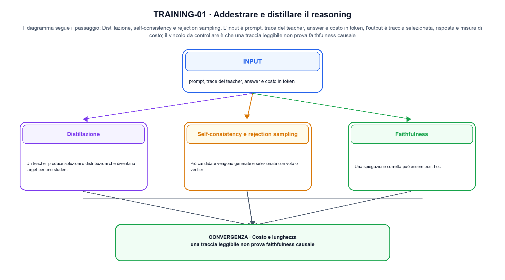
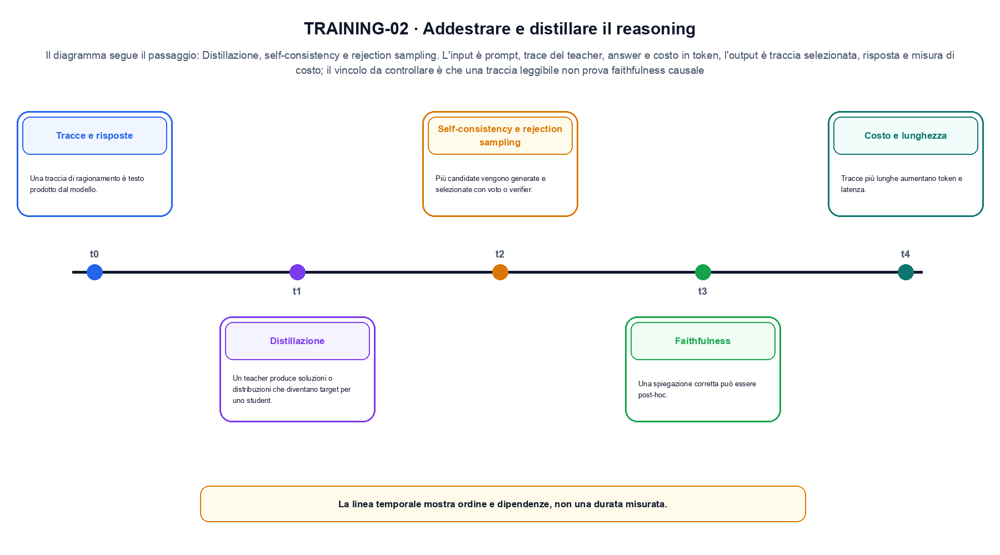

<!--
chapter_id: CH-P09-REASONING-TRAINING
part_id: P09
order_key: 520
title: Addestrare e distillare il reasoning
maturity: ESTABLISHED
status: candidatura completa in revisione autoriale
version: 0.4.0-draft2
last_source_check: 3 agosto 2026
environment: Python 3.13.12, CPU
deferred: benchmark applicativi, varianti non necessarie al contratto centrale e approvazione autoriale
-->

# Capitolo 52. Addestrare e distillare il reasoning

Il risultato precedente non è ancora una soluzione completa. Partiamo da una traccia di reasoning e la risposta che la segue e dalla richiesta «Il pacco non è arrivato» come esempio comune; per arrivare all'output «traccia selezionata, risposta e misura di costo» isoliamo il passaggio «distillazione, self-consistency e rejection sampling» e ne misuriamo il limite prima di passare a Test-time compute, ricerca e controllo del budget.

## Tracce e risposte

Una traccia di ragionamento è testo prodotto dal modello. Può aiutare il training senza costituire una prova fedele del processo interno. [SRC-52-001]

Il caso minimo di «Tracce e risposte» si presenta così: tre tracce producono due risposte 4 e una risposta 5; la selezione majority sceglie 4. Non lo usiamo come decorazione: serve a rendere osservabile la frase «Una traccia di ragionamento è testo prodotto dal modello».

Per ricostruire «Tracce e risposte» annotiamo l'input «prompt, trace del teacher, answer e costo in token», poi l'operazione «distillazione, self-consistency e rejection sampling», infine l'output «traccia selezionata, risposta e misura di costo». Questa sequenza impedisce di scambiare una forma compatibile per il comportamento descritto dalla fonte. Il controllo parte da «Una traccia di ragionamento è testo prodotto dal modello».

Il passaggio da seguire in «Tracce e risposte» è quello descritto dalla frase «Una traccia di ragionamento è testo prodotto dal modello»: l'esempio rende osservabile la trasformazione, mentre il contratto del capitolo ne delimita l'interpretazione. Per «Tracce e risposte» il controllo cambia una sola premessa della frase «Una traccia di ragionamento è testo prodotto dal modello» e conserva input, output e criterio di successo, così la differenza resta attribuibile. La verifica resta ancorata a «Una traccia di ragionamento è testo prodotto dal modello». [SRC-52-001]

Il punto didattico di «Tracce e risposte» è separare ciò che la fonte afferma da ciò che il piccolo caso illustra. L'output «traccia selezionata, risposta e misura di costo» mostra il contratto locale, ma non sostituisce una misura sul sistema completo.

Il controllo minimo di «Tracce e risposte» confronta il caso dichiarato con una variazione che rompe la sua ipotesi. Se la failure non è distinguibile dall'esito valido, manca un'osservazione nel contratto di target, proxy e comportamento. Da «Tracce e risposte» portiamo l'output «traccia selezionata, risposta e misura di costo»; non portiamo invece una conclusione oltre il caso locale.

## Distillazione

Un teacher produce soluzioni o distribuzioni che diventano target per uno student. Filtraggio e copertura stabiliscono cosa viene trasferito. [SRC-52-004]

Prima del nome tecnico fissiamo la situazione: consideriamo un modello teacher e uno student confrontati sullo stesso input, con memoria e regressioni riportate insieme alla loss. Da qui possiamo leggere la conseguenza dichiarata da «Un teacher produce soluzioni o distribuzioni che diventano target per uno student».

Nel contratto locale, l'input «prompt, trace del teacher, answer e costo in token» entra, l'operazione «distillazione, self-consistency e rejection sampling» modifica il percorso e l'output «traccia selezionata, risposta e misura di costo» è ciò che osserviamo. Qui cambia soprattutto il passaggio «Distillazione»; resta da controllare che una traccia leggibile non prova faithfulness causale. La domanda locale è «Un teacher produce soluzioni o distribuzioni che diventano target per uno student».

La compressione cambia rappresentazione, memoria o costo e può introdurre errore. Per attribuire l'effetto bisogna separare storage, calcolo, kernel, calibrazione e regressioni sul compito. Per «Distillazione» il controllo cambia una sola premessa della frase «Un teacher produce soluzioni o distribuzioni che diventano target per uno student» e conserva input, output e criterio di successo, così la differenza resta attribuibile. La verifica resta ancorata a «Un teacher produce soluzioni o distribuzioni che diventano target per uno student». [SRC-52-004]

La lettura va fatta in ordine: prima il caso, poi la trasformazione, quindi la conseguenza. Filtraggio e copertura stabiliscono cosa viene trasferito. Il piccolo risultato resta un'illustrazione di «Un teacher produce soluzioni o distribuzioni che diventano target per uno student», non una promessa generale.

La prova di «Distillazione» conserva input, operazione e output; poi esplicita quale parte di «Un teacher produce soluzioni o distribuzioni che diventano target per uno student» non è stata misurata. Così il test separa l'evidenza dall'inferenza. Il passaggio successivo, «Self-consistency e rejection sampling», potrà cambiare una sola condizione, dichiarando il nuovo setup prima di interpretare il risultato.

## Self-consistency e rejection sampling

Più candidate vengono generate e selezionate con voto o verifier. Il dataset risultante dipende dalla procedura di selezione. [SRC-52-002]

Per capire «Self-consistency e rejection sampling» partiamo da questo caso: un prefisso corretto confrontato con lo stesso prefisso dopo che il modello ha prodotto il token precedente. Il caso rende osservabile il punto centrale: «Più candidate vengono generate e selezionate con voto o verifier».

La sezione usa l'input «prompt, trace del teacher, answer e costo in token» come punto di partenza e l'output «traccia selezionata, risposta e misura di costo» come traccia d'uscita. La trasformazione concreta è «distillazione, self-consistency e rejection sampling»; il caso non è completo se non dichiariamo anche che una traccia leggibile non prova faithfulness causale. La condizione da isolare è «Più candidate vengono generate e selezionate con voto o verifier».

L'inference trasforma logits e richieste in una traiettoria sotto vincoli di memoria e tempo. Decoding, cache, batching e scheduling modificano il servizio osservato e richiedono metriche oltre alla qualità dell'output. Il confronto utile mette accanto il prefisso corretto e quello prodotto dal modello, così il segnale disponibile al training non viene confuso con l'inference. La verifica resta ancorata a «Più candidate vengono generate e selezionate con voto o verifier». [SRC-52-002]

Se cambiamo una premessa, dobbiamo riaprire l'interpretazione. Per «Self-consistency e rejection sampling» conserviamo l'osservazione collegata a «Più candidate vengono generate e selezionate con voto o verifier» e lasciamo esplicitamente fuori ciò che non è stato misurato.

Per verificare «Self-consistency e rejection sampling» cambiamo una sola condizione vicina alla frase «Più candidate vengono generate e selezionate con voto o verifier», teniamo fermo il resto e registriamo l'output «traccia selezionata, risposta e misura di costo». Il caso negativo deve rendere riconoscibile la failure, non soltanto produrre un numero diverso. La sezione successiva, «Faithfulness», riceve l'output «traccia selezionata, risposta e misura di costo» come base, ma dovrà formulare e verificare la propria distinzione.

La figura TRAINING-01 usa la famiglia branch. Il diagramma segue il passaggio: Distillazione, self-consistency e rejection sampling. L'input è prompt, trace del teacher, answer e costo in token, l'output è traccia selezionata, risposta e misura di costo; il vincolo da controllare è che una traccia leggibile non prova faithfulness causale.

## Faithfulness

Una spiegazione corretta può essere post-hoc. Valutare risposta e fedeltà richiede esperimenti differenti. [SRC-52-003]

Il caso minimo di «Faithfulness» si presenta così: due risposte con log-probabilità diverse producono un margine; il margine può diventare un segnale di training, ma non è una misura assoluta di correttezza. Non lo usiamo come decorazione: serve a rendere osservabile la frase «Una spiegazione corretta può essere post-hoc».

Per ricostruire «Faithfulness» annotiamo l'input «prompt, trace del teacher, answer e costo in token», poi l'operazione «distillazione, self-consistency e rejection sampling», infine l'output «traccia selezionata, risposta e misura di costo». Questa sequenza impedisce di scambiare una forma compatibile per il comportamento descritto dalla fonte. Il controllo parte da «Una spiegazione corretta può essere post-hoc».

Il passaggio da seguire in «Faithfulness» è quello descritto dalla frase «Una spiegazione corretta può essere post-hoc»: l'esempio rende osservabile la trasformazione, mentre il contratto del capitolo ne delimita l'interpretazione. Per «Faithfulness» il controllo cambia una sola premessa della frase «Una spiegazione corretta può essere post-hoc» e conserva input, output e criterio di successo, così la differenza resta attribuibile. La verifica resta ancorata a «Una spiegazione corretta può essere post-hoc». [SRC-52-003]

Il punto didattico di «Faithfulness» è separare ciò che la fonte afferma da ciò che il piccolo caso illustra. L'output «traccia selezionata, risposta e misura di costo» mostra il contratto locale, ma non sostituisce una misura sul sistema completo.

Il controllo minimo di «Faithfulness» confronta il caso dichiarato con una variazione che rompe la sua ipotesi. Se la failure non è distinguibile dall'esito valido, manca un'osservazione nel contratto di target, proxy e comportamento. Da «Faithfulness» portiamo l'output «traccia selezionata, risposta e misura di costo»; non portiamo invece una conclusione oltre il caso locale.

## Costo e lunghezza

Tracce più lunghe aumentano token e latenza. Il training deve distinguere utilità della risposta e budget del processo. [SRC-52-001]

Prima del nome tecnico fissiamo la situazione: consideriamo un batch di richieste eterogenee in cui throughput, coda e time-to-first-token vengono misurati separatamente. Da qui possiamo leggere la conseguenza dichiarata da «Tracce più lunghe aumentano token e latenza».

Nel contratto locale, l'input «prompt, trace del teacher, answer e costo in token» entra, l'operazione «distillazione, self-consistency e rejection sampling» modifica il percorso e l'output «traccia selezionata, risposta e misura di costo» è ciò che osserviamo. Qui cambia soprattutto il passaggio «Costo e lunghezza»; resta da controllare che una traccia leggibile non prova faithfulness causale. La domanda locale è «Tracce più lunghe aumentano token e latenza».

Prima del modello, il testo diventa una sequenza di unità con una convenzione precisa. Encoding, tokenizer, token speciali, mask e packing modificano l'input effettivo e quindi fanno parte del contratto del checkpoint. La misura separa costo locale, coda e latenza end-to-end sotto un carico dichiarato, così il miglioramento non resta confinato al kernel. La verifica resta ancorata a «Tracce più lunghe aumentano token e latenza». [SRC-52-001]

La lettura va fatta in ordine: prima il caso, poi la trasformazione, quindi la conseguenza. Il training deve distinguere utilità della risposta e budget del processo. Il piccolo risultato resta un'illustrazione di «Tracce più lunghe aumentano token e latenza», non una promessa generale.

La prova di «Costo e lunghezza» conserva input, operazione e output; poi esplicita quale parte di «Tracce più lunghe aumentano token e latenza» non è stata misurata. Così il test separa l'evidenza dall'inferenza. Il caso finale consegna l'output «traccia selezionata, risposta e misura di costo» come evidenza locale e conserva la distanza tra obiettivo locale e compito come domanda aperta.

## Dal concetto alla situazione concreta: Tracce e risposte

Il caso intero parte dall'input «prompt, trace del teacher, answer e costo in token», applica l'operazione «distillazione, self-consistency e rejection sampling» e osserva l'output «traccia selezionata, risposta e misura di costo». Un esempio controllato: tre tracce, due concordanti, con selezione majority vote. La formula locale è:

$$
p_student(y|x) <- p_teacher(y|x)
$$

La distillazione trasferisce un comportamento osservato, non ogni capacità del teacher. [SRC-52-001]

La figura TRAINING-02 cambia composizione rispetto alla prima. Il diagramma segue il passaggio: Distillazione, self-consistency e rejection sampling. L'input è prompt, trace del teacher, answer e costo in token, l'output è traccia selezionata, risposta e misura di costo; il vincolo da controllare è che una traccia leggibile non prova faithfulness causale.

## Una prova ripetibile: Distillazione

Nel run Python rendiamo osservabile la frase «Una traccia di ragionamento è testo prodotto dal modello» con valori piccoli e leggibili. Il test associato verifica determinismo, output e rifiuto di una condizione incoerente; il file di output `code/outputs/SNIP-52-001.txt` documenta il caso senza pretendere una misura generale.

## Il trasferimento richiede altro: Costo e lunghezza

Il meccanismo di «Addestrare e distillare il reasoning» non garantisce da solo che il sistema funzioni fuori dal caso guida. Una traccia leggibile non prova faithfulness causale. Il limite osservato riguarda la frase «Una traccia di ragionamento è testo prodotto dal modello»; per trasferire il concetto occorre riaprire la verifica quando cambiano dati, scala o ambiente.

## Il filo che passa oltre: Addestrare e distillare il reasoning

Il percorso ha tenuto insieme una traccia di reasoning e la risposta che la segue, l'operazione «distillazione, self-consistency e rejection sampling» e l'output «traccia selezionata, risposta e misura di costo». Le sezioni «Tracce e risposte», «Distillazione», «Costo e lunghezza» mostrano come il protocollo osservato delimiti ciò che il capitolo può sostenere. L'invariante da portare avanti è: una traccia leggibile non prova faithfulness causale. Il Capitolo 53, Test-time compute, ricerca e controllo del budget, può partire da questo output e dichiarare la propria domanda.

### Rilettura guidata: Tracce e risposte

1. Ricostruisci l'oggetto continuo a partire da «Tracce e risposte» e indica quale parte della frase «Una traccia di ragionamento è testo prodotto dal modello» entra nel caso.
2. Spiega quale trasformazione collega «Tracce e risposte» a «Costo e lunghezza» e quale output osserviamo nel passaggio.
3. Usa lo snippet per controllare l'invariante del contratto: una traccia leggibile non prova faithfulness causale.
4. Separa una definizione sostenuta da una fonte, un esempio illustrativo e un risultato locale del caso guida.
5. Indica quale parte della frase «Tracce più lunghe aumentano token e latenza» richiederebbe una misura nuova prima di essere estesa oltre il caso osservato.

### Allenamento e trasferimento: Costo e lunghezza

1. Disegna il percorso di «Tracce e risposte» indicando dati in ingresso e risultato.
2. Ripeti «Distillazione» cambiando soltanto un valore dichiarato.
3. Trova in «Self-consistency e rejection sampling» una condizione che, se rimossa, produrrebbe una failure leggibile.
4. Aggiungi a «Faithfulness» un controllo negativo e spiega che cosa protegge.
5. Indica quale claim su «Costo e lunghezza» richiederebbe un benchmark ulteriore.

## Dove verificare definizioni e risultati: Addestrare e distillare il reasoning

Per «Addestrare e distillare il reasoning», le fonti portanti, i limiti dei claim e la data di consultazione sono raccolti in `FONTI_PRIMARIE.md`; la ricerca riguarda soprattutto target, proxy e comportamento. `CLAIMS.md` separa definizioni e risultati locali; codice, ambiente, test e output sono nella cartella `code/`, con attenzione a target, proxy e comportamento.
