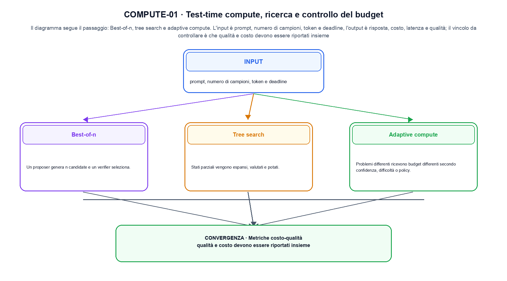
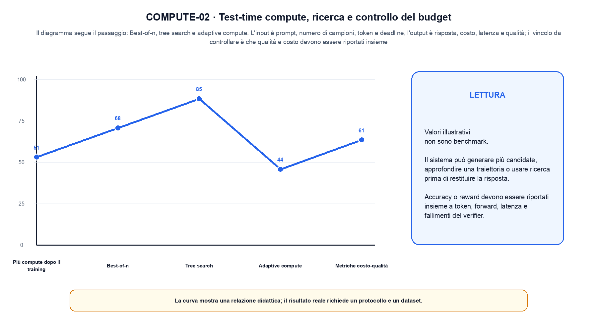

<!--
chapter_id: CH-P09-TEST-TIME-COMPUTE
part_id: P09
order_key: 530
title: Test-time compute, ricerca e controllo del budget
maturity: ESTABLISHED
status: candidatura completa in revisione autoriale
version: 0.4.0-draft2
last_source_check: 3 agosto 2026
environment: Python 3.13.12, CPU
deferred: benchmark applicativi, varianti non necessarie al contratto centrale e approvazione autoriale
-->

# Capitolo 53. Test-time compute, ricerca e controllo del budget

La richiesta «Il pacco non è arrivato» resta il caso guida. In questo capitolo la usiamo per distinguere un budget di compute aggiunto durante l'inferenza, trasformazione e risultato, senza nascondere i dettagli tecnici.

## Più compute dopo il training

Il sistema può generare più candidate, approfondire una traiettoria o usare ricerca prima di restituire la risposta. [SRC-53-001]

Prima del nome tecnico fissiamo la situazione: consideriamo tre candidati vengono valutati entro un budget comune e si conserva il punteggio migliore. Da qui possiamo leggere la conseguenza dichiarata da «Il sistema può generare più candidate, approfondire una traiettoria o usare ricerca prima di restituire la risposta».

La sezione usa l'input «prompt, numero di campioni, token e deadline» come punto di partenza e l'output «risposta, costo, latenza e qualità» come traccia d'uscita. La trasformazione concreta è «best-of-n, tree search e adaptive compute»; il caso non è completo se non dichiariamo anche che qualità e costo devono essere riportati insieme. La condizione da isolare è «Il sistema può generare più candidate, approfondire una traiettoria o usare ricerca prima di restituire la risposta».

Il passaggio da seguire in «Più compute dopo il training» è quello descritto dalla frase «Il sistema può generare più candidate, approfondire una traiettoria o usare ricerca prima di restituire la risposta»: l'esempio rende osservabile la trasformazione, mentre il contratto del capitolo ne delimita l'interpretazione. Per «Più compute dopo il training» il controllo cambia una sola premessa della frase «Il sistema può generare più candidate, approfondire una traiettoria o usare ricerca prima di restituire la risposta» e conserva input, output e criterio di successo, così la differenza resta attribuibile. La verifica resta ancorata a «Il sistema può generare più candidate, approfondire una traiettoria o usare ricerca prima di restituire la risposta». [SRC-53-001]

Se cambiamo una premessa, dobbiamo riaprire l'interpretazione. Per «Più compute dopo il training» conserviamo l'osservazione collegata a «Il sistema può generare più candidate, approfondire una traiettoria o usare ricerca prima di restituire la risposta» e lasciamo esplicitamente fuori ciò che non è stato misurato.

La prova di «Più compute dopo il training» conserva input, operazione e output; poi esplicita quale parte di «Il sistema può generare più candidate, approfondire una traiettoria o usare ricerca prima di restituire la risposta» non è stata misurata. Così il test separa l'evidenza dall'inferenza. Il passaggio successivo, «Best-of-n», potrà cambiare una sola condizione, dichiarando il nuovo setup prima di interpretare il risultato.

## Best-of-n

Un proposer genera n candidate e un verifier seleziona. Il beneficio dipende dalla diversità e dalla qualità del ranking. [SRC-53-002]

Per capire «Best-of-n» partiamo da questo caso: quattro campioni con un budget massimo di token. Il caso rende osservabile il punto centrale: «Un proposer genera n candidate e un verifier seleziona».

Per ricostruire «Best-of-n» annotiamo l'input «prompt, numero di campioni, token e deadline», poi l'operazione «best-of-n, tree search e adaptive compute», infine l'output «risposta, costo, latenza e qualità». Questa sequenza impedisce di scambiare una forma compatibile per il comportamento descritto dalla fonte. Il controllo parte da «Un proposer genera n candidate e un verifier seleziona».

Il passaggio da seguire in «Best-of-n» è quello descritto dalla frase «Un proposer genera n candidate e un verifier seleziona»: l'esempio rende osservabile la trasformazione, mentre il contratto del capitolo ne delimita l'interpretazione. Per «Best-of-n» il controllo cambia una sola premessa della frase «Un proposer genera n candidate e un verifier seleziona» e conserva input, output e criterio di successo, così la differenza resta attribuibile. La verifica resta ancorata a «Un proposer genera n candidate e un verifier seleziona». [SRC-53-002]

Il punto didattico di «Best-of-n» è separare ciò che la fonte afferma da ciò che il piccolo caso illustra. L'output «risposta, costo, latenza e qualità» mostra il contratto locale, ma non sostituisce una misura sul sistema completo.

Per verificare «Best-of-n» cambiamo una sola condizione vicina alla frase «Un proposer genera n candidate e un verifier seleziona», teniamo fermo il resto e registriamo l'output «risposta, costo, latenza e qualità». Il caso negativo deve rendere riconoscibile la failure, non soltanto produrre un numero diverso. La sezione successiva, «Tree search», riceve l'output «risposta, costo, latenza e qualità» come base, ma dovrà formulare e verificare la propria distinzione.

## Tree search

Stati parziali vengono espansi, valutati e potati. Branching factor, profondità e budget definiscono il costo. [SRC-53-003]

Il caso minimo di «Tree search» si presenta così: un caso in cui qualità e costo devono essere riportati insieme. Non lo usiamo come decorazione: serve a rendere osservabile la frase «Stati parziali vengono espansi, valutati e potati».

Nel contratto locale, l'input «prompt, numero di campioni, token e deadline» entra, l'operazione «best-of-n, tree search e adaptive compute» modifica il percorso e l'output «risposta, costo, latenza e qualità» è ciò che osserviamo. Qui cambia soprattutto il passaggio «Tree search»; resta da controllare che qualità e costo devono essere riportati insieme. La domanda locale è «Stati parziali vengono espansi, valutati e potati».

Il passaggio da seguire in «Tree search» è quello descritto dalla frase «Stati parziali vengono espansi, valutati e potati»: l'esempio rende osservabile la trasformazione, mentre il contratto del capitolo ne delimita l'interpretazione. Per «Tree search» il controllo cambia una sola premessa della frase «Stati parziali vengono espansi, valutati e potati» e conserva input, output e criterio di successo, così la differenza resta attribuibile. La verifica resta ancorata a «Stati parziali vengono espansi, valutati e potati». [SRC-53-003]

La lettura va fatta in ordine: prima il caso, poi la trasformazione, quindi la conseguenza. Branching factor, profondità e budget definiscono il costo. Il piccolo risultato resta un'illustrazione di «Stati parziali vengono espansi, valutati e potati», non una promessa generale.

Il controllo minimo di «Tree search» confronta il caso dichiarato con una variazione che rompe la sua ipotesi. Se la failure non è distinguibile dall'esito valido, manca un'osservazione nel contratto di target, proxy e comportamento. Da «Tree search» portiamo l'output «risposta, costo, latenza e qualità»; non portiamo invece una conclusione oltre il caso locale.

## Adaptive compute

Problemi differenti ricevono budget differenti secondo confidenza, difficoltà o policy. La stima di difficoltà può essere errata. [SRC-53-004]

Prima del nome tecnico fissiamo la situazione: consideriamo due risposte con log-probabilità diverse producono un margine; il margine può diventare un segnale di training, ma non è una misura assoluta di correttezza. Da qui possiamo leggere la conseguenza dichiarata da «Problemi differenti ricevono budget differenti secondo confidenza, difficoltà o policy».

La sezione usa l'input «prompt, numero di campioni, token e deadline» come punto di partenza e l'output «risposta, costo, latenza e qualità» come traccia d'uscita. La trasformazione concreta è «best-of-n, tree search e adaptive compute»; il caso non è completo se non dichiariamo anche che qualità e costo devono essere riportati insieme. La condizione da isolare è «Problemi differenti ricevono budget differenti secondo confidenza, difficoltà o policy».

Il passaggio da seguire in «Adaptive compute» è quello descritto dalla frase «Problemi differenti ricevono budget differenti secondo confidenza, difficoltà o policy»: l'esempio rende osservabile la trasformazione, mentre il contratto del capitolo ne delimita l'interpretazione. Per «Adaptive compute» il controllo cambia una sola premessa della frase «Problemi differenti ricevono budget differenti secondo confidenza, difficoltà o policy» e conserva input, output e criterio di successo, così la differenza resta attribuibile. La verifica resta ancorata a «Problemi differenti ricevono budget differenti secondo confidenza, difficoltà o policy». [SRC-53-004]

Se cambiamo una premessa, dobbiamo riaprire l'interpretazione. Per «Adaptive compute» conserviamo l'osservazione collegata a «Problemi differenti ricevono budget differenti secondo confidenza, difficoltà o policy» e lasciamo esplicitamente fuori ciò che non è stato misurato.

La prova di «Adaptive compute» conserva input, operazione e output; poi esplicita quale parte di «Problemi differenti ricevono budget differenti secondo confidenza, difficoltà o policy» non è stata misurata. Così il test separa l'evidenza dall'inferenza. Il passaggio successivo, «Metriche costo-qualità», potrà cambiare una sola condizione, dichiarando il nuovo setup prima di interpretare il risultato.

La figura COMPUTE-01 usa la famiglia branch. Il diagramma segue il passaggio: Best-of-n, tree search e adaptive compute. L'input è prompt, numero di campioni, token e deadline, l'output è risposta, costo, latenza e qualità; il vincolo da controllare è che qualità e costo devono essere riportati insieme.

## Metriche costo-qualità

Accuracy o reward devono essere riportati insieme a token, forward, latenza e fallimenti del verifier. [SRC-53-001]

Per capire «Metriche costo-qualità» partiamo da questo caso: quattro casi con protocollo, una failure e una slice conservati insieme al valore aggregato. Il caso rende osservabile il punto centrale: «Accuracy o reward devono essere riportati insieme a token, forward, latenza e fallimenti del verifier».

Per ricostruire «Metriche costo-qualità» annotiamo l'input «prompt, numero di campioni, token e deadline», poi l'operazione «best-of-n, tree search e adaptive compute», infine l'output «risposta, costo, latenza e qualità». Questa sequenza impedisce di scambiare una forma compatibile per il comportamento descritto dalla fonte. Il controllo parte da «Accuracy o reward devono essere riportati insieme a token, forward, latenza e fallimenti del verifier».

Una valutazione deve collegare claim, popolazione, protocollo e decisione. Media, slice, failure, giudice e incertezza misurano aspetti diversi e non diventano intercambiabili perché condividono una tabella. La misura va letta insieme a popolazione, slice e failure: cambiare il report senza cambiare il protocollo non crea nuova evidenza. La verifica resta ancorata a «Accuracy o reward devono essere riportati insieme a token, forward, latenza e fallimenti del verifier». [SRC-53-001]

Il punto didattico di «Metriche costo-qualità» è separare ciò che la fonte afferma da ciò che il piccolo caso illustra. L'output «risposta, costo, latenza e qualità» mostra il contratto locale, ma non sostituisce una misura sul sistema completo.

Per verificare «Metriche costo-qualità» cambiamo una sola condizione vicina alla frase «Accuracy o reward devono essere riportati insieme a token, forward, latenza e fallimenti del verifier», teniamo fermo il resto e registriamo l'output «risposta, costo, latenza e qualità». Il caso negativo deve rendere riconoscibile la failure, non soltanto produrre un numero diverso. Il percorso si chiude lasciando espliciti la misura locale e ciò che richiederebbe una prova ulteriore.

## Un caso dall'input all'output: Più compute dopo il training

Il caso intero parte dall'input «prompt, numero di campioni, token e deadline», applica l'operazione «best-of-n, tree search e adaptive compute» e osserva l'output «risposta, costo, latenza e qualità». Un esempio controllato: quattro campioni con un budget massimo di token. Lo schema compatto è:

$$
budget = samples * tokens
$$

È una notazione di interfaccia, non un'identità numerica completa. Il test-time compute è una risorsa da misurare insieme a qualità e latenza. [SRC-53-001]

La figura COMPUTE-02 cambia composizione rispetto alla prima. Il diagramma segue il passaggio: Best-of-n, tree search e adaptive compute. L'input è prompt, numero di campioni, token e deadline, l'output è risposta, costo, latenza e qualità; il vincolo da controllare è che qualità e costo devono essere riportati insieme.

## Dal meccanismo alla prova locale: Best-of-n

Lo snippet locale mette in esecuzione questo caso: quattro campioni con un budget massimo di token. Il test associato controlla determinismo, output e invariante e rifiuta una shape o condizione incoerente; il risultato è conservato in `code/outputs/SNIP-53-001.txt`, come evidenza locale e non come benchmark di produzione.

## Dove il risultato si ferma: Metriche costo-qualità

Il caso di «Test-time compute, ricerca e controllo del budget» non certifica un servizio completo. Qualità e costo devono essere riportati insieme. La domanda successiva è se «Accuracy o reward devono essere riportati insieme a token, forward, latenza e fallimenti del verifier» regga quando cambiano dati, scala, hardware o criteri di decisione.

## Che cosa portiamo avanti: Test-time compute, ricerca e controllo del budget

Il filo della lezione va dall'input «prompt, numero di campioni, token e deadline» all'output «risposta, costo, latenza e qualità». Nei passaggi «Più compute dopo il training», «Best-of-n», «Metriche costo-qualità» abbiamo usato esempi e controlli negativi per rendere il contratto controllabile e delimitare la conclusione. L'invariante da portare avanti è: qualità e costo devono essere riportati insieme. Il Capitolo 54, Aggiornamento, merging ed editing del modello, può partire da questo output e dichiarare la propria domanda.

### Verifica di comprensione: Più compute dopo il training

1. Ricostruisci l'oggetto continuo a partire da «Più compute dopo il training» e indica quale parte della frase «Il sistema può generare più candidate, approfondire una traiettoria o usare ricerca prima di restituire la risposta» entra nel caso.
2. Spiega quale trasformazione collega «Più compute dopo il training» a «Metriche costo-qualità» e quale output osserviamo nel passaggio.
3. Usa lo snippet per controllare l'invariante del contratto: qualità e costo devono essere riportati insieme.
4. Separa una definizione sostenuta da una fonte, un esempio illustrativo e un risultato locale del caso guida.
5. Indica quale parte della frase «Accuracy o reward devono essere riportati insieme a token, forward, latenza e fallimenti del verifier» richiederebbe una misura nuova prima di essere estesa oltre il caso osservato.

### Esercizi di trasferimento: Metriche costo-qualità

1. Disegna il percorso di «Più compute dopo il training» indicando dati in ingresso e risultato.
2. Ripeti «Best-of-n» cambiando soltanto un valore dichiarato.
3. Trova in «Tree search» una condizione che, se rimossa, produrrebbe una failure leggibile.
4. Aggiungi a «Adaptive compute» un controllo negativo e spiega che cosa protegge.
5. Indica quale claim su «Metriche costo-qualità» richiederebbe un benchmark ulteriore.

## Fonti, codice e materiali: Test-time compute, ricerca e controllo del budget

Per ricontrollare «Test-time compute, ricerca e controllo del budget», partire da `FONTI_PRIMARIE.md` e poi dal codice: la domanda aperta è come trasferire la distanza tra obiettivo locale e compito oltre il caso locale, con la data di consultazione dichiarata. `CLAIMS.md` separa definizioni e risultati locali; codice, ambiente, test e output sono nella cartella `code/`, con attenzione a target, proxy e comportamento.
