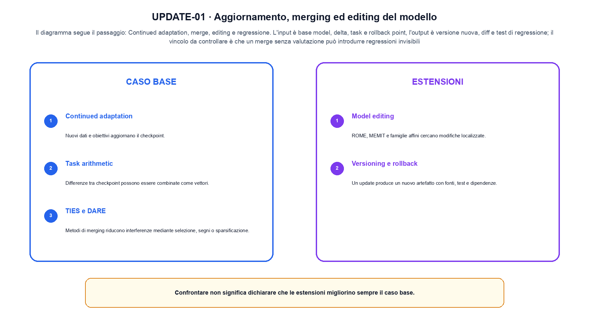
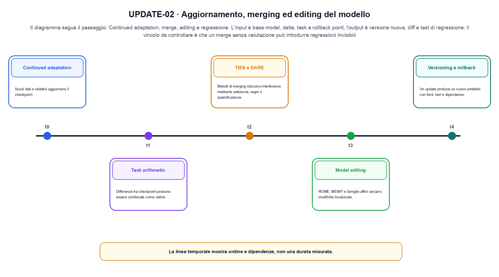

<!--
chapter_id: CH-P09-MODEL-UPDATE
part_id: P09
order_key: 540
title: Aggiornamento, merging ed editing del modello
maturity: ESTABLISHED
status: candidatura completa in revisione autoriale
version: 0.4.0-draft2
last_source_check: 3 agosto 2026
environment: Python 3.13.12, CPU
deferred: benchmark applicativi, varianti non necessarie al contratto centrale e approvazione autoriale
-->

# Capitolo 54. Aggiornamento, merging ed editing del modello

Una frase plausibile non basta a spiegare aggiornamento, merging ed editing del modello. L'oggetto è versioni di pesi e modifiche localizzate del modello; riprendiamo la richiesta «Il pacco non è arrivato» come contesto comune, partiamo da un input piccolo, rendiamo visibile l'operazione e fissiamo che cosa non possiamo concludere.

## Continued adaptation

Nuovi dati e obiettivi aggiornano il checkpoint. Replay, regolarizzazione e valutazioni controllano forgetting e regressioni. [SRC-54-001]

Per capire «Continued adaptation» partiamo da questo caso: un delta modifica una sola chiave del caso guida e il test confronta prima, dopo e rollback. Il caso rende osservabile il punto centrale: «Nuovi dati e obiettivi aggiornano il checkpoint».

Nel contratto locale, l'input «base model, delta, task e rollback point» entra, l'operazione «continued adaptation, merge, editing e regressione» modifica il percorso e l'output «versione nuova, diff e test di regressione» è ciò che osserviamo. Qui cambia soprattutto il passaggio «Continued adaptation»; resta da controllare che un merge senza valutazione può introdurre regressioni invisibili. La domanda locale è «Nuovi dati e obiettivi aggiornano il checkpoint».

Il passaggio da seguire in «Continued adaptation» è quello descritto dalla frase «Nuovi dati e obiettivi aggiornano il checkpoint»: l'esempio rende osservabile la trasformazione, mentre il contratto del capitolo ne delimita l'interpretazione. Per «Continued adaptation» il controllo cambia una sola premessa della frase «Nuovi dati e obiettivi aggiornano il checkpoint» e conserva input, output e criterio di successo, così la differenza resta attribuibile. La verifica resta ancorata a «Nuovi dati e obiettivi aggiornano il checkpoint». [SRC-54-001]

La lettura va fatta in ordine: prima il caso, poi la trasformazione, quindi la conseguenza. Replay, regolarizzazione e valutazioni controllano forgetting e regressioni. Il piccolo risultato resta un'illustrazione di «Nuovi dati e obiettivi aggiornano il checkpoint», non una promessa generale.

Per verificare «Continued adaptation» cambiamo una sola condizione vicina alla frase «Nuovi dati e obiettivi aggiornano il checkpoint», teniamo fermo il resto e registriamo l'output «versione nuova, diff e test di regressione». Il caso negativo deve rendere riconoscibile la failure, non soltanto produrre un numero diverso. La sezione successiva, «Task arithmetic», riceve l'output «versione nuova, diff e test di regressione» come base, ma dovrà formulare e verificare la propria distinzione.

## Task arithmetic

Differenze tra checkpoint possono essere combinate come vettori. La compatibilità richiede stessa base e corrispondenza dei parametri. [SRC-54-004]

Il caso minimo di «Task arithmetic» si presenta così: due delta combinati e una capability testata prima e dopo. Non lo usiamo come decorazione: serve a rendere osservabile la frase «Differenze tra checkpoint possono essere combinate come vettori».

La sezione usa l'input «base model, delta, task e rollback point» come punto di partenza e l'output «versione nuova, diff e test di regressione» come traccia d'uscita. La trasformazione concreta è «continued adaptation, merge, editing e regressione»; il caso non è completo se non dichiariamo anche che un merge senza valutazione può introdurre regressioni invisibili. La condizione da isolare è «Differenze tra checkpoint possono essere combinate come vettori».

Il passaggio da seguire in «Task arithmetic» è quello descritto dalla frase «Differenze tra checkpoint possono essere combinate come vettori»: l'esempio rende osservabile la trasformazione, mentre il contratto del capitolo ne delimita l'interpretazione. Per «Task arithmetic» il controllo cambia una sola premessa della frase «Differenze tra checkpoint possono essere combinate come vettori» e conserva input, output e criterio di successo, così la differenza resta attribuibile. La verifica resta ancorata a «Differenze tra checkpoint possono essere combinate come vettori». [SRC-54-004]

Se cambiamo una premessa, dobbiamo riaprire l'interpretazione. Per «Task arithmetic» conserviamo l'osservazione collegata a «Differenze tra checkpoint possono essere combinate come vettori» e lasciamo esplicitamente fuori ciò che non è stato misurato.

Il controllo minimo di «Task arithmetic» confronta il caso dichiarato con una variazione che rompe la sua ipotesi. Se la failure non è distinguibile dall'esito valido, manca un'osservazione nel contratto di target, proxy e comportamento. Da «Task arithmetic» portiamo l'output «versione nuova, diff e test di regressione»; non portiamo invece una conclusione oltre il caso locale.

La figura UPDATE-01 usa la famiglia compare. Il diagramma segue il passaggio: Continued adaptation, merge, editing e regressione. L'input è base model, delta, task e rollback point, l'output è versione nuova, diff e test di regressione; il vincolo da controllare è che un merge senza valutazione può introdurre regressioni invisibili.

## TIES e DARE

Metodi di merging riducono interferenze mediante selezione, segni o sparsificazione. I risultati dipendono dai task e dalla scala dei delta. [SRC-54-003]

Prima del nome tecnico fissiamo la situazione: consideriamo un caso in cui un merge senza valutazione può introdurre regressioni invisibili. Da qui possiamo leggere la conseguenza dichiarata da «Metodi di merging riducono interferenze mediante selezione, segni o sparsificazione».

Per ricostruire «TIES e DARE» annotiamo l'input «base model, delta, task e rollback point», poi l'operazione «continued adaptation, merge, editing e regressione», infine l'output «versione nuova, diff e test di regressione». Questa sequenza impedisce di scambiare una forma compatibile per il comportamento descritto dalla fonte. Il controllo parte da «Metodi di merging riducono interferenze mediante selezione, segni o sparsificazione».

Il passaggio da seguire in «TIES e DARE» è quello descritto dalla frase «Metodi di merging riducono interferenze mediante selezione, segni o sparsificazione»: l'esempio rende osservabile la trasformazione, mentre il contratto del capitolo ne delimita l'interpretazione. Per «TIES e DARE» il controllo cambia una sola premessa della frase «Metodi di merging riducono interferenze mediante selezione, segni o sparsificazione» e conserva input, output e criterio di successo, così la differenza resta attribuibile. La verifica resta ancorata a «Metodi di merging riducono interferenze mediante selezione, segni o sparsificazione». [SRC-54-003]

Il punto didattico di «TIES e DARE» è separare ciò che la fonte afferma da ciò che il piccolo caso illustra. L'output «versione nuova, diff e test di regressione» mostra il contratto locale, ma non sostituisce una misura sul sistema completo.

La prova di «TIES e DARE» conserva input, operazione e output; poi esplicita quale parte di «Metodi di merging riducono interferenze mediante selezione, segni o sparsificazione» non è stata misurata. Così il test separa l'evidenza dall'inferenza. Il passaggio successivo, «Model editing», potrà cambiare una sola condizione, dichiarando il nuovo setup prima di interpretare il risultato.

## Model editing

ROME, MEMIT e famiglie affini cercano modifiche localizzate. Località, generalizzazione e side effect devono essere misurati separatamente. [SRC-54-002]

Per capire «Model editing» partiamo da questo caso: due risposte con log-probabilità diverse producono un margine; il margine può diventare un segnale di training, ma non è una misura assoluta di correttezza. Il caso rende osservabile il punto centrale: «ROME, MEMIT e famiglie affini cercano modifiche localizzate».

Nel contratto locale, l'input «base model, delta, task e rollback point» entra, l'operazione «continued adaptation, merge, editing e regressione» modifica il percorso e l'output «versione nuova, diff e test di regressione» è ciò che osserviamo. Qui cambia soprattutto il passaggio «Model editing»; resta da controllare che un merge senza valutazione può introdurre regressioni invisibili. La domanda locale è «ROME, MEMIT e famiglie affini cercano modifiche localizzate».

Un flow rende esplicito il percorso invertibile tra spazio semplice e dati. La densità deve tenere conto del Jacobiano, mentre il costo dipende dalla trasformazione o dalla soluzione numerica scelta. Per «Model editing» il controllo cambia una sola premessa della frase «ROME, MEMIT e famiglie affini cercano modifiche localizzate» e conserva input, output e criterio di successo, così la differenza resta attribuibile. La verifica resta ancorata a «ROME, MEMIT e famiglie affini cercano modifiche localizzate». [SRC-54-002]

La lettura va fatta in ordine: prima il caso, poi la trasformazione, quindi la conseguenza. Località, generalizzazione e side effect devono essere misurati separatamente. Il piccolo risultato resta un'illustrazione di «ROME, MEMIT e famiglie affini cercano modifiche localizzate», non una promessa generale.

Per verificare «Model editing» cambiamo una sola condizione vicina alla frase «ROME, MEMIT e famiglie affini cercano modifiche localizzate», teniamo fermo il resto e registriamo l'output «versione nuova, diff e test di regressione». Il caso negativo deve rendere riconoscibile la failure, non soltanto produrre un numero diverso. La sezione successiva, «Versioning e rollback», riceve l'output «versione nuova, diff e test di regressione» come base, ma dovrà formulare e verificare la propria distinzione.

## Versioning e rollback

Un update produce un nuovo artefatto con fonti, test e dipendenze. Merging ed editing non sostituiscono la gestione delle versioni. [SRC-54-001]

Il caso minimo di «Versioning e rollback» si presenta così: una traiettoria minima osservazione-azione-tool-verifica in cui una chiamata fuori allowlist viene bloccata prima dell'esecuzione. Non lo usiamo come decorazione: serve a rendere osservabile la frase «Un update produce un nuovo artefatto con fonti, test e dipendenze».

La sezione usa l'input «base model, delta, task e rollback point» come punto di partenza e l'output «versione nuova, diff e test di regressione» come traccia d'uscita. La trasformazione concreta è «continued adaptation, merge, editing e regressione»; il caso non è completo se non dichiariamo anche che un merge senza valutazione può introdurre regressioni invisibili. La condizione da isolare è «Un update produce un nuovo artefatto con fonti, test e dipendenze».

Il passaggio da seguire in «Versioning e rollback» è quello descritto dalla frase «Un update produce un nuovo artefatto con fonti, test e dipendenze»: l'esempio rende osservabile la trasformazione, mentre il contratto del capitolo ne delimita l'interpretazione. Per «Versioning e rollback» il controllo cambia una sola premessa della frase «Un update produce un nuovo artefatto con fonti, test e dipendenze» e conserva input, output e criterio di successo, così la differenza resta attribuibile. La verifica resta ancorata a «Un update produce un nuovo artefatto con fonti, test e dipendenze». [SRC-54-001]

Se cambiamo una premessa, dobbiamo riaprire l'interpretazione. Per «Versioning e rollback» conserviamo l'osservazione collegata a «Un update produce un nuovo artefatto con fonti, test e dipendenze» e lasciamo esplicitamente fuori ciò che non è stato misurato.

Il controllo minimo di «Versioning e rollback» confronta il caso dichiarato con una variazione che rompe la sua ipotesi. Se la failure non è distinguibile dall'esito valido, manca un'osservazione nel contratto di target, proxy e comportamento. La conclusione resta ancorata al protocollo osservato, non al nome della tecnica.

## La definizione messa alla prova: Continued adaptation

Il caso intero parte dall'input «base model, delta, task e rollback point», applica l'operazione «continued adaptation, merge, editing e regressione» e osserva l'output «versione nuova, diff e test di regressione». Un esempio controllato: due delta combinati e una capability testata prima e dopo. Lo schema compatto è:

$$
theta' = merge(theta_1, theta_2, rule)
$$

È una notazione di interfaccia, non un'identità numerica completa. Il merge richiede una regola e una valutazione di regressione. [SRC-54-001]

La figura UPDATE-02 cambia composizione rispetto alla prima. Il diagramma segue il passaggio: Continued adaptation, merge, editing e regressione. L'input è base model, delta, task e rollback point, l'output è versione nuova, diff e test di regressione; il vincolo da controllare è che un merge senza valutazione può introdurre regressioni invisibili.

## Un esperimento piccolo ma leggibile: Task arithmetic

Lo snippet locale mette in esecuzione questo caso: due delta combinati e una capability testata prima e dopo. Il test associato controlla determinismo, output e invariante e rifiuta una shape o condizione incoerente; il risultato è conservato in `code/outputs/SNIP-54-001.txt`, come evidenza locale e non come benchmark di produzione.

## Il confine del caso guida: Versioning e rollback

Il caso di «Aggiornamento, merging ed editing del modello» non certifica un servizio completo. Un merge senza valutazione può introdurre regressioni invisibili. La domanda successiva è se «Un update produce un nuovo artefatto con fonti, test e dipendenze» regga quando cambiano dati, scala, hardware o criteri di decisione.

## Il contratto che rimane: Aggiornamento, merging ed editing del modello

Il filo della lezione va dall'input «base model, delta, task e rollback point» all'output «versione nuova, diff e test di regressione». Nei passaggi «Continued adaptation», «Task arithmetic», «Versioning e rollback» abbiamo usato esempi e controlli negativi per rendere il contratto controllabile e delimitare la conclusione. L'invariante da portare avanti è: un merge senza valutazione può introdurre regressioni invisibili. Il Capitolo 55, Fondamenti della multimodalità, può partire da questo output e dichiarare la propria domanda.

### Controllo finale della lezione: Continued adaptation

1. Ricostruisci l'oggetto continuo a partire da «Continued adaptation» e indica quale parte della frase «Nuovi dati e obiettivi aggiornano il checkpoint» entra nel caso.
2. Spiega quale trasformazione collega «Continued adaptation» a «Versioning e rollback» e quale output osserviamo nel passaggio.
3. Usa lo snippet per controllare l'invariante del contratto: un merge senza valutazione può introdurre regressioni invisibili.
4. Separa una definizione sostenuta da una fonte, un esempio illustrativo e un risultato locale del caso guida.
5. Indica quale parte della frase «Un update produce un nuovo artefatto con fonti, test e dipendenze» richiederebbe una misura nuova prima di essere estesa oltre il caso osservato.

### Prove da rifare e modificare: Versioning e rollback

1. Racconta «Continued adaptation» come una trasformazione: che cosa entra e che cosa esce?
2. Confronta due esecuzioni di «Task arithmetic» mantenendo il resto del setup invariato.
3. Per «TIES e DARE», separa l'esempio locale dal limite che impedisce di generalizzarlo.
4. Progetta una prova per «Model editing» che renda visibile il suo confine.
5. Scrivi una metrica o una domanda per valutare «Versioning e rollback» senza confondere livelli diversi.

## Riferimenti e prove riproducibili: Aggiornamento, merging ed editing del modello

Per ricontrollare «Aggiornamento, merging ed editing del modello», partire da `FONTI_PRIMARIE.md` e poi dal codice: la domanda aperta è come trasferire la distanza tra obiettivo locale e compito oltre il caso locale, con la data di consultazione dichiarata. `CLAIMS.md` separa definizioni e risultati locali; codice, ambiente, test e output sono nella cartella `code/`, con attenzione a target, proxy e comportamento.
