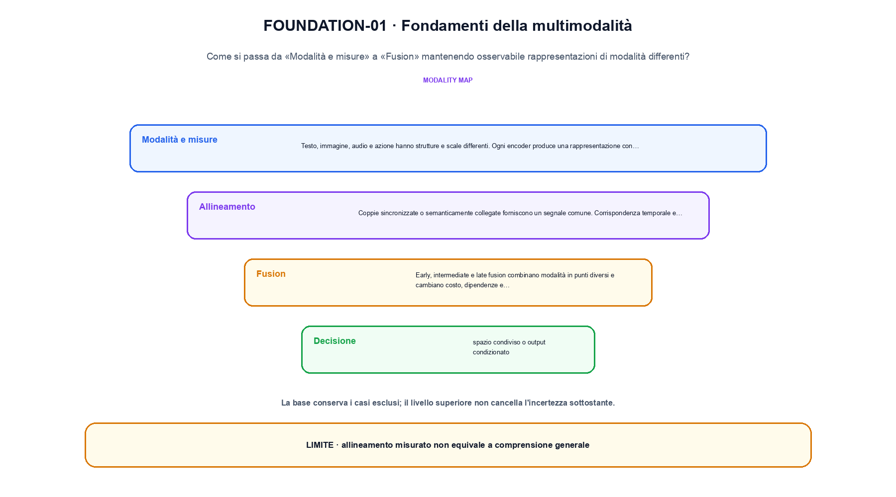
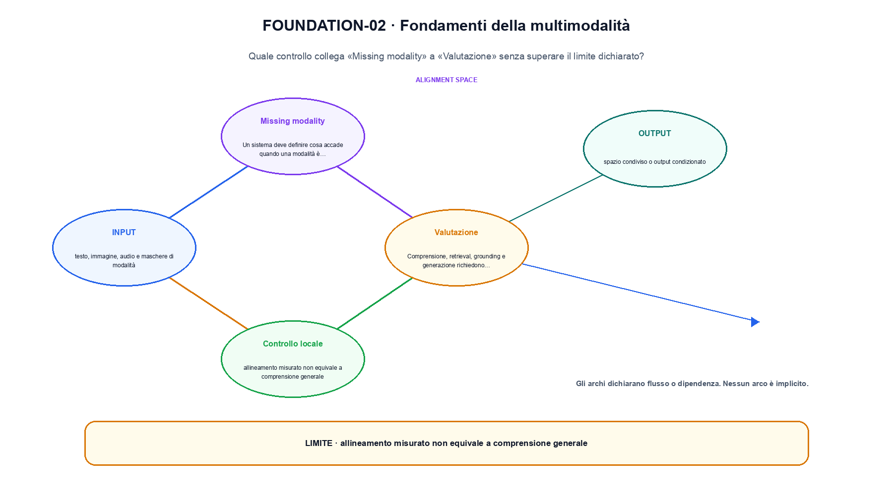

<!--
chapter_id: CH-P10-MULTIMODAL-FOUNDATIONS
part_id: P10
order_key: 550
title: Fondamenti della multimodalità
maturity: CORE
status: revisione editoriale v2, approvazione autoriale aperta
version: 0.5.0-draft3
last_source_check: 4 agosto 2026
environment: Python 3.13.12, CPU
code_policy: reference
deferred: benchmark applicativi non eseguiti e approvazione autoriale delle visuali
-->

# Capitolo 55. Fondamenti della multimodalità

La domanda guida di questa lezione è come collegare «Modalità e misure» e «Valutazione» senza perdere il contratto tecnico di fondamenti della multimodalità. L'oggetto osservato è rappresentazioni di modalità differenti. Il contratto locale è: input, testo, immagine, audio e maschere di modalità; operazione, encoder, proiezione, alignment e fusion; output, spazio condiviso o output condizionato. Il caso guida è questo: Due vettori, testo e immagine, vengono proiettati nella stessa dimensione prima della fusione. Il confine da mantenere esplicito è: allineamento misurato non equivale a comprensione generale.

## Modalità e misure

Testo, immagine, audio e azione hanno strutture e scale differenti. Ogni encoder produce una rappresentazione con assi dichiarati. [SRC-55-001]

Ogni modalità ha un encoder e un contratto prima dell'allineamento.

**Caso da seguire.** Due vettori, testo e immagine, vengono proiettati nella stessa dimensione prima della fusione.

**Controllo.** Classifica lo stesso caso lungo un solo asse alla volta e annota quale proprietà non è stata misurata.


## Allineamento

Coppie sincronizzate o semanticamente collegate forniscono un segnale comune. Corrispondenza temporale e semantica non coincidono sempre. [SRC-55-002]

**Caso da seguire.** Due vettori di modalità proiettati nella stessa dimensione.

**Controllo.** Cambia la proprietà che distingue «Allineamento» dalle categorie vicine. Se la classificazione non cambia, la distinzione va formulata meglio.


## Fusion

Early, intermediate e late fusion combinano modalità in punti diversi e cambiano costo, dipendenze e disponibilità dei dati. [SRC-55-003]

**Caso da seguire.** Un caso in cui allineamento misurato non equivale a comprensione generale.

**Controllo.** Confronta un caso positivo e uno di confine usando la medesima definizione; non trasformare l'esempio in una graduatoria generale.




La prima figura segue il percorso da «Modalità e misure» a «Fusion».


## Missing modality

Un sistema deve definire cosa accade quando una modalità è assente, corrotta o non autorizzata. [SRC-55-004]

**Caso da seguire.** Due vettori di modalità diverse vengono proiettati in uno spazio comune prima della similarità o della fusione; la dimensione comune è un invariante esplicito.

**Controllo.** Indica quale osservazione smentirebbe l'assegnazione del caso a «Missing modality» e quale invece sarebbe irrilevante.


## Valutazione

Comprensione, retrieval, grounding e generazione richiedono benchmark distinti. Una media multimodale può nascondere una modalità debole. [SRC-55-001]

**Caso da seguire.** Per «Valutazione» si mantiene l'input del capitolo e si isola questa condizione: Comprensione, retrieval, grounding e generazione richiedono benchmark distinti.

**Controllo.** Limita la conclusione alla proprietà dichiarata: Una media multimodale può nascondere una modalità debole. Le dimensioni non osservate restano aperte.


## Esempio Python eseguito

Il frammento seguente è lo stesso conservato nel repository. Usa valori piccoli perché l'obiettivo è osservare il meccanismo, non simulare una scala che non abbiamo eseguito.

```python
def contract():
    text = [0.2, 0.4]
    image = [0.6, 0.1]
    shared = [(a + b) / 2 for a, b in zip(text, image)]
    return {"shared": shared, "modalities": 2, "invariant": "modalities meet in a declared shared representation"}
```

Esecuzione con `python snip_55_contract.py`:

```text
{"invariant": "modalities meet in a declared shared representation", "modalities": 2, "shared": [0.4, 0.25]}
```

Il test associato è [`code/test_55_contract.py`](code/test_55_contract.py); l'output versionato è [`code/outputs/SNIP-55-001.txt`](code/outputs/SNIP-55-001.txt).




La seconda figura mette a confronto «Missing modality» e il limite discusso in «Valutazione».


## Come si collegano i passaggi

- **Da «Modalità e misure» a «Allineamento».** Testo, immagine, audio e azione hanno strutture e scale differenti. Coppie sincronizzate o semanticamente collegate forniscono un segnale comune. La definizione iniziale stabilisce l'asse del confronto; la categoria successiva aggiunge una proprietà senza creare una classifica implicita. [SRC-55-001; SRC-55-002]

- **Da «Allineamento» a «Fusion».** Coppie sincronizzate o semanticamente collegate forniscono un segnale comune. Early, intermediate e late fusion combinano modalità in punti diversi e cambiano costo, dipendenze e disponibilità dei dati. Il terzo passaggio verifica se le categorie restano distinguibili sullo stesso caso e impedisce che termini vicini diventino sinonimi. [SRC-55-002; SRC-55-003]

- **Da «Fusion» a «Missing modality».** Early, intermediate e late fusion combinano modalità in punti diversi e cambiano costo, dipendenze e disponibilità dei dati. Un sistema deve definire cosa accade quando una modalità è assente, corrotta o non autorizzata. La quarta sezione introduce il punto in cui l'asse scelto smette di bastare e richiede una nuova osservazione. [SRC-55-003; SRC-55-004]

- **Da «Missing modality» a «Valutazione».** Un sistema deve definire cosa accade quando una modalità è assente, corrotta o non autorizzata. Comprensione, retrieval, grounding e generazione richiedono benchmark distinti. La sezione finale riunisce le dimensioni della valutazione, ma conserva i limiti di ciascuna invece di fonderle in un unico punteggio. [SRC-55-004; SRC-55-001]

La catena completa produce spazio condiviso o output condizionato a partire da testo, immagine, audio e maschere di modalità. Ogni collegamento conserva un oggetto osservabile diverso; per questo il risultato non può essere esteso oltre il limite dichiarato: allineamento misurato non equivale a comprensione generale.


## Domande per distinguere le categorie

1. Ricostruisci «Modalità e misure» con un esempio diverso da quello mostrato e indica l'output atteso prima del calcolo.
2. Nel passaggio «Allineamento», cambia una sola ipotesi e spiega quale risultato non è più confrontabile.
3. Collega «Fusion» a una riga dello snippet oppure motiva perché la prova deve essere documentale.
4. Progetta un caso limite per «Missing modality» che produca una failure riconoscibile.
5. Per «Valutazione», separa una conclusione sostenuta dal caso locale da una che richiederebbe nuovi dati o un benchmark.


## Una mappa, non una graduatoria

La lezione parte da «testo, immagine, audio e maschere di modalità» e arriva fino a «spazio condiviso o output condizionato». Il limite da conservare è questo: allineamento misurato non equivale a comprensione generale. Definizioni e risultati citati sono rintracciabili in [`FONTI_PRIMARIE.md`](FONTI_PRIMARIE.md); la mappa dei claim è in [`CLAIMS.md`](CLAIMS.md).
