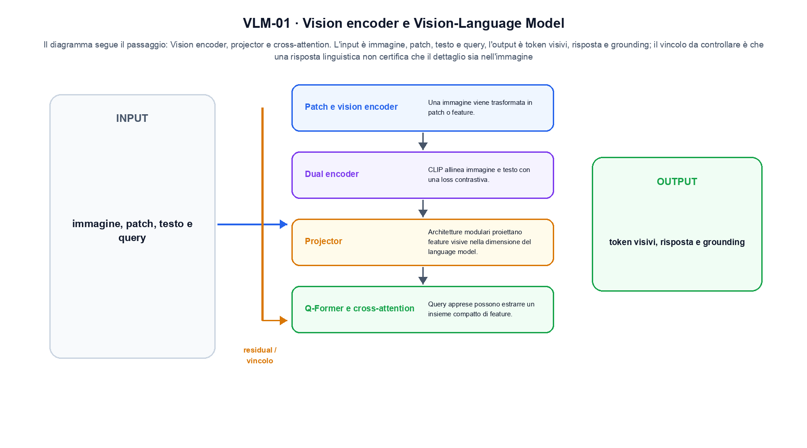
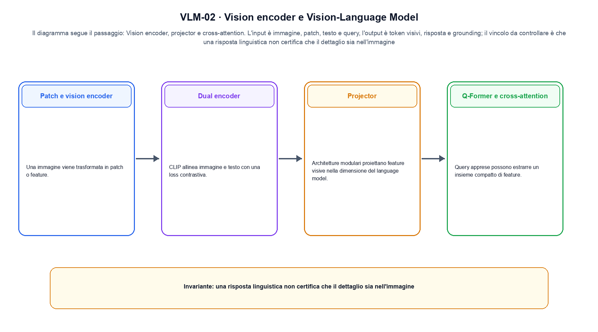

<!--
chapter_id: CH-P10-VLM
part_id: P10
order_key: 560
title: Vision encoder e Vision-Language Model
maturity: CORE
status: candidatura completa in revisione autoriale
version: 0.4.0-draft2
last_source_check: 3 agosto 2026
environment: Python 3.13.12, CPU
deferred: benchmark applicativi, varianti non necessarie al contratto centrale e approvazione autoriale
-->

# Capitolo 56. Vision encoder e Vision-Language Model

Finora abbiamo potuto descrivere patch visivi e token linguistici in un VLM. La richiesta «Il pacco non è arrivato» resta lo scenario condiviso: nel Capitolo 56 prendiamo l'input «immagine, patch, testo e query» e lo seguiamo fino all'output «token visivi, risposta e grounding», dichiarando prima il contratto e poi il limite.

## Patch e vision encoder

Una immagine viene trasformata in patch o feature. Risoluzione, positional encoding e pooling definiscono la sequenza visiva. [SRC-56-001]

Prima del nome tecnico fissiamo la situazione: consideriamo una query confronta due patch visive e conserva l'indice della patch con score maggiore. Da qui possiamo leggere la conseguenza dichiarata da «Una immagine viene trasformata in patch o feature».

La sezione usa l'input «immagine, patch, testo e query» come punto di partenza e l'output «token visivi, risposta e grounding» come traccia d'uscita. La trasformazione concreta è «vision encoder, projector e cross-attention»; il caso non è completo se non dichiariamo anche che una risposta linguistica non certifica che il dettaglio sia nell'immagine. La condizione da isolare è «Una immagine viene trasformata in patch o feature».

Un flow rende esplicito il percorso invertibile tra spazio semplice e dati. La densità deve tenere conto del Jacobiano, mentre il costo dipende dalla trasformazione o dalla soluzione numerica scelta. Per «Patch e vision encoder» il controllo cambia una sola premessa della frase «Una immagine viene trasformata in patch o feature» e conserva input, output e criterio di successo, così la differenza resta attribuibile. La verifica resta ancorata a «Una immagine viene trasformata in patch o feature». [SRC-56-001]

Se cambiamo una premessa, dobbiamo riaprire l'interpretazione. Per «Patch e vision encoder» conserviamo l'osservazione collegata a «Una immagine viene trasformata in patch o feature» e lasciamo esplicitamente fuori ciò che non è stato misurato.

La prova di «Patch e vision encoder» conserva input, operazione e output; poi esplicita quale parte di «Una immagine viene trasformata in patch o feature» non è stata misurata. Così il test separa l'evidenza dall'inferenza. Il passaggio successivo, «Dual encoder», potrà cambiare una sola condizione, dichiarando il nuovo setup prima di interpretare il risultato.

## Dual encoder

CLIP allinea immagine e testo con una loss contrastiva. I due encoder supportano retrieval efficiente ma interagiscono tardi. [SRC-56-002]

Per capire «Dual encoder» partiamo da questo caso: due patch aggregate e una domanda con riferimento locale. Il caso rende osservabile il punto centrale: «CLIP allinea immagine e testo con una loss contrastiva».

Per ricostruire «Dual encoder» annotiamo l'input «immagine, patch, testo e query», poi l'operazione «vision encoder, projector e cross-attention», infine l'output «token visivi, risposta e grounding». Questa sequenza impedisce di scambiare una forma compatibile per il comportamento descritto dalla fonte. Il controllo parte da «CLIP allinea immagine e testo con una loss contrastiva».

Un flow rende esplicito il percorso invertibile tra spazio semplice e dati. La densità deve tenere conto del Jacobiano, mentre il costo dipende dalla trasformazione o dalla soluzione numerica scelta. Per «Dual encoder» il controllo cambia una sola premessa della frase «CLIP allinea immagine e testo con una loss contrastiva» e conserva input, output e criterio di successo, così la differenza resta attribuibile. La verifica resta ancorata a «CLIP allinea immagine e testo con una loss contrastiva». [SRC-56-002]

Il punto didattico di «Dual encoder» è separare ciò che la fonte afferma da ciò che il piccolo caso illustra. L'output «token visivi, risposta e grounding» mostra il contratto locale, ma non sostituisce una misura sul sistema completo.

Per verificare «Dual encoder» cambiamo una sola condizione vicina alla frase «CLIP allinea immagine e testo con una loss contrastiva», teniamo fermo il resto e registriamo l'output «token visivi, risposta e grounding». Il caso negativo deve rendere riconoscibile la failure, non soltanto produrre un numero diverso. La sezione successiva, «Projector», riceve l'output «token visivi, risposta e grounding» come base, ma dovrà formulare e verificare la propria distinzione.

## Projector

Architetture modulari proiettano feature visive nella dimensione del language model. Il projector stabilisce capacità e numero di visual token. [SRC-56-003]

Il caso minimo di «Projector» si presenta così: un caso in cui una risposta linguistica non certifica che il dettaglio sia nell'immagine. Non lo usiamo come decorazione: serve a rendere osservabile la frase «Architetture modulari proiettano feature visive nella dimensione del language model».

Nel contratto locale, l'input «immagine, patch, testo e query» entra, l'operazione «vision encoder, projector e cross-attention» modifica il percorso e l'output «token visivi, risposta e grounding» è ciò che osserviamo. Qui cambia soprattutto il passaggio «Projector»; resta da controllare che una risposta linguistica non certifica che il dettaglio sia nell'immagine. La domanda locale è «Architetture modulari proiettano feature visive nella dimensione del language model».

Il passaggio da seguire in «Projector» è quello descritto dalla frase «Architetture modulari proiettano feature visive nella dimensione del language model»: l'esempio rende osservabile la trasformazione, mentre il contratto del capitolo ne delimita l'interpretazione. Per «Projector» il controllo cambia una sola premessa della frase «Architetture modulari proiettano feature visive nella dimensione del language model» e conserva input, output e criterio di successo, così la differenza resta attribuibile. La verifica resta ancorata a «Architetture modulari proiettano feature visive nella dimensione del language model». [SRC-56-003]

La lettura va fatta in ordine: prima il caso, poi la trasformazione, quindi la conseguenza. Il projector stabilisce capacità e numero di visual token. Il piccolo risultato resta un'illustrazione di «Architetture modulari proiettano feature visive nella dimensione del language model», non una promessa generale.

Il controllo minimo di «Projector» confronta il caso dichiarato con una variazione che rompe la sua ipotesi. Se la failure non è distinguibile dall'esito valido, manca un'osservazione nel contratto di allineamento tra modalità. Da «Projector» portiamo l'output «token visivi, risposta e grounding»; non portiamo invece una conclusione oltre il caso locale.

## Q-Former e cross-attention

Query apprese possono estrarre un insieme compatto di feature. Altre architetture inseriscono cross-attention dedicata. [SRC-56-004]

Prima del nome tecnico fissiamo la situazione: consideriamo due vettori di modalità diverse vengono proiettati in uno spazio comune prima della similarità o della fusione; la dimensione comune è un invariante esplicito. Da qui possiamo leggere la conseguenza dichiarata da «Query apprese possono estrarre un insieme compatto di feature».

La sezione usa l'input «immagine, patch, testo e query» come punto di partenza e l'output «token visivi, risposta e grounding» come traccia d'uscita. La trasformazione concreta è «vision encoder, projector e cross-attention»; il caso non è completo se non dichiariamo anche che una risposta linguistica non certifica che il dettaglio sia nell'immagine. La condizione da isolare è «Query apprese possono estrarre un insieme compatto di feature».

L'attention determina quali coppie di posizioni possono contribuire e come vengono organizzate key e value. Il numero di head, il pattern di visibilità e la cache cambiano memoria e connettività, non soltanto il nome del blocco. La variabile da isolare è il pattern di visibilità o di riuso: la stessa shape può corrispondere a dipendenze e costi diversi. La verifica resta ancorata a «Query apprese possono estrarre un insieme compatto di feature». [SRC-56-004]

Se cambiamo una premessa, dobbiamo riaprire l'interpretazione. Per «Q-Former e cross-attention» conserviamo l'osservazione collegata a «Query apprese possono estrarre un insieme compatto di feature» e lasciamo esplicitamente fuori ciò che non è stato misurato.

La prova di «Q-Former e cross-attention» conserva input, operazione e output; poi esplicita quale parte di «Query apprese possono estrarre un insieme compatto di feature» non è stata misurata. Così il test separa l'evidenza dall'inferenza. Il passaggio successivo, «Grounding e hallucination», potrà cambiare una sola condizione, dichiarando il nuovo setup prima di interpretare il risultato.

La figura VLM-01 usa la famiglia architecture. Il diagramma segue il passaggio: Vision encoder, projector e cross-attention. L'input è immagine, patch, testo e query, l'output è token visivi, risposta e grounding; il vincolo da controllare è che una risposta linguistica non certifica che il dettaglio sia nell'immagine.

## Grounding e hallucination

Descrivere una immagine non garantisce localizzare oggetti o relazioni. Grounding, OCR e affidabilità richiedono test specifici. [SRC-56-001]

Per capire «Grounding e hallucination» partiamo da questo caso: due vettori di modalità diverse vengono proiettati in uno spazio comune prima della similarità o della fusione; la dimensione comune è un invariante esplicito. Il caso rende osservabile il punto centrale: «Descrivere una immagine non garantisce localizzare oggetti o relazioni».

Per ricostruire «Grounding e hallucination» annotiamo l'input «immagine, patch, testo e query», poi l'operazione «vision encoder, projector e cross-attention», infine l'output «token visivi, risposta e grounding». Questa sequenza impedisce di scambiare una forma compatibile per il comportamento descritto dalla fonte. Il controllo parte da «Descrivere una immagine non garantisce localizzare oggetti o relazioni».

Il passaggio da seguire in «Grounding e hallucination» è quello descritto dalla frase «Descrivere una immagine non garantisce localizzare oggetti o relazioni»: l'esempio rende osservabile la trasformazione, mentre il contratto del capitolo ne delimita l'interpretazione. Per «Grounding e hallucination» il controllo cambia una sola premessa della frase «Descrivere una immagine non garantisce localizzare oggetti o relazioni» e conserva input, output e criterio di successo, così la differenza resta attribuibile. La verifica resta ancorata a «Descrivere una immagine non garantisce localizzare oggetti o relazioni». [SRC-56-001]

Il punto didattico di «Grounding e hallucination» è separare ciò che la fonte afferma da ciò che il piccolo caso illustra. L'output «token visivi, risposta e grounding» mostra il contratto locale, ma non sostituisce una misura sul sistema completo.

Per verificare «Grounding e hallucination» cambiamo una sola condizione vicina alla frase «Descrivere una immagine non garantisce localizzare oggetti o relazioni», teniamo fermo il resto e registriamo l'output «token visivi, risposta e grounding». Il caso negativo deve rendere riconoscibile la failure, non soltanto produrre un numero diverso. Il percorso si chiude lasciando espliciti la misura locale e ciò che richiederebbe una prova ulteriore.

## Il caso minimo e la sua variante: Patch e vision encoder

Il caso intero parte dall'input «immagine, patch, testo e query», applica l'operazione «vision encoder, projector e cross-attention» e osserva l'output «token visivi, risposta e grounding». Un esempio controllato: due patch aggregate e una domanda con riferimento locale. La formula locale è:

$$
s = sim(f_text(t), f_image(i))
$$

La similarità misurata non esaurisce la comprensione della scena. [SRC-56-001]

La figura VLM-02 cambia composizione rispetto alla prima. Il diagramma segue il passaggio: Vision encoder, projector e cross-attention. L'input è immagine, patch, testo e query, l'output è token visivi, risposta e grounding; il vincolo da controllare è che una risposta linguistica non certifica che il dettaglio sia nell'immagine.

## Che cosa osserva lo snippet: Dual encoder

Nel run Python rendiamo osservabile la frase «Una immagine viene trasformata in patch o feature» con valori piccoli e leggibili. Il test associato verifica determinismo, output e rifiuto di una condizione incoerente; il file di output `code/outputs/SNIP-56-001.txt` documenta il caso senza pretendere una misura generale.

## Che cosa non dimostra: Grounding e hallucination

Il meccanismo di «Vision encoder e Vision-Language Model» non garantisce da solo che il sistema funzioni fuori dal caso guida. Una risposta linguistica non certifica che il dettaglio sia nell'immagine. Il limite osservato riguarda la frase «Una immagine viene trasformata in patch o feature»; per trasferire il concetto occorre riaprire la verifica quando cambiano dati, scala o ambiente.

## La mappa delle condizioni: Vision encoder e Vision-Language Model

Il percorso ha tenuto insieme patch visivi e token linguistici in un VLM, l'operazione «vision encoder, projector e cross-attention» e l'output «token visivi, risposta e grounding». Le sezioni «Patch e vision encoder», «Dual encoder», «Grounding e hallucination» mostrano come il protocollo osservato delimiti ciò che il capitolo può sostenere. L'invariante da portare avanti è: una risposta linguistica non certifica che il dettaglio sia nell'immagine. Il Capitolo 57, Generazione e modifica delle immagini, può partire da questo output e dichiarare la propria domanda.

### Cinque domande di controllo: Patch e vision encoder

1. Ricostruisci l'oggetto continuo a partire da «Patch e vision encoder» e indica quale parte della frase «Una immagine viene trasformata in patch o feature» entra nel caso.
2. Spiega quale trasformazione collega «Patch e vision encoder» a «Grounding e hallucination» e quale output osserviamo nel passaggio.
3. Usa lo snippet per controllare l'invariante del contratto: una risposta linguistica non certifica che il dettaglio sia nell'immagine.
4. Separa una definizione sostenuta da una fonte, un esempio illustrativo e un risultato locale del caso guida.
5. Indica quale parte della frase «Descrivere una immagine non garantisce localizzare oggetti o relazioni» richiederebbe una misura nuova prima di essere estesa oltre il caso osservato.

### Esercizi per cambiare una condizione: Grounding e hallucination

1. Racconta «Patch e vision encoder» come una trasformazione: che cosa entra e che cosa esce?
2. Confronta due esecuzioni di «Dual encoder» mantenendo il resto del setup invariato.
3. Per «Projector», separa l'esempio locale dal limite che impedisce di generalizzarlo.
4. Progetta una prova per «Q-Former e cross-attention» che renda visibile il suo confine.
5. Scrivi una metrica o una domanda per valutare «Grounding e hallucination» senza confondere livelli diversi.

## Fonti e risultati locali: Vision encoder e Vision-Language Model

Per «Vision encoder e Vision-Language Model», le fonti portanti, i limiti dei claim e la data di consultazione sono raccolti in `FONTI_PRIMARIE.md`; la ricerca riguarda soprattutto allineamento tra modalità. `CLAIMS.md` separa definizioni e risultati locali; codice, ambiente, test e output sono nella cartella `code/`, con attenzione a allineamento tra modalità.
