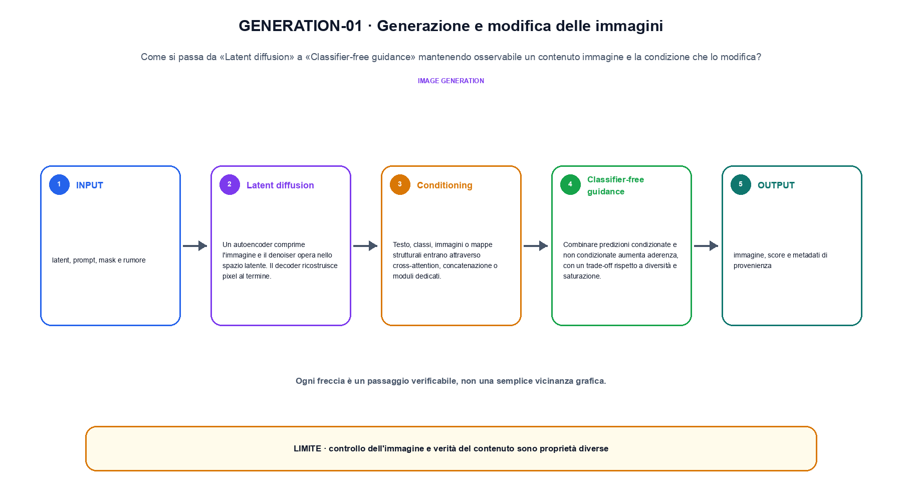
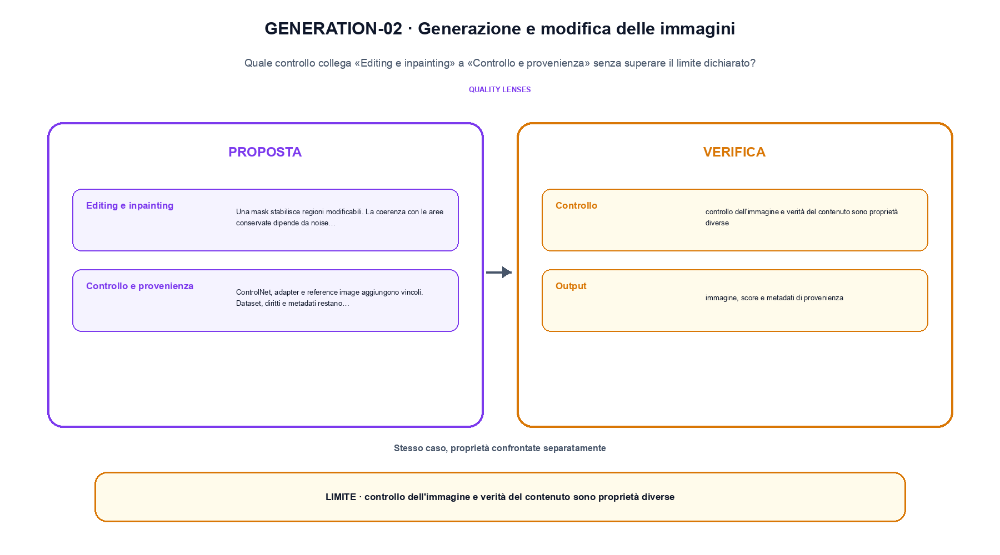

<!--
chapter_id: CH-P10-IMAGE-GENERATION
part_id: P10
order_key: 570
title: Generazione e modifica delle immagini
maturity: ESTABLISHED
status: revisione editoriale v2, approvazione autoriale aperta
version: 0.5.0-draft3
last_source_check: 4 agosto 2026
environment: Python 3.13.12, CPU
code_policy: reference
deferred: benchmark applicativi non eseguiti e approvazione autoriale delle visuali
-->

# Capitolo 57. Generazione e modifica delle immagini

La domanda guida di questa lezione è come collegare «Latent diffusion» e «Controllo e provenienza» senza perdere il contratto tecnico di generazione e modifica delle immagini. L'oggetto osservato è un contenuto immagine e la condizione che lo modifica. Il contratto locale è: input, latent, prompt, mask e rumore; operazione, denoising, guidance, editing o inpainting; output, immagine, score e metadati di provenienza. Il caso guida è questo: Un singolo passo riduce una coppia di valori rumorosi secondo uno schedule dichiarato. Il confine da mantenere esplicito è: controllo dell'immagine e verità del contenuto sono proprietà diverse.

## Latent diffusion

Un autoencoder comprime l'immagine e il denoiser opera nello spazio latente. Il decoder ricostruisce pixel al termine. [SRC-57-001]

Editing e generazione modificano un contenuto sotto una condizione dichiarata.

**Caso da seguire.** Un singolo passo riduce una coppia di valori rumorosi secondo uno schedule dichiarato.

**Controllo.** Registra richiesta, decisione, stato e output finale. Un esito plausibile non deve nascondere il componente che lo ha prodotto.


## Conditioning

Testo, classi, immagini o mappe strutturali entrano attraverso cross-attention, concatenazione o moduli dedicati. [SRC-57-002]

**Caso da seguire.** Una regione mascherata modificata lasciando il resto fissato.

**Controllo.** Ripeti «Conditioning» con una capability o un'autorizzazione rimossa e verifica che la failure preceda qualsiasi side effect.




La prima figura segue il percorso da «Latent diffusion» a «Classifier-free guidance».


## Classifier-free guidance

Combinare predizioni condizionate e non condizionate aumenta aderenza, con un trade-off rispetto a diversità e saturazione. [SRC-57-003]

**Caso da seguire.** Un caso in cui controllo dell'immagine e verità del contenuto sono proprietà diverse.

**Controllo.** Separa il test del singolo componente dal test end-to-end, usando lo stesso input e la stessa configurazione versionata.


## Editing e inpainting

Una mask stabilisce regioni modificabili. La coerenza con le aree conservate dipende da noise schedule e condition. [SRC-57-004]

**Caso da seguire.** Due vettori di modalità diverse vengono proiettati in uno spazio comune prima della similarità o della fusione; la dimensione comune è un invariante esplicito.

**Controllo.** Introduci una failure a un solo confine e controlla che log, stato e recovery identifichino quel confine senza ambiguità.


## Controllo e provenienza

ControlNet, adapter e reference image aggiungono vincoli. Dataset, diritti e metadati restano parte del sistema. [SRC-57-001]

**Caso da seguire.** Un payload modificato dopo la firma, con digest e metadati confrontati separatamente.

**Controllo.** Confronta il comportamento completo, non soltanto l'ultimo messaggio. Il risultato resta limitato da: Dataset, diritti e metadati restano parte del sistema.




La seconda figura mette a confronto «Editing e inpainting» e il limite discusso in «Controllo e provenienza».


## Esempio Python eseguito

Il frammento seguente è lo stesso conservato nel repository. Usa valori piccoli perché l'obiettivo è osservare il meccanismo, non simulare una scala che non abbiamo eseguito.

```python
def contract():
    noisy = [0.9, 0.1]
    denoised = [0.7 * noisy[0] + 0.3 * 0.5, 0.7 * noisy[1] + 0.3 * 0.5]
    return {"denoised": denoised, "steps": 1, "invariant": "a generation step declares its noise level and update"}
```

Esecuzione con `python snip_57_contract.py`:

```text
{"denoised": [0.78, 0.21999999999999997], "invariant": "a generation step declares its noise level and update", "steps": 1}
```

Il test associato è [`code/test_57_contract.py`](code/test_57_contract.py); l'output versionato è [`code/outputs/SNIP-57-001.txt`](code/outputs/SNIP-57-001.txt).


## Come si collegano i passaggi

- **Da «Latent diffusion» a «Conditioning».** Un autoencoder comprime l'immagine e il denoiser opera nello spazio latente. Testo, classi, immagini o mappe strutturali entrano attraverso cross-attention, concatenazione o moduli dedicati. Il contratto iniziale nomina messaggi e confini; il componente successivo implementa una parte del percorso senza ereditare autorizzazioni implicite. [SRC-57-001; SRC-57-002]

- **Da «Conditioning» a «Classifier-free guidance».** Testo, classi, immagini o mappe strutturali entrano attraverso cross-attention, concatenazione o moduli dedicati. Combinare predizioni condizionate e non condizionate aumenta aderenza, con un trade-off rispetto a diversità e saturazione. Il terzo passaggio compone più componenti e rende quindi necessario conservare stato, identità e decisione oltre all'output finale. [SRC-57-002; SRC-57-003]

- **Da «Classifier-free guidance» a «Editing e inpainting».** Combinare predizioni condizionate e non condizionate aumenta aderenza, con un trade-off rispetto a diversità e saturazione. Una mask stabilisce regioni modificabili. La quarta sezione introduce failure e recovery nel punto in cui possono ancora precedere un side effect o una perdita di stato. [SRC-57-003; SRC-57-004]

- **Da «Editing e inpainting» a «Controllo e provenienza».** Una mask stabilisce regioni modificabili. ControlNet, adapter e reference image aggiungono vincoli. La chiusura valuta il comportamento end-to-end: un componente corretto non basta se il collegamento, il carico o la policy cambiano l'esito. [SRC-57-004; SRC-57-001]

La catena completa produce immagine, score e metadati di provenienza a partire da latent, prompt, mask e rumore. Ogni collegamento conserva un oggetto osservabile diverso; per questo il risultato non può essere esteso oltre il limite dichiarato: controllo dell'immagine e verità del contenuto sono proprietà diverse.


## Prove sui confini del sistema

1. Ricostruisci «Latent diffusion» con un esempio diverso da quello mostrato e indica l'output atteso prima del calcolo.
2. Nel passaggio «Conditioning», cambia una sola ipotesi e spiega quale risultato non è più confrontabile.
3. Collega «Classifier-free guidance» a una riga dello snippet oppure motiva perché la prova deve essere documentale.
4. Progetta un caso limite per «Editing e inpainting» che produca una failure riconoscibile.
5. Per «Controllo e provenienza», separa una conclusione sostenuta dal caso locale da una che richiederebbe nuovi dati o un benchmark.


## Il confine operativo

La lezione parte da «latent, prompt, mask e rumore» e arriva fino a «immagine, score e metadati di provenienza». Il limite da conservare è questo: controllo dell'immagine e verità del contenuto sono proprietà diverse. Definizioni e risultati citati sono rintracciabili in [`FONTI_PRIMARIE.md`](FONTI_PRIMARIE.md); la mappa dei claim è in [`CLAIMS.md`](CLAIMS.md).
