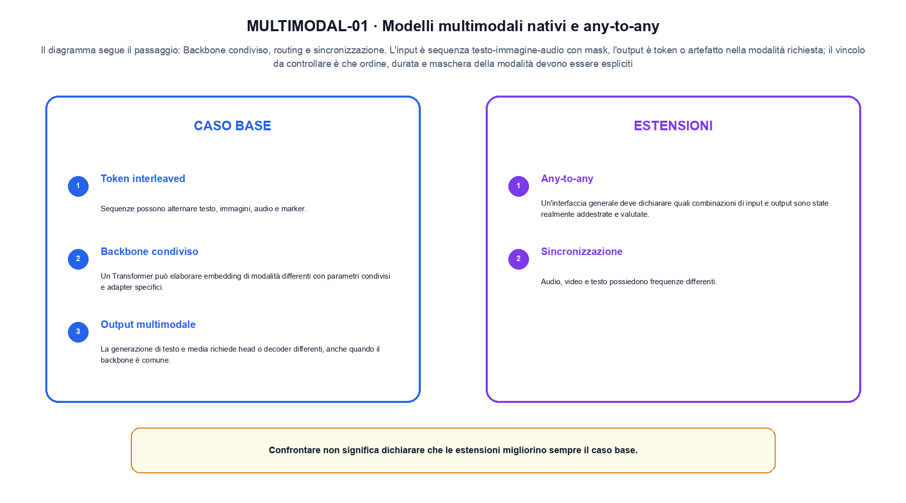
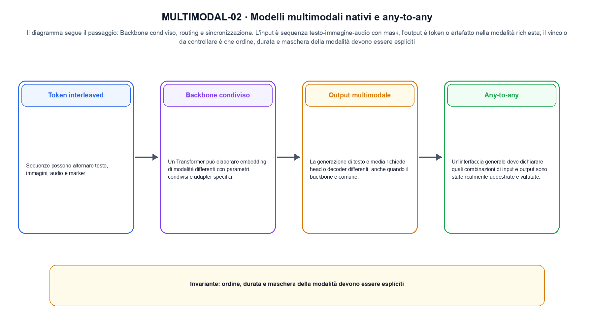

<!--
chapter_id: CH-P10-NATIVE-MULTIMODAL
part_id: P10
order_key: 580
title: Modelli multimodali nativi e any-to-any
maturity: ESTABLISHED
status: candidatura completa in revisione autoriale
version: 0.4.0-draft2
last_source_check: 3 agosto 2026
environment: Python 3.13.12, CPU
deferred: benchmark applicativi, varianti non necessarie al contratto centrale e approvazione autoriale
-->

# Capitolo 58. Modelli multimodali nativi e any-to-any

La richiesta «Il pacco non è arrivato» resta il caso guida. In questo capitolo la usiamo per distinguere token interleaved e output di più modalità, trasformazione e risultato, senza nascondere i dettagli tecnici.

## Token interleaved

Sequenze possono alternare testo, immagini, audio e marker. Il tokenizer multimodale definisce unità e ordine. [SRC-58-001]

Il caso minimo di «Token interleaved» si presenta così: una sequenza alterna token testuali e visivi mantenendo la modalità associata a ogni posizione. Non lo usiamo come decorazione: serve a rendere osservabile la frase «Sequenze possono alternare testo, immagini, audio e marker».

Per ricostruire «Token interleaved» annotiamo l'input «sequenza testo-immagine-audio con mask», poi l'operazione «backbone condiviso, routing e sincronizzazione», infine l'output «token o artefatto nella modalità richiesta». Questa sequenza impedisce di scambiare una forma compatibile per il comportamento descritto dalla fonte. Il controllo parte da «Sequenze possono alternare testo, immagini, audio e marker».

Il passaggio da seguire in «Token interleaved» è quello descritto dalla frase «Sequenze possono alternare testo, immagini, audio e marker»: l'esempio rende osservabile la trasformazione, mentre il contratto del capitolo ne delimita l'interpretazione. Per «Token interleaved» il controllo cambia una sola premessa della frase «Sequenze possono alternare testo, immagini, audio e marker» e conserva input, output e criterio di successo, così la differenza resta attribuibile. La verifica resta ancorata a «Sequenze possono alternare testo, immagini, audio e marker». [SRC-58-001]

Il punto didattico di «Token interleaved» è separare ciò che la fonte afferma da ciò che il piccolo caso illustra. L'output «token o artefatto nella modalità richiesta» mostra il contratto locale, ma non sostituisce una misura sul sistema completo.

Il controllo minimo di «Token interleaved» confronta il caso dichiarato con una variazione che rompe la sua ipotesi. Se la failure non è distinguibile dall'esito valido, manca un'osservazione nel contratto di allineamento tra modalità. Da «Token interleaved» portiamo l'output «token o artefatto nella modalità richiesta»; non portiamo invece una conclusione oltre il caso locale.

## Backbone condiviso

Un Transformer può elaborare embedding di modalità differenti con parametri condivisi e adapter specifici. [SRC-58-002]

Prima del nome tecnico fissiamo la situazione: consideriamo testo e immagine alternati con due posizioni riservate. Da qui possiamo leggere la conseguenza dichiarata da «Un Transformer può elaborare embedding di modalità differenti con parametri condivisi e adapter specifici».

Nel contratto locale, l'input «sequenza testo-immagine-audio con mask» entra, l'operazione «backbone condiviso, routing e sincronizzazione» modifica il percorso e l'output «token o artefatto nella modalità richiesta» è ciò che osserviamo. Qui cambia soprattutto il passaggio «Backbone condiviso»; resta da controllare che ordine, durata e maschera della modalità devono essere espliciti. La domanda locale è «Un Transformer può elaborare embedding di modalità differenti con parametri condivisi e adapter specifici».

Il passaggio da seguire in «Backbone condiviso» è quello descritto dalla frase «Un Transformer può elaborare embedding di modalità differenti con parametri condivisi e adapter specifici»: l'esempio rende osservabile la trasformazione, mentre il contratto del capitolo ne delimita l'interpretazione. Per «Backbone condiviso» il controllo cambia una sola premessa della frase «Un Transformer può elaborare embedding di modalità differenti con parametri condivisi e adapter specifici» e conserva input, output e criterio di successo, così la differenza resta attribuibile. La verifica resta ancorata a «Un Transformer può elaborare embedding di modalità differenti con parametri condivisi e adapter specifici». [SRC-58-002]

La lettura va fatta in ordine: prima il caso, poi la trasformazione, quindi la conseguenza. Il piccolo risultato resta un'illustrazione di «Un Transformer può elaborare embedding di modalità differenti con parametri condivisi e adapter specifici», non una promessa generale.

La prova di «Backbone condiviso» conserva input, operazione e output; poi esplicita quale parte di «Un Transformer può elaborare embedding di modalità differenti con parametri condivisi e adapter specifici» non è stata misurata. Così il test separa l'evidenza dall'inferenza. Il passaggio successivo, «Output multimodale», potrà cambiare una sola condizione, dichiarando il nuovo setup prima di interpretare il risultato.

## Output multimodale

La generazione di testo e media richiede head o decoder differenti, anche quando il backbone è comune. [SRC-58-003]

Per capire «Output multimodale» partiamo da questo caso: due rappresentazioni di modalità diverse proiettate nella stessa dimensione prima di similarità, fusione o generazione. Il caso rende osservabile il punto centrale: «La generazione di testo e media richiede head o decoder differenti, anche quando il backbone è comune».

La sezione usa l'input «sequenza testo-immagine-audio con mask» come punto di partenza e l'output «token o artefatto nella modalità richiesta» come traccia d'uscita. La trasformazione concreta è «backbone condiviso, routing e sincronizzazione»; il caso non è completo se non dichiariamo anche che ordine, durata e maschera della modalità devono essere espliciti. La condizione da isolare è «La generazione di testo e media richiede head o decoder differenti, anche quando il backbone è comune».

Le modalità devono essere rappresentate, sincronizzate e collegate a un compito osservabile. Una proiezione in uno spazio comune o una risposta corretta non dimostra da sola grounding o comprensione generale. Per «Output multimodale» il controllo cambia una sola premessa della frase «La generazione di testo e media richiede head o decoder differenti, anche quando il backbone è comune» e conserva input, output e criterio di successo, così la differenza resta attribuibile. La verifica resta ancorata a «La generazione di testo e media richiede head o decoder differenti, anche quando il backbone è comune». [SRC-58-003]

Se cambiamo una premessa, dobbiamo riaprire l'interpretazione. Per «Output multimodale» conserviamo l'osservazione collegata a «La generazione di testo e media richiede head o decoder differenti, anche quando il backbone è comune» e lasciamo esplicitamente fuori ciò che non è stato misurato.

Per verificare «Output multimodale» cambiamo una sola condizione vicina alla frase «La generazione di testo e media richiede head o decoder differenti, anche quando il backbone è comune», teniamo fermo il resto e registriamo l'output «token o artefatto nella modalità richiesta». Il caso negativo deve rendere riconoscibile la failure, non soltanto produrre un numero diverso. La sezione successiva, «Any-to-any», riceve l'output «token o artefatto nella modalità richiesta» come base, ma dovrà formulare e verificare la propria distinzione.

La figura MULTIMODAL-01 usa la famiglia compare. Il diagramma segue il passaggio: Backbone condiviso, routing e sincronizzazione. L'input è sequenza testo-immagine-audio con mask, l'output è token o artefatto nella modalità richiesta; il vincolo da controllare è che ordine, durata e maschera della modalità devono essere espliciti.

## Any-to-any

Un'interfaccia generale deve dichiarare quali combinazioni di input e output sono state realmente addestrate e valutate. [SRC-58-004]

Il caso minimo di «Any-to-any» si presenta così: due vettori di modalità diverse vengono proiettati in uno spazio comune prima della similarità o della fusione; la dimensione comune è un invariante esplicito. Non lo usiamo come decorazione: serve a rendere osservabile la frase «Un'interfaccia generale deve dichiarare quali combinazioni di input e output sono state realmente addestrate e valutate».

Per ricostruire «Any-to-any» annotiamo l'input «sequenza testo-immagine-audio con mask», poi l'operazione «backbone condiviso, routing e sincronizzazione», infine l'output «token o artefatto nella modalità richiesta». Questa sequenza impedisce di scambiare una forma compatibile per il comportamento descritto dalla fonte. Il controllo parte da «Un'interfaccia generale deve dichiarare quali combinazioni di input e output sono state realmente addestrate e valutate».

Il passaggio da seguire in «Any-to-any» è quello descritto dalla frase «Un'interfaccia generale deve dichiarare quali combinazioni di input e output sono state realmente addestrate e valutate»: l'esempio rende osservabile la trasformazione, mentre il contratto del capitolo ne delimita l'interpretazione. Per «Any-to-any» il controllo cambia una sola premessa della frase «Un'interfaccia generale deve dichiarare quali combinazioni di input e output sono state realmente addestrate e valutate» e conserva input, output e criterio di successo, così la differenza resta attribuibile. La verifica resta ancorata a «Un'interfaccia generale deve dichiarare quali combinazioni di input e output sono state realmente addestrate e valutate». [SRC-58-004]

Il punto didattico di «Any-to-any» è separare ciò che la fonte afferma da ciò che il piccolo caso illustra. L'output «token o artefatto nella modalità richiesta» mostra il contratto locale, ma non sostituisce una misura sul sistema completo.

Il controllo minimo di «Any-to-any» confronta il caso dichiarato con una variazione che rompe la sua ipotesi. Se la failure non è distinguibile dall'esito valido, manca un'osservazione nel contratto di allineamento tra modalità. Da «Any-to-any» portiamo l'output «token o artefatto nella modalità richiesta»; non portiamo invece una conclusione oltre il caso locale.

## Sincronizzazione

Audio, video e testo possiedono frequenze differenti. Allineamento temporale e turn-taking diventano parte dell'architettura. [SRC-58-001]

Prima del nome tecnico fissiamo la situazione: consideriamo due vettori di modalità diverse vengono proiettati in uno spazio comune prima della similarità o della fusione; la dimensione comune è un invariante esplicito. Da qui possiamo leggere la conseguenza dichiarata da «Audio, video e testo possiedono frequenze differenti».

Nel contratto locale, l'input «sequenza testo-immagine-audio con mask» entra, l'operazione «backbone condiviso, routing e sincronizzazione» modifica il percorso e l'output «token o artefatto nella modalità richiesta» è ciò che osserviamo. Qui cambia soprattutto il passaggio «Sincronizzazione»; resta da controllare che ordine, durata e maschera della modalità devono essere espliciti. La domanda locale è «Audio, video e testo possiedono frequenze differenti».

Il passaggio da seguire in «Sincronizzazione» è quello descritto dalla frase «Audio, video e testo possiedono frequenze differenti»: l'esempio rende osservabile la trasformazione, mentre il contratto del capitolo ne delimita l'interpretazione. Per «Sincronizzazione» il controllo cambia una sola premessa della frase «Audio, video e testo possiedono frequenze differenti» e conserva input, output e criterio di successo, così la differenza resta attribuibile. La verifica resta ancorata a «Audio, video e testo possiedono frequenze differenti». [SRC-58-001]

La lettura va fatta in ordine: prima il caso, poi la trasformazione, quindi la conseguenza. Allineamento temporale e turn-taking diventano parte dell'architettura. Il piccolo risultato resta un'illustrazione di «Audio, video e testo possiedono frequenze differenti», non una promessa generale.

La prova di «Sincronizzazione» conserva input, operazione e output; poi esplicita quale parte di «Audio, video e testo possiedono frequenze differenti» non è stata misurata. Così il test separa l'evidenza dall'inferenza. Il caso finale consegna l'output «token o artefatto nella modalità richiesta» come evidenza locale e conserva il contributo effettivo di ciascun segnale come domanda aperta.

## Una traiettoria controllata: Token interleaved

Il caso intero parte dall'input «sequenza testo-immagine-audio con mask», applica l'operazione «backbone condiviso, routing e sincronizzazione» e osserva l'output «token o artefatto nella modalità richiesta». Un esempio controllato: testo e immagine alternati con due posizioni riservate. Lo schema compatto è:

$$
z = fuse(z_text, z_vision, z_audio)
$$

È una notazione di interfaccia, non un'identità numerica completa. La fusione conserva le dimensioni e le maschere delle modalità. [SRC-58-001]

La figura MULTIMODAL-02 cambia composizione rispetto alla prima. Il diagramma segue il passaggio: Backbone condiviso, routing e sincronizzazione. L'input è sequenza testo-immagine-audio con mask, l'output è token o artefatto nella modalità richiesta; il vincolo da controllare è che ordine, durata e maschera della modalità devono essere espliciti.

## Il passaggio eseguito in Python: Backbone condiviso

Nel run Python rendiamo osservabile la frase «Sequenze possono alternare testo, immagini, audio e marker» con valori piccoli e leggibili. Il test associato verifica determinismo, output e rifiuto di una condizione incoerente; il file di output `code/outputs/SNIP-58-001.txt` documenta il caso senza pretendere una misura generale.

## Prima di generalizzare: Sincronizzazione

Il meccanismo di «Modelli multimodali nativi e any-to-any» non garantisce da solo che il sistema funzioni fuori dal caso guida. Ordine, durata e maschera della modalità devono essere espliciti. Il limite osservato riguarda la frase «Sequenze possono alternare testo, immagini, audio e marker»; per trasferire il concetto occorre riaprire la verifica quando cambiano dati, scala o ambiente.

## Dalla lezione al capitolo seguente: Modelli multimodali nativi e any-to-any

Il percorso ha tenuto insieme token interleaved e output di più modalità, l'operazione «backbone condiviso, routing e sincronizzazione» e l'output «token o artefatto nella modalità richiesta». Le sezioni «Token interleaved», «Backbone condiviso», «Sincronizzazione» mostrano come il protocollo osservato delimiti ciò che il capitolo può sostenere. L'invariante da portare avanti è: ordine, durata e maschera della modalità devono essere espliciti. Il Capitolo 59, Audio, parlato e musica, può partire da questo output e dichiarare la propria domanda.

### Domande per ricostruire il percorso: Token interleaved

1. Ricostruisci l'oggetto continuo a partire da «Token interleaved» e indica quale parte della frase «Sequenze possono alternare testo, immagini, audio e marker» entra nel caso.
2. Spiega quale trasformazione collega «Token interleaved» a «Sincronizzazione» e quale output osserviamo nel passaggio.
3. Usa lo snippet per controllare l'invariante del contratto: ordine, durata e maschera della modalità devono essere espliciti.
4. Separa una definizione sostenuta da una fonte, un esempio illustrativo e un risultato locale del caso guida.
5. Indica quale parte della frase «Audio, video e testo possiedono frequenze differenti» richiederebbe una misura nuova prima di essere estesa oltre il caso osservato.

### Esercizi sul failure mode: Sincronizzazione

1. Ricostruisci «Token interleaved» senza usare il nome della tecnica, soltanto con input, operazione e output.
2. Sostituisci una condizione di «Backbone condiviso» e prevedi che cosa non dovrebbe cambiare.
3. Cerca un controesempio per «Output multimodale» e annota quale ipotesi viene rotta.
4. Trasforma il limite di «Any-to-any» in un test ripetibile.
5. Spiega come trasferire «Sincronizzazione» senza portare con sé una promessa non misurata.

## Dossier delle fonti e materiali: Modelli multimodali nativi e any-to-any

Per «Modelli multimodali nativi e any-to-any», le fonti portanti, i limiti dei claim e la data di consultazione sono raccolti in `FONTI_PRIMARIE.md`; la ricerca riguarda soprattutto allineamento tra modalità. `CLAIMS.md` separa definizioni e risultati locali; codice, ambiente, test e output sono nella cartella `code/`, con attenzione a allineamento tra modalità.
