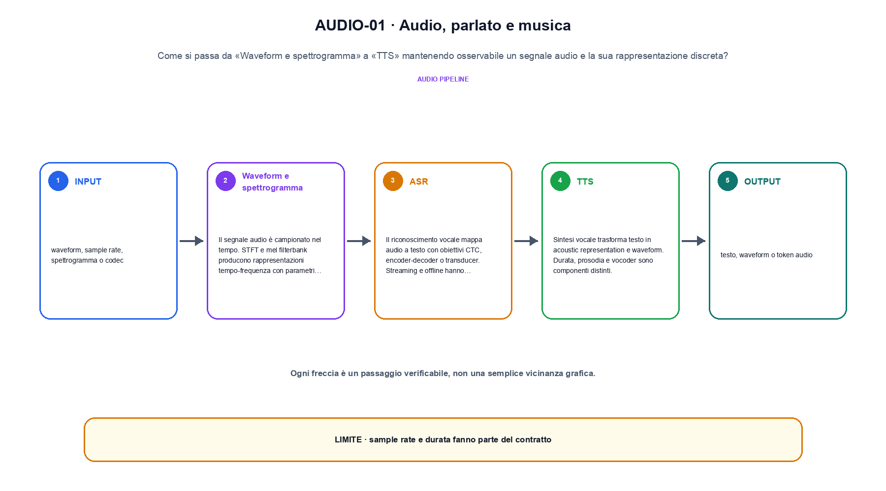
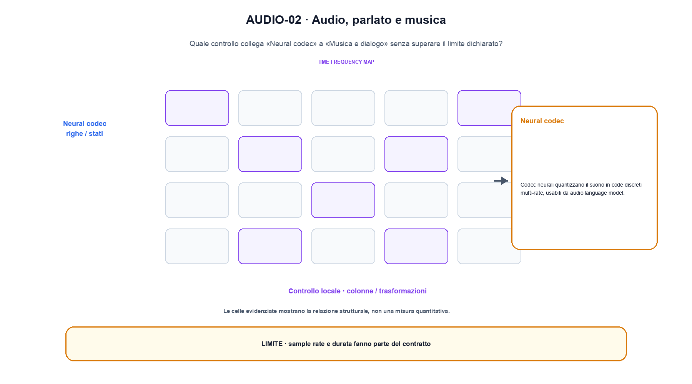

<!--
chapter_id: CH-P10-AUDIO
part_id: P10
order_key: 590
title: Audio, parlato e musica
maturity: CORE
status: revisione editoriale v2, approvazione autoriale aperta
version: 0.5.0-draft3
last_source_check: 4 agosto 2026
environment: Python 3.13.12, CPU
code_policy: reference
deferred: benchmark applicativi non eseguiti e approvazione autoriale delle visuali
-->

# Capitolo 59. Audio, parlato e musica

La domanda guida di questa lezione è come collegare «Waveform e spettrogramma» e «Musica e dialogo» senza perdere il contratto tecnico di audio, parlato e musica. L'oggetto osservato è un segnale audio e la sua rappresentazione discreta. Il contratto locale è: input, waveform, sample rate, spettrogramma o codec; operazione, ASR, TTS, codec e generazione; output, testo, waveform o token audio. Il caso guida è questo: Quattro campioni audio vengono divisi in due frame senza cambiare l'ordine temporale. Il confine da mantenere esplicito è: sample rate e durata fanno parte del contratto.

## Waveform e spettrogramma

Il segnale audio è campionato nel tempo. STFT e mel filterbank producono rappresentazioni tempo-frequenza con parametri espliciti. [SRC-59-001]

Sample rate, token e durata fanno parte del contratto dell'audio.

**Caso da seguire.** Quattro campioni audio vengono divisi in due frame senza cambiare l'ordine temporale.

**Controllo.** Registra richiesta, decisione, stato e output finale. Un esito plausibile non deve nascondere il componente che lo ha prodotto.


## ASR

Il riconoscimento vocale mappa audio a testo con obiettivi CTC, encoder-decoder o transducer. Streaming e offline hanno vincoli diversi. [SRC-59-002]

**Caso da seguire.** Una breve waveform convertita in frame e token.

**Controllo.** Ripeti «ASR» con una capability o un'autorizzazione rimossa e verifica che la failure preceda qualsiasi side effect.




La prima figura segue il percorso da «Waveform e spettrogramma» a «TTS».


## TTS

Sintesi vocale trasforma testo in acoustic representation e waveform. Durata, prosodia e vocoder sono componenti distinti. [SRC-59-003]

**Caso da seguire.** Un caso in cui sample rate e durata fanno parte del contratto.

**Controllo.** Separa il test del singolo componente dal test end-to-end, usando lo stesso input e la stessa configurazione versionata.


## Neural codec

Codec neurali quantizzano il suono in code discreti multi-rate, usabili da audio language model. [SRC-59-004]

**Caso da seguire.** Due vettori di modalità diverse vengono proiettati in uno spazio comune prima della similarità o della fusione; la dimensione comune è un invariante esplicito.

**Controllo.** Introduci una failure a un solo confine e controlla che log, stato e recovery identifichino quel confine senza ambiguità.


## Musica e dialogo

Struttura musicale, speaker identity, turn-taking e latenza richiedono dati e metriche specifiche. [SRC-59-001]

**Caso da seguire.** Due rappresentazioni di modalità diverse proiettate nella stessa dimensione prima di similarità, fusione o generazione.

**Controllo.** Confronta il comportamento completo, non soltanto l'ultimo messaggio. Il risultato resta limitato da: Struttura musicale, speaker identity, turn-taking e latenza richiedono dati e metriche specifiche.




La seconda figura mette a confronto «Neural codec» e il limite discusso in «Musica e dialogo».


## Esempio Python eseguito

Il frammento seguente è lo stesso conservato nel repository. Usa valori piccoli perché l'obiettivo è osservare il meccanismo, non simulare una scala che non abbiamo eseguito.

```python
def contract():
    waveform = [0.0, 0.5, -0.5, 0.0]
    frame_size = 2
    frames = [waveform[i:i + frame_size] for i in range(0, len(waveform), frame_size)]
    return {"frames": frames, "sample_count": len(waveform), "invariant": "audio framing preserves sample order and declared frame size"}
```

Esecuzione con `python snip_59_contract.py`:

```text
{"frames": [[0.0, 0.5], [-0.5, 0.0]], "invariant": "audio framing preserves sample order and declared frame size", "sample_count": 4}
```

Il test associato è [`code/test_59_contract.py`](code/test_59_contract.py); l'output versionato è [`code/outputs/SNIP-59-001.txt`](code/outputs/SNIP-59-001.txt).


## Come si collegano i passaggi

- **Da «Waveform e spettrogramma» a «ASR».** Il segnale audio è campionato nel tempo. Il riconoscimento vocale mappa audio a testo con obiettivi CTC, encoder-decoder o transducer. Il contratto iniziale nomina messaggi e confini; il componente successivo implementa una parte del percorso senza ereditare autorizzazioni implicite. [SRC-59-001; SRC-59-002]

- **Da «ASR» a «TTS».** Il riconoscimento vocale mappa audio a testo con obiettivi CTC, encoder-decoder o transducer. Sintesi vocale trasforma testo in acoustic representation e waveform. Il terzo passaggio compone più componenti e rende quindi necessario conservare stato, identità e decisione oltre all'output finale. [SRC-59-002; SRC-59-003]

- **Da «TTS» a «Neural codec».** Sintesi vocale trasforma testo in acoustic representation e waveform. Codec neurali quantizzano il suono in code discreti multi-rate, usabili da audio language model. La quarta sezione introduce failure e recovery nel punto in cui possono ancora precedere un side effect o una perdita di stato. [SRC-59-003; SRC-59-004]

- **Da «Neural codec» a «Musica e dialogo».** Codec neurali quantizzano il suono in code discreti multi-rate, usabili da audio language model. Struttura musicale, speaker identity, turn-taking e latenza richiedono dati e metriche specifiche. La chiusura valuta il comportamento end-to-end: un componente corretto non basta se il collegamento, il carico o la policy cambiano l'esito. [SRC-59-004; SRC-59-001]

La catena completa produce testo, waveform o token audio a partire da waveform, sample rate, spettrogramma o codec. Ogni collegamento conserva un oggetto osservabile diverso; per questo il risultato non può essere esteso oltre il limite dichiarato: sample rate e durata fanno parte del contratto.


## Prove sui confini del sistema

1. Ricostruisci «Waveform e spettrogramma» con un esempio diverso da quello mostrato e indica l'output atteso prima del calcolo.
2. Nel passaggio «ASR», cambia una sola ipotesi e spiega quale risultato non è più confrontabile.
3. Collega «TTS» a una riga dello snippet oppure motiva perché la prova deve essere documentale.
4. Progetta un caso limite per «Neural codec» che produca una failure riconoscibile.
5. Per «Musica e dialogo», separa una conclusione sostenuta dal caso locale da una che richiederebbe nuovi dati o un benchmark.


## Il confine operativo

La lezione parte da «waveform, sample rate, spettrogramma o codec» e arriva fino a «testo, waveform o token audio». Il limite da conservare è questo: sample rate e durata fanno parte del contratto. Definizioni e risultati citati sono rintracciabili in [`FONTI_PRIMARIE.md`](FONTI_PRIMARIE.md); la mappa dei claim è in [`CLAIMS.md`](CLAIMS.md).
