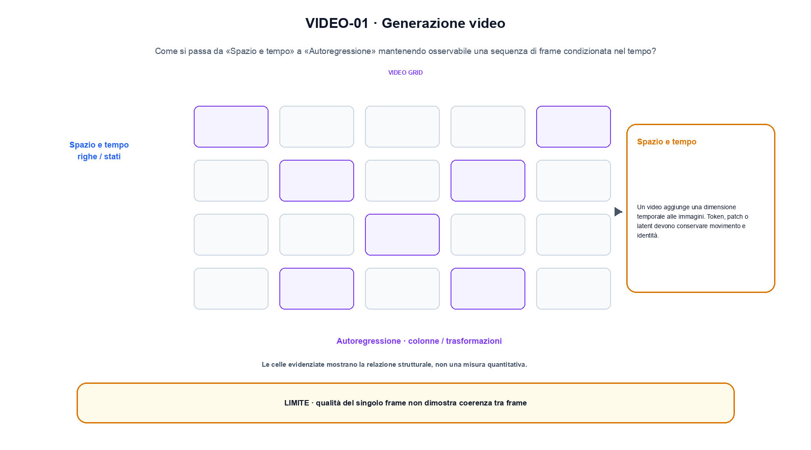
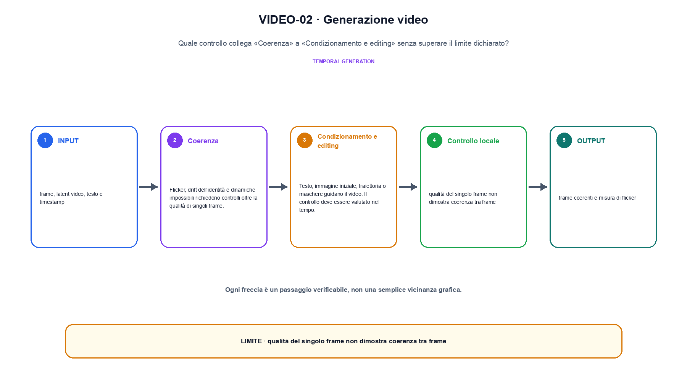

<!--
chapter_id: CH-P10-VIDEO
part_id: P10
order_key: 600
title: Generazione video
maturity: ESTABLISHED
status: revisione editoriale v2, approvazione autoriale aperta
version: 0.5.0-draft3
last_source_check: 4 agosto 2026
environment: Python 3.13.12, CPU
code_policy: reference
deferred: benchmark applicativi non eseguiti e approvazione autoriale delle visuali
-->

# Capitolo 60. Generazione video

Generazione video viene letto come un sistema: «Spazio e tempo» e «Condizionamento e editing» restano collegati da confini e decisioni osservabili. L'oggetto osservato è una sequenza di frame condizionata nel tempo. Il contratto locale dichiara input, frame, latent video, testo e timestamp; operazione, denoising, autoregressione e controllo temporale; output, frame coerenti e misura di flicker. Il primo esempio osservabile è Tre frame condividono una condizione e conservano l'ordine temporale. Il limite da non nascondere è: qualità del singolo frame non dimostra coerenza tra frame.

## Spazio e tempo

Un video aggiunge una dimensione temporale alle immagini. Token, patch o latent devono conservare movimento e identità. [SRC-60-001]

Una sequenza video aggiunge asse temporale e coerenza tra frame.

**Caso da seguire.** Tre frame condividono una condizione e conservano l'ordine temporale.

**Controllo.** Per «Spazio e tempo», registra richiesta, decisione, stato e output finale. Nel caso «Spazio e tempo», un esito plausibile non deve nascondere il componente che lo ha prodotto.


## Video diffusion

Il denoiser opera su tensori spazio-temporali o latent compressi. Attention fattorizzata e convoluzioni riducono il costo. [SRC-60-002]

**Caso da seguire.** Due rappresentazioni di modalità diverse proiettate nella stessa dimensione prima di similarità, fusione o generazione.

**Controllo.** Ripeti «Video diffusion» con una capability o un'autorizzazione rimossa e verifica che la failure preceda qualsiasi side effect.


Qui la notazione serve a fissare un'interfaccia tra componenti.

**Schema concettuale.** `frames = decode(z_video, t)`

Una sequenza video aggiunge asse temporale e coerenza tra frame. [SRC-60-001]




La prima figura segue il percorso da «Spazio e tempo» a «Autoregressione».


## Autoregressione

Frame, patch o token video possono essere generati in ordine. L'ordine scelto modifica dipendenze e cache. [SRC-60-003]

**Caso da seguire.** Un prefisso corretto confrontato con lo stesso prefisso dopo che il modello ha prodotto il token precedente.

**Controllo.** Per «Autoregressione», separa il test del singolo componente dal test end-to-end, usando lo stesso input e la stessa configurazione versionata.


## Coerenza

Flicker, drift dell'identità e dinamiche impossibili richiedono controlli oltre la qualità di singoli frame. [SRC-60-004]

**Caso da seguire.** Due vettori di modalità diverse vengono proiettati in uno spazio comune prima della similarità o della fusione; la dimensione comune è un invariante esplicito.

**Controllo.** Per «Coerenza», introduci una failure a un solo confine e controlla che log, stato e recovery identifichino quel confine senza ambiguità.


## Condizionamento e editing

Testo, immagine iniziale, traiettoria o maschere guidano il video. Il controllo deve essere valutato nel tempo. [SRC-60-001]

**Caso da seguire.** Per «Condizionamento e editing» si mantiene l'input del capitolo e si isola questa condizione: Testo, immagine iniziale, traiettoria o maschere guidano il video.

**Controllo.** Per «Condizionamento e editing», confronta il comportamento completo, non soltanto l'ultimo messaggio. Nel caso «Condizionamento e editing», il risultato resta limitato da: Il controllo deve essere valutato nel tempo.




La seconda figura mette a confronto «Coerenza» e il limite discusso in «Condizionamento e editing».


## Esempio Python eseguito

Per rendere osservabile generazione video, il capitolo conserva qui l'artefatto Python eseguito. Per «Generazione video», il caso di default usa valori piccoli per isolare il meccanismo. Il test rifiuta anche un caso non documentato di «generazione video».

```python
def contract(case: str = "default"):
    if case != "default":
        raise ValueError("only the documented default case is supported")
    frames = ["f0", "f1", "f2"]
    condition = "prompt"
    generated = [(frame, condition) for frame in frames]
    return {"frame_count": len(generated), "temporal_order": [item[0] for item in generated], "invariant": "video generation keeps an explicit temporal index"}
```

Esecuzione con `python snip_60_contract.py`:

```text
{"frame_count": 3, "invariant": "video generation keeps an explicit temporal index", "temporal_order": ["f0", "f1", "f2"]}
```

Il test associato è [`code/test_60_contract.py`](code/test_60_contract.py); l'output versionato è [`code/outputs/SNIP-60-001.txt`](code/outputs/SNIP-60-001.txt).


## Come si collegano i passaggi

- **Da «Spazio e tempo» a «Video diffusion».** Un video aggiunge una dimensione temporale alle immagini. Il denoiser opera su tensori spazio-temporali o latent compressi. «Spazio e tempo» nomina il confine e «Video diffusion» implementa il percorso senza ereditare autorizzazioni implicite. Il passaggio successivo rende misurabile «Video diffusion». [SRC-60-001; SRC-60-002]

- **Da «Video diffusion» a «Autoregressione».** Il denoiser opera su tensori spazio-temporali o latent compressi. Frame, patch o token video possono essere generati in ordine. Componendo «Video diffusion» e «Autoregressione» diventa necessario conservare stato, identità e decisione. Da «Video diffusion» a «Autoregressione» cambia la domanda osservabile. [SRC-60-002; SRC-60-003]

- **Da «Autoregressione» a «Coerenza».** Frame, patch o token video possono essere generati in ordine. Flicker, drift dell'identità e dinamiche impossibili richiedono controlli oltre la qualità di singoli frame. «Coerenza» introduce failure e recovery prima di un side effect o di una perdita di stato. Il passaggio successivo rende misurabile «Coerenza». [SRC-60-003; SRC-60-004]

- **Da «Coerenza» a «Condizionamento e editing».** Flicker, drift dell'identità e dinamiche impossibili richiedono controlli oltre la qualità di singoli frame. Testo, immagine iniziale, traiettoria o maschere guidano il video. La chiusura su «Condizionamento e editing» valuta il sistema completo, non soltanto il componente iniziale. Da «Coerenza» a «Condizionamento e editing» cambia la domanda osservabile. [SRC-60-004; SRC-60-001]

La catena completa produce frame coerenti e misura di flicker a partire da frame, latent video, testo e timestamp. Ogni collegamento conserva un oggetto osservabile diverso; per questo il risultato non può essere esteso oltre il limite dichiarato: qualità del singolo frame non dimostra coerenza tra frame.


## Prove sui confini del sistema

1. Ricostruisci «Spazio e tempo» con un esempio diverso da quello mostrato e indica l'output atteso prima del calcolo.
2. Nel passaggio «Video diffusion», cambia una sola ipotesi e spiega quale risultato non è più confrontabile.
3. Collega «Autoregressione» a una riga dello snippet oppure motiva perché la prova deve essere documentale.
4. Progetta un caso limite per «Coerenza» che produca una failure riconoscibile.
5. Per «Condizionamento e editing», separa una conclusione sostenuta dal caso locale da una che richiederebbe nuovi dati o un benchmark.


## Il confine operativo

La lezione parte da «frame, latent video, testo e timestamp» e arriva fino a «frame coerenti e misura di flicker». Il limite da conservare è questo: qualità del singolo frame non dimostra coerenza tra frame. Il confine di «Condizionamento e editing» va ricontrollato tra claim, fonti e artefatti: i rinvii sono [`FONTI_PRIMARIE.md`](FONTI_PRIMARIE.md), [`CLAIMS.md`](CLAIMS.md) e `code/`.
