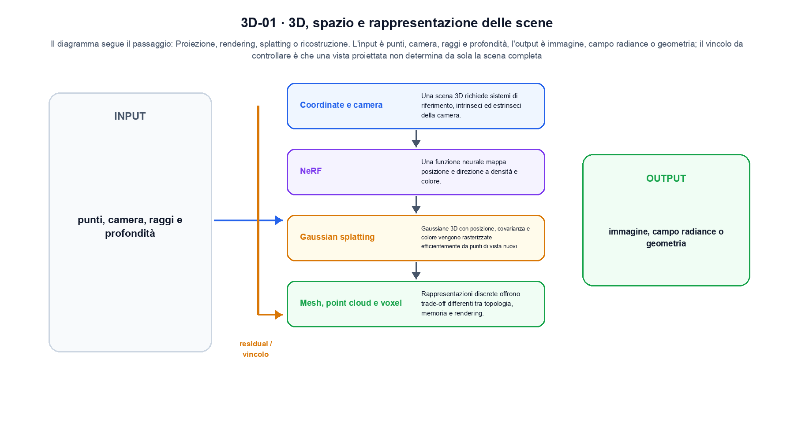
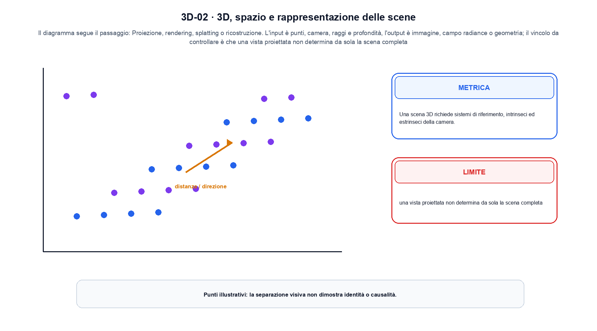

<!--
chapter_id: CH-P10-SPATIAL-3D
part_id: P10
order_key: 610
title: 3D, spazio e rappresentazione delle scene
maturity: ESTABLISHED
status: candidatura completa in revisione autoriale
version: 0.4.0-draft2
last_source_check: 3 agosto 2026
environment: Python 3.13.12, CPU
deferred: benchmark applicativi, varianti non necessarie al contratto centrale e approvazione autoriale
-->

# Capitolo 61. 3D, spazio e rappresentazione delle scene

Finora abbiamo potuto descrivere punti e coordinate che descrivono una scena 3D. La richiesta «Il pacco non è arrivato» resta lo scenario condiviso: nel Capitolo 61 prendiamo l'input «punti, camera, raggi e profondità» e lo seguiamo fino all'output «immagine, campo radiance o geometria», dichiarando prima il contratto e poi il limite.

## Coordinate e camera

Una scena 3D richiede sistemi di riferimento, intrinseci ed estrinseci della camera. Errori di coordinate cambiano il rendering. [SRC-61-001]

Il caso minimo di «Coordinate e camera» si presenta così: tre punti 3D producono un centroide con tre coordinate. Non lo usiamo come decorazione: serve a rendere osservabile la frase «Una scena 3D richiede sistemi di riferimento, intrinseci ed estrinseci della camera».

Per ricostruire «Coordinate e camera» annotiamo l'input «punti, camera, raggi e profondità», poi l'operazione «proiezione, rendering, splatting o ricostruzione», infine l'output «immagine, campo radiance o geometria». Questa sequenza impedisce di scambiare una forma compatibile per il comportamento descritto dalla fonte. Il controllo parte da «Una scena 3D richiede sistemi di riferimento, intrinseci ed estrinseci della camera».

Il passaggio da seguire in «Coordinate e camera» è quello descritto dalla frase «Una scena 3D richiede sistemi di riferimento, intrinseci ed estrinseci della camera»: l'esempio rende osservabile la trasformazione, mentre il contratto del capitolo ne delimita l'interpretazione. Per «Coordinate e camera» il controllo cambia una sola premessa della frase «Una scena 3D richiede sistemi di riferimento, intrinseci ed estrinseci della camera» e conserva input, output e criterio di successo, così la differenza resta attribuibile. La verifica resta ancorata a «Una scena 3D richiede sistemi di riferimento, intrinseci ed estrinseci della camera». [SRC-61-001]

Il punto didattico di «Coordinate e camera» è separare ciò che la fonte afferma da ciò che il piccolo caso illustra. L'output «immagine, campo radiance o geometria» mostra il contratto locale, ma non sostituisce una misura sul sistema completo.

Il controllo minimo di «Coordinate e camera» confronta il caso dichiarato con una variazione che rompe la sua ipotesi. Se la failure non è distinguibile dall'esito valido, manca un'osservazione nel contratto di allineamento tra modalità. Da «Coordinate e camera» portiamo l'output «immagine, campo radiance o geometria»; non portiamo invece una conclusione oltre il caso locale.

## NeRF

Una funzione neurale mappa posizione e direzione a densità e colore. Volume rendering integra campioni lungo i raggi. [SRC-61-002]

Prima del nome tecnico fissiamo la situazione: consideriamo due punti proiettati con camera e profondità dichiarate. Da qui possiamo leggere la conseguenza dichiarata da «Una funzione neurale mappa posizione e direzione a densità e colore».

Nel contratto locale, l'input «punti, camera, raggi e profondità» entra, l'operazione «proiezione, rendering, splatting o ricostruzione» modifica il percorso e l'output «immagine, campo radiance o geometria» è ciò che osserviamo. Qui cambia soprattutto il passaggio «NeRF»; resta da controllare che una vista proiettata non determina da sola la scena completa. La domanda locale è «Una funzione neurale mappa posizione e direzione a densità e colore».

Il passaggio da seguire in «NeRF» è quello descritto dalla frase «Una funzione neurale mappa posizione e direzione a densità e colore»: l'esempio rende osservabile la trasformazione, mentre il contratto del capitolo ne delimita l'interpretazione. Per «NeRF» il controllo cambia una sola premessa della frase «Una funzione neurale mappa posizione e direzione a densità e colore» e conserva input, output e criterio di successo, così la differenza resta attribuibile. La verifica resta ancorata a «Una funzione neurale mappa posizione e direzione a densità e colore». [SRC-61-002]

La lettura va fatta in ordine: prima il caso, poi la trasformazione, quindi la conseguenza. Volume rendering integra campioni lungo i raggi. Il piccolo risultato resta un'illustrazione di «Una funzione neurale mappa posizione e direzione a densità e colore», non una promessa generale.

La prova di «NeRF» conserva input, operazione e output; poi esplicita quale parte di «Una funzione neurale mappa posizione e direzione a densità e colore» non è stata misurata. Così il test separa l'evidenza dall'inferenza. Il passaggio successivo, «Gaussian splatting», potrà cambiare una sola condizione, dichiarando il nuovo setup prima di interpretare il risultato.

## Gaussian splatting

Gaussiane 3D con posizione, covarianza e colore vengono rasterizzate efficientemente da punti di vista nuovi. [SRC-61-003]

Per capire «Gaussian splatting» partiamo da questo caso: un caso in cui una vista proiettata non determina da sola la scena completa. Il caso rende osservabile il punto centrale: «Gaussiane 3D con posizione, covarianza e colore vengono rasterizzate efficientemente da punti di vista nuovi».

La sezione usa l'input «punti, camera, raggi e profondità» come punto di partenza e l'output «immagine, campo radiance o geometria» come traccia d'uscita. La trasformazione concreta è «proiezione, rendering, splatting o ricostruzione»; il caso non è completo se non dichiariamo anche che una vista proiettata non determina da sola la scena completa. La condizione da isolare è «Gaussiane 3D con posizione, covarianza e colore vengono rasterizzate efficientemente da punti di vista nuovi».

Il passaggio da seguire in «Gaussian splatting» è quello descritto dalla frase «Gaussiane 3D con posizione, covarianza e colore vengono rasterizzate efficientemente da punti di vista nuovi»: l'esempio rende osservabile la trasformazione, mentre il contratto del capitolo ne delimita l'interpretazione. Per «Gaussian splatting» il controllo cambia una sola premessa della frase «Gaussiane 3D con posizione, covarianza e colore vengono rasterizzate efficientemente da punti di vista nuovi» e conserva input, output e criterio di successo, così la differenza resta attribuibile. La verifica resta ancorata a «Gaussiane 3D con posizione, covarianza e colore vengono rasterizzate efficientemente da punti di vista nuovi». [SRC-61-003]

Se cambiamo una premessa, dobbiamo riaprire l'interpretazione. Per «Gaussian splatting» conserviamo l'osservazione collegata a «Gaussiane 3D con posizione, covarianza e colore vengono rasterizzate efficientemente da punti di vista nuovi» e lasciamo esplicitamente fuori ciò che non è stato misurato.

Per verificare «Gaussian splatting» cambiamo una sola condizione vicina alla frase «Gaussiane 3D con posizione, covarianza e colore vengono rasterizzate efficientemente da punti di vista nuovi», teniamo fermo il resto e registriamo l'output «immagine, campo radiance o geometria». Il caso negativo deve rendere riconoscibile la failure, non soltanto produrre un numero diverso. La sezione successiva, «Mesh, point cloud e voxel», riceve l'output «immagine, campo radiance o geometria» come base, ma dovrà formulare e verificare la propria distinzione.

La figura 3D-01 usa la famiglia architecture. Il diagramma segue il passaggio: Proiezione, rendering, splatting o ricostruzione. L'input è punti, camera, raggi e profondità, l'output è immagine, campo radiance o geometria; il vincolo da controllare è che una vista proiettata non determina da sola la scena completa.

## Mesh, point cloud e voxel

Rappresentazioni discrete offrono trade-off differenti tra topologia, memoria e rendering. [SRC-61-004]

Il caso minimo di «Mesh, point cloud e voxel» si presenta così: due vettori di modalità diverse vengono proiettati in uno spazio comune prima della similarità o della fusione; la dimensione comune è un invariante esplicito. Non lo usiamo come decorazione: serve a rendere osservabile la frase «Rappresentazioni discrete offrono trade-off differenti tra topologia, memoria e rendering».

Per ricostruire «Mesh, point cloud e voxel» annotiamo l'input «punti, camera, raggi e profondità», poi l'operazione «proiezione, rendering, splatting o ricostruzione», infine l'output «immagine, campo radiance o geometria». Questa sequenza impedisce di scambiare una forma compatibile per il comportamento descritto dalla fonte. Il controllo parte da «Rappresentazioni discrete offrono trade-off differenti tra topologia, memoria e rendering».

Il passaggio da seguire in «Mesh, point cloud e voxel» è quello descritto dalla frase «Rappresentazioni discrete offrono trade-off differenti tra topologia, memoria e rendering»: l'esempio rende osservabile la trasformazione, mentre il contratto del capitolo ne delimita l'interpretazione. Per «Mesh, point cloud e voxel» il controllo cambia una sola premessa della frase «Rappresentazioni discrete offrono trade-off differenti tra topologia, memoria e rendering» e conserva input, output e criterio di successo, così la differenza resta attribuibile. La verifica resta ancorata a «Rappresentazioni discrete offrono trade-off differenti tra topologia, memoria e rendering». [SRC-61-004]

Il punto didattico di «Mesh, point cloud e voxel» è separare ciò che la fonte afferma da ciò che il piccolo caso illustra. L'output «immagine, campo radiance o geometria» mostra il contratto locale, ma non sostituisce una misura sul sistema completo.

Il controllo minimo di «Mesh, point cloud e voxel» confronta il caso dichiarato con una variazione che rompe la sua ipotesi. Se la failure non è distinguibile dall'esito valido, manca un'osservazione nel contratto di allineamento tra modalità. Da «Mesh, point cloud e voxel» portiamo l'output «immagine, campo radiance o geometria»; non portiamo invece una conclusione oltre il caso locale.

## Generazione e grounding spaziale

Testo e immagini possono condizionare scene, ma consistenza geometrica e fisica richiedono valutazioni dedicate. [SRC-61-001]

Prima del nome tecnico fissiamo la situazione: consideriamo due vettori di modalità diverse vengono proiettati in uno spazio comune prima della similarità o della fusione; la dimensione comune è un invariante esplicito. Da qui possiamo leggere la conseguenza dichiarata da «Testo e immagini possono condizionare scene, ma consistenza geometrica e fisica richiedono valutazioni dedicate».

Nel contratto locale, l'input «punti, camera, raggi e profondità» entra, l'operazione «proiezione, rendering, splatting o ricostruzione» modifica il percorso e l'output «immagine, campo radiance o geometria» è ciò che osserviamo. Qui cambia soprattutto il passaggio «Generazione e grounding spaziale»; resta da controllare che una vista proiettata non determina da sola la scena completa. La domanda locale è «Testo e immagini possono condizionare scene, ma consistenza geometrica e fisica richiedono valutazioni dedicate».

Il passaggio da seguire in «Generazione e grounding spaziale» è quello descritto dalla frase «Testo e immagini possono condizionare scene, ma consistenza geometrica e fisica richiedono valutazioni dedicate»: l'esempio rende osservabile la trasformazione, mentre il contratto del capitolo ne delimita l'interpretazione. Per «Generazione e grounding spaziale» il controllo cambia una sola premessa della frase «Testo e immagini possono condizionare scene, ma consistenza geometrica e fisica richiedono valutazioni dedicate» e conserva input, output e criterio di successo, così la differenza resta attribuibile. La verifica resta ancorata a «Testo e immagini possono condizionare scene, ma consistenza geometrica e fisica richiedono valutazioni dedicate». [SRC-61-001]

La lettura va fatta in ordine: prima il caso, poi la trasformazione, quindi la conseguenza. Il piccolo risultato resta un'illustrazione di «Testo e immagini possono condizionare scene, ma consistenza geometrica e fisica richiedono valutazioni dedicate», non una promessa generale.

La prova di «Generazione e grounding spaziale» conserva input, operazione e output; poi esplicita quale parte di «Testo e immagini possono condizionare scene, ma consistenza geometrica e fisica richiedono valutazioni dedicate» non è stata misurata. Così il test separa l'evidenza dall'inferenza. Il caso finale consegna l'output «immagine, campo radiance o geometria» come evidenza locale e conserva il contributo effettivo di ciascun segnale come domanda aperta.

## Il caso minimo e la sua variante: Coordinate e camera

Il caso intero parte dall'input «punti, camera, raggi e profondità», applica l'operazione «proiezione, rendering, splatting o ricostruzione» e osserva l'output «immagine, campo radiance o geometria». Un esempio controllato: due punti proiettati con camera e profondità dichiarate. Lo schema compatto è:

$$
scene = project(points, camera)
$$

È una notazione di interfaccia, non un'identità numerica completa. La proiezione non ricostruisce da sola la geometria completa. [SRC-61-001]

La figura 3D-02 cambia composizione rispetto alla prima. Il diagramma segue il passaggio: Proiezione, rendering, splatting o ricostruzione. L'input è punti, camera, raggi e profondità, l'output è immagine, campo radiance o geometria; il vincolo da controllare è che una vista proiettata non determina da sola la scena completa.

## Che cosa osserva lo snippet: NeRF

Lo snippet locale mette in esecuzione questo caso: due punti proiettati con camera e profondità dichiarate. Il test associato controlla determinismo, output e invariante e rifiuta una shape o condizione incoerente; il risultato è conservato in `code/outputs/SNIP-61-001.txt`, come evidenza locale e non come benchmark di produzione.

## Che cosa non dimostra: Generazione e grounding spaziale

Il caso di «3D, spazio e rappresentazione delle scene» non certifica un servizio completo. Una vista proiettata non determina da sola la scena completa. La domanda successiva è se «Testo e immagini possono condizionare scene, ma consistenza geometrica e fisica richiedono valutazioni dedicate» regga quando cambiano dati, scala, hardware o criteri di decisione.

## La mappa delle condizioni: 3D, spazio e rappresentazione delle scene

Il filo della lezione va dall'input «punti, camera, raggi e profondità» all'output «immagine, campo radiance o geometria». Nei passaggi «Coordinate e camera», «NeRF», «Generazione e grounding spaziale» abbiamo usato esempi e controlli negativi per rendere il contratto controllabile e delimitare la conclusione. L'invariante da portare avanti è: una vista proiettata non determina da sola la scena completa. Il Capitolo 62, World model, embodied AI e vision-language-action, può partire da questo output e dichiarare la propria domanda.

### Cinque domande di controllo: Coordinate e camera

1. Ricostruisci l'oggetto continuo a partire da «Coordinate e camera» e indica quale parte della frase «Una scena 3D richiede sistemi di riferimento, intrinseci ed estrinseci della camera» entra nel caso.
2. Spiega quale trasformazione collega «Coordinate e camera» a «Generazione e grounding spaziale» e quale output osserviamo nel passaggio.
3. Usa lo snippet per controllare l'invariante del contratto: una vista proiettata non determina da sola la scena completa.
4. Separa una definizione sostenuta da una fonte, un esempio illustrativo e un risultato locale del caso guida.
5. Indica quale parte della frase «Testo e immagini possono condizionare scene, ma consistenza geometrica e fisica richiedono valutazioni dedicate» richiederebbe una misura nuova prima di essere estesa oltre il caso osservato.

### Esercizi per cambiare una condizione: Generazione e grounding spaziale

1. Ricostruisci input e output di «Coordinate e camera» usando un esempio di tre righe.
2. Modifica una sola variabile in «NeRF» e anticipa l'invariante che dovrebbe restare.
3. Metti «Gaussian splatting» a confronto con il caso base e descrivi il failure mode più vicino.
4. Scrivi un test minimo per rendere osservabile il confine di «Mesh, point cloud e voxel».
5. Formula per «Generazione e grounding spaziale» una domanda che separi meccanismo e qualità del sistema.

## Fonti e risultati locali: 3D, spazio e rappresentazione delle scene

Per ricontrollare «3D, spazio e rappresentazione delle scene», partire da `FONTI_PRIMARIE.md` e poi dal codice: la domanda aperta è come trasferire il contributo effettivo di ciascun segnale oltre il caso locale, con la data di consultazione dichiarata. `CLAIMS.md` separa definizioni e risultati locali; codice, ambiente, test e output sono nella cartella `code/`, con attenzione a allineamento tra modalità.
