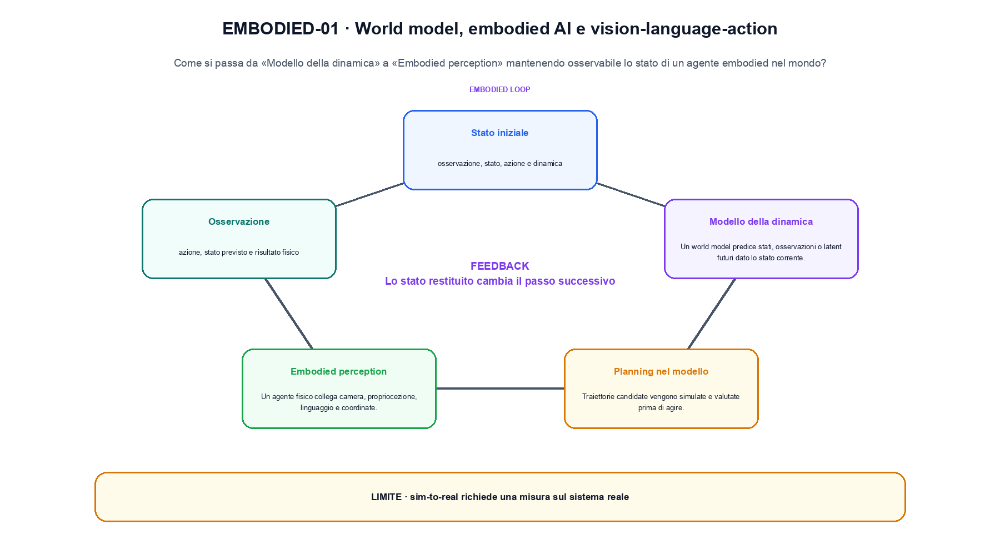
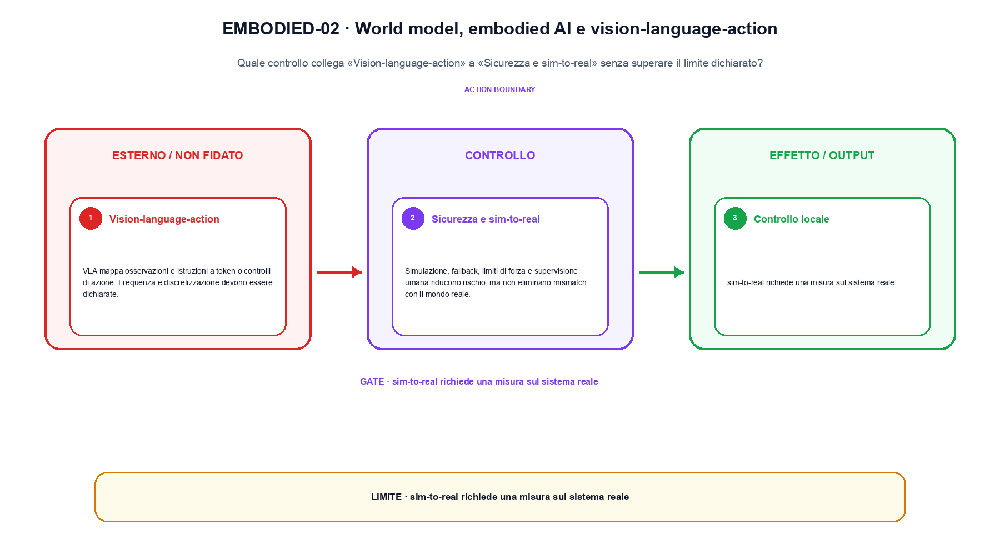

<!--
chapter_id: CH-P10-WORLD-EMBODIED
part_id: P10
order_key: 620
title: World model, embodied AI e vision-language-action
maturity: ESTABLISHED
status: revisione editoriale v2, approvazione autoriale aperta
version: 0.5.0-draft3
last_source_check: 4 agosto 2026
environment: Python 3.13.12, CPU
code_policy: reference
deferred: benchmark applicativi non eseguiti e approvazione autoriale delle visuali
-->

# Capitolo 62. World model, embodied AI e vision-language-action

Per capire world model, embodied ai e vision-language-action, partiamo da «Modello della dinamica» e seguiamo ogni confine fino a «Sicurezza e sim-to-real». L'oggetto osservato è lo stato di un agente embodied nel mondo. Il contratto locale dichiara input, osservazione, stato, azione e dinamica; operazione, world model, planning, VLA e controllo; output, azione, stato previsto e risultato fisico. Il caso di partenza è Un'azione move porta la posizione da 0 a 1 e consuma una unità di batteria. Il limite da non nascondere è: sim-to-real richiede una misura sul sistema reale.

## Modello della dinamica

Un world model predice stati, osservazioni o latent futuri dato lo stato corrente e un'azione. [SRC-62-001]

Un world model o una policy produce un'azione condizionata da osservazione e stato.

**Caso da seguire.** Un'azione move porta la posizione da 0 a 1 e consuma una unità di batteria.

**Controllo.** Per «Modello della dinamica», registra richiesta, decisione, stato e output finale. Nel caso «Modello della dinamica», un esito plausibile non deve nascondere il componente che lo ha prodotto.


## Planning nel modello

Traiettorie candidate vengono simulate e valutate prima di agire. Errori del modello possono essere sfruttati dal planner. [SRC-62-002]

**Caso da seguire.** Un'azione prevista in simulazione e il controllo del suo esito.

**Controllo.** Ripeti «Planning nel modello» con una capability o un'autorizzazione rimossa e verifica che la failure preceda qualsiasi side effect.


Per questo capitolo la notazione compatta chiarisce input, trasformazione e risultato.

**Schema concettuale.** `a_t = policy(o_t, state_t)`

Un world model o una policy produce un'azione condizionata da osservazione e stato. [SRC-62-001]




La prima figura segue il percorso da «Modello della dinamica» a «Embodied perception».


## Embodied perception

Un agente fisico collega camera, propriocezione, linguaggio e coordinate. Latenza e calibrazione influenzano ogni azione. [SRC-62-003]

**Caso da seguire.** Un caso in cui sim-to-real richiede una misura sul sistema reale.

**Controllo.** Per «Embodied perception», separa il test del singolo componente dal test end-to-end, usando lo stesso input e la stessa configurazione versionata.


## Vision-language-action

VLA mappa osservazioni e istruzioni a token o controlli di azione. Frequenza e discretizzazione devono essere dichiarate. [SRC-62-004]

**Caso da seguire.** Una griglia 3x3 e un kernel 2x2 in cui una sola posizione dell'output viene calcolata a mano.

**Controllo.** Per «Vision-language-action», introduci una failure a un solo confine e controlla che log, stato e recovery identifichino quel confine senza ambiguità.


## Sicurezza e sim-to-real

Simulazione, fallback, limiti di forza e supervisione umana riducono rischio, ma non eliminano mismatch con il mondo reale. [SRC-62-001]

**Caso da seguire.** Due vettori di modalità diverse vengono proiettati in uno spazio comune prima della similarità o della fusione; la dimensione comune è un invariante esplicito.

**Controllo.** Per «Sicurezza e sim-to-real», confronta il comportamento completo, non soltanto l'ultimo messaggio. Nel caso «Sicurezza e sim-to-real», il risultato resta limitato da: Simulazione, fallback, limiti di forza e supervisione umana riducono rischio, ma non eliminano mismatch con il mondo reale.




La seconda figura mette a confronto «Vision-language-action» e il limite discusso in «Sicurezza e sim-to-real».


## Esempio Python eseguito

Questa sezione apre il contratto Python di world model, embodied ai e vision-language-action: il lettore può eseguire lo stesso file e confrontare il risultato. Per «World model, embodied AI e vision-language-action», il caso di default usa valori piccoli per isolare il meccanismo. Il caso non supportato viene provato separatamente, così «world model, embodied ai e vision-language-action» non viene generalizzato oltre l'esempio.

```python
def contract(case: str = "default"):
    if case != "default":
        raise ValueError("only the documented default case is supported")
    state = {"position": 0, "battery": 2}
    action = "move"
    next_state = dict(state)
    next_state["position"] += 1
    next_state["battery"] -= 1
    return {"action": action, "next_state": next_state, "invariant": "the world transition exposes state and action consequences"}
```

Esecuzione con `python snip_62_contract.py`:

```text
{"action": "move", "invariant": "the world transition exposes state and action consequences", "next_state": {"battery": 1, "position": 1}}
```

Il test associato è [`code/test_62_contract.py`](code/test_62_contract.py); l'output versionato è [`code/outputs/SNIP-62-001.txt`](code/outputs/SNIP-62-001.txt).


## Come si collegano i passaggi

- **Da «Modello della dinamica» a «Planning nel modello».** Un world model predice stati, osservazioni o latent futuri dato lo stato corrente e un'azione. Traiettorie candidate vengono simulate e valutate prima di agire. «Modello della dinamica» nomina il confine e «Planning nel modello» implementa il percorso senza ereditare autorizzazioni implicite. Il passaggio successivo rende misurabile «Planning nel modello». [SRC-62-001; SRC-62-002]

- **Da «Planning nel modello» a «Embodied perception».** Traiettorie candidate vengono simulate e valutate prima di agire. Un agente fisico collega camera, propriocezione, linguaggio e coordinate. Componendo «Planning nel modello» e «Embodied perception» diventa necessario conservare stato, identità e decisione. Da «Planning nel modello» a «Embodied perception» cambia la domanda osservabile. [SRC-62-002; SRC-62-003]

- **Da «Embodied perception» a «Vision-language-action».** Un agente fisico collega camera, propriocezione, linguaggio e coordinate. VLA mappa osservazioni e istruzioni a token o controlli di azione. «Vision-language-action» introduce failure e recovery prima di un side effect o di una perdita di stato. Il passaggio successivo rende misurabile «Vision-language-action». [SRC-62-003; SRC-62-004]

- **Da «Vision-language-action» a «Sicurezza e sim-to-real».** VLA mappa osservazioni e istruzioni a token o controlli di azione. Simulazione, fallback, limiti di forza e supervisione umana riducono rischio, ma non eliminano mismatch con il mondo reale. La chiusura su «Sicurezza e sim-to-real» valuta il sistema completo, non soltanto il componente iniziale. Da «Vision-language-action» a «Sicurezza e sim-to-real» cambia la domanda osservabile. [SRC-62-004; SRC-62-001]

La catena completa produce azione, stato previsto e risultato fisico a partire da osservazione, stato, azione e dinamica. Ogni collegamento conserva un oggetto osservabile diverso; per questo il risultato non può essere esteso oltre il limite dichiarato: sim-to-real richiede una misura sul sistema reale.


## Prove sui confini del sistema

1. Ricostruisci «Modello della dinamica» con un esempio diverso da quello mostrato e indica l'output atteso prima del calcolo.
2. Nel passaggio «Planning nel modello», cambia una sola ipotesi e spiega quale risultato non è più confrontabile.
3. Collega «Embodied perception» a una riga dello snippet oppure motiva perché la prova deve essere documentale.
4. Progetta un caso limite per «Vision-language-action» che produca una failure riconoscibile.
5. Per «Sicurezza e sim-to-real», separa una conclusione sostenuta dal caso locale da una che richiederebbe nuovi dati o un benchmark.


## Il confine operativo

La lezione parte da «osservazione, stato, azione e dinamica» e arriva fino a «azione, stato previsto e risultato fisico». Il limite da conservare è questo: sim-to-real richiede una misura sul sistema reale. Il confine di «Sicurezza e sim-to-real» va ricontrollato tra claim, fonti e artefatti: i rinvii sono [`FONTI_PRIMARIE.md`](FONTI_PRIMARIE.md), [`CLAIMS.md`](CLAIMS.md) e `code/`.
