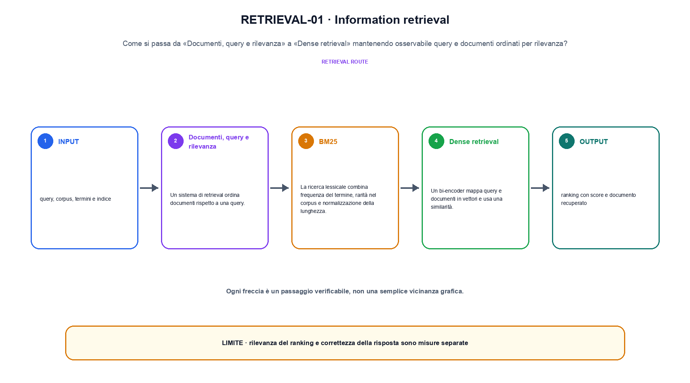
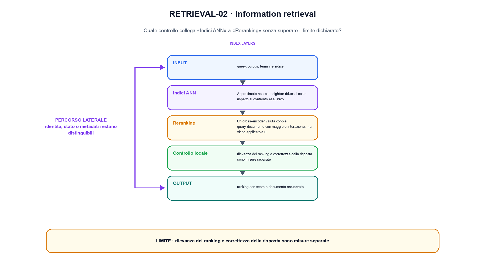

<!--
chapter_id: CH-P11-RETRIEVAL
part_id: P11
order_key: 630
title: Information retrieval
maturity: CORE
status: revisione editoriale v2, approvazione autoriale aperta
version: 0.5.0-draft3
last_source_check: 4 agosto 2026
environment: Python 3.13.12, CPU
code_policy: reference
deferred: benchmark applicativi non eseguiti e approvazione autoriale delle visuali
-->

# Capitolo 63. Information retrieval

In information retrieval il percorso dei record è il filo conduttore: da «Documenti, query e rilevanza» a «Reranking» ogni trasformazione lascia una traccia. L'oggetto osservato è query e documenti ordinati per rilevanza. Il contratto locale dichiara input, query, corpus, termini e indice; operazione, BM25, dense retrieval, ANN e reranking; output, ranking con score e documento recuperato. La situazione minima da seguire è Tre documenti vengono ordinati per sovrapposizione con la query. Il limite da non nascondere è: rilevanza del ranking e correttezza della risposta sono misure separate.

## Documenti, query e rilevanza

Un sistema di retrieval ordina documenti rispetto a una query. La rilevanza dipende dal bisogno informativo e dalle label disponibili. [SRC-63-001]

Il ranking è una funzione osservabile prima di qualsiasi generazione.

**Caso da seguire.** Tre documenti vengono ordinati per sovrapposizione con la query.

**Controllo.** Per «Documenti, query e rilevanza», conserva record iniziale, regola applicata e record finale; un conteggio aggregato non basta a spiegare la trasformazione.


La relazione centrale può essere scritta come:

$$
score(q,d) = bm25(q,d)
$$

Il ranking è una funzione osservabile prima di qualsiasi generazione. [SRC-63-001]




La prima figura segue il percorso da «Documenti, query e rilevanza» a «Dense retrieval».


## BM25

La ricerca lessicale combina frequenza del termine, rarità nel corpus e normalizzazione della lunghezza. Tokenizzazione e campi modificano il punteggio. [SRC-63-002]

**Caso da seguire.** Tre documenti ordinati per sovrapposizione di termini.

**Controllo.** Esegui «BM25» due volte sullo stesso manifest e confronta identificatori, ordine, split e checksum.


## Dense retrieval

Un bi-encoder mappa query e documenti in vettori e usa una similarità. L'addestramento dipende da positivi, negativi e in-batch sampling. [SRC-63-003]

**Caso da seguire.** Una query confrontata con tre documenti, conservando ranking, chunk entrati nel contesto e risposta finale.

**Controllo.** Per «Dense retrieval», aggiungi un record che deve essere escluso e verifica che l'output conservi anche il motivo dell'esclusione.


## Esempio Python eseguito

La prova locale di information retrieval parte da un esempio minimo, registrato nel repository insieme ai suoi test. Per «Information retrieval», il caso di default usa valori piccoli per isolare il meccanismo. La prova negativa riguarda proprio «information retrieval» e interrompe l'interpretazione prima dell'output.

```python
def contract(case: str = "default"):
    if case != "default":
        raise ValueError("only the documented default case is supported")
    query = {"pacco", "ritardo"}
    documents = [("d1", {"pacco", "ritardo"}), ("d2", {"pacco"}), ("d3", {"carta"})]
    ranking = sorted(((len(query & terms), doc_id) for doc_id, terms in documents), reverse=True)
    return {"ranking": ranking, "invariant": "retrieval exposes document scores before generation"}
```

Esecuzione con `python snip_63_contract.py`:

```text
{"invariant": "retrieval exposes document scores before generation", "ranking": [[2, "d1"], [1, "d2"], [0, "d3"]]}
```

Il test associato è [`code/test_63_contract.py`](code/test_63_contract.py); l'output versionato è [`code/outputs/SNIP-63-001.txt`](code/outputs/SNIP-63-001.txt).


## Indici ANN

Approximate nearest neighbor riduce il costo rispetto al confronto esaustivo. Recall, memoria e latenza dipendono dalla struttura e dai parametri. [SRC-63-004]

**Caso da seguire.** Una query e tre documenti ricevono punteggi distinti. Prima di generare, controlliamo quale documento è entrato nel contesto e con quale ranking.

**Controllo.** Per «Indici ANN», modifica una sola regola della pipeline e misura quali record cambiano, evitando di confrontare raccolte di origine diversa.


## Reranking

Un cross-encoder valuta coppie query-documento con maggiore interazione, ma viene applicato a un insieme candidato più piccolo. [SRC-63-001]

**Caso da seguire.** Per «Reranking» si mantiene l'input del capitolo e si isola questa condizione: Un cross-encoder valuta coppie query-documento con maggiore interazione, ma viene applicato a un insieme candidato più piccolo.

**Controllo.** Per «Reranking», descrivi ciò che la pipeline perde oltre a ciò che produce. Nel caso «Reranking», il limite locale è: Un cross-encoder valuta coppie query-documento con maggiore interazione, ma viene applicato a un insieme candidato più piccolo.




La seconda figura mette a confronto «Indici ANN» e il limite discusso in «Reranking».


## Come si collegano i passaggi

- **Da «Documenti, query e rilevanza» a «BM25».** Un sistema di retrieval ordina documenti rispetto a una query. La ricerca lessicale combina frequenza del termine, rarità nel corpus e normalizzazione della lunghezza. «Documenti, query e rilevanza» identifica il record e «BM25» dichiara la trasformazione sulla popolazione osservata. Da «Documenti, query e rilevanza» a «BM25» cambia la domanda osservabile. [SRC-63-001; SRC-63-002]

- **Da «BM25» a «Dense retrieval».** La ricerca lessicale combina frequenza del termine, rarità nel corpus e normalizzazione della lunghezza. Un bi-encoder mappa query e documenti in vettori e usa una similarità. Il passaggio da «BM25» a «Dense retrieval» conserva configurazione, conteggi e artefatti intermedi. Il passaggio successivo rende misurabile «Dense retrieval». [SRC-63-002; SRC-63-003]

- **Da «Dense retrieval» a «Indici ANN».** Un bi-encoder mappa query e documenti in vettori e usa una similarità. Approximate nearest neighbor riduce il costo rispetto al confronto esaustivo. Con «Indici ANN» la pipeline può selezionare o usare dati senza confonderli con una modifica del modello. Da «Dense retrieval» a «Indici ANN» cambia la domanda osservabile. [SRC-63-003; SRC-63-004]

- **Da «Indici ANN» a «Reranking».** Approximate nearest neighbor riduce il costo rispetto al confronto esaustivo. Un cross-encoder valuta coppie query-documento con maggiore interazione, ma viene applicato a un insieme candidato più piccolo. «Reranking» porta il risultato alla valutazione e rende visibili record, slice e failure esclusi. Il passaggio successivo rende misurabile «Reranking». [SRC-63-004; SRC-63-001]

La catena completa produce ranking con score e documento recuperato a partire da query, corpus, termini e indice. Ogni collegamento conserva un oggetto osservabile diverso; per questo il risultato non può essere esteso oltre il limite dichiarato: rilevanza del ranking e correttezza della risposta sono misure separate.


## Esercizi sulla tracciabilità

1. Ricostruisci «Documenti, query e rilevanza» con un esempio diverso da quello mostrato e indica l'output atteso prima del calcolo.
2. Nel passaggio «BM25», cambia una sola ipotesi e spiega quale risultato non è più confrontabile.
3. Collega «Dense retrieval» a una riga dello snippet oppure motiva perché la prova deve essere documentale.
4. Progetta un caso limite per «Indici ANN» che produca una failure riconoscibile.
5. Per «Reranking», separa una conclusione sostenuta dal caso locale da una che richiederebbe nuovi dati o un benchmark.


## L'artefatto che deve sopravvivere

La lezione parte da «query, corpus, termini e indice» e arriva fino a «ranking con score e documento recuperato». Il limite da conservare è questo: rilevanza del ranking e correttezza della risposta sono misure separate. Per «Reranking», provenienza e trasformazioni sono registrate in [`FONTI_PRIMARIE.md`](FONTI_PRIMARIE.md), [`CLAIMS.md`](CLAIMS.md) e negli artefatti di `code/`.
