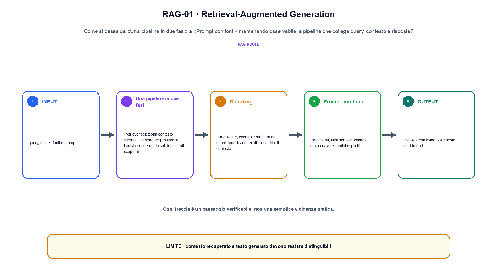
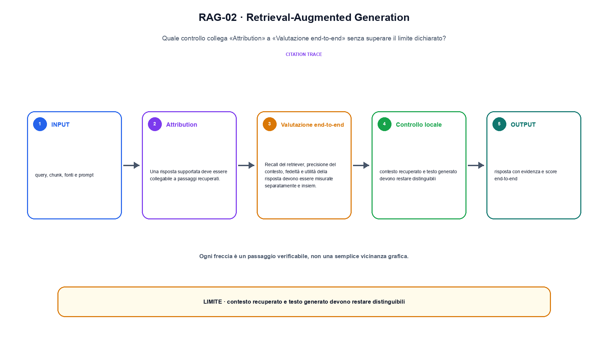

<!--
chapter_id: CH-P11-RAG
part_id: P11
order_key: 640
title: Retrieval-Augmented Generation
maturity: CORE
status: revisione editoriale v2, approvazione autoriale aperta
version: 0.5.0-draft3
last_source_check: 4 agosto 2026
environment: Python 3.13.12, CPU
code_policy: reference
deferred: benchmark applicativi non eseguiti e approvazione autoriale delle visuali
-->

# Capitolo 64. Retrieval-Augmented Generation

Per leggere retrieval-augmented generation, seguiamo i dati tra «Una pipeline in due fasi» e «Valutazione end-to-end» insieme alla loro provenienza. L'oggetto osservato è la pipeline che collega query, contesto e risposta. Il contratto locale dichiara input, query, chunk, fonti e prompt; operazione, chunking, retrieval, attribution e generazione; output, risposta con evidenza e score end-to-end. Il caso di partenza è Due chunk vengono recuperati e una risposta mantiene il documento citato come record distinto. Il limite da non nascondere è: contesto recuperato e testo generato devono restare distinguibili.

## Una pipeline in due fasi

Il retriever seleziona contesto esterno; il generatore produce la risposta condizionata sui documenti recuperati. [SRC-64-001]

Il contesto recuperato deve essere ispezionabile e separato dalla risposta.

**Caso da seguire.** Due chunk vengono recuperati e una risposta mantiene il documento citato come record distinto.

**Controllo.** Per «Una pipeline in due fasi», conserva record iniziale, regola applicata e record finale; un conteggio aggregato non basta a spiegare la trasformazione.


La relazione centrale può essere scritta come:

$$
answer = generate(query, retrieve(query))
$$

Il contesto recuperato deve essere ispezionabile e separato dalla risposta. [SRC-64-001]




La prima figura segue il percorso da «Una pipeline in due fasi» a «Prompt con fonti».


## Chunking

Dimensione, overlap e struttura dei chunk modificano recall e quantità di contesto. Un chunk non coincide sempre con una unità semantica. [SRC-64-002]

**Caso da seguire.** Due chunk citati e una frase che non compare nelle fonti.

**Controllo.** Esegui «Chunking» due volte sullo stesso manifest e confronta identificatori, ordine, split e checksum.


## Prompt con fonti

Documenti, istruzioni e domanda devono avere confini espliciti. Il modello può ignorare, confondere o citare in modo scorretto il contesto. [SRC-64-003]

**Caso da seguire.** Un caso in cui contesto recuperato e testo generato devono restare distinguibili.

**Controllo.** Per «Prompt con fonti», aggiungi un record che deve essere escluso e verifica che l'output conservi anche il motivo dell'esclusione.


## Esempio Python eseguito

Per rendere osservabile retrieval-augmented generation, il capitolo conserva qui l'artefatto Python eseguito. Per «Retrieval-Augmented Generation», il caso di default usa valori piccoli per isolare il meccanismo. Il test rifiuta anche un caso non documentato di «retrieval-augmented generation».

```python
def contract(case: str = "default"):
    if case != "default":
        raise ValueError("only the documented default case is supported")
    retrieved = [("d1", 0.9), ("d2", 0.4)]
    answer = "Il pacco è in transito"
    cited = retrieved[0][0]
    return {"answer": answer, "citation": cited, "invariant": "RAG keeps retrieved evidence and generated answer as separate records"}
```

Esecuzione con `python snip_64_contract.py`:

```text
{"answer": "Il pacco è in transito", "citation": "d1", "invariant": "RAG keeps retrieved evidence and generated answer as separate records"}
```

Il test associato è [`code/test_64_contract.py`](code/test_64_contract.py); l'output versionato è [`code/outputs/SNIP-64-001.txt`](code/outputs/SNIP-64-001.txt).


## Attribution

Una risposta supportata deve essere collegabile a passaggi recuperati. Citazione presente e citazione corretta sono controlli differenti. [SRC-64-004]

**Caso da seguire.** Quattro casi con tre esiti corretti e una failure, riportando la media insieme alla slice e al protocollo per «Attribution» e all'output risposta con evidenza e score end-to-end.

**Controllo.** Per «Attribution», modifica una sola regola della pipeline e misura quali record cambiano, evitando di confrontare raccolte di origine diversa.


## Valutazione end-to-end

Recall del retriever, precisione del contesto, fedeltà e utilità della risposta devono essere misurate separatamente e insieme. [SRC-64-001]

**Caso da seguire.** Una query e tre documenti ricevono punteggi distinti. Prima di generare, controlliamo quale documento è entrato nel contesto e con quale ranking.

**Controllo.** Per «Valutazione end-to-end», descrivi ciò che la pipeline perde oltre a ciò che produce. Nel caso «Valutazione end-to-end», il limite locale è: Recall del retriever, precisione del contesto, fedeltà e utilità della risposta devono essere misurate separatamente e insieme.




La seconda figura mette a confronto «Attribution» e il limite discusso in «Valutazione end-to-end».


## Come si collegano i passaggi

- **Da «Una pipeline in due fasi» a «Chunking».** Il retriever seleziona contesto esterno; il generatore produce la risposta condizionata sui documenti recuperati. Dimensione, overlap e struttura dei chunk modificano recall e quantità di contesto. «Una pipeline in due fasi» identifica il record e «Chunking» dichiara la trasformazione sulla popolazione osservata. Il passaggio successivo rende misurabile «Chunking». [SRC-64-001; SRC-64-002]

- **Da «Chunking» a «Prompt con fonti».** Dimensione, overlap e struttura dei chunk modificano recall e quantità di contesto. Documenti, istruzioni e domanda devono avere confini espliciti. Il passaggio da «Chunking» a «Prompt con fonti» conserva configurazione, conteggi e artefatti intermedi. Da «Chunking» a «Prompt con fonti» cambia la domanda osservabile. [SRC-64-002; SRC-64-003]

- **Da «Prompt con fonti» a «Attribution».** Documenti, istruzioni e domanda devono avere confini espliciti. Una risposta supportata deve essere collegabile a passaggi recuperati. Con «Attribution» la pipeline può selezionare o usare dati senza confonderli con una modifica del modello. Il passaggio successivo rende misurabile «Attribution». [SRC-64-003; SRC-64-004]

- **Da «Attribution» a «Valutazione end-to-end».** Una risposta supportata deve essere collegabile a passaggi recuperati. Recall del retriever, precisione del contesto, fedeltà e utilità della risposta devono essere misurate separatamente e insieme. «Valutazione end-to-end» porta il risultato alla valutazione e rende visibili record, slice e failure esclusi. Da «Attribution» a «Valutazione end-to-end» cambia la domanda osservabile. [SRC-64-004; SRC-64-001]

La catena completa produce risposta con evidenza e score end-to-end a partire da query, chunk, fonti e prompt. Ogni collegamento conserva un oggetto osservabile diverso; per questo il risultato non può essere esteso oltre il limite dichiarato: contesto recuperato e testo generato devono restare distinguibili.


## Esercizi sulla tracciabilità

1. Ricostruisci «Una pipeline in due fasi» con un esempio diverso da quello mostrato e indica l'output atteso prima del calcolo.
2. Nel passaggio «Chunking», cambia una sola ipotesi e spiega quale risultato non è più confrontabile.
3. Collega «Prompt con fonti» a una riga dello snippet oppure motiva perché la prova deve essere documentale.
4. Progetta un caso limite per «Attribution» che produca una failure riconoscibile.
5. Per «Valutazione end-to-end», separa una conclusione sostenuta dal caso locale da una che richiederebbe nuovi dati o un benchmark.


## L'artefatto che deve sopravvivere

La lezione parte da «query, chunk, fonti e prompt» e arriva fino a «risposta con evidenza e score end-to-end». Il limite da conservare è questo: contesto recuperato e testo generato devono restare distinguibili. Per «Valutazione end-to-end», provenienza e trasformazioni sono registrate in [`FONTI_PRIMARIE.md`](FONTI_PRIMARIE.md), [`CLAIMS.md`](CLAIMS.md) e negli artefatti di `code/`.
