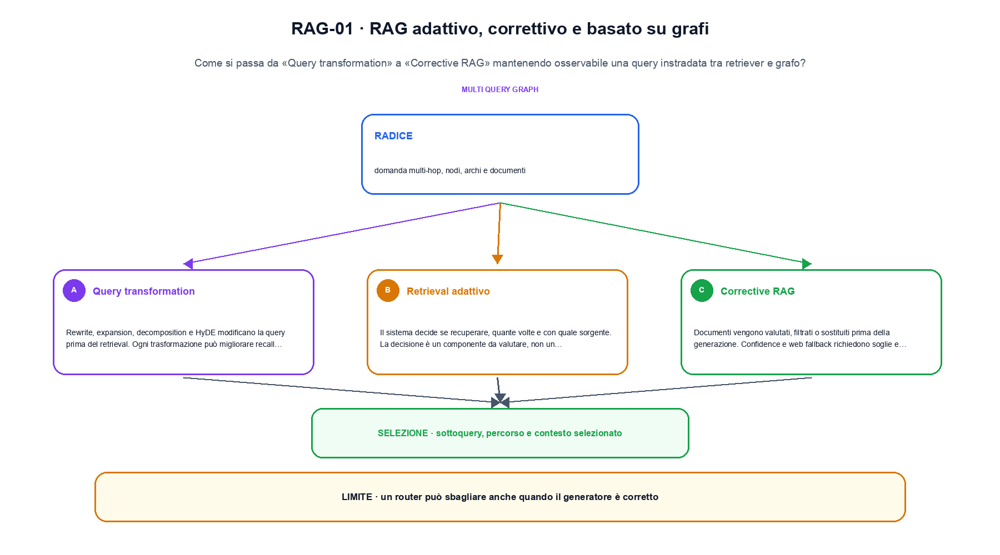
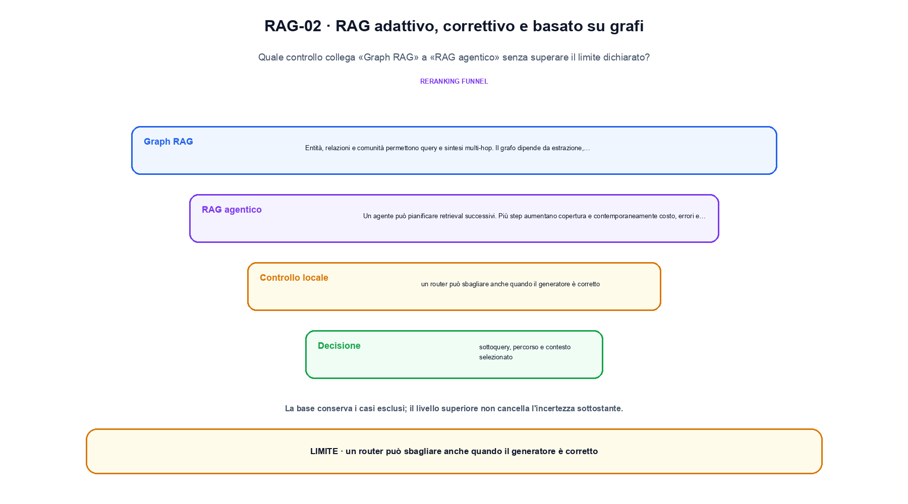

<!--
chapter_id: CH-P11-ADVANCED-RAG
part_id: P11
order_key: 650
title: RAG adattivo, correttivo e basato su grafi
maturity: ESTABLISHED
status: revisione editoriale v2, approvazione autoriale aperta
version: 0.5.0-draft3
last_source_check: 4 agosto 2026
environment: Python 3.13.12, CPU
code_policy: reference
deferred: benchmark applicativi non eseguiti e approvazione autoriale delle visuali
-->

# Capitolo 65. RAG adattivo, correttivo e basato su grafi

La domanda guida di questa lezione è come collegare «Query transformation» e «RAG agentico» senza perdere il contratto tecnico di rag adattivo, correttivo e basato su grafi. L'oggetto osservato è una query instradata tra retriever e grafo. Il contratto locale è: input, domanda multi-hop, nodi, archi e documenti; operazione, query transformation, routing e corrective retrieval; output, sottoquery, percorso e contesto selezionato. Il caso guida è questo: Una domanda segue il percorso q1 -> d1 -> q2 -> d2. Il confine da mantenere esplicito è: un router può sbagliare anche quando il generatore è corretto.

## Query transformation

Rewrite, expansion, decomposition e HyDE modificano la query prima del retrieval. Ogni trasformazione può migliorare recall o introdurre drift. [SRC-65-001]

Il router sceglie una fonte, ma la scelta resta da valutare.

**Caso da seguire.** Una domanda segue il percorso q1 -> d1 -> q2 -> d2.

**Controllo.** Conserva record iniziale, regola applicata e record finale; un conteggio aggregato non basta a spiegare la trasformazione.




La prima figura segue il percorso da «Query transformation» a «Corrective RAG».


## Retrieval adattivo

Il sistema decide se recuperare, quante volte e con quale sorgente. La decisione è un componente da valutare, non un comportamento gratuito del modello. [SRC-65-002]

**Caso da seguire.** Una query confrontata con tre documenti, conservando ranking, chunk entrati nel contesto e risposta finale.

**Controllo.** Esegui «Retrieval adattivo» due volte sullo stesso manifest e confronta identificatori, ordine, split e checksum.


## Corrective RAG

Documenti vengono valutati, filtrati o sostituiti prima della generazione. Confidence e web fallback richiedono soglie e autorizzazioni. [SRC-65-003]

**Caso da seguire.** Per «Corrective RAG» si mantiene l'input del capitolo e si isola questa condizione: Documenti vengono valutati, filtrati o sostituiti prima della generazione.

**Controllo.** Aggiungi un record che deve essere escluso e verifica che l'output conservi anche il motivo dell'esclusione.


## Esempio Python eseguito

Il frammento seguente è lo stesso conservato nel repository. Usa valori piccoli perché l'obiettivo è osservare il meccanismo, non simulare una scala che non abbiamo eseguito.

```python
def contract():
    graph = {"q1": ["d1"], "d1": ["q2"], "q2": ["d2"]}
    frontier = ["q1"]
    visited = []
    while frontier:
        node = frontier.pop(0)
        visited.append(node)
        frontier.extend(neighbor for neighbor in graph.get(node, []) if neighbor not in visited)
    return {"path": visited, "invariant": "multi-hop retrieval records the path rather than only the final context"}
```

Esecuzione con `python snip_65_contract.py`:

```text
{"invariant": "multi-hop retrieval records the path rather than only the final context", "path": ["q1", "d1", "q2", "d2"]}
```

Il test associato è [`code/test_65_contract.py`](code/test_65_contract.py); l'output versionato è [`code/outputs/SNIP-65-001.txt`](code/outputs/SNIP-65-001.txt).


## Graph RAG

Entità, relazioni e comunità permettono query e sintesi multi-hop. Il grafo dipende da estrazione, normalizzazione e aggiornamento. [SRC-65-004]

**Caso da seguire.** Per «Graph RAG» si mantiene l'input del capitolo e si isola questa condizione: Entità, relazioni e comunità permettono query e sintesi multi-hop.

**Controllo.** Modifica una sola regola della pipeline e misura quali record cambiano, evitando di confrontare raccolte di origine diversa.


## RAG agentico

Un agente può pianificare retrieval successivi. Più step aumentano copertura e contemporaneamente costo, errori e superficie di attacco. [SRC-65-001]

**Caso da seguire.** Per «RAG agentico» si mantiene l'input del capitolo e si isola questa condizione: Un agente può pianificare retrieval successivi.

**Controllo.** Descrivi ciò che la pipeline perde oltre a ciò che produce. Il limite locale è: Più step aumentano copertura e contemporaneamente costo, errori e superficie di attacco.




La seconda figura mette a confronto «Graph RAG» e il limite discusso in «RAG agentico».


## Come si collegano i passaggi

- **Da «Query transformation» a «Retrieval adattivo».** Rewrite, expansion, decomposition e HyDE modificano la query prima del retrieval. Il sistema decide se recuperare, quante volte e con quale sorgente. Il primo passaggio identifica il record e la sua provenienza; il secondo dichiara la trasformazione che cambia la popolazione osservata. [SRC-65-001; SRC-65-002]

- **Da «Retrieval adattivo» a «Corrective RAG».** Il sistema decide se recuperare, quante volte e con quale sorgente. Documenti vengono valutati, filtrati o sostituiti prima della generazione. La trasformazione diventa confrontabile soltanto quando il passaggio successivo conserva configurazione, conteggi e artefatti intermedi. [SRC-65-002; SRC-65-003]

- **Da «Corrective RAG» a «Graph RAG».** Documenti vengono valutati, filtrati o sostituiti prima della generazione. Entità, relazioni e comunità permettono query e sintesi multi-hop. Una volta resa tracciabile la pipeline, il quarto passaggio può affrontare selezione o uso senza confondere un cambiamento nei dati con uno nel modello. [SRC-65-003; SRC-65-004]

- **Da «Graph RAG» a «RAG agentico».** Entità, relazioni e comunità permettono query e sintesi multi-hop. Un agente può pianificare retrieval successivi. L'ultima sezione porta il risultato alla valutazione e chiede quali record, slice o failure restano fuori dalla media. [SRC-65-004; SRC-65-001]

La catena completa produce sottoquery, percorso e contesto selezionato a partire da domanda multi-hop, nodi, archi e documenti. Ogni collegamento conserva un oggetto osservabile diverso; per questo il risultato non può essere esteso oltre il limite dichiarato: un router può sbagliare anche quando il generatore è corretto.


## Esercizi sulla tracciabilità

1. Ricostruisci «Query transformation» con un esempio diverso da quello mostrato e indica l'output atteso prima del calcolo.
2. Nel passaggio «Retrieval adattivo», cambia una sola ipotesi e spiega quale risultato non è più confrontabile.
3. Collega «Corrective RAG» a una riga dello snippet oppure motiva perché la prova deve essere documentale.
4. Progetta un caso limite per «Graph RAG» che produca una failure riconoscibile.
5. Per «RAG agentico», separa una conclusione sostenuta dal caso locale da una che richiederebbe nuovi dati o un benchmark.


## L'artefatto che deve sopravvivere

La lezione parte da «domanda multi-hop, nodi, archi e documenti» e arriva fino a «sottoquery, percorso e contesto selezionato». Il limite da conservare è questo: un router può sbagliare anche quando il generatore è corretto. Definizioni e risultati citati sono rintracciabili in [`FONTI_PRIMARIE.md`](FONTI_PRIMARIE.md); la mappa dei claim è in [`CLAIMS.md`](CLAIMS.md).
