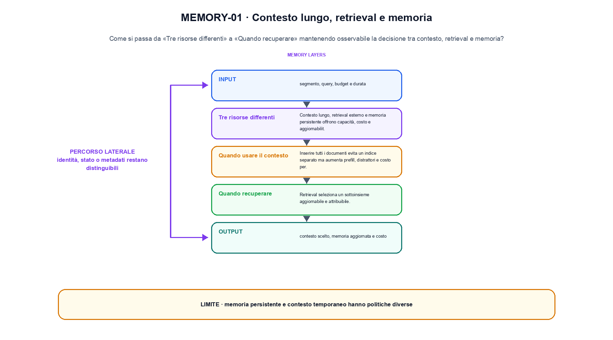
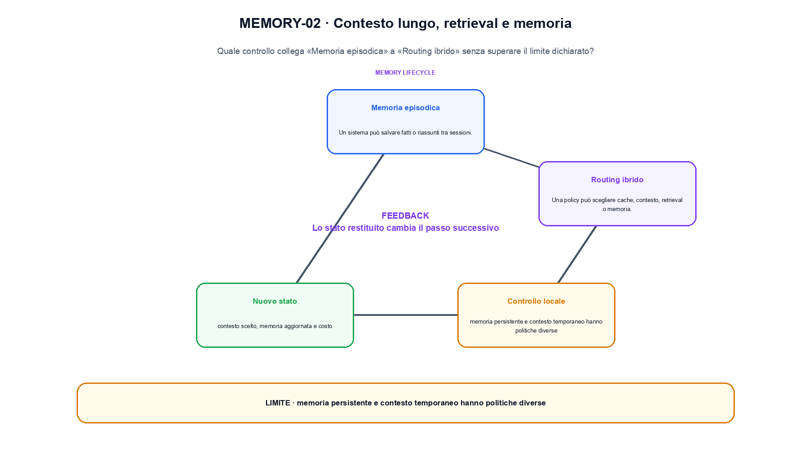

<!--
chapter_id: CH-P11-CONTEXT-RETRIEVAL-MEMORY
part_id: P11
order_key: 660
title: Contesto lungo, retrieval e memoria
maturity: ESTABLISHED
status: revisione editoriale v2, approvazione autoriale aperta
version: 0.5.0-draft3
last_source_check: 4 agosto 2026
environment: Python 3.13.12, CPU
code_policy: reference
deferred: benchmark applicativi non eseguiti e approvazione autoriale delle visuali
-->

# Capitolo 66. Contesto lungo, retrieval e memoria

In contesto lungo, retrieval e memoria il percorso dei record è il filo conduttore: da «Tre risorse differenti» a «Routing ibrido» ogni trasformazione lascia una traccia. L'oggetto osservato è la decisione tra contesto, retrieval e memoria. Il contratto locale dichiara input, segmento, query, budget e durata; operazione, routing, scrittura episodica e recupero; output, contesto scelto, memoria aggiornata e costo. Il caso di partenza è Un fatto stabile entra nella memoria persistente, mentre un dettaglio recente resta nel contesto breve. Il limite da non nascondere è: memoria persistente e contesto temporaneo hanno politiche diverse.

## Tre risorse differenti

Contesto lungo, retrieval esterno e memoria persistente offrono capacità, costo e aggiornabilità differenti. [SRC-66-001]

Memoria e contesto hanno politiche diverse di conservazione e recupero.

**Caso da seguire.** Un fatto stabile entra nella memoria persistente, mentre un dettaglio recente resta nel contesto breve.

**Controllo.** Per «Tre risorse differenti», conserva record iniziale, regola applicata e record finale; un conteggio aggregato non basta a spiegare la trasformazione.


La relazione centrale può essere scritta come:

$$
memory_t = update(memory_{t-1}, segment_t)
$$

Memoria e contesto hanno politiche diverse di conservazione e recupero. [SRC-66-001]




La prima figura segue il percorso da «Tre risorse differenti» a «Quando recuperare».


## Quando usare il contesto

Inserire tutti i documenti evita un indice separato ma aumenta prefill, distrattori e costo per richiesta. [SRC-66-002]

**Caso da seguire.** Un fatto stabile salvato e un dettaglio recente escluso.

**Controllo.** Esegui «Quando usare il contesto» due volte sullo stesso manifest e confronta identificatori, ordine, split e checksum.


## Quando recuperare

Retrieval seleziona un sottoinsieme aggiornabile e attribuibile. Può fallire per query, indice o ranking. [SRC-66-003]

**Caso da seguire.** Un caso in cui memoria persistente e contesto temporaneo hanno politiche diverse.

**Controllo.** Per «Quando recuperare», aggiungi un record che deve essere escluso e verifica che l'output conservi anche il motivo dell'esclusione.


## Esempio Python eseguito

Questa sezione apre il contratto Python di contesto lungo, retrieval e memoria: il lettore può eseguire lo stesso file e confrontare il risultato. Per «Contesto lungo, retrieval e memoria», il caso di default usa valori piccoli per isolare il meccanismo. Il caso non supportato viene provato separatamente, così «contesto lungo, retrieval e memoria» non viene generalizzato oltre l'esempio.

```python
def contract(case: str = "default"):
    if case != "default":
        raise ValueError("only the documented default case is supported")
    short_term = ["ultimo evento"]
    long_term = ["fatto stabile"]
    recalled = long_term[0]
    return {"short_term": short_term, "recalled": recalled, "invariant": "memory scope and retrieval source remain explicit"}
```

Esecuzione con `python snip_66_contract.py`:

```text
{"invariant": "memory scope and retrieval source remain explicit", "recalled": "fatto stabile", "short_term": ["ultimo evento"]}
```

Il test associato è [`code/test_66_contract.py`](code/test_66_contract.py); l'output versionato è [`code/outputs/SNIP-66-001.txt`](code/outputs/SNIP-66-001.txt).


## Memoria episodica

Un sistema può salvare fatti o riassunti tra sessioni. Provenienza, consenso, scadenza e correzione diventano parte del contratto. [SRC-66-004]

**Caso da seguire.** Una query confrontata con tre documenti, conservando ranking, chunk entrati nel contesto e risposta finale.

**Controllo.** Per «Memoria episodica», modifica una sola regola della pipeline e misura quali record cambiano, evitando di confrontare raccolte di origine diversa.


## Routing ibrido

Una policy può scegliere cache, contesto, retrieval o memoria. La decisione deve essere misurata rispetto a qualità, latenza e privacy. [SRC-66-001]

**Caso da seguire.** Una query e tre documenti ricevono punteggi distinti. Prima di generare, controlliamo quale documento è entrato nel contesto e con quale ranking.

**Controllo.** Per «Routing ibrido», descrivi ciò che la pipeline perde oltre a ciò che produce. Nel caso «Routing ibrido», il limite locale è: La decisione deve essere misurata rispetto a qualità, latenza e privacy.




La seconda figura mette a confronto «Memoria episodica» e il limite discusso in «Routing ibrido».


## Come si collegano i passaggi

- **Da «Tre risorse differenti» a «Quando usare il contesto».** Contesto lungo, retrieval esterno e memoria persistente offrono capacità, costo e aggiornabilità differenti. Inserire tutti i documenti evita un indice separato ma aumenta prefill, distrattori e costo per richiesta. «Tre risorse differenti» identifica il record e «Quando usare il contesto» dichiara la trasformazione sulla popolazione osservata. Il passaggio successivo rende misurabile «Quando usare il contesto». [SRC-66-001; SRC-66-002]

- **Da «Quando usare il contesto» a «Quando recuperare».** Inserire tutti i documenti evita un indice separato ma aumenta prefill, distrattori e costo per richiesta. Retrieval seleziona un sottoinsieme aggiornabile e attribuibile. Il passaggio da «Quando usare il contesto» a «Quando recuperare» conserva configurazione, conteggi e artefatti intermedi. Da «Quando usare il contesto» a «Quando recuperare» cambia la domanda osservabile. [SRC-66-002; SRC-66-003]

- **Da «Quando recuperare» a «Memoria episodica».** Retrieval seleziona un sottoinsieme aggiornabile e attribuibile. Un sistema può salvare fatti o riassunti tra sessioni. Con «Memoria episodica» la pipeline può selezionare o usare dati senza confonderli con una modifica del modello. Il passaggio successivo rende misurabile «Memoria episodica». [SRC-66-003; SRC-66-004]

- **Da «Memoria episodica» a «Routing ibrido».** Un sistema può salvare fatti o riassunti tra sessioni. Una policy può scegliere cache, contesto, retrieval o memoria. «Routing ibrido» porta il risultato alla valutazione e rende visibili record, slice e failure esclusi. Da «Memoria episodica» a «Routing ibrido» cambia la domanda osservabile. [SRC-66-004; SRC-66-001]

La catena completa produce contesto scelto, memoria aggiornata e costo a partire da segmento, query, budget e durata. Ogni collegamento conserva un oggetto osservabile diverso; per questo il risultato non può essere esteso oltre il limite dichiarato: memoria persistente e contesto temporaneo hanno politiche diverse.


## Esercizi sulla tracciabilità

1. Ricostruisci «Tre risorse differenti» con un esempio diverso da quello mostrato e indica l'output atteso prima del calcolo.
2. Nel passaggio «Quando usare il contesto», cambia una sola ipotesi e spiega quale risultato non è più confrontabile.
3. Collega «Quando recuperare» a una riga dello snippet oppure motiva perché la prova deve essere documentale.
4. Progetta un caso limite per «Memoria episodica» che produca una failure riconoscibile.
5. Per «Routing ibrido», separa una conclusione sostenuta dal caso locale da una che richiederebbe nuovi dati o un benchmark.


## L'artefatto che deve sopravvivere

La lezione parte da «segmento, query, budget e durata» e arriva fino a «contesto scelto, memoria aggiornata e costo». Il limite da conservare è questo: memoria persistente e contesto temporaneo hanno politiche diverse. Per «Routing ibrido», provenienza e trasformazioni sono registrate in [`FONTI_PRIMARIE.md`](FONTI_PRIMARIE.md), [`CLAIMS.md`](CLAIMS.md) e negli artefatti di `code/`.
