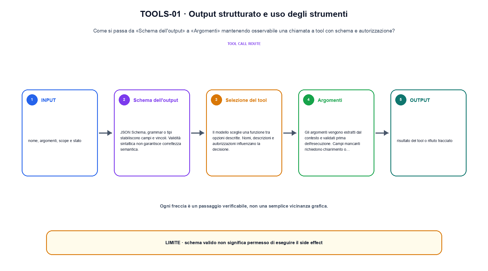
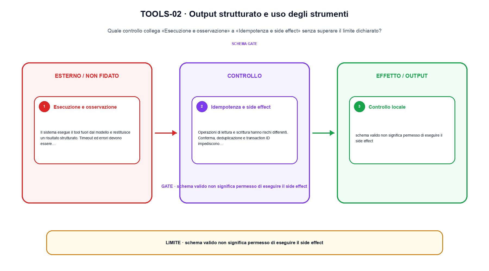

<!--
chapter_id: CH-P11-TOOLS
part_id: P11
order_key: 670
title: Output strutturato e uso degli strumenti
maturity: CORE
status: revisione editoriale v2, approvazione autoriale aperta
version: 0.5.0-draft3
last_source_check: 4 agosto 2026
environment: Python 3.13.12, CPU
code_policy: reference
deferred: benchmark applicativi non eseguiti e approvazione autoriale delle visuali
-->

# Capitolo 67. Output strutturato e uso degli strumenti

La domanda guida di questa lezione è come collegare «Schema dell'output» e «Idempotenza e side effect» senza perdere il contratto tecnico di output strutturato e uso degli strumenti. L'oggetto osservato è una chiamata a tool con schema e autorizzazione. Il contratto locale è: input, nome, argomenti, scope e stato; operazione, parsing, selezione, esecuzione e osservazione; output, risultato del tool o rifiuto tracciato. Il caso guida è questo: Lookup_order passa l'allowlist, mentre refund viene rifiutato prima del side effect. Il confine da mantenere esplicito è: schema valido non significa permesso di eseguire il side effect.

## Schema dell'output

JSON Schema, grammar o tipi stabiliscono campi e vincoli. Validità sintattica non garantisce correttezza semantica. [SRC-67-001]

Lo schema rende l'azione parsabile, non automaticamente autorizzata.

**Caso da seguire.** Lookup_order passa l'allowlist, mentre refund viene rifiutato prima del side effect.

**Controllo.** Registra richiesta, decisione, stato e output finale. Un esito plausibile non deve nascondere il componente che lo ha prodotto.


## Selezione del tool

Il modello sceglie una funzione tra opzioni descritte. Nomi, descrizioni e autorizzazioni influenzano la decisione. [SRC-67-002]

**Caso da seguire.** Una traiettoria minima osservazione-azione-tool-verifica in cui una chiamata fuori allowlist viene bloccata prima dell'esecuzione.

**Controllo.** Ripeti «Selezione del tool» con una capability o un'autorizzazione rimossa e verifica che la failure preceda qualsiasi side effect.




La prima figura segue il percorso da «Schema dell'output» a «Argomenti».


## Argomenti

Gli argomenti vengono estratti dal contesto e validati prima dell'esecuzione. Campi mancanti richiedono chiarimento o fallback. [SRC-67-003]

**Caso da seguire.** Un caso in cui schema valido non significa permesso di eseguire il side effect.

**Controllo.** Separa il test del singolo componente dal test end-to-end, usando lo stesso input e la stessa configurazione versionata.


## Esecuzione e osservazione

Il sistema esegue il tool fuori dal modello e restituisce un risultato strutturato. Timeout ed errori devono essere rappresentati. [SRC-67-004]

**Caso da seguire.** Una traiettoria minima alterna osservazione, decisione, tool e verifica. Il test può controllare che un'azione non autorizzata venga bloccata.

**Controllo.** Introduci una failure a un solo confine e controlla che log, stato e recovery identifichino quel confine senza ambiguità.


## Idempotenza e side effect

Operazioni di lettura e scrittura hanno rischi differenti. Conferma, deduplicazione e transaction ID impediscono ripetizioni non desiderate. [SRC-67-001]

**Caso da seguire.** Per «Idempotenza e side effect» si mantiene l'input del capitolo e si isola questa condizione: Operazioni di lettura e scrittura hanno rischi differenti.

**Controllo.** Confronta il comportamento completo, non soltanto l'ultimo messaggio. Il risultato resta limitato da: Conferma, deduplicazione e transaction ID impediscono ripetizioni non desiderate.




La seconda figura mette a confronto «Esecuzione e osservazione» e il limite discusso in «Idempotenza e side effect».


## Esempio Python eseguito

Il frammento seguente è lo stesso conservato nel repository. Usa valori piccoli perché l'obiettivo è osservare il meccanismo, non simulare una scala che non abbiamo eseguito.

```python
def contract():
    request = {"tool": "lookup_order", "order_id": "A1"}
    allowlist = {"lookup_order"}
    allowed = request["tool"] in allowlist and bool(request["order_id"])
    return {"allowed": allowed, "request": request, "invariant": "tool execution requires validation outside generated text"}
```

Esecuzione con `python snip_67_contract.py`:

```text
{"allowed": true, "invariant": "tool execution requires validation outside generated text", "request": {"order_id": "A1", "tool": "lookup_order"}}
```

Il test associato è [`code/test_67_contract.py`](code/test_67_contract.py); l'output versionato è [`code/outputs/SNIP-67-001.txt`](code/outputs/SNIP-67-001.txt).


## Come si collegano i passaggi

- **Da «Schema dell'output» a «Selezione del tool».** JSON Schema, grammar o tipi stabiliscono campi e vincoli. Il modello sceglie una funzione tra opzioni descritte. Il contratto iniziale nomina messaggi e confini; il componente successivo implementa una parte del percorso senza ereditare autorizzazioni implicite. [SRC-67-001; SRC-67-002]

- **Da «Selezione del tool» a «Argomenti».** Il modello sceglie una funzione tra opzioni descritte. Gli argomenti vengono estratti dal contesto e validati prima dell'esecuzione. Il terzo passaggio compone più componenti e rende quindi necessario conservare stato, identità e decisione oltre all'output finale. [SRC-67-002; SRC-67-003]

- **Da «Argomenti» a «Esecuzione e osservazione».** Gli argomenti vengono estratti dal contesto e validati prima dell'esecuzione. Il sistema esegue il tool fuori dal modello e restituisce un risultato strutturato. La quarta sezione introduce failure e recovery nel punto in cui possono ancora precedere un side effect o una perdita di stato. [SRC-67-003; SRC-67-004]

- **Da «Esecuzione e osservazione» a «Idempotenza e side effect».** Il sistema esegue il tool fuori dal modello e restituisce un risultato strutturato. Operazioni di lettura e scrittura hanno rischi differenti. La chiusura valuta il comportamento end-to-end: un componente corretto non basta se il collegamento, il carico o la policy cambiano l'esito. [SRC-67-004; SRC-67-001]

La catena completa produce risultato del tool o rifiuto tracciato a partire da nome, argomenti, scope e stato. Ogni collegamento conserva un oggetto osservabile diverso; per questo il risultato non può essere esteso oltre il limite dichiarato: schema valido non significa permesso di eseguire il side effect.


## Prove sui confini del sistema

1. Ricostruisci «Schema dell'output» con un esempio diverso da quello mostrato e indica l'output atteso prima del calcolo.
2. Nel passaggio «Selezione del tool», cambia una sola ipotesi e spiega quale risultato non è più confrontabile.
3. Collega «Argomenti» a una riga dello snippet oppure motiva perché la prova deve essere documentale.
4. Progetta un caso limite per «Esecuzione e osservazione» che produca una failure riconoscibile.
5. Per «Idempotenza e side effect», separa una conclusione sostenuta dal caso locale da una che richiederebbe nuovi dati o un benchmark.


## Il confine operativo

La lezione parte da «nome, argomenti, scope e stato» e arriva fino a «risultato del tool o rifiuto tracciato». Il limite da conservare è questo: schema valido non significa permesso di eseguire il side effect. Definizioni e risultati citati sono rintracciabili in [`FONTI_PRIMARIE.md`](FONTI_PRIMARIE.md); la mappa dei claim è in [`CLAIMS.md`](CLAIMS.md).
