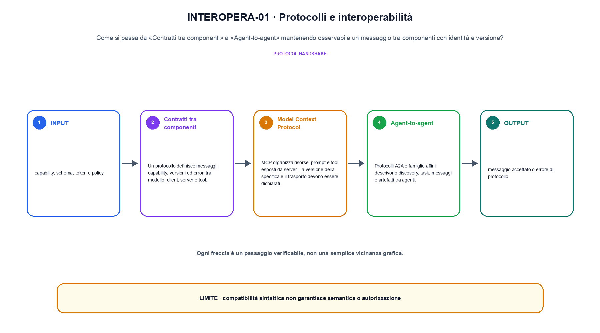
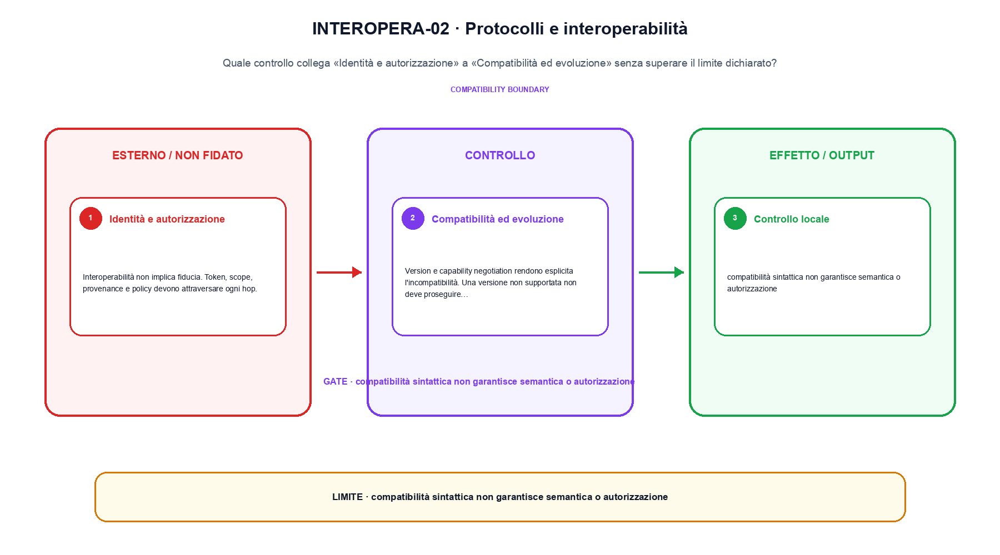

<!--
chapter_id: CH-P11-INTEROPERABILITY
part_id: P11
order_key: 680
title: Protocolli e interoperabilità
maturity: ESTABLISHED
status: revisione editoriale v2, approvazione autoriale aperta
version: 0.5.0-draft3
last_source_check: 4 agosto 2026
environment: Python 3.13.12, CPU
code_policy: reference
deferred: benchmark applicativi non eseguiti e approvazione autoriale delle visuali
-->

# Capitolo 68. Protocolli e interoperabilità

La domanda guida di questa lezione è come collegare «Contratti tra componenti» e «Compatibilità ed evoluzione» senza perdere il contratto tecnico di protocolli e interoperabilità. L'oggetto osservato è un messaggio tra componenti con identità e versione. Il contratto locale è: input, capability, schema, token e policy; operazione, negoziazione, encoding, autorizzazione e compatibilità; output, messaggio accettato o errore di protocollo. Il caso guida è questo: Un producer versione 1 è compatibile con un consumer che accetta le versioni 1 e 2. Il confine da mantenere esplicito è: compatibilità sintattica non garantisce semantica o autorizzazione.

## Contratti tra componenti

Un protocollo definisce messaggi, capability, versioni ed errori tra modello, client, server e tool. [SRC-68-001]

Un protocollo definisce formato e semantica condivisa tra componenti.

**Caso da seguire.** Un producer versione 1 è compatibile con un consumer che accetta le versioni 1 e 2.

**Controllo.** Registra richiesta, decisione, stato e output finale. Un esito plausibile non deve nascondere il componente che lo ha prodotto.


## Model Context Protocol

MCP organizza risorse, prompt e tool esposti da server. La versione della specifica e il trasporto devono essere dichiarati. [SRC-68-001]

**Caso da seguire.** Un server MCP che espone una capability e un tool con schema degli argomenti.

**Controllo.** Ripeti «Model Context Protocol» con una capability o un'autorizzazione rimossa e verifica che la failure preceda qualsiasi side effect.




La prima figura segue il percorso da «Contratti tra componenti» a «Agent-to-agent».


## Agent-to-agent

Protocolli A2A e famiglie affini descrivono discovery, task, messaggi e artefatti tra agenti. [SRC-68-002]

**Caso da seguire.** Un task A2A che passa da discovery a working e poi a completed.

**Controllo.** Separa il test del singolo componente dal test end-to-end, usando lo stesso input e la stessa configurazione versionata.


## Identità e autorizzazione

Interoperabilità non implica fiducia. Token, scope, provenance e policy devono attraversare ogni hop. [SRC-68-003]

**Caso da seguire.** Una credenziale firmata con subject, scope, issuer e scadenza.

**Controllo.** Introduci una failure a un solo confine e controlla che log, stato e recovery identifichino quel confine senza ambiguità.


## Compatibilità ed evoluzione

Version e capability negotiation rendono esplicita l'incompatibilità. Una versione non supportata non deve proseguire silenziosamente. [SRC-68-001]

**Caso da seguire.** Una negoziazione che rifiuta un campo nuovo quando la versione non lo supporta.

**Controllo.** Confronta il comportamento completo, non soltanto l'ultimo messaggio. Il risultato resta limitato da: Una versione non supportata non deve proseguire silenziosamente.




La seconda figura mette a confronto «Identità e autorizzazione» e il limite discusso in «Compatibilità ed evoluzione».


## Esempio Python eseguito

Il frammento seguente è lo stesso conservato nel repository. Usa valori piccoli perché l'obiettivo è osservare il meccanismo, non simulare una scala che non abbiamo eseguito.

```python
def contract():
    producer = {"version": 1, "capability": "lookup_order"}
    consumer = {"accepted_versions": {1, 2}, "required": "lookup_order"}
    compatible = producer["version"] in consumer["accepted_versions"] and producer["capability"] == consumer["required"]
    return {"compatible": compatible, "invariant": "interoperability is a versioned contract, not a shared label"}
```

Esecuzione con `python snip_68_contract.py`:

```text
{"compatible": true, "invariant": "interoperability is a versioned contract, not a shared label"}
```

Il test associato è [`code/test_68_contract.py`](code/test_68_contract.py); l'output versionato è [`code/outputs/SNIP-68-001.txt`](code/outputs/SNIP-68-001.txt).


## Come si collegano i passaggi

- **Da «Contratti tra componenti» a «Model Context Protocol».** Un protocollo definisce messaggi, capability, versioni ed errori tra modello, client, server e tool. MCP organizza risorse, prompt e tool esposti da server. Il contratto iniziale nomina messaggi e confini; il componente successivo implementa una parte del percorso senza ereditare autorizzazioni implicite. [SRC-68-001; SRC-68-001]

- **Da «Model Context Protocol» a «Agent-to-agent».** MCP organizza risorse, prompt e tool esposti da server. Protocolli A2A e famiglie affini descrivono discovery, task, messaggi e artefatti tra agenti. Il terzo passaggio compone più componenti e rende quindi necessario conservare stato, identità e decisione oltre all'output finale. [SRC-68-001; SRC-68-002]

- **Da «Agent-to-agent» a «Identità e autorizzazione».** Protocolli A2A e famiglie affini descrivono discovery, task, messaggi e artefatti tra agenti. Interoperabilità non implica fiducia. La quarta sezione introduce failure e recovery nel punto in cui possono ancora precedere un side effect o una perdita di stato. [SRC-68-002; SRC-68-003]

- **Da «Identità e autorizzazione» a «Compatibilità ed evoluzione».** Interoperabilità non implica fiducia. Version e capability negotiation rendono esplicita l'incompatibilità. La chiusura valuta il comportamento end-to-end: un componente corretto non basta se il collegamento, il carico o la policy cambiano l'esito. [SRC-68-003; SRC-68-001]

La catena completa produce messaggio accettato o errore di protocollo a partire da capability, schema, token e policy. Ogni collegamento conserva un oggetto osservabile diverso; per questo il risultato non può essere esteso oltre il limite dichiarato: compatibilità sintattica non garantisce semantica o autorizzazione.


## Prove sui confini del sistema

1. Ricostruisci «Contratti tra componenti» con un esempio diverso da quello mostrato e indica l'output atteso prima del calcolo.
2. Nel passaggio «Model Context Protocol», cambia una sola ipotesi e spiega quale risultato non è più confrontabile.
3. Collega «Agent-to-agent» a una riga dello snippet oppure motiva perché la prova deve essere documentale.
4. Progetta un caso limite per «Identità e autorizzazione» che produca una failure riconoscibile.
5. Per «Compatibilità ed evoluzione», separa una conclusione sostenuta dal caso locale da una che richiederebbe nuovi dati o un benchmark.


## Il confine operativo

La lezione parte da «capability, schema, token e policy» e arriva fino a «messaggio accettato o errore di protocollo». Il limite da conservare è questo: compatibilità sintattica non garantisce semantica o autorizzazione. Definizioni e risultati citati sono rintracciabili in [`FONTI_PRIMARIE.md`](FONTI_PRIMARIE.md); la mappa dei claim è in [`CLAIMS.md`](CLAIMS.md).
