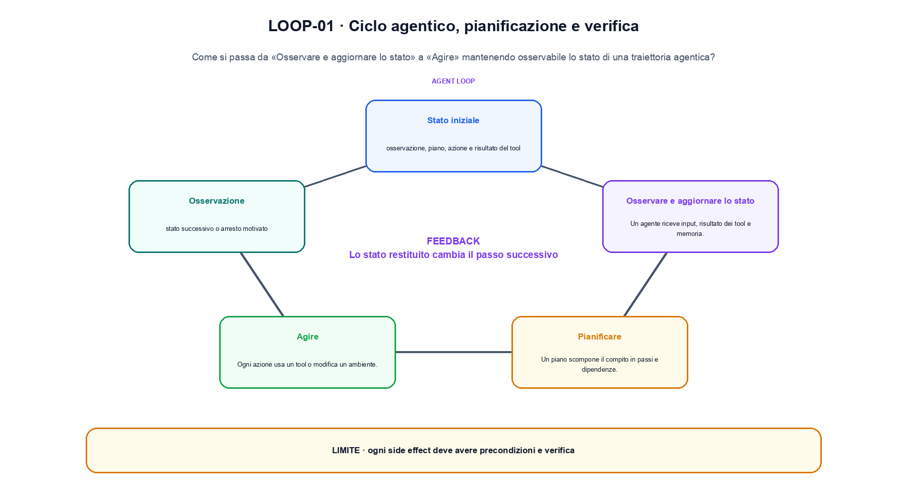
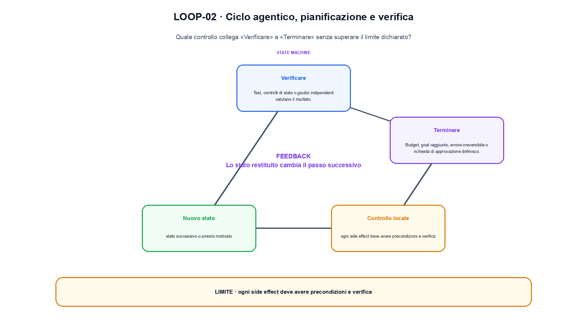

<!--
chapter_id: CH-P11-AGENT-LOOP
part_id: P11
order_key: 690
title: Ciclo agentico, pianificazione e verifica
maturity: CORE
status: revisione editoriale v2, approvazione autoriale aperta
version: 0.5.0-draft3
last_source_check: 4 agosto 2026
environment: Python 3.13.12, CPU
code_policy: reference
deferred: benchmark applicativi non eseguiti e approvazione autoriale delle visuali
-->

# Capitolo 69. Ciclo agentico, pianificazione e verifica

Ciclo agentico, pianificazione e verifica viene letto come un sistema: «Osservare e aggiornare lo stato» e «Terminare» restano collegati da confini e decisioni osservabili. L'oggetto osservato è lo stato di una traiettoria agentica. Il contratto locale dichiara input, osservazione, piano, azione e risultato del tool; operazione, observe, plan, act, verify e terminate; output, stato successivo o arresto motivato. Il caso di partenza è Una traiettoria minima registra observe, plan, tool e verify. Il limite da non nascondere è: ogni side effect deve avere precondizioni e verifica.

## Osservare e aggiornare lo stato

Un agente riceve input, risultato dei tool e memoria. Lo stato operativo deve essere separato dal testo libero del modello. [SRC-69-001]

Il ciclo deve rendere visibili azione, osservazione e arresto.

**Caso da seguire.** Una traiettoria minima registra observe, plan, tool e verify.

**Controllo.** Per «Osservare e aggiornare lo stato», registra richiesta, decisione, stato e output finale. Nel caso «Osservare e aggiornare lo stato», un esito plausibile non deve nascondere il componente che lo ha prodotto.


## Pianificare

Un piano scompone il compito in passi e dipendenze. Il piano iniziale può essere rivisto dopo nuove osservazioni. [SRC-69-002]

**Caso da seguire.** Lookup, conferma utente e aggiornamento dell'ordine.

**Controllo.** Ripeti «Pianificare» con una capability o un'autorizzazione rimossa e verifica che la failure preceda qualsiasi side effect.


La forma compatta aiuta a seguire il flusso senza attribuirgli una garanzia quantitativa.

**Schema concettuale.** `state_{t+1} = step(state_t, action_t, observation_t)`

Il ciclo deve rendere visibili azione, osservazione e arresto. [SRC-69-001]




La prima figura segue il percorso da «Osservare e aggiornare lo stato» a «Agire».


## Agire

Ogni azione usa un tool o modifica un ambiente. Parametri, autorizzazioni e costo devono essere validati. [SRC-69-003]

**Caso da seguire.** Un caso in cui ogni side effect deve avere precondizioni e verifica.

**Controllo.** Per «Agire», separa il test del singolo componente dal test end-to-end, usando lo stesso input e la stessa configurazione versionata.


## Verificare

Test, controlli di stato o giudici indipendenti valutano il risultato. Una autocritica del modello non equivale a verifica esterna. [SRC-69-004]

**Caso da seguire.** Una traiettoria minima alterna osservazione, decisione, tool e verifica. Il test può controllare che un'azione non autorizzata venga bloccata.

**Controllo.** Per «Verificare», introduci una failure a un solo confine e controlla che log, stato e recovery identifichino quel confine senza ambiguità.


## Terminare

Budget, goal raggiunto, errore irreversibile o richiesta di approvazione definiscono condizioni di stop. [SRC-69-001]

**Caso da seguire.** Per «Terminare» si mantiene l'input del capitolo e si isola questa condizione: Budget, goal raggiunto, errore irreversibile o richiesta di approvazione definiscono condizioni di stop.

**Controllo.** Per «Terminare», confronta il comportamento completo, non soltanto l'ultimo messaggio. Nel caso «Terminare», il risultato resta limitato da: Budget, goal raggiunto, errore irreversibile o richiesta di approvazione definiscono condizioni di stop.




La seconda figura mette a confronto «Verificare» e il limite discusso in «Terminare».


## Esempio Python eseguito

Il caso computazionale di ciclo agentico, pianificazione e verifica è riportato senza trasformazioni: il file e l'output sono quelli verificati. Per «Ciclo agentico, pianificazione e verifica», il caso di default usa valori piccoli per isolare il meccanismo. La suite conserva inoltre una failure esplicita per separare il contratto osservato da «ciclo agentico, pianificazione e verifica».

```python
def contract(case: str = "default"):
    if case != "default":
        raise ValueError("only the documented default case is supported")
    events = ["observe", "plan", "tool", "verify"]
    valid = events == ["observe", "plan", "tool", "verify"]
    return {"events": events, "valid": valid, "invariant": "an agent loop records observation, action and verification"}
```

Esecuzione con `python snip_69_contract.py`:

```text
{"events": ["observe", "plan", "tool", "verify"], "invariant": "an agent loop records observation, action and verification", "valid": true}
```

Il test associato è [`code/test_69_contract.py`](code/test_69_contract.py); l'output versionato è [`code/outputs/SNIP-69-001.txt`](code/outputs/SNIP-69-001.txt).


## Come si collegano i passaggi

- **Da «Osservare e aggiornare lo stato» a «Pianificare».** Un agente riceve input, risultato dei tool e memoria. Un piano scompone il compito in passi e dipendenze. «Osservare e aggiornare lo stato» nomina il confine e «Pianificare» implementa il percorso senza ereditare autorizzazioni implicite. Da «Osservare e aggiornare lo stato» a «Pianificare» cambia la domanda osservabile. [SRC-69-001; SRC-69-002]

- **Da «Pianificare» a «Agire».** Un piano scompone il compito in passi e dipendenze. Ogni azione usa un tool o modifica un ambiente. Componendo «Pianificare» e «Agire» diventa necessario conservare stato, identità e decisione. Il passaggio successivo rende misurabile «Agire». [SRC-69-002; SRC-69-003]

- **Da «Agire» a «Verificare».** Ogni azione usa un tool o modifica un ambiente. Test, controlli di stato o giudici indipendenti valutano il risultato. «Verificare» introduce failure e recovery prima di un side effect o di una perdita di stato. Da «Agire» a «Verificare» cambia la domanda osservabile. [SRC-69-003; SRC-69-004]

- **Da «Verificare» a «Terminare».** Test, controlli di stato o giudici indipendenti valutano il risultato. Budget, goal raggiunto, errore irreversibile o richiesta di approvazione definiscono condizioni di stop. La chiusura su «Terminare» valuta il sistema completo, non soltanto il componente iniziale. Il passaggio successivo rende misurabile «Terminare». [SRC-69-004; SRC-69-001]

La catena completa produce stato successivo o arresto motivato a partire da osservazione, piano, azione e risultato del tool. Ogni collegamento conserva un oggetto osservabile diverso; per questo il risultato non può essere esteso oltre il limite dichiarato: ogni side effect deve avere precondizioni e verifica.


## Prove sui confini del sistema

1. Ricostruisci «Osservare e aggiornare lo stato» con un esempio diverso da quello mostrato e indica l'output atteso prima del calcolo.
2. Nel passaggio «Pianificare», cambia una sola ipotesi e spiega quale risultato non è più confrontabile.
3. Collega «Agire» a una riga dello snippet oppure motiva perché la prova deve essere documentale.
4. Progetta un caso limite per «Verificare» che produca una failure riconoscibile.
5. Per «Terminare», separa una conclusione sostenuta dal caso locale da una che richiederebbe nuovi dati o un benchmark.


## Il confine operativo

La lezione parte da «osservazione, piano, azione e risultato del tool» e arriva fino a «stato successivo o arresto motivato». Il limite da conservare è questo: ogni side effect deve avere precondizioni e verifica. Il confine di «Terminare» va ricontrollato tra claim, fonti e artefatti: i rinvii sono [`FONTI_PRIMARIE.md`](FONTI_PRIMARIE.md), [`CLAIMS.md`](CLAIMS.md) e `code/`.
