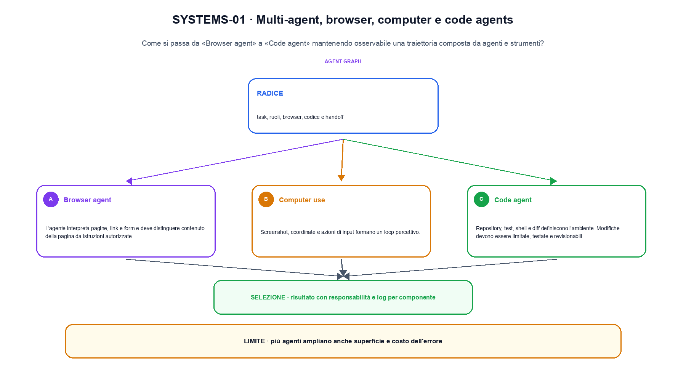
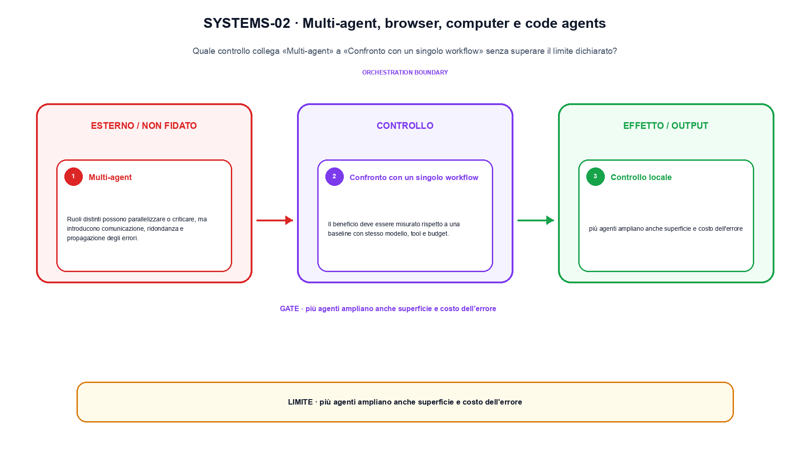

<!--
chapter_id: CH-P11-AGENT-SYSTEMS
part_id: P11
order_key: 700
title: Multi-agent, browser, computer e code agents
maturity: ESTABLISHED
status: revisione editoriale v2, approvazione autoriale aperta
version: 0.5.0-draft3
last_source_check: 4 agosto 2026
environment: Python 3.13.12, CPU
code_policy: reference
deferred: benchmark applicativi non eseguiti e approvazione autoriale delle visuali
-->

# Capitolo 70. Multi-agent, browser, computer e code agents

Il percorso di multi-agent, browser, computer e code agents attraversa «Browser agent» e «Confronto con un singolo workflow» senza attribuire al solo modello ciò che dipende dal sistema. L'oggetto osservato è una traiettoria composta da agenti e strumenti. Il contratto locale dichiara input, task, ruoli, browser, codice e handoff; operazione, delega, comunicazione, esecuzione e aggregazione; output, risultato con responsabilità e log per componente. La situazione minima da seguire è Planner, executor e critic scambiano tre messaggi con ruoli espliciti. Il limite da non nascondere è: più agenti ampliano anche superficie e costo dell'errore.

## Browser agent

L'agente interpreta pagine, link e form e deve distinguere contenuto della pagina da istruzioni autorizzate. [SRC-70-001]

Più componenti ampliano la traiettoria e anche la superficie di errore.

**Caso da seguire.** Planner, executor e critic scambiano tre messaggi con ruoli espliciti.

**Controllo.** Per «Browser agent», registra richiesta, decisione, stato e output finale. Nel caso «Browser agent», un esito plausibile non deve nascondere il componente che lo ha prodotto.


## Computer use

Screenshot, coordinate e azioni di input formano un loop percettivo. Risoluzione, focus e stato dell'interfaccia possono cambiare. [SRC-70-002]

**Caso da seguire.** Un planner delega ricerca e verifica a due ruoli separati.

**Controllo.** Ripeti «Computer use» con una capability o un'autorizzazione rimossa e verifica che la failure preceda qualsiasi side effect.


Qui la notazione serve a fissare un'interfaccia tra componenti.

**Schema concettuale.** `trajectory = compose(agents, tools, browser)`

Più componenti ampliano la traiettoria e anche la superficie di errore. [SRC-70-001]




La prima figura segue il percorso da «Browser agent» a «Code agent».


## Code agent

Repository, test, shell e diff definiscono l'ambiente. Modifiche devono essere limitate, testate e revisionabili. [SRC-70-003]

**Caso da seguire.** Una traiettoria minima osservazione-azione-tool-verifica in cui una chiamata fuori allowlist viene bloccata prima dell'esecuzione.

**Controllo.** Per «Code agent», separa il test del singolo componente dal test end-to-end, usando lo stesso input e la stessa configurazione versionata.


## Multi-agent

Ruoli distinti possono parallelizzare o criticare, ma introducono comunicazione, ridondanza e propagazione degli errori. [SRC-70-004]

**Caso da seguire.** Per «Multi-agent» si mantiene l'input del capitolo e si isola questa condizione: Ruoli distinti possono parallelizzare o criticare, ma introducono comunicazione, ridondanza e propagazione degli errori.

**Controllo.** Per «Multi-agent», introduci una failure a un solo confine e controlla che log, stato e recovery identifichino quel confine senza ambiguità.


## Confronto con un singolo workflow

Il beneficio deve essere misurato rispetto a una baseline con stesso modello, tool e budget. [SRC-70-001]

**Caso da seguire.** Un dato trasformato e ricostruito con la quantità di probabilità o di errore dichiarata.

**Controllo.** Per «Confronto con un singolo workflow», confronta il comportamento completo, non soltanto l'ultimo messaggio. Nel caso «Confronto con un singolo workflow», il risultato resta limitato da: Il beneficio deve essere misurato rispetto a una baseline con stesso modello, tool e budget.




La seconda figura mette a confronto «Multi-agent» e il limite discusso in «Confronto con un singolo workflow».


## Esempio Python eseguito

Questa sezione apre il contratto Python di multi-agent, browser, computer e code agents: il lettore può eseguire lo stesso file e confrontare il risultato. Per «Multi-agent, browser, computer e code agents», il caso di default usa valori piccoli per isolare il meccanismo. Il caso non supportato viene provato separatamente, così «multi-agent, browser, computer e code agents» non viene generalizzato oltre l'esempio.

```python
def contract(case: str = "default"):
    if case != "default":
        raise ValueError("only the documented default case is supported")
    messages = [("planner", "lookup"), ("executor", "done"), ("critic", "pass")]
    roles = [role for role, _message in messages]
    return {"roles": roles, "message_count": len(messages), "invariant": "multi-agent coordination exposes role and message boundaries"}
```

Esecuzione con `python snip_70_contract.py`:

```text
{"invariant": "multi-agent coordination exposes role and message boundaries", "message_count": 3, "roles": ["planner", "executor", "critic"]}
```

Il test associato è [`code/test_70_contract.py`](code/test_70_contract.py); l'output versionato è [`code/outputs/SNIP-70-001.txt`](code/outputs/SNIP-70-001.txt).


## Come si collegano i passaggi

- **Da «Browser agent» a «Computer use».** L'agente interpreta pagine, link e form e deve distinguere contenuto della pagina da istruzioni autorizzate. Screenshot, coordinate e azioni di input formano un loop percettivo. «Browser agent» nomina il confine e «Computer use» implementa il percorso senza ereditare autorizzazioni implicite. Il passaggio successivo rende misurabile «Computer use». [SRC-70-001; SRC-70-002]

- **Da «Computer use» a «Code agent».** Screenshot, coordinate e azioni di input formano un loop percettivo. Repository, test, shell e diff definiscono l'ambiente. Componendo «Computer use» e «Code agent» diventa necessario conservare stato, identità e decisione. Da «Computer use» a «Code agent» cambia la domanda osservabile. [SRC-70-002; SRC-70-003]

- **Da «Code agent» a «Multi-agent».** Repository, test, shell e diff definiscono l'ambiente. Ruoli distinti possono parallelizzare o criticare, ma introducono comunicazione, ridondanza e propagazione degli errori. «Multi-agent» introduce failure e recovery prima di un side effect o di una perdita di stato. Il passaggio successivo rende misurabile «Multi-agent». [SRC-70-003; SRC-70-004]

- **Da «Multi-agent» a «Confronto con un singolo workflow».** Ruoli distinti possono parallelizzare o criticare, ma introducono comunicazione, ridondanza e propagazione degli errori. Il beneficio deve essere misurato rispetto a una baseline con stesso modello, tool e budget. La chiusura su «Confronto con un singolo workflow» valuta il sistema completo, non soltanto il componente iniziale. Da «Multi-agent» a «Confronto con un singolo workflow» cambia la domanda osservabile. [SRC-70-004; SRC-70-001]

La catena completa produce risultato con responsabilità e log per componente a partire da task, ruoli, browser, codice e handoff. Ogni collegamento conserva un oggetto osservabile diverso; per questo il risultato non può essere esteso oltre il limite dichiarato: più agenti ampliano anche superficie e costo dell'errore.


## Prove sui confini del sistema

1. Ricostruisci «Browser agent» con un esempio diverso da quello mostrato e indica l'output atteso prima del calcolo.
2. Nel passaggio «Computer use», cambia una sola ipotesi e spiega quale risultato non è più confrontabile.
3. Collega «Code agent» a una riga dello snippet oppure motiva perché la prova deve essere documentale.
4. Progetta un caso limite per «Multi-agent» che produca una failure riconoscibile.
5. Per «Confronto con un singolo workflow», separa una conclusione sostenuta dal caso locale da una che richiederebbe nuovi dati o un benchmark.


## Il confine operativo

La lezione parte da «task, ruoli, browser, codice e handoff» e arriva fino a «risultato con responsabilità e log per componente». Il limite da conservare è questo: più agenti ampliano anche superficie e costo dell'errore. Il confine di «Confronto con un singolo workflow» va ricontrollato tra claim, fonti e artefatti: i rinvii sono [`FONTI_PRIMARIE.md`](FONTI_PRIMARIE.md), [`CLAIMS.md`](CLAIMS.md) e `code/`.
