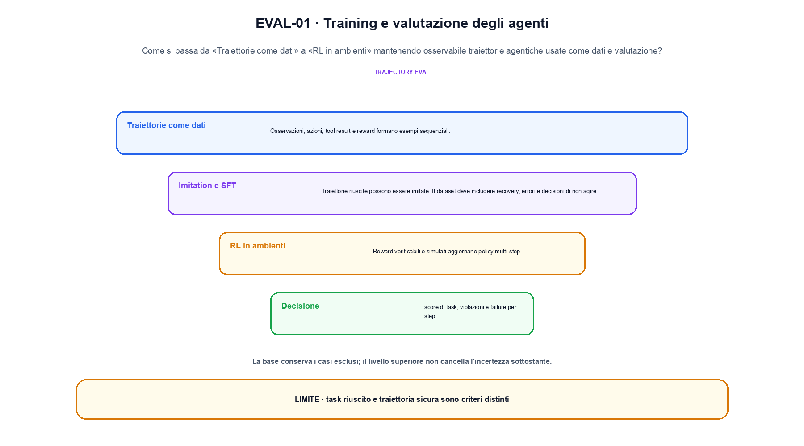
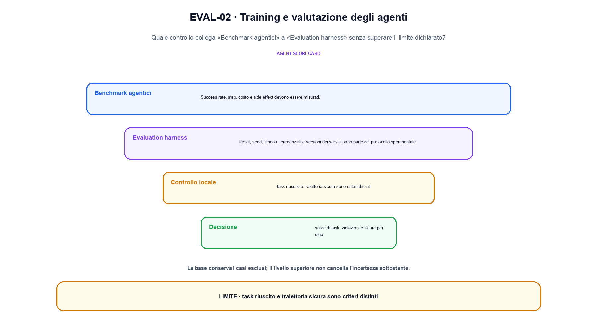

<!--
chapter_id: CH-P11-AGENT-TRAINING-EVAL
part_id: P11
order_key: 710
title: Training e valutazione degli agenti
maturity: ESTABLISHED
status: revisione editoriale v2, approvazione autoriale aperta
version: 0.5.0-draft3
last_source_check: 4 agosto 2026
environment: Python 3.13.12, CPU
code_policy: reference
deferred: benchmark applicativi non eseguiti e approvazione autoriale delle visuali
-->

# Capitolo 71. Training e valutazione degli agenti

Per capire training e valutazione degli agenti, partiamo da «Traiettorie come dati» e seguiamo ogni confine fino a «Evaluation harness». L'oggetto osservato è traiettorie agentiche usate come dati e valutazione. Il contratto locale dichiara input, task, trace, policy, outcome e costo; operazione, SFT, RL, benchmark e harness; output, score di task, violazioni e failure per step. Il caso di partenza è Due traiettorie hanno lo stesso successo, ma soltanto una ha zero violazioni di policy. Il limite da non nascondere è: task riuscito e traiettoria sicura sono criteri distinti.

## Traiettorie come dati

Osservazioni, azioni, tool result e reward formano esempi sequenziali. Logging incompleto rende impossibile ricostruire il fallimento. [SRC-71-001]

L'eval deve distinguere compito riuscito, traiettoria e violazione di policy.

**Caso da seguire.** Due traiettorie hanno lo stesso successo, ma soltanto una ha zero violazioni di policy.

**Controllo.** Per «Traiettorie come dati», registra richiesta, decisione, stato e output finale. Nel caso «Traiettorie come dati», un esito plausibile non deve nascondere il componente che lo ha prodotto.


## Imitation e SFT

Traiettorie riuscite possono essere imitate. Il dataset deve includere recovery, errori e decisioni di non agire. [SRC-71-002]

**Caso da seguire.** Due traiettorie con stesso esito ma una violazione di policy.

**Controllo.** Ripeti «Imitation e SFT» con una capability o un'autorizzazione rimossa e verifica che la failure preceda qualsiasi side effect.


La relazione seguente è una mappa operativa e non una misura del sistema.

**Schema concettuale.** `score = evaluate(trajectory, task, policy)`

L'eval deve distinguere compito riuscito, traiettoria e violazione di policy. [SRC-71-001]




La prima figura segue il percorso da «Traiettorie come dati» a «RL in ambienti».


## RL in ambienti

Reward verificabili o simulati aggiornano policy multi-step. Il modello può sfruttare bug dell'ambiente o del checker. [SRC-71-003]

**Caso da seguire.** Un caso in cui task riuscito e traiettoria sicura sono criteri distinti.

**Controllo.** Per «RL in ambienti», separa il test del singolo componente dal test end-to-end, usando lo stesso input e la stessa configurazione versionata.


## Benchmark agentici

Success rate, step, costo e side effect devono essere misurati. Task statici rischiano contaminazione e overfitting. [SRC-71-004]

**Caso da seguire.** Quattro casi con protocollo, una failure e una slice conservati insieme al valore aggregato.

**Controllo.** Per «Benchmark agentici», introduci una failure a un solo confine e controlla che log, stato e recovery identifichino quel confine senza ambiguità.


## Evaluation harness

Reset, seed, timeout, credenziali e versioni dei servizi sono parte del protocollo sperimentale. [SRC-71-001]

**Caso da seguire.** Quattro casi con tre esiti corretti e una failure, riportando la media insieme alla slice e al protocollo per «Evaluation harness» e all'output score di task, violazioni e failure per step.

**Controllo.** Per «Evaluation harness», confronta il comportamento completo, non soltanto l'ultimo messaggio. Nel caso «Evaluation harness», il risultato resta limitato da: Reset, seed, timeout, credenziali e versioni dei servizi sono parte del protocollo sperimentale.




La seconda figura mette a confronto «Benchmark agentici» e il limite discusso in «Evaluation harness».


## Esempio Python eseguito

La prova locale di training e valutazione degli agenti parte da un esempio minimo, registrato nel repository insieme ai suoi test. Per «Training e valutazione degli agenti», il caso di default usa valori piccoli per isolare il meccanismo. La prova negativa riguarda proprio «training e valutazione degli agenti» e interrompe l'interpretazione prima dell'output.

```python
def contract(case: str = "default"):
    if case != "default":
        raise ValueError("only the documented default case is supported")
    traces = [{"success": True, "violations": 0}, {"success": True, "violations": 1}]
    safe_success = sum(trace["success"] and trace["violations"] == 0 for trace in traces)
    return {"task_success": sum(trace["success"] for trace in traces), "safe_success": safe_success, "invariant": "task completion and policy compliance are separate metrics"}
```

Esecuzione con `python snip_71_contract.py`:

```text
{"invariant": "task completion and policy compliance are separate metrics", "safe_success": 1, "task_success": 2}
```

Il test associato è [`code/test_71_contract.py`](code/test_71_contract.py); l'output versionato è [`code/outputs/SNIP-71-001.txt`](code/outputs/SNIP-71-001.txt).


## Come si collegano i passaggi

- **Da «Traiettorie come dati» a «Imitation e SFT».** Osservazioni, azioni, tool result e reward formano esempi sequenziali. Traiettorie riuscite possono essere imitate. «Traiettorie come dati» nomina il confine e «Imitation e SFT» implementa il percorso senza ereditare autorizzazioni implicite. Da «Traiettorie come dati» a «Imitation e SFT» cambia la domanda osservabile. [SRC-71-001; SRC-71-002]

- **Da «Imitation e SFT» a «RL in ambienti».** Traiettorie riuscite possono essere imitate. Reward verificabili o simulati aggiornano policy multi-step. Componendo «Imitation e SFT» e «RL in ambienti» diventa necessario conservare stato, identità e decisione. Il passaggio successivo rende misurabile «RL in ambienti». [SRC-71-002; SRC-71-003]

- **Da «RL in ambienti» a «Benchmark agentici».** Reward verificabili o simulati aggiornano policy multi-step. Success rate, step, costo e side effect devono essere misurati. «Benchmark agentici» introduce failure e recovery prima di un side effect o di una perdita di stato. Da «RL in ambienti» a «Benchmark agentici» cambia la domanda osservabile. [SRC-71-003; SRC-71-004]

- **Da «Benchmark agentici» a «Evaluation harness».** Success rate, step, costo e side effect devono essere misurati. Reset, seed, timeout, credenziali e versioni dei servizi sono parte del protocollo sperimentale. La chiusura su «Evaluation harness» valuta il sistema completo, non soltanto il componente iniziale. Il passaggio successivo rende misurabile «Evaluation harness». [SRC-71-004; SRC-71-001]

La catena completa produce score di task, violazioni e failure per step a partire da task, trace, policy, outcome e costo. Ogni collegamento conserva un oggetto osservabile diverso; per questo il risultato non può essere esteso oltre il limite dichiarato: task riuscito e traiettoria sicura sono criteri distinti.


## Prove sui confini del sistema

1. Ricostruisci «Traiettorie come dati» con un esempio diverso da quello mostrato e indica l'output atteso prima del calcolo.
2. Nel passaggio «Imitation e SFT», cambia una sola ipotesi e spiega quale risultato non è più confrontabile.
3. Collega «RL in ambienti» a una riga dello snippet oppure motiva perché la prova deve essere documentale.
4. Progetta un caso limite per «Benchmark agentici» che produca una failure riconoscibile.
5. Per «Evaluation harness», separa una conclusione sostenuta dal caso locale da una che richiederebbe nuovi dati o un benchmark.


## Il confine operativo

La lezione parte da «task, trace, policy, outcome e costo» e arriva fino a «score di task, violazioni e failure per step». Il limite da conservare è questo: task riuscito e traiettoria sicura sono criteri distinti. Il confine di «Evaluation harness» va ricontrollato tra claim, fonti e artefatti: i rinvii sono [`FONTI_PRIMARIE.md`](FONTI_PRIMARIE.md), [`CLAIMS.md`](CLAIMS.md) e `code/`.
