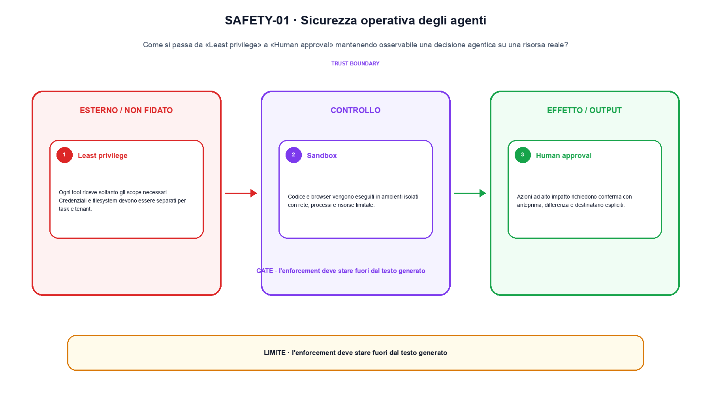
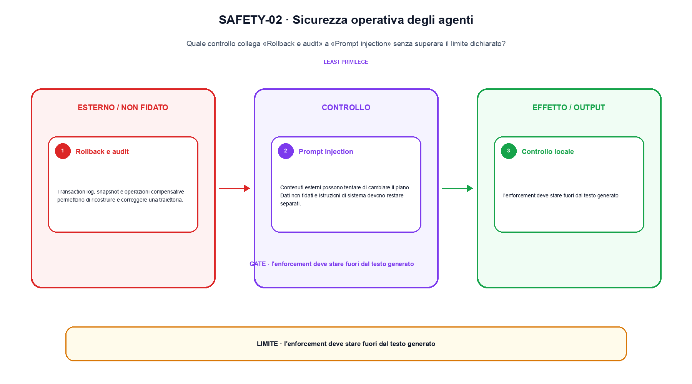

<!--
chapter_id: CH-P11-AGENT-SAFETY
part_id: P11
order_key: 720
title: Sicurezza operativa degli agenti
maturity: CORE
status: revisione editoriale v2, approvazione autoriale aperta
version: 0.5.0-draft3
last_source_check: 4 agosto 2026
environment: Python 3.13.12, CPU
code_policy: reference
deferred: benchmark applicativi non eseguiti e approvazione autoriale delle visuali
-->

# Capitolo 72. Sicurezza operativa degli agenti

La domanda guida di questa lezione è come collegare «Least privilege» e «Prompt injection» senza perdere il contratto tecnico di sicurezza operativa degli agenti. L'oggetto osservato è una decisione agentica su una risorsa reale. Il contratto locale è: input, input non fidato, tool, scope e approvazione; operazione, least privilege, sandbox, human approval e rollback; output, allow/deny, side effect o rollback auditabile. Il caso guida è questo: Lookup_order è consentito, mentre refund richiede approvazione o viene negato dalla policy esterna. Il confine da mantenere esplicito è: l'enforcement deve stare fuori dal testo generato.

## Least privilege

Ogni tool riceve soltanto gli scope necessari. Credenziali e filesystem devono essere separati per task e tenant. [SRC-72-001]

Sicurezza agentica richiede una decisione esterna alla sola generazione.

**Caso da seguire.** Lookup_order è consentito, mentre refund richiede approvazione o viene negato dalla policy esterna.

**Controllo.** Registra richiesta, decisione, stato e output finale. Un esito plausibile non deve nascondere il componente che lo ha prodotto.


## Sandbox

Codice e browser vengono eseguiti in ambienti isolati con rete, processi e risorse limitate. [SRC-72-002]

**Caso da seguire.** Una traiettoria minima osservazione-azione-tool-verifica in cui una chiamata fuori allowlist viene bloccata prima dell'esecuzione.

**Controllo.** Ripeti «Sandbox» con una capability o un'autorizzazione rimossa e verifica che la failure preceda qualsiasi side effect.




La prima figura segue il percorso da «Least privilege» a «Human approval».


## Human approval

Azioni ad alto impatto richiedono conferma con anteprima, differenza e destinatario espliciti. [SRC-72-003]

**Caso da seguire.** Per «Human approval» si mantiene l'input del capitolo e si isola questa condizione: Azioni ad alto impatto richiedono conferma con anteprima, differenza e destinatario espliciti.

**Controllo.** Separa il test del singolo componente dal test end-to-end, usando lo stesso input e la stessa configurazione versionata.


## Rollback e audit

Transaction log, snapshot e operazioni compensative permettono di ricostruire e correggere una traiettoria. [SRC-72-004]

**Caso da seguire.** Per «Rollback e audit» si mantiene l'input del capitolo e si isola questa condizione: Transaction log, snapshot e operazioni compensative permettono di ricostruire e correggere una traiettoria.

**Controllo.** Introduci una failure a un solo confine e controlla che log, stato e recovery identifichino quel confine senza ambiguità.


## Prompt injection

Contenuti esterni possono tentare di cambiare il piano. Dati non fidati e istruzioni di sistema devono restare separati. [SRC-72-001]

**Caso da seguire.** Un input non fidato che raggiunge una policy esterna, con decisione allow/deny e traccia dell'evento conservate separatamente.

**Controllo.** Confronta il comportamento completo, non soltanto l'ultimo messaggio. Il risultato resta limitato da: Dati non fidati e istruzioni di sistema devono restare separati.




La seconda figura mette a confronto «Rollback e audit» e il limite discusso in «Prompt injection».


## Esempio Python eseguito

Il frammento seguente è lo stesso conservato nel repository. Usa valori piccoli perché l'obiettivo è osservare il meccanismo, non simulare una scala che non abbiamo eseguito.

```python
def contract():
    request = {"tool": "refund", "scope": "order:A1"}
    policy = {"allowed_tools": {"lookup_order"}, "requires_approval": {"refund"}}
    allowed = request["tool"] in policy["allowed_tools"]
    return {"allowed": allowed, "approval_required": request["tool"] in policy["requires_approval"], "invariant": "authorization and rollback live outside the model text"}
```

Esecuzione con `python snip_72_contract.py`:

```text
{"allowed": false, "approval_required": true, "invariant": "authorization and rollback live outside the model text"}
```

Il test associato è [`code/test_72_contract.py`](code/test_72_contract.py); l'output versionato è [`code/outputs/SNIP-72-001.txt`](code/outputs/SNIP-72-001.txt).


## Come si collegano i passaggi

- **Da «Least privilege» a «Sandbox».** Ogni tool riceve soltanto gli scope necessari. Codice e browser vengono eseguiti in ambienti isolati con rete, processi e risorse limitate. Il contratto iniziale nomina messaggi e confini; il componente successivo implementa una parte del percorso senza ereditare autorizzazioni implicite. [SRC-72-001; SRC-72-002]

- **Da «Sandbox» a «Human approval».** Codice e browser vengono eseguiti in ambienti isolati con rete, processi e risorse limitate. Azioni ad alto impatto richiedono conferma con anteprima, differenza e destinatario espliciti. Il terzo passaggio compone più componenti e rende quindi necessario conservare stato, identità e decisione oltre all'output finale. [SRC-72-002; SRC-72-003]

- **Da «Human approval» a «Rollback e audit».** Azioni ad alto impatto richiedono conferma con anteprima, differenza e destinatario espliciti. Transaction log, snapshot e operazioni compensative permettono di ricostruire e correggere una traiettoria. La quarta sezione introduce failure e recovery nel punto in cui possono ancora precedere un side effect o una perdita di stato. [SRC-72-003; SRC-72-004]

- **Da «Rollback e audit» a «Prompt injection».** Transaction log, snapshot e operazioni compensative permettono di ricostruire e correggere una traiettoria. Contenuti esterni possono tentare di cambiare il piano. La chiusura valuta il comportamento end-to-end: un componente corretto non basta se il collegamento, il carico o la policy cambiano l'esito. [SRC-72-004; SRC-72-001]

La catena completa produce allow/deny, side effect o rollback auditabile a partire da input non fidato, tool, scope e approvazione. Ogni collegamento conserva un oggetto osservabile diverso; per questo il risultato non può essere esteso oltre il limite dichiarato: l'enforcement deve stare fuori dal testo generato.


## Prove sui confini del sistema

1. Ricostruisci «Least privilege» con un esempio diverso da quello mostrato e indica l'output atteso prima del calcolo.
2. Nel passaggio «Sandbox», cambia una sola ipotesi e spiega quale risultato non è più confrontabile.
3. Collega «Human approval» a una riga dello snippet oppure motiva perché la prova deve essere documentale.
4. Progetta un caso limite per «Rollback e audit» che produca una failure riconoscibile.
5. Per «Prompt injection», separa una conclusione sostenuta dal caso locale da una che richiederebbe nuovi dati o un benchmark.


## Il confine operativo

La lezione parte da «input non fidato, tool, scope e approvazione» e arriva fino a «allow/deny, side effect o rollback auditabile». Il limite da conservare è questo: l'enforcement deve stare fuori dal testo generato. Definizioni e risultati citati sono rintracciabili in [`FONTI_PRIMARIE.md`](FONTI_PRIMARIE.md); la mappa dei claim è in [`CLAIMS.md`](CLAIMS.md).
