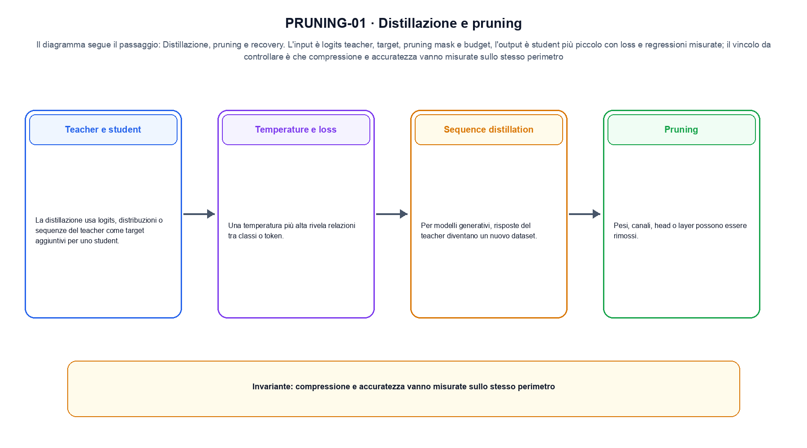
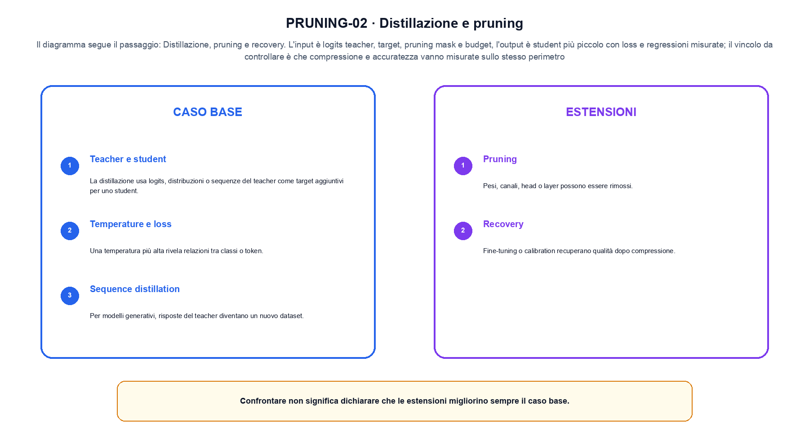

<!--
chapter_id: CH-P12-DISTILLATION-PRUNING
part_id: P12
order_key: 730
title: Distillazione e pruning
maturity: CORE
status: candidatura completa in revisione autoriale
version: 0.4.0-draft2
last_source_check: 3 agosto 2026
environment: Python 3.13.12, CPU
deferred: benchmark applicativi, varianti non necessarie al contratto centrale e approvazione autoriale
-->

# Capitolo 73. Distillazione e pruning

La richiesta «Il pacco non è arrivato» resta il caso guida. In questo capitolo la usiamo per distinguere pesi del teacher, student e struttura da comprimere, trasformazione e risultato, senza nascondere i dettagli tecnici.

## Teacher e student

La distillazione usa logits, distribuzioni o sequenze del teacher come target aggiuntivi per uno student. [SRC-73-001]

Il caso minimo di «Teacher e student» si presenta così: teacher e student hanno due vettori di logits differenti e una mask conserva una connessione. Non lo usiamo come decorazione: serve a rendere osservabile la frase «La distillazione usa logits, distribuzioni o sequenze del teacher come target aggiuntivi per uno student».

Per ricostruire «Teacher e student» annotiamo l'input «logits teacher, target, pruning mask e budget», poi l'operazione «distillazione, pruning e recovery», infine l'output «student più piccolo con loss e regressioni misurate». Questa sequenza impedisce di scambiare una forma compatibile per il comportamento descritto dalla fonte. Il controllo parte da «La distillazione usa logits, distribuzioni o sequenze del teacher come target aggiuntivi per uno student».

L'ottimizzazione modifica rappresentazione, memoria, calcolo o scheduling sotto un carico dichiarato. Per attribuire il beneficio bisogna separare il guadagno locale da latenza, qualità e costo end-to-end. Per «Teacher e student» il controllo cambia una sola premessa della frase «La distillazione usa logits, distribuzioni o sequenze del teacher come target aggiuntivi per uno student» e conserva input, output e criterio di successo, così la differenza resta attribuibile. La verifica resta ancorata a «La distillazione usa logits, distribuzioni o sequenze del teacher come target aggiuntivi per uno student». [SRC-73-001]

Il punto didattico di «Teacher e student» è separare ciò che la fonte afferma da ciò che il piccolo caso illustra. L'output «student più piccolo con loss e regressioni misurate» mostra il contratto locale, ma non sostituisce una misura sul sistema completo.

Il controllo minimo di «Teacher e student» confronta il caso dichiarato con una variazione che rompe la sua ipotesi. Se la failure non è distinguibile dall'esito valido, manca un'osservazione nel contratto di latency, memoria e throughput. Da «Teacher e student» portiamo l'output «student più piccolo con loss e regressioni misurate»; non portiamo invece una conclusione oltre il caso locale.

## Temperature e loss

Una temperatura più alta rivela relazioni tra classi o token. Hard target e soft target vengono pesati separatamente. [SRC-73-002]

Prima del nome tecnico fissiamo la situazione: consideriamo due logits trasferiti e una connessione potata con recovery. Da qui possiamo leggere la conseguenza dichiarata da «Una temperatura più alta rivela relazioni tra classi o token».

Nel contratto locale, l'input «logits teacher, target, pruning mask e budget» entra, l'operazione «distillazione, pruning e recovery» modifica il percorso e l'output «student più piccolo con loss e regressioni misurate» è ciò che osserviamo. Qui cambia soprattutto il passaggio «Temperature e loss»; resta da controllare che compressione e accuratezza vanno misurate sullo stesso perimetro. La domanda locale è «Una temperatura più alta rivela relazioni tra classi o token».

L'ottimizzazione modifica rappresentazione, memoria, calcolo o scheduling sotto un carico dichiarato. Per attribuire il beneficio bisogna separare il guadagno locale da latenza, qualità e costo end-to-end. Per «Temperature e loss» il controllo cambia una sola premessa della frase «Una temperatura più alta rivela relazioni tra classi o token» e conserva input, output e criterio di successo, così la differenza resta attribuibile. La verifica resta ancorata a «Una temperatura più alta rivela relazioni tra classi o token». [SRC-73-002]

La lettura va fatta in ordine: prima il caso, poi la trasformazione, quindi la conseguenza. Hard target e soft target vengono pesati separatamente. Il piccolo risultato resta un'illustrazione di «Una temperatura più alta rivela relazioni tra classi o token», non una promessa generale.

La prova di «Temperature e loss» conserva input, operazione e output; poi esplicita quale parte di «Una temperatura più alta rivela relazioni tra classi o token» non è stata misurata. Così il test separa l'evidenza dall'inferenza. Il passaggio successivo, «Sequence distillation», potrà cambiare una sola condizione, dichiarando il nuovo setup prima di interpretare il risultato.

## Sequence distillation

Per modelli generativi, risposte del teacher diventano un nuovo dataset. Filtri e diversità determinano ciò che lo student vede. [SRC-73-003]

Per capire «Sequence distillation» partiamo da questo caso: un modello teacher e uno student confrontati sullo stesso input, con memoria e regressioni riportate insieme alla loss. Il caso rende osservabile il punto centrale: «Per modelli generativi, risposte del teacher diventano un nuovo dataset».

La sezione usa l'input «logits teacher, target, pruning mask e budget» come punto di partenza e l'output «student più piccolo con loss e regressioni misurate» come traccia d'uscita. La trasformazione concreta è «distillazione, pruning e recovery»; il caso non è completo se non dichiariamo anche che compressione e accuratezza vanno misurate sullo stesso perimetro. La condizione da isolare è «Per modelli generativi, risposte del teacher diventano un nuovo dataset».

L'ottimizzazione modifica rappresentazione, memoria, calcolo o scheduling sotto un carico dichiarato. Per attribuire il beneficio bisogna separare il guadagno locale da latenza, qualità e costo end-to-end. Per «Sequence distillation» il controllo cambia una sola premessa della frase «Per modelli generativi, risposte del teacher diventano un nuovo dataset» e conserva input, output e criterio di successo, così la differenza resta attribuibile. La verifica resta ancorata a «Per modelli generativi, risposte del teacher diventano un nuovo dataset». [SRC-73-003]

Se cambiamo una premessa, dobbiamo riaprire l'interpretazione. Per «Sequence distillation» conserviamo l'osservazione collegata a «Per modelli generativi, risposte del teacher diventano un nuovo dataset» e lasciamo esplicitamente fuori ciò che non è stato misurato.

Per verificare «Sequence distillation» cambiamo una sola condizione vicina alla frase «Per modelli generativi, risposte del teacher diventano un nuovo dataset», teniamo fermo il resto e registriamo l'output «student più piccolo con loss e regressioni misurate». Il caso negativo deve rendere riconoscibile la failure, non soltanto produrre un numero diverso. La sezione successiva, «Pruning», riceve l'output «student più piccolo con loss e regressioni misurate» come base, ma dovrà formulare e verificare la propria distinzione.

La figura PRUNING-01 usa la famiglia pipeline. Il diagramma segue il passaggio: Distillazione, pruning e recovery. L'input è logits teacher, target, pruning mask e budget, l'output è student più piccolo con loss e regressioni misurate; il vincolo da controllare è che compressione e accuratezza vanno misurate sullo stesso perimetro.

## Pruning

Pesi, canali, head o layer possono essere rimossi. Sparsità nominale e accelerazione reale dipendono da kernel e hardware. [SRC-73-004]

Il caso minimo di «Pruning» si presenta così: un modello teacher e uno student confrontati sullo stesso input, con memoria e regressioni riportate insieme alla loss. Non lo usiamo come decorazione: serve a rendere osservabile la frase «Pesi, canali, head o layer possono essere rimossi».

Per ricostruire «Pruning» annotiamo l'input «logits teacher, target, pruning mask e budget», poi l'operazione «distillazione, pruning e recovery», infine l'output «student più piccolo con loss e regressioni misurate». Questa sequenza impedisce di scambiare una forma compatibile per il comportamento descritto dalla fonte. Il controllo parte da «Pesi, canali, head o layer possono essere rimossi».

L'ottimizzazione modifica rappresentazione, memoria, calcolo o scheduling sotto un carico dichiarato. Per attribuire il beneficio bisogna separare il guadagno locale da latenza, qualità e costo end-to-end. Per «Pruning» il controllo cambia una sola premessa della frase «Pesi, canali, head o layer possono essere rimossi» e conserva input, output e criterio di successo, così la differenza resta attribuibile. La verifica resta ancorata a «Pesi, canali, head o layer possono essere rimossi». [SRC-73-004]

Il punto didattico di «Pruning» è separare ciò che la fonte afferma da ciò che il piccolo caso illustra. L'output «student più piccolo con loss e regressioni misurate» mostra il contratto locale, ma non sostituisce una misura sul sistema completo.

Il controllo minimo di «Pruning» confronta il caso dichiarato con una variazione che rompe la sua ipotesi. Se la failure non è distinguibile dall'esito valido, manca un'osservazione nel contratto di latency, memoria e throughput. Da «Pruning» portiamo l'output «student più piccolo con loss e regressioni misurate»; non portiamo invece una conclusione oltre il caso locale.

## Recovery

Fine-tuning o calibration recuperano qualità dopo compressione. Il confronto deve includere memoria, latency e regressioni per slice. [SRC-73-001]

Prima del nome tecnico fissiamo la situazione: consideriamo una metrica del compito nuovo confrontata con la stessa metrica sul comportamento precedente. Da qui possiamo leggere la conseguenza dichiarata da «Fine-tuning o calibration recuperano qualità dopo compressione».

Nel contratto locale, l'input «logits teacher, target, pruning mask e budget» entra, l'operazione «distillazione, pruning e recovery» modifica il percorso e l'output «student più piccolo con loss e regressioni misurate» è ciò che osserviamo. Qui cambia soprattutto il passaggio «Recovery»; resta da controllare che compressione e accuratezza vanno misurate sullo stesso perimetro. La domanda locale è «Fine-tuning o calibration recuperano qualità dopo compressione».

L'ottimizzazione modifica rappresentazione, memoria, calcolo o scheduling sotto un carico dichiarato. Per attribuire il beneficio bisogna separare il guadagno locale da latenza, qualità e costo end-to-end. Il test deve conservare una misura del comportamento precedente prima e dopo l'aggiornamento, non soltanto il punteggio sul compito nuovo. La verifica resta ancorata a «Fine-tuning o calibration recuperano qualità dopo compressione». [SRC-73-001]

La lettura va fatta in ordine: prima il caso, poi la trasformazione, quindi la conseguenza. Il confronto deve includere memoria, latency e regressioni per slice. Il piccolo risultato resta un'illustrazione di «Fine-tuning o calibration recuperano qualità dopo compressione», non una promessa generale.

La prova di «Recovery» conserva input, operazione e output; poi esplicita quale parte di «Fine-tuning o calibration recuperano qualità dopo compressione» non è stata misurata. Così il test separa l'evidenza dall'inferenza. Il caso finale consegna l'output «student più piccolo con loss e regressioni misurate» come evidenza locale e conserva la misura end-to-end sotto carico dichiarato come domanda aperta.

## Un caso dall'input all'output: Teacher e student

Il caso intero parte dall'input «logits teacher, target, pruning mask e budget», applica l'operazione «distillazione, pruning e recovery» e osserva l'output «student più piccolo con loss e regressioni misurate». Un esempio controllato: due logits trasferiti e una connessione potata con recovery. La formula locale è:

$$
L_student = distill(L_teacher) + lambda R
$$

Compressione e accuratezza vanno misurate nello stesso perimetro. [SRC-73-001]

La figura PRUNING-02 cambia composizione rispetto alla prima. Il diagramma segue il passaggio: Distillazione, pruning e recovery. L'input è logits teacher, target, pruning mask e budget, l'output è student più piccolo con loss e regressioni misurate; il vincolo da controllare è che compressione e accuratezza vanno misurate sullo stesso perimetro.

## Dal meccanismo alla prova locale: Temperature e loss

Lo snippet locale mette in esecuzione questo caso: due logits trasferiti e una connessione potata con recovery. Il test associato controlla determinismo, output e invariante e rifiuta una shape o condizione incoerente; il risultato è conservato in `code/outputs/SNIP-73-001.txt`, come evidenza locale e non come benchmark di produzione.

## Dove il risultato si ferma: Recovery

Il caso di «Distillazione e pruning» non certifica un servizio completo. Compressione e accuratezza vanno misurate sullo stesso perimetro. La domanda successiva è se «Fine-tuning o calibration recuperano qualità dopo compressione» regga quando cambiano dati, scala, hardware o criteri di decisione.

## Che cosa portiamo avanti: Distillazione e pruning

Il filo della lezione va dall'input «logits teacher, target, pruning mask e budget» all'output «student più piccolo con loss e regressioni misurate». Nei passaggi «Teacher e student», «Temperature e loss», «Recovery» abbiamo usato esempi e controlli negativi per rendere il contratto controllabile e delimitare la conclusione. L'invariante da portare avanti è: compressione e accuratezza vanno misurate sullo stesso perimetro. Il Capitolo 74, Quantizzazione, può partire da questo output e dichiarare la propria domanda.

### Verifica di comprensione: Teacher e student

1. Ricostruisci l'oggetto continuo a partire da «Teacher e student» e indica quale parte della frase «La distillazione usa logits, distribuzioni o sequenze del teacher come target aggiuntivi per uno student» entra nel caso.
2. Spiega quale trasformazione collega «Teacher e student» a «Recovery» e quale output osserviamo nel passaggio.
3. Usa lo snippet per controllare l'invariante del contratto: compressione e accuratezza vanno misurate sullo stesso perimetro.
4. Separa una definizione sostenuta da una fonte, un esempio illustrativo e un risultato locale del caso guida.
5. Indica quale parte della frase «Fine-tuning o calibration recuperano qualità dopo compressione» richiederebbe una misura nuova prima di essere estesa oltre il caso osservato.

### Esercizi di trasferimento: Recovery

1. Racconta «Teacher e student» come una trasformazione: che cosa entra e che cosa esce?
2. Confronta due esecuzioni di «Temperature e loss» mantenendo il resto del setup invariato.
3. Per «Sequence distillation», separa l'esempio locale dal limite che impedisce di generalizzarlo.
4. Progetta una prova per «Pruning» che renda visibile il suo confine.
5. Scrivi una metrica o una domanda per valutare «Recovery» senza confondere livelli diversi.

## Fonti, codice e materiali: Distillazione e pruning

Per ricontrollare «Distillazione e pruning», partire da `FONTI_PRIMARIE.md` e poi dal codice: la domanda aperta è come trasferire la misura end-to-end sotto carico dichiarato oltre il caso locale, con la data di consultazione dichiarata. `CLAIMS.md` separa definizioni e risultati locali; codice, ambiente, test e output sono nella cartella `code/`, con attenzione a latency, memoria e throughput.
