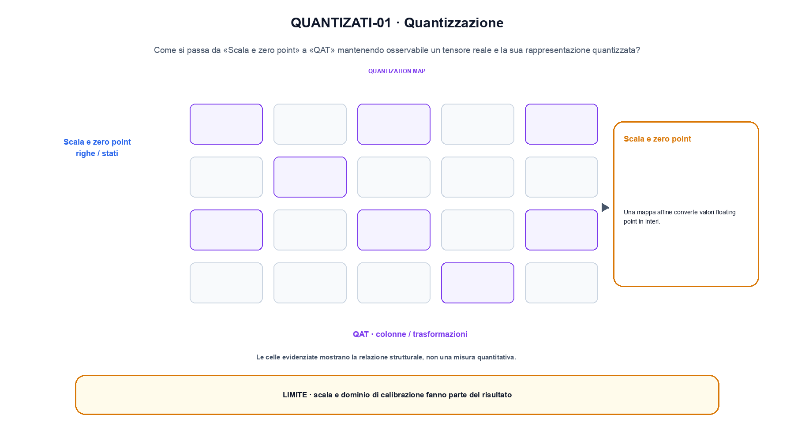
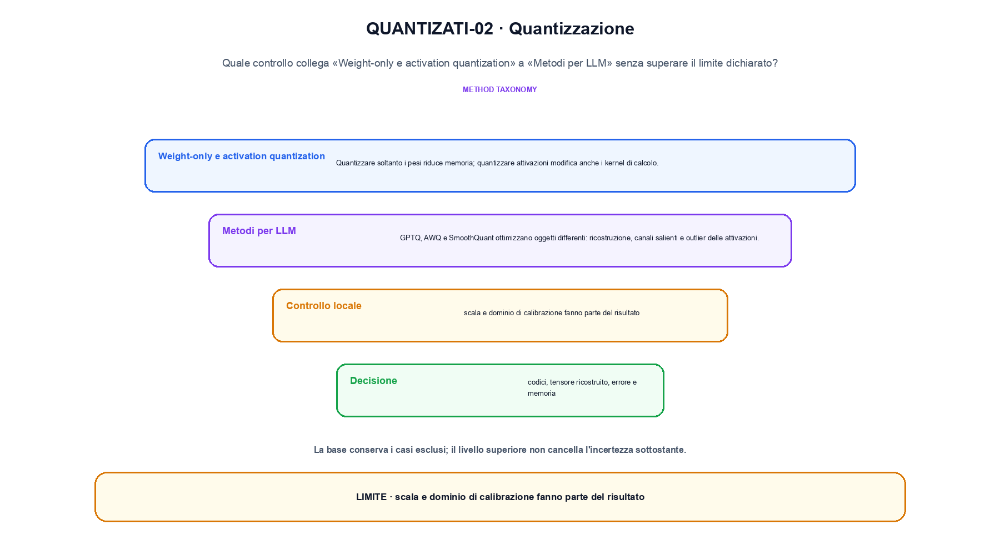

<!--
chapter_id: CH-P12-QUANTIZATION
part_id: P12
order_key: 740
title: Quantizzazione
maturity: CORE
status: revisione editoriale v2, approvazione autoriale aperta
version: 0.5.0-draft3
last_source_check: 4 agosto 2026
environment: Python 3.13.12, CPU
code_policy: reference
deferred: benchmark applicativi non eseguiti e approvazione autoriale delle visuali
-->

# Capitolo 74. Quantizzazione

La lezione prende un caso piccolo e lo accompagna da «Scala e zero point» fino a «Metodi per LLM», senza saltare i passaggi. L'oggetto osservato è un tensore reale e la sua rappresentazione quantizzata. Il contratto locale dichiara input, valori, scale, zero-point, dtype e calibrazione; operazione, PTQ, QAT, weight-only o activation quantization; output, codici, tensore ricostruito, errore e memoria. Il caso di partenza è Tre valori con scala 0,25 vengono quantizzati e ricostruiti con errore massimo misurato. Il limite da non nascondere è: scala e dominio di calibrazione fanno parte del risultato.

## Scala e zero point

Una mappa affine converte valori floating point in interi. La granularità per tensor o per channel cambia scale, errore e metadati. [SRC-74-001]

Scale, zero-point e intervallo intero definiscono insieme quantizzazione e ricostruzione.

**Caso da seguire.** Tre valori con scala 0,25 vengono quantizzati e ricostruiti con errore massimo misurato.

**Controllo.** Per «Scala e zero point», scrivi il risultato atteso prima del calcolo, modifica una sola quantità e localizza il primo passaggio che cambia. Nel caso «Scala e zero point», il vincolo da conservare è: La granularità per tensor o per channel cambia scale, errore e metadati.


## PTQ

Post-training quantization usa calibration senza riaddestrare completamente. La rappresentatività dei dati di calibration è essenziale. [SRC-74-002]

**Caso da seguire.** Tre valori quantizzati con scala 0,25 e errore massimo.

**Controllo.** Per «PTQ», ricalcola il caso a mano e con lo snippet. Nel caso «PTQ», se i risultati divergono, confronta prima i valori intermedi e soltanto dopo l'output finale.


La relazione centrale può essere scritta come:

$$
q = clamp(round(x / s) + z); \hat{x} = s(q - z)
$$

Scale, zero-point e intervallo intero definiscono insieme quantizzazione e ricostruzione. [SRC-74-001]




La prima figura segue il percorso da «Scala e zero point» a «QAT».


## QAT

Quantization-aware training simula arrotondamento e clipping durante il training per adattare i pesi. [SRC-74-001]

**Caso da seguire.** Un caso in cui scala e dominio di calibrazione fanno parte del risultato.

**Controllo.** Per «QAT», aggiungi un valore limite e verifica separatamente forma, valore e ipotesi. Una shape valida non dimostra da sola «QAT».


## Weight-only e activation quantization

Quantizzare soltanto i pesi riduce memoria; quantizzare attivazioni modifica anche i kernel di calcolo. [SRC-74-003; SRC-74-002]

**Caso da seguire.** Tre valori floating point quantizzati con una scala dichiarata e confrontati con la ricostruzione.

**Controllo.** Per «Weight-only e activation quantization», mantieni fisso l'input e sostituisci soltanto il meccanismo discusso nella sezione. Nel caso «Weight-only e activation quantization», il confronto deve attribuire la differenza a quel passaggio, non al setup.


## Esempio Python eseguito

Questa sezione apre il contratto Python di quantizzazione: il lettore può eseguire lo stesso file e confrontare il risultato. Per «Quantizzazione», il caso di default usa valori piccoli per isolare il meccanismo. Il caso non supportato viene provato separatamente, così «quantizzazione» non viene generalizzato oltre l'esempio.

```python
def contract(case: str = "default"):
    if case != "default":
        raise ValueError("only the documented default case is supported")
    values = [-0.5, 0.0, 0.5]
    scale = 0.25
    quantized = [round(value / scale) for value in values]
    restored = [code * scale for code in quantized]
    error = max(abs(value - recovered) for value, recovered in zip(values, restored))
    return {"quantized": quantized, "restored": restored, "max_error": error, "invariant": "scale and calibration determine quantization error"}
```

Esecuzione con `python snip_74_contract.py`:

```text
{"invariant": "scale and calibration determine quantization error", "max_error": 0.0, "quantized": [-2, 0, 2], "restored": [-0.5, 0.0, 0.5]}
```

Il test associato è [`code/test_74_contract.py`](code/test_74_contract.py); l'output versionato è [`code/outputs/SNIP-74-001.txt`](code/outputs/SNIP-74-001.txt).


## Metodi per LLM

GPTQ, AWQ e SmoothQuant ottimizzano oggetti differenti: ricostruzione, canali salienti e outlier delle attivazioni. I loro contratti non sono intercambiabili. [SRC-74-004; SRC-74-003; SRC-74-002]

**Caso da seguire.** Ridurre i byte per elemento cambia memoria e potenzialmente errore. Il controllo richiede confronto numerico oltre alla misura di tempo.

**Controllo.** Per «Metodi per LLM», costruisci un controesempio che rispetti il tipo di dato ma violi l'ipotesi centrale. Il test deve rendere riconoscibile perché «Metodi per LLM» non si applica.




La seconda figura mette a confronto «Weight-only e activation quantization» e il limite discusso in «Metodi per LLM».


## Come si collegano i passaggi

- **Da «Scala e zero point» a «PTQ».** Una mappa affine converte valori floating point in interi. Post-training quantization usa calibration senza riaddestrare completamente. Tra «Scala e zero point» e «PTQ» l'ingresso viene fissato prima della regola che produce il valore. Il passaggio successivo rende misurabile «PTQ». [SRC-74-001; SRC-74-002]

- **Da «PTQ» a «QAT».** Post-training quantization usa calibration senza riaddestrare completamente. Quantization-aware training simula arrotondamento e clipping durante il training per adattare i pesi. Nel caso «QAT» il componente diventa il punto in cui localizzare l'errore. Da «PTQ» a «QAT» cambia la domanda osservabile. [SRC-74-002; SRC-74-001]

- **Da «QAT» a «Weight-only e activation quantization».** Quantization-aware training simula arrotondamento e clipping durante il training per adattare i pesi. Quantizzare soltanto i pesi riduce memoria; quantizzare attivazioni modifica anche i kernel di calcolo. Dopo «QAT», la variante di «Weight-only e activation quantization» cambia una proprietà alla volta. Il passaggio successivo rende misurabile «Weight-only e activation quantization». [SRC-74-001; SRC-74-003; SRC-74-002]

- **Da «Weight-only e activation quantization» a «Metodi per LLM».** Quantizzare soltanto i pesi riduce memoria; quantizzare attivazioni modifica anche i kernel di calcolo. GPTQ, AWQ e SmoothQuant ottimizzano oggetti differenti: ricostruzione, canali salienti e outlier delle attivazioni. Da «Metodi per LLM» in poi la misura resta distinta dalla correttezza locale del calcolo. Da «Weight-only e activation quantization» a «Metodi per LLM» cambia la domanda osservabile. [SRC-74-003; SRC-74-002; SRC-74-004; SRC-74-003; SRC-74-002]

La catena completa produce codici, tensore ricostruito, errore e memoria a partire da valori, scale, zero-point, dtype e calibrazione. Ogni collegamento conserva un oggetto osservabile diverso; per questo il risultato non può essere esteso oltre il limite dichiarato: scala e dominio di calibrazione fanno parte del risultato.


## Esercizi sul meccanismo

1. Ricostruisci «Scala e zero point» con un esempio diverso da quello mostrato e indica l'output atteso prima del calcolo.
2. Nel passaggio «PTQ», cambia una sola ipotesi e spiega quale risultato non è più confrontabile.
3. Collega «QAT» a una riga dello snippet oppure motiva perché la prova deve essere documentale.
4. Progetta un caso limite per «Weight-only e activation quantization» che produca una failure riconoscibile.
5. Per «Metodi per LLM», separa una conclusione sostenuta dal caso locale da una che richiederebbe nuovi dati o un benchmark.


## Che cosa deve restare chiaro

La lezione parte da «valori, scale, zero-point, dtype e calibrazione» e arriva fino a «codici, tensore ricostruito, errore e memoria». Il limite da conservare è questo: scala e dominio di calibrazione fanno parte del risultato. La formula e il codice collegati a «Metodi per LLM» sono rintracciabili in [`FONTI_PRIMARIE.md`](FONTI_PRIMARIE.md), [`CLAIMS.md`](CLAIMS.md) e `code/`.
