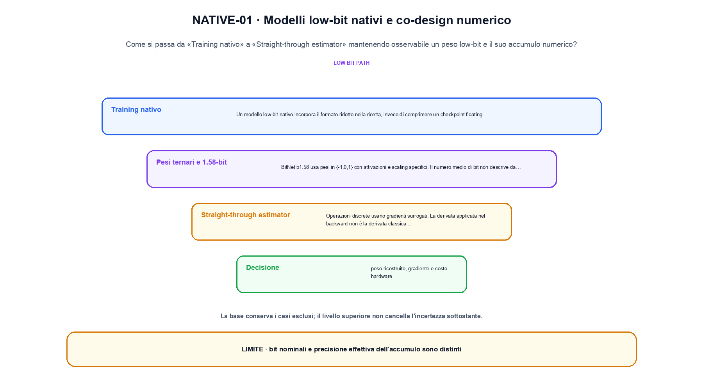
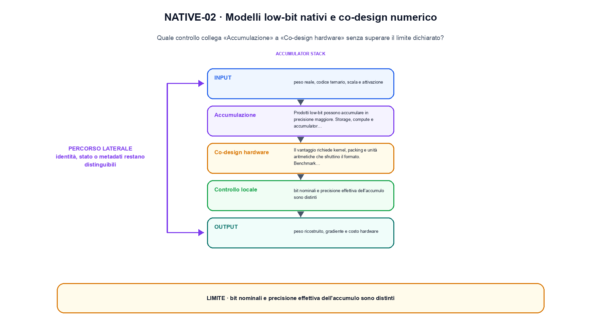

<!--
chapter_id: CH-P12-LOW-BIT-NATIVE
part_id: P12
order_key: 750
title: Modelli low-bit nativi e co-design numerico
maturity: FRONTIER
status: revisione editoriale v2, approvazione autoriale aperta
version: 0.5.0-draft3
last_source_check: 4 agosto 2026
environment: Python 3.13.12, CPU
code_policy: reference
deferred: benchmark applicativi non eseguiti e approvazione autoriale delle visuali
-->

# Capitolo 75. Modelli low-bit nativi e co-design numerico

La domanda guida di questa lezione è come collegare «Training nativo» e «Co-design hardware» senza perdere il contratto tecnico di modelli low-bit nativi e co-design numerico. L'oggetto osservato è un peso low-bit e il suo accumulo numerico. Il contratto locale è: input, peso reale, codice ternario, scala e attivazione; operazione, training nativo, STE e accumulazione; output, peso ricostruito, gradiente e costo hardware. Il caso guida è questo: I codici -1, 0 e 1 vengono ricostruiti con una scala e sommati nella precisione dichiarata. Il confine da mantenere esplicito è: bit nominali e precisione effettiva dell'accumulo sono distinti.

## Training nativo

Un modello low-bit nativo incorpora il formato ridotto nella ricetta, invece di comprimere un checkpoint floating point al termine. [SRC-75-001]

Un formato low-bit introduce rappresentazione e operazione di ricostruzione.

**Caso da seguire.** I codici -1, 0 e 1 vengono ricostruiti con una scala e sommati nella precisione dichiarata.

**Controllo.** Scrivi il risultato atteso prima del calcolo, modifica una sola quantità e localizza il primo passaggio che cambia. Il vincolo da conservare è: Un modello low-bit nativo incorpora il formato ridotto nella ricetta, invece di comprimere un checkpoint floating point al termine.


## Pesi ternari e 1.58-bit

BitNet b1.58 usa pesi in {-1,0,1} con attivazioni e scaling specifici. Il numero medio di bit non descrive da solo il kernel. [SRC-75-002]

**Caso da seguire.** Tre valori floating point quantizzati con una scala dichiarata e confrontati con la ricostruzione.

**Controllo.** Ricalcola il caso a mano e con lo snippet. Se i risultati divergono, confronta prima i valori intermedi e soltanto dopo l'output finale.


La relazione centrale può essere scritta come:

$$
w_hat = dequantize(codebook(index(w)))
$$

Un formato low-bit introduce rappresentazione e operazione di ricostruzione. [SRC-75-001]




La prima figura segue il percorso da «Training nativo» a «Straight-through estimator».


## Straight-through estimator

Operazioni discrete usano gradienti surrogati. La derivata applicata nel backward non è la derivata classica della quantizzazione. [SRC-75-003]

**Caso da seguire.** Un caso in cui bit nominali e precisione effettiva dell'accumulo sono distinti.

**Controllo.** Aggiungi un valore limite e verifica separatamente forma, valore e ipotesi. Una shape valida non dimostra da sola «Straight-through estimator».


## Accumulazione

Prodotti low-bit possono accumulare in precisione maggiore. Storage, compute e accumulator dtype devono essere separati. [SRC-75-004]

**Caso da seguire.** Ridurre i byte per elemento cambia memoria e potenzialmente errore. Il controllo richiede confronto numerico oltre alla misura di tempo.

**Controllo.** Mantieni fisso l'input e sostituisci soltanto il meccanismo discusso nella sezione. Il confronto deve attribuire la differenza a quel passaggio, non al setup.


## Esempio Python eseguito

Il frammento seguente è lo stesso conservato nel repository. Usa valori piccoli perché l'obiettivo è osservare il meccanismo, non simulare una scala che non abbiamo eseguito.

```python
def contract():
    codes = [-1, 0, 1]
    scale = 0.5
    restored = [code * scale for code in codes]
    accumulated = sum(restored)
    return {"restored": restored, "accumulated": accumulated, "invariant": "nominal bit width is distinct from accumulation precision"}
```

Esecuzione con `python snip_75_contract.py`:

```text
{"accumulated": 0.0, "invariant": "nominal bit width is distinct from accumulation precision", "restored": [-0.5, 0.0, 0.5]}
```

Il test associato è [`code/test_75_contract.py`](code/test_75_contract.py); l'output versionato è [`code/outputs/SNIP-75-001.txt`](code/outputs/SNIP-75-001.txt).


## Co-design hardware

Il vantaggio richiede kernel, packing e unità aritmetiche che sfruttino il formato. Benchmark su hardware non ottimizzato possono nasconderlo. [SRC-75-001]

**Caso da seguire.** La stessa operazione misurata separando bytes mossi, tempo del kernel e latenza end-to-end.

**Controllo.** Costruisci un controesempio che rispetti il tipo di dato ma violi l'ipotesi centrale. Il test deve rendere riconoscibile perché «Co-design hardware» non si applica.




La seconda figura mette a confronto «Accumulazione» e il limite discusso in «Co-design hardware».


## Come si collegano i passaggi

- **Da «Training nativo» a «Pesi ternari e 1.58-bit».** Un modello low-bit nativo incorpora il formato ridotto nella ricetta, invece di comprimere un checkpoint floating point al termine. BitNet b1.58 usa pesi in {-1,0,1} con attivazioni e scaling specifici. Il primo passaggio definisce che cosa entra nel calcolo; il secondo stabilisce la regola che produce il valore osservabile. [SRC-75-001; SRC-75-002]

- **Da «Pesi ternari e 1.58-bit» a «Straight-through estimator».** BitNet b1.58 usa pesi in {-1,0,1} con attivazioni e scaling specifici. Operazioni discrete usano gradienti surrogati. La regola generale viene poi letta dentro il componente: questa separazione permette di localizzare un errore prima di attribuirlo all'intero modello. [SRC-75-002; SRC-75-003]

- **Da «Straight-through estimator» a «Accumulazione».** Operazioni discrete usano gradienti surrogati. Prodotti low-bit possono accumulare in precisione maggiore. Dopo avere reso visibile il componente, il percorso introduce la variante o l'ottimizzazione senza cambiare di nascosto il caso di partenza. [SRC-75-003; SRC-75-004]

- **Da «Accumulazione» a «Co-design hardware».** Prodotti low-bit possono accumulare in precisione maggiore. Il vantaggio richiede kernel, packing e unità aritmetiche che sfruttino il formato. L'ultimo passaggio sposta l'attenzione dal funzionamento locale alla misura: correttezza del calcolo e qualità applicativa restano domande distinte. [SRC-75-004; SRC-75-001]

La catena completa produce peso ricostruito, gradiente e costo hardware a partire da peso reale, codice ternario, scala e attivazione. Ogni collegamento conserva un oggetto osservabile diverso; per questo il risultato non può essere esteso oltre il limite dichiarato: bit nominali e precisione effettiva dell'accumulo sono distinti.


## Esercizi sul meccanismo

1. Ricostruisci «Training nativo» con un esempio diverso da quello mostrato e indica l'output atteso prima del calcolo.
2. Nel passaggio «Pesi ternari e 1.58-bit», cambia una sola ipotesi e spiega quale risultato non è più confrontabile.
3. Collega «Straight-through estimator» a una riga dello snippet oppure motiva perché la prova deve essere documentale.
4. Progetta un caso limite per «Accumulazione» che produca una failure riconoscibile.
5. Per «Co-design hardware», separa una conclusione sostenuta dal caso locale da una che richiederebbe nuovi dati o un benchmark.


## Che cosa deve restare chiaro

La lezione parte da «peso reale, codice ternario, scala e attivazione» e arriva fino a «peso ricostruito, gradiente e costo hardware». Il limite da conservare è questo: bit nominali e precisione effettiva dell'accumulo sono distinti. Definizioni e risultati citati sono rintracciabili in [`FONTI_PRIMARIE.md`](FONTI_PRIMARIE.md); la mappa dei claim è in [`CLAIMS.md`](CLAIMS.md).
