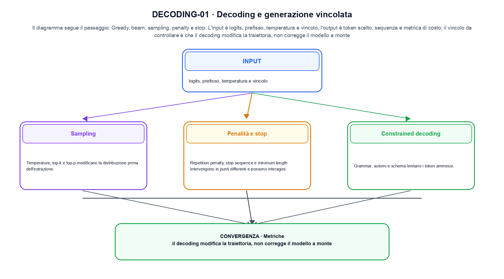
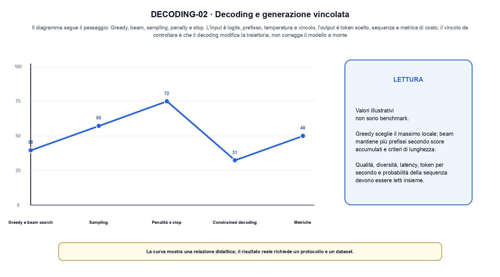

<!--
chapter_id: CH-P12-DECODING
part_id: P12
order_key: 760
title: Decoding e generazione vincolata
maturity: CORE
status: candidatura completa in revisione autoriale
version: 0.4.0-draft2
last_source_check: 3 agosto 2026
environment: Python 3.13.12, CPU
deferred: benchmark applicativi, varianti non necessarie al contratto centrale e approvazione autoriale
-->

# Capitolo 76. Decoding e generazione vincolata

Finora abbiamo potuto descrivere logits e spazio delle sequenze ammissibili. La richiesta «Il pacco non è arrivato» resta lo scenario condiviso: nel Capitolo 76 prendiamo l'input «logits, prefisso, temperatura e vincolo» e lo seguiamo fino all'output «token scelto, sequenza e metrica di costo», dichiarando prima il contratto e poi il limite.

## Greedy e beam search

Greedy sceglie il massimo locale; beam mantiene più prefissi secondo score accumulati e criteri di lunghezza. [SRC-76-001]

Il caso minimo di «Greedy e beam search» si presenta così: lo stesso vettore di logits produce un token greedy e un supporto di sampling espliciti. Non lo usiamo come decorazione: serve a rendere osservabile la frase «Greedy sceglie il massimo locale; beam mantiene più prefissi secondo score accumulati e criteri di lunghezza».

Per ricostruire «Greedy e beam search» annotiamo l'input «logits, prefisso, temperatura e vincolo», poi l'operazione «greedy, beam, sampling, penalty e stop», infine l'output «token scelto, sequenza e metrica di costo». Questa sequenza impedisce di scambiare una forma compatibile per il comportamento descritto dalla fonte. Il controllo parte da «Greedy sceglie il massimo locale; beam mantiene più prefissi secondo score accumulati e criteri di lunghezza».

L'ottimizzazione modifica rappresentazione, memoria, calcolo o scheduling sotto un carico dichiarato. Per attribuire il beneficio bisogna separare il guadagno locale da latenza, qualità e costo end-to-end. Per «Greedy e beam search» il controllo cambia una sola premessa della frase «Greedy sceglie il massimo locale; beam mantiene più prefissi secondo score accumulati e criteri di lunghezza» e conserva input, output e criterio di successo, così la differenza resta attribuibile. La verifica resta ancorata a «Greedy sceglie il massimo locale; beam mantiene più prefissi secondo score accumulati e criteri di lunghezza». [SRC-76-001]

Il punto didattico di «Greedy e beam search» è separare ciò che la fonte afferma da ciò che il piccolo caso illustra. L'output «token scelto, sequenza e metrica di costo» mostra il contratto locale, ma non sostituisce una misura sul sistema completo.

Il controllo minimo di «Greedy e beam search» confronta il caso dichiarato con una variazione che rompe la sua ipotesi. Se la failure non è distinguibile dall'esito valido, manca un'osservazione nel contratto di latency, memoria e throughput. Da «Greedy e beam search» portiamo l'output «token scelto, sequenza e metrica di costo»; non portiamo invece una conclusione oltre il caso locale.

## Sampling

Temperature, top-k e top-p modificano la distribuzione prima dell'estrazione. Seed e backend influenzano la riproducibilità. [SRC-76-002]

Prima del nome tecnico fissiamo la situazione: consideriamo un prefisso corretto confrontato con lo stesso prefisso dopo che il modello ha prodotto il token precedente. Da qui possiamo leggere la conseguenza dichiarata da «Temperature, top-k e top-p modificano la distribuzione prima dell'estrazione».

Nel contratto locale, l'input «logits, prefisso, temperatura e vincolo» entra, l'operazione «greedy, beam, sampling, penalty e stop» modifica il percorso e l'output «token scelto, sequenza e metrica di costo» è ciò che osserviamo. Qui cambia soprattutto il passaggio «Sampling»; resta da controllare che il decoding modifica la traiettoria, non corregge il modello a monte. La domanda locale è «Temperature, top-k e top-p modificano la distribuzione prima dell'estrazione».

L'ottimizzazione modifica rappresentazione, memoria, calcolo o scheduling sotto un carico dichiarato. Per attribuire il beneficio bisogna separare il guadagno locale da latenza, qualità e costo end-to-end. Il confronto utile mette accanto il prefisso corretto e quello prodotto dal modello, così il segnale disponibile al training non viene confuso con l'inference. La verifica resta ancorata a «Temperature, top-k e top-p modificano la distribuzione prima dell'estrazione». [SRC-76-002]

La lettura va fatta in ordine: prima il caso, poi la trasformazione, quindi la conseguenza. Seed e backend influenzano la riproducibilità. Il piccolo risultato resta un'illustrazione di «Temperature, top-k e top-p modificano la distribuzione prima dell'estrazione», non una promessa generale.

La prova di «Sampling» conserva input, operazione e output; poi esplicita quale parte di «Temperature, top-k e top-p modificano la distribuzione prima dell'estrazione» non è stata misurata. Così il test separa l'evidenza dall'inferenza. Il passaggio successivo, «Penalità e stop», potrà cambiare una sola condizione, dichiarando il nuovo setup prima di interpretare il risultato.

## Penalità e stop

Repetition penalty, stop sequence e minimum length intervengono in punti differenti e possono interagire. [SRC-76-003]

Per capire «Penalità e stop» partiamo da questo caso: un caso in cui il decoding modifica la traiettoria, non corregge il modello a monte. Il caso rende osservabile il punto centrale: «Repetition penalty, stop sequence e minimum length intervengono in punti differenti e possono interagire».

La sezione usa l'input «logits, prefisso, temperatura e vincolo» come punto di partenza e l'output «token scelto, sequenza e metrica di costo» come traccia d'uscita. La trasformazione concreta è «greedy, beam, sampling, penalty e stop»; il caso non è completo se non dichiariamo anche che il decoding modifica la traiettoria, non corregge il modello a monte. La condizione da isolare è «Repetition penalty, stop sequence e minimum length intervengono in punti differenti e possono interagire».

L'ottimizzazione modifica rappresentazione, memoria, calcolo o scheduling sotto un carico dichiarato. Per attribuire il beneficio bisogna separare il guadagno locale da latenza, qualità e costo end-to-end. Per «Penalità e stop» il controllo cambia una sola premessa della frase «Repetition penalty, stop sequence e minimum length intervengono in punti differenti e possono interagire» e conserva input, output e criterio di successo, così la differenza resta attribuibile. La verifica resta ancorata a «Repetition penalty, stop sequence e minimum length intervengono in punti differenti e possono interagire». [SRC-76-003]

Se cambiamo una premessa, dobbiamo riaprire l'interpretazione. Per «Penalità e stop» conserviamo l'osservazione collegata a «Repetition penalty, stop sequence e minimum length intervengono in punti differenti e possono interagire» e lasciamo esplicitamente fuori ciò che non è stato misurato.

Per verificare «Penalità e stop» cambiamo una sola condizione vicina alla frase «Repetition penalty, stop sequence e minimum length intervengono in punti differenti e possono interagire», teniamo fermo il resto e registriamo l'output «token scelto, sequenza e metrica di costo». Il caso negativo deve rendere riconoscibile la failure, non soltanto produrre un numero diverso. La sezione successiva, «Constrained decoding», riceve l'output «token scelto, sequenza e metrica di costo» come base, ma dovrà formulare e verificare la propria distinzione.

La figura DECODING-01 usa la famiglia branch. Il diagramma segue il passaggio: Greedy, beam, sampling, penalty e stop. L'input è logits, prefisso, temperatura e vincolo, l'output è token scelto, sequenza e metrica di costo; il vincolo da controllare è che il decoding modifica la traiettoria, non corregge il modello a monte.

## Constrained decoding

Grammar, automi e schema limitano i token ammessi. Validità strutturale non garantisce argomenti corretti. [SRC-76-004]

Il caso minimo di «Constrained decoding» si presenta così: un prefisso corretto confrontato con lo stesso prefisso dopo che il modello ha prodotto il token precedente. Non lo usiamo come decorazione: serve a rendere osservabile la frase «Grammar, automi e schema limitano i token ammessi».

Per ricostruire «Constrained decoding» annotiamo l'input «logits, prefisso, temperatura e vincolo», poi l'operazione «greedy, beam, sampling, penalty e stop», infine l'output «token scelto, sequenza e metrica di costo». Questa sequenza impedisce di scambiare una forma compatibile per il comportamento descritto dalla fonte. Il controllo parte da «Grammar, automi e schema limitano i token ammessi».

L'ottimizzazione modifica rappresentazione, memoria, calcolo o scheduling sotto un carico dichiarato. Per attribuire il beneficio bisogna separare il guadagno locale da latenza, qualità e costo end-to-end. Il confronto utile mette accanto il prefisso corretto e quello prodotto dal modello, così il segnale disponibile al training non viene confuso con l'inference. La verifica resta ancorata a «Grammar, automi e schema limitano i token ammessi». [SRC-76-004]

Il punto didattico di «Constrained decoding» è separare ciò che la fonte afferma da ciò che il piccolo caso illustra. L'output «token scelto, sequenza e metrica di costo» mostra il contratto locale, ma non sostituisce una misura sul sistema completo.

Il controllo minimo di «Constrained decoding» confronta il caso dichiarato con una variazione che rompe la sua ipotesi. Se la failure non è distinguibile dall'esito valido, manca un'osservazione nel contratto di latency, memoria e throughput. Da «Constrained decoding» portiamo l'output «token scelto, sequenza e metrica di costo»; non portiamo invece una conclusione oltre il caso locale.

## Metriche

Qualità, diversità, latency, token per secondo e probabilità della sequenza devono essere letti insieme. [SRC-76-001]

Prima del nome tecnico fissiamo la situazione: consideriamo quattro casi con protocollo, una failure e una slice conservati insieme al valore aggregato. Da qui possiamo leggere la conseguenza dichiarata da «Qualità, diversità, latency, token per secondo e probabilità della sequenza devono essere letti insieme».

Nel contratto locale, l'input «logits, prefisso, temperatura e vincolo» entra, l'operazione «greedy, beam, sampling, penalty e stop» modifica il percorso e l'output «token scelto, sequenza e metrica di costo» è ciò che osserviamo. Qui cambia soprattutto il passaggio «Metriche»; resta da controllare che il decoding modifica la traiettoria, non corregge il modello a monte. La domanda locale è «Qualità, diversità, latency, token per secondo e probabilità della sequenza devono essere letti insieme».

L'ottimizzazione modifica rappresentazione, memoria, calcolo o scheduling sotto un carico dichiarato. Per attribuire il beneficio bisogna separare il guadagno locale da latenza, qualità e costo end-to-end. La misura va letta insieme a popolazione, slice e failure: cambiare il report senza cambiare il protocollo non crea nuova evidenza. La verifica resta ancorata a «Qualità, diversità, latency, token per secondo e probabilità della sequenza devono essere letti insieme». [SRC-76-001]

La lettura va fatta in ordine: prima il caso, poi la trasformazione, quindi la conseguenza. Il piccolo risultato resta un'illustrazione di «Qualità, diversità, latency, token per secondo e probabilità della sequenza devono essere letti insieme», non una promessa generale.

La prova di «Metriche» conserva input, operazione e output; poi esplicita quale parte di «Qualità, diversità, latency, token per secondo e probabilità della sequenza devono essere letti insieme» non è stata misurata. Così il test separa l'evidenza dall'inferenza. Il caso finale consegna l'output «token scelto, sequenza e metrica di costo» come evidenza locale e conserva la misura end-to-end sotto carico dichiarato come domanda aperta.

## Un esempio con controllo negativo: Greedy e beam search

Il caso intero parte dall'input «logits, prefisso, temperatura e vincolo», applica l'operazione «greedy, beam, sampling, penalty e stop» e osserva l'output «token scelto, sequenza e metrica di costo». Un esempio controllato: greedy e top-p sullo stesso vettore di logits. Lo schema compatto è:

$$
y = decode(logits, constraint)
$$

È una notazione di interfaccia, non un'identità numerica completa. Vincoli di decoding cambiano lo spazio delle sequenze ammissibili. [SRC-76-001]

La figura DECODING-02 cambia composizione rispetto alla prima. Il diagramma segue il passaggio: Greedy, beam, sampling, penalty e stop. L'input è logits, prefisso, temperatura e vincolo, l'output è token scelto, sequenza e metrica di costo; il vincolo da controllare è che il decoding modifica la traiettoria, non corregge il modello a monte.

## Dalla formula al run: Sampling

Lo snippet locale mette in esecuzione questo caso: greedy e top-p sullo stesso vettore di logits. Il test associato controlla determinismo, output e invariante e rifiuta una shape o condizione incoerente; il risultato è conservato in `code/outputs/SNIP-76-001.txt`, come evidenza locale e non come benchmark di produzione.

## Limiti, varianti e nuove misure: Metriche

Il caso di «Decoding e generazione vincolata» non certifica un servizio completo. Il decoding modifica la traiettoria, non corregge il modello a monte. La domanda successiva è se «Qualità, diversità, latency, token per secondo e probabilità della sequenza devono essere letti insieme» regga quando cambiano dati, scala, hardware o criteri di decisione.

## L'invariante da conservare: Decoding e generazione vincolata

Il filo della lezione va dall'input «logits, prefisso, temperatura e vincolo» all'output «token scelto, sequenza e metrica di costo». Nei passaggi «Greedy e beam search», «Sampling», «Metriche» abbiamo usato esempi e controlli negativi per rendere il contratto controllabile e delimitare la conclusione. L'invariante da portare avanti è: il decoding modifica la traiettoria, non corregge il modello a monte. Il Capitolo 77, Speculative e parallel decoding, può partire da questo output e dichiarare la propria domanda.

### Prova di comprensione: Greedy e beam search

1. Ricostruisci l'oggetto continuo a partire da «Greedy e beam search» e indica quale parte della frase «Greedy sceglie il massimo locale; beam mantiene più prefissi secondo score accumulati e criteri di lunghezza» entra nel caso.
2. Spiega quale trasformazione collega «Greedy e beam search» a «Metriche» e quale output osserviamo nel passaggio.
3. Usa lo snippet per controllare l'invariante del contratto: il decoding modifica la traiettoria, non corregge il modello a monte.
4. Separa una definizione sostenuta da una fonte, un esempio illustrativo e un risultato locale del caso guida.
5. Indica quale parte della frase «Qualità, diversità, latency, token per secondo e probabilità della sequenza devono essere letti insieme» richiederebbe una misura nuova prima di essere estesa oltre il caso osservato.

### Esercizi con casi limite: Metriche

1. Ricostruisci input e output di «Greedy e beam search» usando un esempio di tre righe.
2. Modifica una sola variabile in «Sampling» e anticipa l'invariante che dovrebbe restare.
3. Metti «Penalità e stop» a confronto con il caso base e descrivi il failure mode più vicino.
4. Scrivi un test minimo per rendere osservabile il confine di «Constrained decoding».
5. Formula per «Metriche» una domanda che separi meccanismo e qualità del sistema.

## Fonti primarie e artefatti del capitolo: Decoding e generazione vincolata

Per ricontrollare «Decoding e generazione vincolata», partire da `FONTI_PRIMARIE.md` e poi dal codice: la domanda aperta è come trasferire la misura end-to-end sotto carico dichiarato oltre il caso locale, con la data di consultazione dichiarata. `CLAIMS.md` separa definizioni e risultati locali; codice, ambiente, test e output sono nella cartella `code/`, con attenzione a latency, memoria e throughput.
