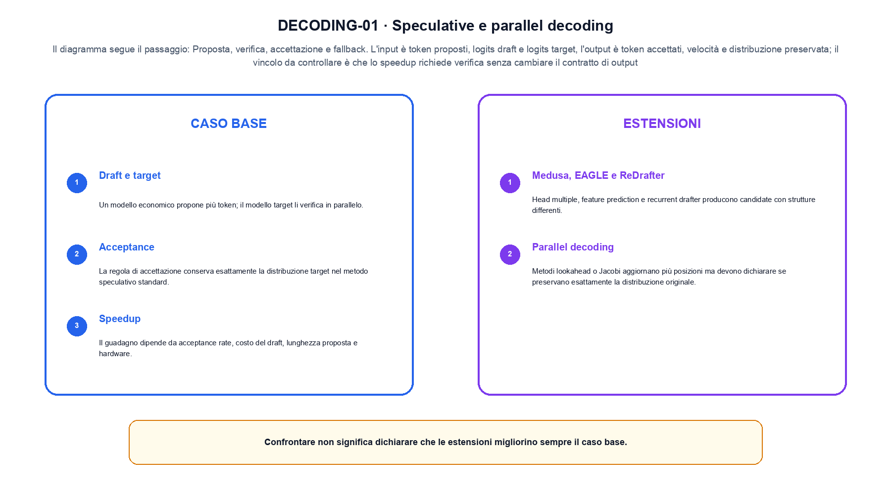
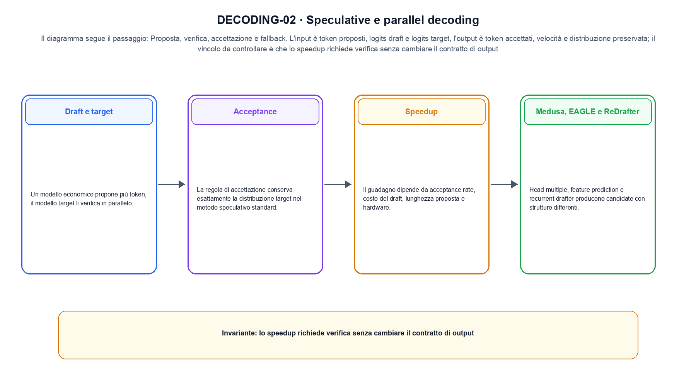

<!--
chapter_id: CH-P12-SPECULATIVE-DECODING
part_id: P12
order_key: 770
title: Speculative e parallel decoding
maturity: ESTABLISHED
status: candidatura completa in revisione autoriale
version: 0.4.0-draft2
last_source_check: 3 agosto 2026
environment: Python 3.13.12, CPU
deferred: benchmark applicativi, varianti non necessarie al contratto centrale e approvazione autoriale
-->

# Capitolo 77. Speculative e parallel decoding

Il risultato precedente non è ancora una soluzione completa. Partiamo da draft e target durante il decoding speculativo e dalla richiesta «Il pacco non è arrivato» come esempio comune; per arrivare all'output «token accettati, velocità e distribuzione preservata» isoliamo il passaggio «proposta, verifica, accettazione e fallback» e ne misuriamo il limite prima di passare a KV cache e riuso del contesto.

## Draft e target

Un modello economico propone più token; il modello target li verifica in parallelo. [SRC-77-001]

Prima del nome tecnico fissiamo la situazione: consideriamo tre token draft vengono verificati: due sono accettati e uno ricade nel target. Da qui possiamo leggere la conseguenza dichiarata da «Un modello economico propone più token; il modello target li verifica in parallelo».

La sezione usa l'input «token proposti, logits draft e logits target» come punto di partenza e l'output «token accettati, velocità e distribuzione preservata» come traccia d'uscita. La trasformazione concreta è «proposta, verifica, accettazione e fallback»; il caso non è completo se non dichiariamo anche che lo speedup richiede verifica senza cambiare il contratto di output. La condizione da isolare è «Un modello economico propone più token; il modello target li verifica in parallelo».

L'ottimizzazione modifica rappresentazione, memoria, calcolo o scheduling sotto un carico dichiarato. Per attribuire il beneficio bisogna separare il guadagno locale da latenza, qualità e costo end-to-end. Per «Draft e target» il controllo cambia una sola premessa della frase «Un modello economico propone più token; il modello target li verifica in parallelo» e conserva input, output e criterio di successo, così la differenza resta attribuibile. La verifica resta ancorata a «Un modello economico propone più token; il modello target li verifica in parallelo». [SRC-77-001]

Se cambiamo una premessa, dobbiamo riaprire l'interpretazione. Per «Draft e target» conserviamo l'osservazione collegata a «Un modello economico propone più token; il modello target li verifica in parallelo» e lasciamo esplicitamente fuori ciò che non è stato misurato.

La prova di «Draft e target» conserva input, operazione e output; poi esplicita quale parte di «Un modello economico propone più token; il modello target li verifica in parallelo» non è stata misurata. Così il test separa l'evidenza dall'inferenza. Il passaggio successivo, «Acceptance», potrà cambiare una sola condizione, dichiarando il nuovo setup prima di interpretare il risultato.

## Acceptance

La regola di accettazione conserva esattamente la distribuzione target nel metodo speculativo standard. [SRC-77-002]

Per capire «Acceptance» partiamo da questo caso: tre token proposti, due accettati e uno ricalcolato. Il caso rende osservabile il punto centrale: «La regola di accettazione conserva esattamente la distribuzione target nel metodo speculativo standard».

Per ricostruire «Acceptance» annotiamo l'input «token proposti, logits draft e logits target», poi l'operazione «proposta, verifica, accettazione e fallback», infine l'output «token accettati, velocità e distribuzione preservata». Questa sequenza impedisce di scambiare una forma compatibile per il comportamento descritto dalla fonte. Il controllo parte da «La regola di accettazione conserva esattamente la distribuzione target nel metodo speculativo standard».

L'ottimizzazione modifica rappresentazione, memoria, calcolo o scheduling sotto un carico dichiarato. Per attribuire il beneficio bisogna separare il guadagno locale da latenza, qualità e costo end-to-end. Per «Acceptance» il controllo cambia una sola premessa della frase «La regola di accettazione conserva esattamente la distribuzione target nel metodo speculativo standard» e conserva input, output e criterio di successo, così la differenza resta attribuibile. La verifica resta ancorata a «La regola di accettazione conserva esattamente la distribuzione target nel metodo speculativo standard». [SRC-77-002]

Il punto didattico di «Acceptance» è separare ciò che la fonte afferma da ciò che il piccolo caso illustra. L'output «token accettati, velocità e distribuzione preservata» mostra il contratto locale, ma non sostituisce una misura sul sistema completo.

Per verificare «Acceptance» cambiamo una sola condizione vicina alla frase «La regola di accettazione conserva esattamente la distribuzione target nel metodo speculativo standard», teniamo fermo il resto e registriamo l'output «token accettati, velocità e distribuzione preservata». Il caso negativo deve rendere riconoscibile la failure, non soltanto produrre un numero diverso. La sezione successiva, «Speedup», riceve l'output «token accettati, velocità e distribuzione preservata» come base, ma dovrà formulare e verificare la propria distinzione.

## Speedup

Il guadagno dipende da acceptance rate, costo del draft, lunghezza proposta e hardware. [SRC-77-003]

Il caso minimo di «Speedup» si presenta così: un caso in cui lo speedup richiede verifica senza cambiare il contratto di output. Non lo usiamo come decorazione: serve a rendere osservabile la frase «Il guadagno dipende da acceptance rate, costo del draft, lunghezza proposta e hardware».

Nel contratto locale, l'input «token proposti, logits draft e logits target» entra, l'operazione «proposta, verifica, accettazione e fallback» modifica il percorso e l'output «token accettati, velocità e distribuzione preservata» è ciò che osserviamo. Qui cambia soprattutto il passaggio «Speedup»; resta da controllare che lo speedup richiede verifica senza cambiare il contratto di output. La domanda locale è «Il guadagno dipende da acceptance rate, costo del draft, lunghezza proposta e hardware».

L'ottimizzazione modifica rappresentazione, memoria, calcolo o scheduling sotto un carico dichiarato. Per attribuire il beneficio bisogna separare il guadagno locale da latenza, qualità e costo end-to-end. Per «Speedup» il controllo cambia una sola premessa della frase «Il guadagno dipende da acceptance rate, costo del draft, lunghezza proposta e hardware» e conserva input, output e criterio di successo, così la differenza resta attribuibile. La verifica resta ancorata a «Il guadagno dipende da acceptance rate, costo del draft, lunghezza proposta e hardware». [SRC-77-003]

La lettura va fatta in ordine: prima il caso, poi la trasformazione, quindi la conseguenza. Il piccolo risultato resta un'illustrazione di «Il guadagno dipende da acceptance rate, costo del draft, lunghezza proposta e hardware», non una promessa generale.

Il controllo minimo di «Speedup» confronta il caso dichiarato con una variazione che rompe la sua ipotesi. Se la failure non è distinguibile dall'esito valido, manca un'osservazione nel contratto di latency, memoria e throughput. Da «Speedup» portiamo l'output «token accettati, velocità e distribuzione preservata»; non portiamo invece una conclusione oltre il caso locale.

## Medusa, EAGLE e ReDrafter

Head multiple, feature prediction e recurrent drafter producono candidate con strutture differenti. [SRC-77-004]

Prima del nome tecnico fissiamo la situazione: consideriamo ridurre i byte per elemento cambia memoria e potenzialmente errore. Il controllo richiede confronto numerico oltre alla misura di tempo. Da qui possiamo leggere la conseguenza dichiarata da «Head multiple, feature prediction e recurrent drafter producono candidate con strutture differenti».

La sezione usa l'input «token proposti, logits draft e logits target» come punto di partenza e l'output «token accettati, velocità e distribuzione preservata» come traccia d'uscita. La trasformazione concreta è «proposta, verifica, accettazione e fallback»; il caso non è completo se non dichiariamo anche che lo speedup richiede verifica senza cambiare il contratto di output. La condizione da isolare è «Head multiple, feature prediction e recurrent drafter producono candidate con strutture differenti».

L'ottimizzazione modifica rappresentazione, memoria, calcolo o scheduling sotto un carico dichiarato. Per attribuire il beneficio bisogna separare il guadagno locale da latenza, qualità e costo end-to-end. Per «Medusa, EAGLE e ReDrafter» il controllo cambia una sola premessa della frase «Head multiple, feature prediction e recurrent drafter producono candidate con strutture differenti» e conserva input, output e criterio di successo, così la differenza resta attribuibile. La verifica resta ancorata a «Head multiple, feature prediction e recurrent drafter producono candidate con strutture differenti». [SRC-77-004]

Se cambiamo una premessa, dobbiamo riaprire l'interpretazione. Per «Medusa, EAGLE e ReDrafter» conserviamo l'osservazione collegata a «Head multiple, feature prediction e recurrent drafter producono candidate con strutture differenti» e lasciamo esplicitamente fuori ciò che non è stato misurato.

La prova di «Medusa, EAGLE e ReDrafter» conserva input, operazione e output; poi esplicita quale parte di «Head multiple, feature prediction e recurrent drafter producono candidate con strutture differenti» non è stata misurata. Così il test separa l'evidenza dall'inferenza. Il passaggio successivo, «Parallel decoding», potrà cambiare una sola condizione, dichiarando il nuovo setup prima di interpretare il risultato.

La figura DECODING-01 usa la famiglia compare. Il diagramma segue il passaggio: Proposta, verifica, accettazione e fallback. L'input è token proposti, logits draft e logits target, l'output è token accettati, velocità e distribuzione preservata; il vincolo da controllare è che lo speedup richiede verifica senza cambiare il contratto di output.

## Parallel decoding

Metodi lookahead o Jacobi aggiornano più posizioni ma devono dichiarare se preservano esattamente la distribuzione originale. [SRC-77-001]

Per capire «Parallel decoding» partiamo da questo caso: un prefisso corretto confrontato con lo stesso prefisso dopo che il modello ha prodotto il token precedente. Il caso rende osservabile il punto centrale: «Metodi lookahead o Jacobi aggiornano più posizioni ma devono dichiarare se preservano esattamente la distribuzione originale».

Per ricostruire «Parallel decoding» annotiamo l'input «token proposti, logits draft e logits target», poi l'operazione «proposta, verifica, accettazione e fallback», infine l'output «token accettati, velocità e distribuzione preservata». Questa sequenza impedisce di scambiare una forma compatibile per il comportamento descritto dalla fonte. Il controllo parte da «Metodi lookahead o Jacobi aggiornano più posizioni ma devono dichiarare se preservano esattamente la distribuzione originale».

L'ottimizzazione modifica rappresentazione, memoria, calcolo o scheduling sotto un carico dichiarato. Per attribuire il beneficio bisogna separare il guadagno locale da latenza, qualità e costo end-to-end. Il confronto utile mette accanto il prefisso corretto e quello prodotto dal modello, così il segnale disponibile al training non viene confuso con l'inference. La verifica resta ancorata a «Metodi lookahead o Jacobi aggiornano più posizioni ma devono dichiarare se preservano esattamente la distribuzione originale». [SRC-77-001]

Il punto didattico di «Parallel decoding» è separare ciò che la fonte afferma da ciò che il piccolo caso illustra. L'output «token accettati, velocità e distribuzione preservata» mostra il contratto locale, ma non sostituisce una misura sul sistema completo.

Per verificare «Parallel decoding» cambiamo una sola condizione vicina alla frase «Metodi lookahead o Jacobi aggiornano più posizioni ma devono dichiarare se preservano esattamente la distribuzione originale», teniamo fermo il resto e registriamo l'output «token accettati, velocità e distribuzione preservata». Il caso negativo deve rendere riconoscibile la failure, non soltanto produrre un numero diverso. Il percorso si chiude lasciando espliciti la misura locale e ciò che richiederebbe una prova ulteriore.

## Dal concetto alla situazione concreta: Draft e target

Il caso intero parte dall'input «token proposti, logits draft e logits target», applica l'operazione «proposta, verifica, accettazione e fallback» e osserva l'output «token accettati, velocità e distribuzione preservata». Un esempio controllato: tre token proposti, due accettati e uno ricalcolato. Lo schema compatto è:

$$
accepted = verify(draft, target)
$$

È una notazione di interfaccia, non un'identità numerica completa. Speculazione e decoding parallelo richiedono una verifica del draft. [SRC-77-001]

La figura DECODING-02 cambia composizione rispetto alla prima. Il diagramma segue il passaggio: Proposta, verifica, accettazione e fallback. L'input è token proposti, logits draft e logits target, l'output è token accettati, velocità e distribuzione preservata; il vincolo da controllare è che lo speedup richiede verifica senza cambiare il contratto di output.

## Una prova ripetibile: Acceptance

Lo snippet locale mette in esecuzione questo caso: tre token proposti, due accettati e uno ricalcolato. Il test associato controlla determinismo, output e invariante e rifiuta una shape o condizione incoerente; il risultato è conservato in `code/outputs/SNIP-77-001.txt`, come evidenza locale e non come benchmark di produzione.

## Il trasferimento richiede altro: Parallel decoding

Il caso di «Speculative e parallel decoding» non certifica un servizio completo. Lo speedup richiede verifica senza cambiare il contratto di output. La domanda successiva è se «Metodi lookahead o Jacobi aggiornano più posizioni ma devono dichiarare se preservano esattamente la distribuzione originale» regga quando cambiano dati, scala, hardware o criteri di decisione.

## Il filo che passa oltre: Speculative e parallel decoding

Il filo della lezione va dall'input «token proposti, logits draft e logits target» all'output «token accettati, velocità e distribuzione preservata». Nei passaggi «Draft e target», «Acceptance», «Parallel decoding» abbiamo usato esempi e controlli negativi per rendere il contratto controllabile e delimitare la conclusione. L'invariante da portare avanti è: lo speedup richiede verifica senza cambiare il contratto di output. Il Capitolo 78, KV cache e riuso del contesto, può partire da questo output e dichiarare la propria domanda.

### Rilettura guidata: Draft e target

1. Ricostruisci l'oggetto continuo a partire da «Draft e target» e indica quale parte della frase «Un modello economico propone più token; il modello target li verifica in parallelo» entra nel caso.
2. Spiega quale trasformazione collega «Draft e target» a «Parallel decoding» e quale output osserviamo nel passaggio.
3. Usa lo snippet per controllare l'invariante del contratto: lo speedup richiede verifica senza cambiare il contratto di output.
4. Separa una definizione sostenuta da una fonte, un esempio illustrativo e un risultato locale del caso guida.
5. Indica quale parte della frase «Metodi lookahead o Jacobi aggiornano più posizioni ma devono dichiarare se preservano esattamente la distribuzione originale» richiederebbe una misura nuova prima di essere estesa oltre il caso osservato.

### Allenamento e trasferimento: Parallel decoding

1. Ricostruisci «Draft e target» senza usare il nome della tecnica, soltanto con input, operazione e output.
2. Sostituisci una condizione di «Acceptance» e prevedi che cosa non dovrebbe cambiare.
3. Cerca un controesempio per «Speedup» e annota quale ipotesi viene rotta.
4. Trasforma il limite di «Medusa, EAGLE e ReDrafter» in un test ripetibile.
5. Spiega come trasferire «Parallel decoding» senza portare con sé una promessa non misurata.

## Dove verificare definizioni e risultati: Speculative e parallel decoding

Per ricontrollare «Speculative e parallel decoding», partire da `FONTI_PRIMARIE.md` e poi dal codice: la domanda aperta è come trasferire la misura end-to-end sotto carico dichiarato oltre il caso locale, con la data di consultazione dichiarata. `CLAIMS.md` separa definizioni e risultati locali; codice, ambiente, test e output sono nella cartella `code/`, con attenzione a latency, memoria e throughput.
