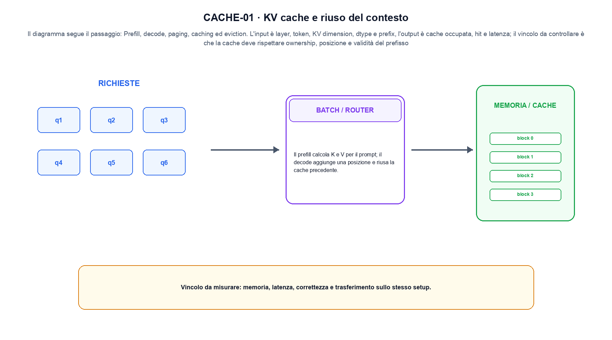
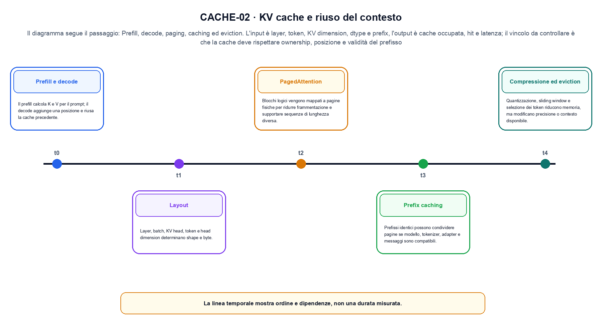

<!--
chapter_id: CH-P12-KV-CACHE
part_id: P12
order_key: 780
title: KV cache e riuso del contesto
maturity: CORE
status: candidatura completa in revisione autoriale
version: 0.4.0-draft2
last_source_check: 3 agosto 2026
environment: Python 3.13.12, CPU
deferred: benchmark applicativi, varianti non necessarie al contratto centrale e approvazione autoriale
-->

# Capitolo 78. KV cache e riuso del contesto

La richiesta «Il pacco non è arrivato» resta il caso guida. In questo capitolo la usiamo per distinguere blocchi di KV cache associati a una richiesta, trasformazione e risultato, senza nascondere i dettagli tecnici.

## Prefill e decode

Il prefill calcola K e V per il prompt; il decode aggiunge una posizione e riusa la cache precedente. [SRC-78-001]

Per capire «Prefill e decode» partiamo da questo caso: due richieste condividono un prefisso di due token e divergono al terzo. Il caso rende osservabile il punto centrale: «Il prefill calcola K e V per il prompt; il decode aggiunge una posizione e riusa la cache precedente».

Nel contratto locale, l'input «layer, token, KV dimension, dtype e prefix» entra, l'operazione «prefill, decode, paging, caching ed eviction» modifica il percorso e l'output «cache occupata, hit e latenza» è ciò che osserviamo. Qui cambia soprattutto il passaggio «Prefill e decode»; resta da controllare che la cache deve rispettare ownership, posizione e validità del prefisso. La domanda locale è «Il prefill calcola K e V per il prompt; il decode aggiunge una posizione e riusa la cache precedente».

L'ottimizzazione modifica rappresentazione, memoria, calcolo o scheduling sotto un carico dichiarato. Per attribuire il beneficio bisogna separare il guadagno locale da latenza, qualità e costo end-to-end. Per «Prefill e decode» il controllo cambia una sola premessa della frase «Il prefill calcola K e V per il prompt; il decode aggiunge una posizione e riusa la cache precedente» e conserva input, output e criterio di successo, così la differenza resta attribuibile. La verifica resta ancorata a «Il prefill calcola K e V per il prompt; il decode aggiunge una posizione e riusa la cache precedente». [SRC-78-001]

La lettura va fatta in ordine: prima il caso, poi la trasformazione, quindi la conseguenza. Il piccolo risultato resta un'illustrazione di «Il prefill calcola K e V per il prompt; il decode aggiunge una posizione e riusa la cache precedente», non una promessa generale.

Per verificare «Prefill e decode» cambiamo una sola condizione vicina alla frase «Il prefill calcola K e V per il prompt; il decode aggiunge una posizione e riusa la cache precedente», teniamo fermo il resto e registriamo l'output «cache occupata, hit e latenza». Il caso negativo deve rendere riconoscibile la failure, non soltanto produrre un numero diverso. La sezione successiva, «Layout», riceve l'output «cache occupata, hit e latenza» come base, ma dovrà formulare e verificare la propria distinzione.

## Layout

Layer, batch, KV head, token e head dimension determinano shape e byte. Contiguità e paginazione influenzano il kernel. [SRC-78-002]

Il caso minimo di «Layout» si presenta così: due richieste condividono un prefisso e divergono al terzo token. Non lo usiamo come decorazione: serve a rendere osservabile la frase «Layer, batch, KV head, token e head dimension determinano shape e byte».

La sezione usa l'input «layer, token, KV dimension, dtype e prefix» come punto di partenza e l'output «cache occupata, hit e latenza» come traccia d'uscita. La trasformazione concreta è «prefill, decode, paging, caching ed eviction»; il caso non è completo se non dichiariamo anche che la cache deve rispettare ownership, posizione e validità del prefisso. La condizione da isolare è «Layer, batch, KV head, token e head dimension determinano shape e byte».

L'ottimizzazione modifica rappresentazione, memoria, calcolo o scheduling sotto un carico dichiarato. Per attribuire il beneficio bisogna separare il guadagno locale da latenza, qualità e costo end-to-end. Per «Layout» il controllo cambia una sola premessa della frase «Layer, batch, KV head, token e head dimension determinano shape e byte» e conserva input, output e criterio di successo, così la differenza resta attribuibile. La verifica resta ancorata a «Layer, batch, KV head, token e head dimension determinano shape e byte». [SRC-78-002]

Se cambiamo una premessa, dobbiamo riaprire l'interpretazione. Per «Layout» conserviamo l'osservazione collegata a «Layer, batch, KV head, token e head dimension determinano shape e byte» e lasciamo esplicitamente fuori ciò che non è stato misurato.

Il controllo minimo di «Layout» confronta il caso dichiarato con una variazione che rompe la sua ipotesi. Se la failure non è distinguibile dall'esito valido, manca un'osservazione nel contratto di latency, memoria e throughput. Da «Layout» portiamo l'output «cache occupata, hit e latenza»; non portiamo invece una conclusione oltre il caso locale.

La figura CACHE-01 usa la famiglia queue. Il diagramma segue il passaggio: Prefill, decode, paging, caching ed eviction. L'input è layer, token, KV dimension, dtype e prefix, l'output è cache occupata, hit e latenza; il vincolo da controllare è che la cache deve rispettare ownership, posizione e validità del prefisso.

## PagedAttention

Blocchi logici vengono mappati a pagine fisiche per ridurre frammentazione e supportare sequenze di lunghezza diversa. [SRC-78-003]

Prima del nome tecnico fissiamo la situazione: consideriamo un caso in cui la cache deve rispettare ownership, posizione e validità del prefisso. Da qui possiamo leggere la conseguenza dichiarata da «Blocchi logici vengono mappati a pagine fisiche per ridurre frammentazione e supportare sequenze di lunghezza diversa».

Per ricostruire «PagedAttention» annotiamo l'input «layer, token, KV dimension, dtype e prefix», poi l'operazione «prefill, decode, paging, caching ed eviction», infine l'output «cache occupata, hit e latenza». Questa sequenza impedisce di scambiare una forma compatibile per il comportamento descritto dalla fonte. Il controllo parte da «Blocchi logici vengono mappati a pagine fisiche per ridurre frammentazione e supportare sequenze di lunghezza diversa».

L'ottimizzazione modifica rappresentazione, memoria, calcolo o scheduling sotto un carico dichiarato. Per attribuire il beneficio bisogna separare il guadagno locale da latenza, qualità e costo end-to-end. La variabile da isolare è il pattern di visibilità o di riuso: la stessa shape può corrispondere a dipendenze e costi diversi. La verifica resta ancorata a «Blocchi logici vengono mappati a pagine fisiche per ridurre frammentazione e supportare sequenze di lunghezza diversa». [SRC-78-003]

Il punto didattico di «PagedAttention» è separare ciò che la fonte afferma da ciò che il piccolo caso illustra. L'output «cache occupata, hit e latenza» mostra il contratto locale, ma non sostituisce una misura sul sistema completo.

La prova di «PagedAttention» conserva input, operazione e output; poi esplicita quale parte di «Blocchi logici vengono mappati a pagine fisiche per ridurre frammentazione e supportare sequenze di lunghezza diversa» non è stata misurata. Così il test separa l'evidenza dall'inferenza. Il passaggio successivo, «Prefix caching», potrà cambiare una sola condizione, dichiarando il nuovo setup prima di interpretare il risultato.

## Prefix caching

Prefissi identici possono condividere pagine se modello, tokenizer, adapter e messaggi sono compatibili. [SRC-78-004]

Per capire «Prefix caching» partiamo da questo caso: ridurre i byte per elemento cambia memoria e potenzialmente errore. Il controllo richiede confronto numerico oltre alla misura di tempo. Il caso rende osservabile il punto centrale: «Prefissi identici possono condividere pagine se modello, tokenizer, adapter e messaggi sono compatibili».

Nel contratto locale, l'input «layer, token, KV dimension, dtype e prefix» entra, l'operazione «prefill, decode, paging, caching ed eviction» modifica il percorso e l'output «cache occupata, hit e latenza» è ciò che osserviamo. Qui cambia soprattutto il passaggio «Prefix caching»; resta da controllare che la cache deve rispettare ownership, posizione e validità del prefisso. La domanda locale è «Prefissi identici possono condividere pagine se modello, tokenizer, adapter e messaggi sono compatibili».

L'ottimizzazione modifica rappresentazione, memoria, calcolo o scheduling sotto un carico dichiarato. Per attribuire il beneficio bisogna separare il guadagno locale da latenza, qualità e costo end-to-end. Per «Prefix caching» il controllo cambia una sola premessa della frase «Prefissi identici possono condividere pagine se modello, tokenizer, adapter e messaggi sono compatibili» e conserva input, output e criterio di successo, così la differenza resta attribuibile. La verifica resta ancorata a «Prefissi identici possono condividere pagine se modello, tokenizer, adapter e messaggi sono compatibili». [SRC-78-004]

La lettura va fatta in ordine: prima il caso, poi la trasformazione, quindi la conseguenza. Il piccolo risultato resta un'illustrazione di «Prefissi identici possono condividere pagine se modello, tokenizer, adapter e messaggi sono compatibili», non una promessa generale.

Per verificare «Prefix caching» cambiamo una sola condizione vicina alla frase «Prefissi identici possono condividere pagine se modello, tokenizer, adapter e messaggi sono compatibili», teniamo fermo il resto e registriamo l'output «cache occupata, hit e latenza». Il caso negativo deve rendere riconoscibile la failure, non soltanto produrre un numero diverso. La sezione successiva, «Compressione ed eviction», riceve l'output «cache occupata, hit e latenza» come base, ma dovrà formulare e verificare la propria distinzione.

## Compressione ed eviction

Quantizzazione, sliding window e selezione dei token riducono memoria, ma modificano precisione o contesto disponibile. [SRC-78-001]

Il caso minimo di «Compressione ed eviction» si presenta così: ridurre i byte per elemento cambia memoria e potenzialmente errore. Il controllo richiede confronto numerico oltre alla misura di tempo. Non lo usiamo come decorazione: serve a rendere osservabile la frase «Quantizzazione, sliding window e selezione dei token riducono memoria, ma modificano precisione o contesto disponibile».

La sezione usa l'input «layer, token, KV dimension, dtype e prefix» come punto di partenza e l'output «cache occupata, hit e latenza» come traccia d'uscita. La trasformazione concreta è «prefill, decode, paging, caching ed eviction»; il caso non è completo se non dichiariamo anche che la cache deve rispettare ownership, posizione e validità del prefisso. La condizione da isolare è «Quantizzazione, sliding window e selezione dei token riducono memoria, ma modificano precisione o contesto disponibile».

L'ottimizzazione modifica rappresentazione, memoria, calcolo o scheduling sotto un carico dichiarato. Per attribuire il beneficio bisogna separare il guadagno locale da latenza, qualità e costo end-to-end. Per «Compressione ed eviction» il controllo cambia una sola premessa della frase «Quantizzazione, sliding window e selezione dei token riducono memoria, ma modificano precisione o contesto disponibile» e conserva input, output e criterio di successo, così la differenza resta attribuibile. La verifica resta ancorata a «Quantizzazione, sliding window e selezione dei token riducono memoria, ma modificano precisione o contesto disponibile». [SRC-78-001]

Se cambiamo una premessa, dobbiamo riaprire l'interpretazione. Per «Compressione ed eviction» conserviamo l'osservazione collegata a «Quantizzazione, sliding window e selezione dei token riducono memoria, ma modificano precisione o contesto disponibile» e lasciamo esplicitamente fuori ciò che non è stato misurato.

Il controllo minimo di «Compressione ed eviction» confronta il caso dichiarato con una variazione che rompe la sua ipotesi. Se la failure non è distinguibile dall'esito valido, manca un'osservazione nel contratto di latency, memoria e throughput. La conclusione resta ancorata al protocollo osservato, non al nome della tecnica.

## Dal concetto alla situazione concreta: Prefill e decode

Il caso intero parte dall'input «layer, token, KV dimension, dtype e prefix», applica l'operazione «prefill, decode, paging, caching ed eviction» e osserva l'output «cache occupata, hit e latenza». Un esempio controllato: due richieste condividono un prefisso e divergono al terzo token. La formula locale è:

$$
memory = layers * tokens * kv_dim * bytes
$$

La cache cresce con lunghezza, layer, dimensione KV e dtype. [SRC-78-001]

La figura CACHE-02 cambia composizione rispetto alla prima. Il diagramma segue il passaggio: Prefill, decode, paging, caching ed eviction. L'input è layer, token, KV dimension, dtype e prefix, l'output è cache occupata, hit e latenza; il vincolo da controllare è che la cache deve rispettare ownership, posizione e validità del prefisso.

## Una prova ripetibile: Layout

Il file `code/snip_78_contract.py` collega il contratto del capitolo alla frase «Quantizzazione, sliding window e selezione dei token riducono memoria, ma modificano precisione o contesto disponibile». Il test controlla l'invariante, la risposta valida e il caso negativo; `code/outputs/SNIP-78-001.txt` conserva il risultato ripetibile del caso locale.

## Il trasferimento richiede altro: Compressione ed eviction

Il meccanismo di «KV cache e riuso del contesto» resta legato al contratto locale. La cache deve rispettare ownership, posizione e validità del prefisso. Prima di generalizzare la frase «Quantizzazione, sliding window e selezione dei token riducono memoria, ma modificano precisione o contesto disponibile», servono un nuovo setup, un protocollo dichiarato e una misura ripetibile.

## Il filo che passa oltre: KV cache e riuso del contesto

Abbiamo seguito blocchi di KV cache associati a una richiesta, partendo dall'input «layer, token, KV dimension, dtype e prefix» e arrivando all'output «cache occupata, hit e latenza». Le sezioni «Prefill e decode», «Layout», «Compressione ed eviction» hanno isolato le proprie frasi chiave senza confondere il meccanismo con il risultato applicativo. L'invariante da portare avanti è: la cache deve rispettare ownership, posizione e validità del prefisso. Il Capitolo 79, Serving, batching e scheduling, può partire da questo output e dichiarare la propria domanda.

### Rilettura guidata: Prefill e decode

1. Ricostruisci l'oggetto continuo a partire da «Prefill e decode» e indica quale parte della frase «Il prefill calcola K e V per il prompt; il decode aggiunge una posizione e riusa la cache precedente» entra nel caso.
2. Spiega quale trasformazione collega «Prefill e decode» a «Compressione ed eviction» e quale output osserviamo nel passaggio.
3. Usa lo snippet per controllare l'invariante del contratto: la cache deve rispettare ownership, posizione e validità del prefisso.
4. Separa una definizione sostenuta da una fonte, un esempio illustrativo e un risultato locale del caso guida.
5. Indica quale parte della frase «Quantizzazione, sliding window e selezione dei token riducono memoria, ma modificano precisione o contesto disponibile» richiederebbe una misura nuova prima di essere estesa oltre il caso osservato.

### Allenamento e trasferimento: Compressione ed eviction

1. Racconta «Prefill e decode» come una trasformazione: che cosa entra e che cosa esce?
2. Confronta due esecuzioni di «Layout» mantenendo il resto del setup invariato.
3. Per «PagedAttention», separa l'esempio locale dal limite che impedisce di generalizzarlo.
4. Progetta una prova per «Prefix caching» che renda visibile il suo confine.
5. Scrivi una metrica o una domanda per valutare «Compressione ed eviction» senza confondere livelli diversi.

## Dove verificare definizioni e risultati: KV cache e riuso del contesto

Il dossier di «KV cache e riuso del contesto» in `FONTI_PRIMARIE.md` separa definizioni, risultati e il costo che si sposta tra kernel e servizio; la data di consultazione è registrata accanto ai riferimenti. `CLAIMS.md` separa definizioni e risultati locali; codice, ambiente, test e output sono nella cartella `code/`, con attenzione a latency, memoria e throughput.
