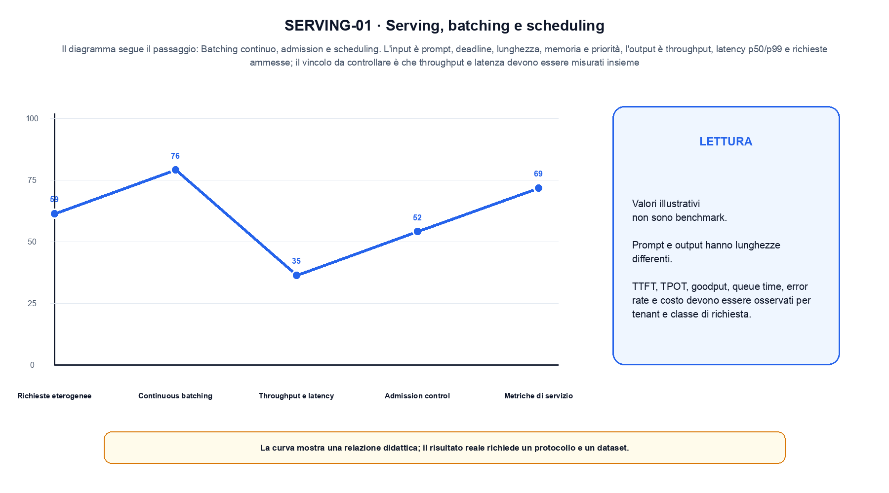
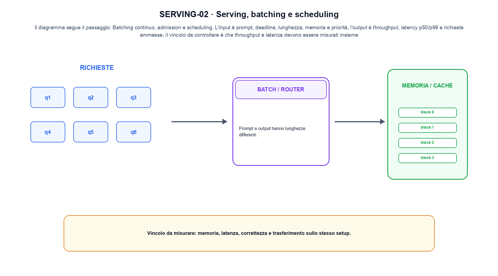

<!--
chapter_id: CH-P12-SERVING
part_id: P12
order_key: 790
title: Serving, batching e scheduling
maturity: CORE
status: revisione editoriale v2, approvazione autoriale aperta
version: 0.5.0-draft3
last_source_check: 4 agosto 2026
environment: Python 3.13.12, CPU
code_policy: reference
deferred: benchmark applicativi non eseguiti e approvazione autoriale delle visuali
-->

# Capitolo 79. Serving, batching e scheduling

Il percorso di serving, batching e scheduling attraversa «Richieste eterogenee» e «Metriche di servizio» senza attribuire al solo modello ciò che dipende dal sistema. L'oggetto osservato è richieste eterogenee in una coda di serving. Il contratto locale dichiara input, prompt, deadline, lunghezza, memoria e priorità; operazione, batching continuo, admission e scheduling; output, throughput, latency p50/p99 e richieste ammesse. La situazione minima da seguire è Due richieste brevi e una lunga entrano nello stesso batch, con token totali registrati. Il limite da non nascondere è: throughput e latenza devono essere misurati insieme.

## Richieste eterogenee

Prompt e output hanno lunghezze differenti. Un batch statico spreca slot quando alcune sequenze terminano. [SRC-79-001]

Batching e scheduling sono una decisione con vincoli, non solo una coda.

**Caso da seguire.** Due richieste brevi e una lunga entrano nello stesso batch, con token totali registrati.

**Controllo.** Per «Richieste eterogenee», registra richiesta, decisione, stato e output finale. Nel caso «Richieste eterogenee», un esito plausibile non deve nascondere il componente che lo ha prodotto.


## Continuous batching

Il scheduler inserisce nuove richieste tra iterazioni di decode e rimuove quelle concluse. [SRC-79-002]

**Caso da seguire.** Un batch di richieste eterogenee in cui throughput, coda e time-to-first-token vengono misurati separatamente.

**Controllo.** Ripeti «Continuous batching» con una capability o un'autorizzazione rimossa e verifica che la failure preceda qualsiasi side effect.


La forma compatta aiuta a seguire il flusso senza attribuirgli una garanzia quantitativa.

**Schema concettuale.** `schedule = batch(requests, deadline, memory)`

Batching e scheduling sono una decisione con vincoli, non solo una coda. [SRC-79-001]




La prima figura segue il percorso da «Richieste eterogenee» a «Throughput e latency».


## Throughput e latency

Aumentare batch migliora utilizzo ma può aumentare time-to-first-token e inter-token latency. [SRC-79-003]

**Caso da seguire.** Per «Throughput e latency» si mantiene l'input del capitolo e si isola questa condizione: Aumentare batch migliora utilizzo ma può aumentare time-to-first-token e inter-token latency.

**Controllo.** Per «Throughput e latency», separa il test del singolo componente dal test end-to-end, usando lo stesso input e la stessa configurazione versionata.


## Admission control

Memoria KV, priorità, deadline e fairness determinano quali richieste entrano nel sistema. [SRC-79-004]

**Caso da seguire.** Ridurre i byte per elemento cambia memoria e potenzialmente errore. Il controllo richiede confronto numerico oltre alla misura di tempo.

**Controllo.** Per «Admission control», introduci una failure a un solo confine e controlla che log, stato e recovery identifichino quel confine senza ambiguità.


## Metriche di servizio

TTFT, TPOT, goodput, queue time, error rate e costo devono essere osservati per tenant e classe di richiesta. [SRC-79-001]

**Caso da seguire.** Quattro casi con protocollo, una failure e una slice conservati insieme al valore aggregato.

**Controllo.** Per «Metriche di servizio», confronta il comportamento completo, non soltanto l'ultimo messaggio. Nel caso «Metriche di servizio», il risultato resta limitato da: TTFT, TPOT, goodput, queue time, error rate e costo devono essere osservati per tenant e classe di richiesta.




La seconda figura mette a confronto «Admission control» e il limite discusso in «Metriche di servizio».


## Esempio Python eseguito

La prova locale di serving, batching e scheduling parte da un esempio minimo, registrato nel repository insieme ai suoi test. Per «Serving, batching e scheduling», il caso di default usa valori piccoli per isolare il meccanismo. La prova negativa riguarda proprio «serving, batching e scheduling» e interrompe l'interpretazione prima dell'output.

```python
def contract(case: str = "default"):
    if case != "default":
        raise ValueError("only the documented default case is supported")
    requests = [("short-1", 2), ("short-2", 2), ("long", 6)]
    batch = [request[0] for request in requests]
    total_tokens = sum(length for _request, length in requests)
    return {"batch": batch, "total_tokens": total_tokens, "invariant": "serving reports throughput and latency for the same admitted requests"}
```

Esecuzione con `python snip_79_contract.py`:

```text
{"batch": ["short-1", "short-2", "long"], "invariant": "serving reports throughput and latency for the same admitted requests", "total_tokens": 10}
```

Il test associato è [`code/test_79_contract.py`](code/test_79_contract.py); l'output versionato è [`code/outputs/SNIP-79-001.txt`](code/outputs/SNIP-79-001.txt).


## Come si collegano i passaggi

- **Da «Richieste eterogenee» a «Continuous batching».** Prompt e output hanno lunghezze differenti. Il scheduler inserisce nuove richieste tra iterazioni di decode e rimuove quelle concluse. «Richieste eterogenee» nomina il confine e «Continuous batching» implementa il percorso senza ereditare autorizzazioni implicite. Da «Richieste eterogenee» a «Continuous batching» cambia la domanda osservabile. [SRC-79-001; SRC-79-002]

- **Da «Continuous batching» a «Throughput e latency».** Il scheduler inserisce nuove richieste tra iterazioni di decode e rimuove quelle concluse. Aumentare batch migliora utilizzo ma può aumentare time-to-first-token e inter-token latency. Componendo «Continuous batching» e «Throughput e latency» diventa necessario conservare stato, identità e decisione. Il passaggio successivo rende misurabile «Throughput e latency». [SRC-79-002; SRC-79-003]

- **Da «Throughput e latency» a «Admission control».** Aumentare batch migliora utilizzo ma può aumentare time-to-first-token e inter-token latency. Memoria KV, priorità, deadline e fairness determinano quali richieste entrano nel sistema. «Admission control» introduce failure e recovery prima di un side effect o di una perdita di stato. Da «Throughput e latency» a «Admission control» cambia la domanda osservabile. [SRC-79-003; SRC-79-004]

- **Da «Admission control» a «Metriche di servizio».** Memoria KV, priorità, deadline e fairness determinano quali richieste entrano nel sistema. TTFT, TPOT, goodput, queue time, error rate e costo devono essere osservati per tenant e classe di richiesta. La chiusura su «Metriche di servizio» valuta il sistema completo, non soltanto il componente iniziale. Il passaggio successivo rende misurabile «Metriche di servizio». [SRC-79-004; SRC-79-001]

La catena completa produce throughput, latency p50/p99 e richieste ammesse a partire da prompt, deadline, lunghezza, memoria e priorità. Ogni collegamento conserva un oggetto osservabile diverso; per questo il risultato non può essere esteso oltre il limite dichiarato: throughput e latenza devono essere misurati insieme.


## Prove sui confini del sistema

1. Ricostruisci «Richieste eterogenee» con un esempio diverso da quello mostrato e indica l'output atteso prima del calcolo.
2. Nel passaggio «Continuous batching», cambia una sola ipotesi e spiega quale risultato non è più confrontabile.
3. Collega «Throughput e latency» a una riga dello snippet oppure motiva perché la prova deve essere documentale.
4. Progetta un caso limite per «Admission control» che produca una failure riconoscibile.
5. Per «Metriche di servizio», separa una conclusione sostenuta dal caso locale da una che richiederebbe nuovi dati o un benchmark.


## Il confine operativo

La lezione parte da «prompt, deadline, lunghezza, memoria e priorità» e arriva fino a «throughput, latency p50/p99 e richieste ammesse». Il limite da conservare è questo: throughput e latenza devono essere misurati insieme. Il confine di «Metriche di servizio» va ricontrollato tra claim, fonti e artefatti: i rinvii sono [`FONTI_PRIMARIE.md`](FONTI_PRIMARIE.md), [`CLAIMS.md`](CLAIMS.md) e `code/`.
