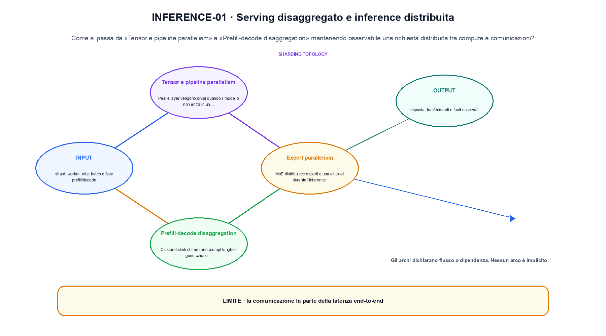
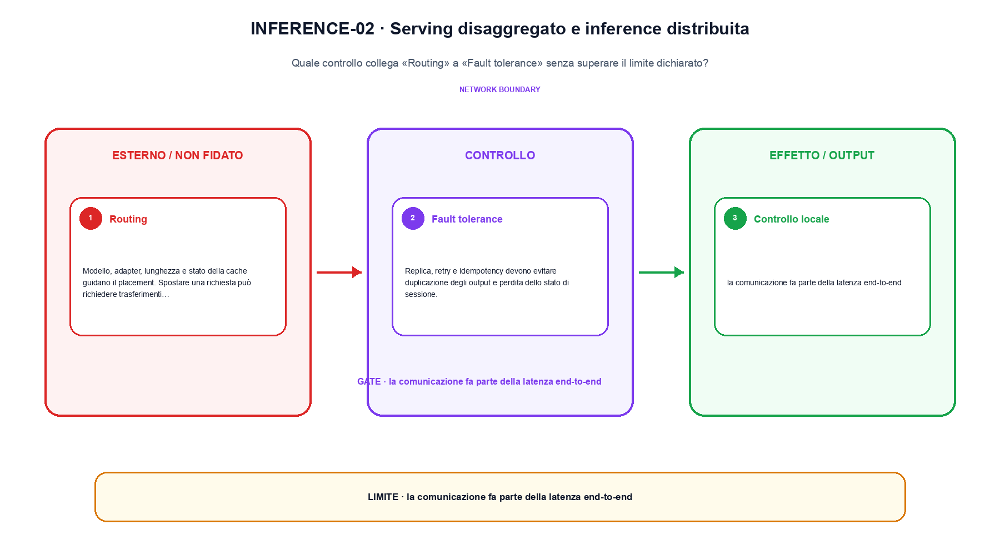

<!--
chapter_id: CH-P12-DISTRIBUTED-INFERENCE
part_id: P12
order_key: 800
title: Serving disaggregato e inference distribuita
maturity: ESTABLISHED
status: revisione editoriale v2, approvazione autoriale aperta
version: 0.5.0-draft3
last_source_check: 4 agosto 2026
environment: Python 3.13.12, CPU
code_policy: reference
deferred: benchmark applicativi non eseguiti e approvazione autoriale delle visuali
-->

# Capitolo 80. Serving disaggregato e inference distribuita

La domanda guida di questa lezione è come collegare «Tensor e pipeline parallelism» e «Fault tolerance» senza perdere il contratto tecnico di serving disaggregato e inference distribuita. L'oggetto osservato è una richiesta distribuita tra compute e comunicazioni. Il contratto locale è: input, shard, worker, rete, batch e fase prefill/decode; operazione, parallelismo, disaggregazione, routing e recovery; output, risposta, trasferimenti e fault osservati. Il caso guida è questo: Due worker aggiungono comunicazione e compute alla latenza end-to-end. Il confine da mantenere esplicito è: la comunicazione fa parte della latenza end-to-end.

## Tensor e pipeline parallelism

Pesi e layer vengono divisi quando il modello non entra in un singolo dispositivo. [SRC-80-001]

Il servizio distribuito include comunicazioni oltre al calcolo locale.

**Caso da seguire.** Due worker aggiungono comunicazione e compute alla latenza end-to-end.

**Controllo.** Registra richiesta, decisione, stato e output finale. Un esito plausibile non deve nascondere il componente che lo ha prodotto.


## Expert parallelism

MoE distribuisce esperti e usa all-to-all durante l'inference. [SRC-80-002]

**Caso da seguire.** Due worker con una sincronizzazione e un timeout.

**Controllo.** Ripeti «Expert parallelism» con una capability o un'autorizzazione rimossa e verifica che la failure preceda qualsiasi side effect.




La prima figura segue il percorso da «Tensor e pipeline parallelism» a «Prefill-decode disaggregation».


## Prefill-decode disaggregation

Cluster distinti ottimizzano prompt lunghi e generazione token-by-token, scambiando KV cache attraverso la rete. [SRC-80-003]

**Caso da seguire.** Un caso in cui la comunicazione fa parte della latenza end-to-end.

**Controllo.** Separa il test del singolo componente dal test end-to-end, usando lo stesso input e la stessa configurazione versionata.


## Routing

Modello, adapter, lunghezza e stato della cache guidano il placement. Spostare una richiesta può richiedere trasferimenti costosi. [SRC-80-004]

**Caso da seguire.** Ridurre i byte per elemento cambia memoria e potenzialmente errore. Il controllo richiede confronto numerico oltre alla misura di tempo.

**Controllo.** Introduci una failure a un solo confine e controlla che log, stato e recovery identifichino quel confine senza ambiguità.


## Fault tolerance

Replica, retry e idempotency devono evitare duplicazione degli output e perdita dello stato di sessione. [SRC-80-001]

**Caso da seguire.** Per «Fault tolerance» si mantiene l'input del capitolo e si isola questa condizione: Replica, retry e idempotency devono evitare duplicazione degli output e perdita dello stato di sessione.

**Controllo.** Confronta il comportamento completo, non soltanto l'ultimo messaggio. Il risultato resta limitato da: Replica, retry e idempotency devono evitare duplicazione degli output e perdita dello stato di sessione.




La seconda figura mette a confronto «Routing» e il limite discusso in «Fault tolerance».


## Esempio Python eseguito

Il frammento seguente è lo stesso conservato nel repository. Usa valori piccoli perché l'obiettivo è osservare il meccanismo, non simulare una scala che non abbiamo eseguito.

```python
def contract():
    workers = {"w1": {"tokens": 2, "network_ms": 3}, "w2": {"tokens": 2, "network_ms": 4}}
    end_to_end_ms = max(worker["network_ms"] for worker in workers.values()) + 2
    return {"workers": len(workers), "end_to_end_ms": end_to_end_ms, "invariant": "distributed inference includes communication in end-to-end latency"}
```

Esecuzione con `python snip_80_contract.py`:

```text
{"end_to_end_ms": 6, "invariant": "distributed inference includes communication in end-to-end latency", "workers": 2}
```

Il test associato è [`code/test_80_contract.py`](code/test_80_contract.py); l'output versionato è [`code/outputs/SNIP-80-001.txt`](code/outputs/SNIP-80-001.txt).


## Come si collegano i passaggi

- **Da «Tensor e pipeline parallelism» a «Expert parallelism».** Pesi e layer vengono divisi quando il modello non entra in un singolo dispositivo. MoE distribuisce esperti e usa all-to-all durante l'inference. Il contratto iniziale nomina messaggi e confini; il componente successivo implementa una parte del percorso senza ereditare autorizzazioni implicite. [SRC-80-001; SRC-80-002]

- **Da «Expert parallelism» a «Prefill-decode disaggregation».** MoE distribuisce esperti e usa all-to-all durante l'inference. Cluster distinti ottimizzano prompt lunghi e generazione token-by-token, scambiando KV cache attraverso la rete. Il terzo passaggio compone più componenti e rende quindi necessario conservare stato, identità e decisione oltre all'output finale. [SRC-80-002; SRC-80-003]

- **Da «Prefill-decode disaggregation» a «Routing».** Cluster distinti ottimizzano prompt lunghi e generazione token-by-token, scambiando KV cache attraverso la rete. Modello, adapter, lunghezza e stato della cache guidano il placement. La quarta sezione introduce failure e recovery nel punto in cui possono ancora precedere un side effect o una perdita di stato. [SRC-80-003; SRC-80-004]

- **Da «Routing» a «Fault tolerance».** Modello, adapter, lunghezza e stato della cache guidano il placement. Replica, retry e idempotency devono evitare duplicazione degli output e perdita dello stato di sessione. La chiusura valuta il comportamento end-to-end: un componente corretto non basta se il collegamento, il carico o la policy cambiano l'esito. [SRC-80-004; SRC-80-001]

La catena completa produce risposta, trasferimenti e fault osservati a partire da shard, worker, rete, batch e fase prefill/decode. Ogni collegamento conserva un oggetto osservabile diverso; per questo il risultato non può essere esteso oltre il limite dichiarato: la comunicazione fa parte della latenza end-to-end.


## Prove sui confini del sistema

1. Ricostruisci «Tensor e pipeline parallelism» con un esempio diverso da quello mostrato e indica l'output atteso prima del calcolo.
2. Nel passaggio «Expert parallelism», cambia una sola ipotesi e spiega quale risultato non è più confrontabile.
3. Collega «Prefill-decode disaggregation» a una riga dello snippet oppure motiva perché la prova deve essere documentale.
4. Progetta un caso limite per «Routing» che produca una failure riconoscibile.
5. Per «Fault tolerance», separa una conclusione sostenuta dal caso locale da una che richiederebbe nuovi dati o un benchmark.


## Il confine operativo

La lezione parte da «shard, worker, rete, batch e fase prefill/decode» e arriva fino a «risposta, trasferimenti e fault osservati». Il limite da conservare è questo: la comunicazione fa parte della latenza end-to-end. Definizioni e risultati citati sono rintracciabili in [`FONTI_PRIMARIE.md`](FONTI_PRIMARIE.md); la mappa dei claim è in [`CLAIMS.md`](CLAIMS.md).
