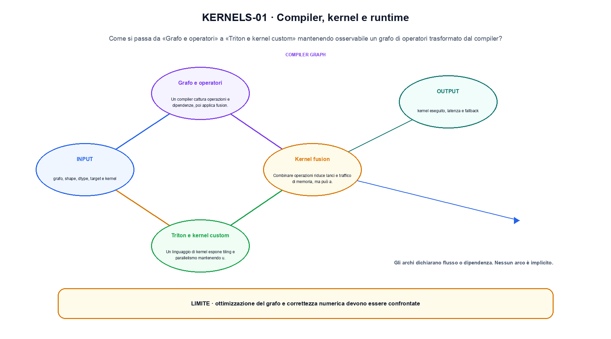
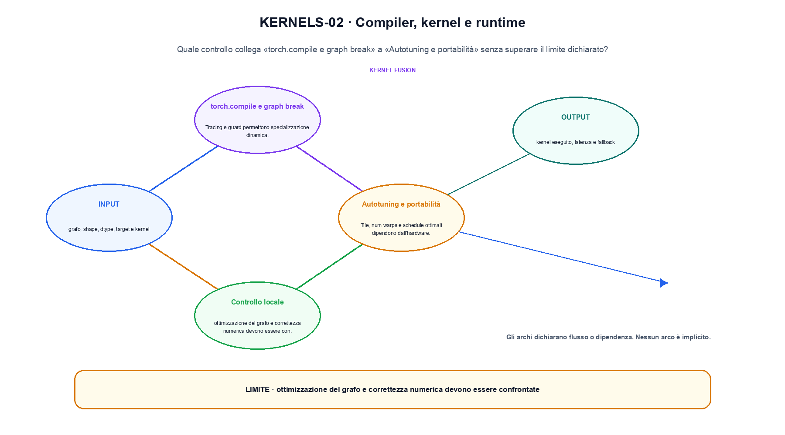

<!--
chapter_id: CH-P12-COMPILERS-KERNELS
part_id: P12
order_key: 810
title: Compiler, kernel e runtime
maturity: ESTABLISHED
status: revisione editoriale v2, approvazione autoriale aperta
version: 0.5.0-draft3
last_source_check: 4 agosto 2026
environment: Python 3.13.12, CPU
code_policy: reference
deferred: benchmark applicativi non eseguiti e approvazione autoriale delle visuali
-->

# Capitolo 81. Compiler, kernel e runtime

Compiler, kernel e runtime viene letto come un sistema: «Grafo e operatori» e «Autotuning e portabilità» restano collegati da confini e decisioni osservabili. L'oggetto osservato è un grafo di operatori trasformato dal compiler. Il contratto locale dichiara input, grafo, shape, dtype, target e kernel; operazione, lowering, fusion, autotuning e gestione dei graph break; output, kernel eseguito, latenza e fallback. Il primo esempio osservabile è Tre operatori diventano due gruppi dopo una fusione, con correttezza numerica da confrontare. Il limite da non nascondere è: ottimizzazione del grafo e correttezza numerica devono essere confrontate.

## Grafo e operatori

Un compiler cattura operazioni e dipendenze, poi applica fusion, scheduling e layout transformation. [SRC-81-001]

Compiler e runtime trasformano il grafo in operazioni del backend.

**Caso da seguire.** Tre operatori diventano due gruppi dopo una fusione, con correttezza numerica da confrontare.

**Controllo.** Per «Grafo e operatori», registra richiesta, decisione, stato e output finale. Nel caso «Grafo e operatori», un esito plausibile non deve nascondere il componente che lo ha prodotto.


## Kernel fusion

Combinare operazioni riduce lanci e traffico di memoria, ma può aumentare register pressure e ridurre riuso. [SRC-81-002]

**Caso da seguire.** La stessa operazione misurata separando bytes mossi, tempo del kernel e latenza end-to-end.

**Controllo.** Ripeti «Kernel fusion» con una capability o un'autorizzazione rimossa e verifica che la failure preceda qualsiasi side effect.


La relazione seguente è una mappa operativa e non una misura del sistema.

**Schema concettuale.** `kernel = lower(graph, target)`

Compiler e runtime trasformano il grafo in operazioni del backend. [SRC-81-001]




La prima figura segue il percorso da «Grafo e operatori» a «Triton e kernel custom».


## Triton e kernel custom

Un linguaggio di kernel espone tiling e parallelismo mantenendo una astrazione più alta rispetto a CUDA. [SRC-81-003]

**Caso da seguire.** Per «Triton e kernel custom» si mantiene l'input del capitolo e si isola questa condizione: Un linguaggio di kernel espone tiling e parallelismo mantenendo una astrazione più alta rispetto a CUDA.

**Controllo.** Per «Triton e kernel custom», separa il test del singolo componente dal test end-to-end, usando lo stesso input e la stessa configurazione versionata.


## torch.compile e graph break

Tracing e guard permettono specializzazione dinamica. Python side effect o shape non supportate producono graph break. [SRC-81-004]

**Caso da seguire.** Ridurre i byte per elemento cambia memoria e potenzialmente errore. Il controllo richiede confronto numerico oltre alla misura di tempo.

**Controllo.** Per «torch.compile e graph break», introduci una failure a un solo confine e controlla che log, stato e recovery identifichino quel confine senza ambiguità.


## Autotuning e portabilità

Tile, num warps e schedule ottimali dipendono dall'hardware. Un kernel corretto richiede test numerici e benchmark separati. [SRC-81-001]

**Caso da seguire.** Per «Autotuning e portabilità» si mantiene l'input del capitolo e si isola questa condizione: Tile, num warps e schedule ottimali dipendono dall'hardware.

**Controllo.** Per «Autotuning e portabilità», confronta il comportamento completo, non soltanto l'ultimo messaggio. Nel caso «Autotuning e portabilità», il risultato resta limitato da: Un kernel corretto richiede test numerici e benchmark separati.




La seconda figura mette a confronto «torch.compile e graph break» e il limite discusso in «Autotuning e portabilità».


## Esempio Python eseguito

Il caso computazionale di compiler, kernel e runtime è riportato senza trasformazioni: il file e l'output sono quelli verificati. Per «Compiler, kernel e runtime», il caso di default usa valori piccoli per isolare il meccanismo. La suite conserva inoltre una failure esplicita per separare il contratto osservato da «compiler, kernel e runtime».

```python
def contract(case: str = "default"):
    if case != "default":
        raise ValueError("only the documented default case is supported")
    graph = ["matmul", "add", "relu"]
    fused = ["matmul_add", "relu"]
    return {"original_ops": len(graph), "fused_ops": len(fused), "invariant": "compiler optimization preserves the declared operator result"}
```

Esecuzione con `python snip_81_contract.py`:

```text
{"fused_ops": 2, "invariant": "compiler optimization preserves the declared operator result", "original_ops": 3}
```

Il test associato è [`code/test_81_contract.py`](code/test_81_contract.py); l'output versionato è [`code/outputs/SNIP-81-001.txt`](code/outputs/SNIP-81-001.txt).


## Come si collegano i passaggi

- **Da «Grafo e operatori» a «Kernel fusion».** Un compiler cattura operazioni e dipendenze, poi applica fusion, scheduling e layout transformation. Combinare operazioni riduce lanci e traffico di memoria, ma può aumentare register pressure e ridurre riuso. «Grafo e operatori» nomina il confine e «Kernel fusion» implementa il percorso senza ereditare autorizzazioni implicite. Da «Grafo e operatori» a «Kernel fusion» cambia la domanda osservabile. [SRC-81-001; SRC-81-002]

- **Da «Kernel fusion» a «Triton e kernel custom».** Combinare operazioni riduce lanci e traffico di memoria, ma può aumentare register pressure e ridurre riuso. Un linguaggio di kernel espone tiling e parallelismo mantenendo una astrazione più alta rispetto a CUDA. Componendo «Kernel fusion» e «Triton e kernel custom» diventa necessario conservare stato, identità e decisione. Il passaggio successivo rende misurabile «Triton e kernel custom». [SRC-81-002; SRC-81-003]

- **Da «Triton e kernel custom» a «torch.compile e graph break».** Un linguaggio di kernel espone tiling e parallelismo mantenendo una astrazione più alta rispetto a CUDA. Tracing e guard permettono specializzazione dinamica. «torch.compile e graph break» introduce failure e recovery prima di un side effect o di una perdita di stato. Da «Triton e kernel custom» a «torch.compile e graph break» cambia la domanda osservabile. [SRC-81-003; SRC-81-004]

- **Da «torch.compile e graph break» a «Autotuning e portabilità».** Tracing e guard permettono specializzazione dinamica. Tile, num warps e schedule ottimali dipendono dall'hardware. La chiusura su «Autotuning e portabilità» valuta il sistema completo, non soltanto il componente iniziale. Il passaggio successivo rende misurabile «Autotuning e portabilità». [SRC-81-004; SRC-81-001]

La catena completa produce kernel eseguito, latenza e fallback a partire da grafo, shape, dtype, target e kernel. Ogni collegamento conserva un oggetto osservabile diverso; per questo il risultato non può essere esteso oltre il limite dichiarato: ottimizzazione del grafo e correttezza numerica devono essere confrontate.


## Prove sui confini del sistema

1. Ricostruisci «Grafo e operatori» con un esempio diverso da quello mostrato e indica l'output atteso prima del calcolo.
2. Nel passaggio «Kernel fusion», cambia una sola ipotesi e spiega quale risultato non è più confrontabile.
3. Collega «Triton e kernel custom» a una riga dello snippet oppure motiva perché la prova deve essere documentale.
4. Progetta un caso limite per «torch.compile e graph break» che produca una failure riconoscibile.
5. Per «Autotuning e portabilità», separa una conclusione sostenuta dal caso locale da una che richiederebbe nuovi dati o un benchmark.


## Il confine operativo

La lezione parte da «grafo, shape, dtype, target e kernel» e arriva fino a «kernel eseguito, latenza e fallback». Il limite da conservare è questo: ottimizzazione del grafo e correttezza numerica devono essere confrontate. Il confine di «Autotuning e portabilità» va ricontrollato tra claim, fonti e artefatti: i rinvii sono [`FONTI_PRIMARIE.md`](FONTI_PRIMARIE.md), [`CLAIMS.md`](CLAIMS.md) e `code/`.
