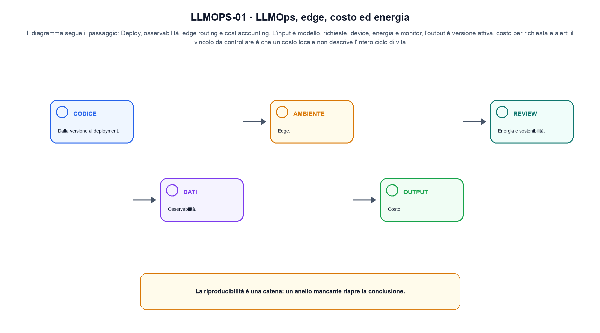
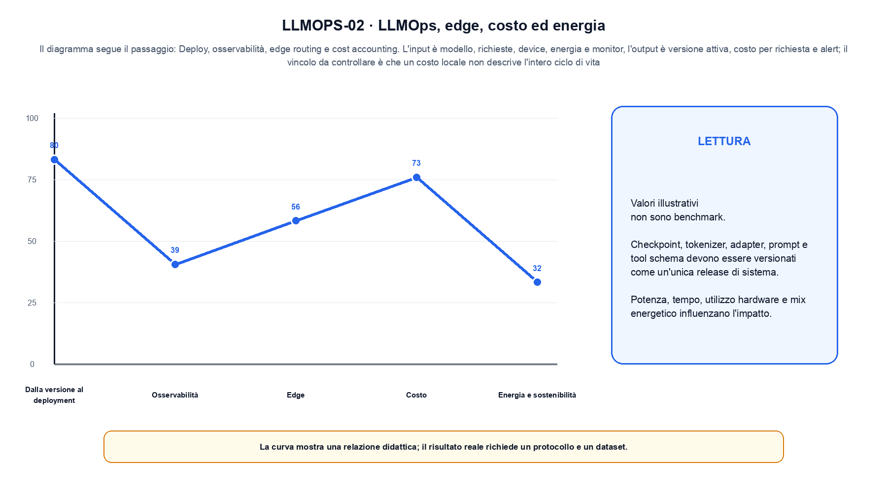

<!--
chapter_id: CH-P12-LLMOPS
part_id: P12
order_key: 820
title: LLMOps, edge, costo ed energia
maturity: CORE
status: candidatura completa in revisione autoriale
version: 0.4.0-draft2
last_source_check: 3 agosto 2026
environment: Python 3.13.12, CPU
deferred: benchmark applicativi, varianti non necessarie al contratto centrale e approvazione autoriale
-->

# Capitolo 82. LLMOps, edge, costo ed energia

Il risultato precedente non è ancora una soluzione completa. Partiamo da un servizio LLM dalla versione al consumo e dalla richiesta «Il pacco non è arrivato» come esempio comune; per arrivare all'output «versione attiva, costo per richiesta e alert» isoliamo il passaggio «deploy, osservabilità, edge routing e cost accounting» e ne misuriamo il limite prima di passare a Progettare una valutazione.

## Dalla versione al deployment

Checkpoint, tokenizer, adapter, prompt e tool schema devono essere versionati come un'unica release di sistema. [SRC-82-001]

Il caso minimo di «Dalla versione al deployment» si presenta così: un record associa versione del modello, token, energia e costo per richiesta. Non lo usiamo come decorazione: serve a rendere osservabile la frase «Checkpoint, tokenizer, adapter, prompt e tool schema devono essere versionati come un'unica release di sistema».

Per ricostruire «Dalla versione al deployment» annotiamo l'input «modello, richieste, device, energia e monitor», poi l'operazione «deploy, osservabilità, edge routing e cost accounting», infine l'output «versione attiva, costo per richiesta e alert». Questa sequenza impedisce di scambiare una forma compatibile per il comportamento descritto dalla fonte. Il controllo parte da «Checkpoint, tokenizer, adapter, prompt e tool schema devono essere versionati come un'unica release di sistema».

L'ottimizzazione modifica rappresentazione, memoria, calcolo o scheduling sotto un carico dichiarato. Per attribuire il beneficio bisogna separare il guadagno locale da latenza, qualità e costo end-to-end. Per «Dalla versione al deployment» il controllo cambia una sola premessa della frase «Checkpoint, tokenizer, adapter, prompt e tool schema devono essere versionati come un'unica release di sistema» e conserva input, output e criterio di successo, così la differenza resta attribuibile. La verifica resta ancorata a «Checkpoint, tokenizer, adapter, prompt e tool schema devono essere versionati come un'unica release di sistema». [SRC-82-001]

Il punto didattico di «Dalla versione al deployment» è separare ciò che la fonte afferma da ciò che il piccolo caso illustra. L'output «versione attiva, costo per richiesta e alert» mostra il contratto locale, ma non sostituisce una misura sul sistema completo.

Il controllo minimo di «Dalla versione al deployment» confronta il caso dichiarato con una variazione che rompe la sua ipotesi. Se la failure non è distinguibile dall'esito valido, manca un'osservazione nel contratto di latency, memoria e throughput. Da «Dalla versione al deployment» portiamo l'output «versione attiva, costo per richiesta e alert»; non portiamo invece una conclusione oltre il caso locale.

## Osservabilità

Log, trace, metriche e feedback collegano input, modello, retrieval, tool e output senza esporre dati oltre il necessario. [SRC-82-002]

Prima del nome tecnico fissiamo la situazione: consideriamo costo per richiesta con energia e quota hardware separate. Da qui possiamo leggere la conseguenza dichiarata da «Log, trace, metriche e feedback collegano input, modello, retrieval, tool e output senza esporre dati oltre il necessario».

Nel contratto locale, l'input «modello, richieste, device, energia e monitor» entra, l'operazione «deploy, osservabilità, edge routing e cost accounting» modifica il percorso e l'output «versione attiva, costo per richiesta e alert» è ciò che osserviamo. Qui cambia soprattutto il passaggio «Osservabilità»; resta da controllare che un costo locale non descrive l'intero ciclo di vita. La domanda locale è «Log, trace, metriche e feedback collegano input, modello, retrieval, tool e output senza esporre dati oltre il necessario».

L'ottimizzazione modifica rappresentazione, memoria, calcolo o scheduling sotto un carico dichiarato. Per attribuire il beneficio bisogna separare il guadagno locale da latenza, qualità e costo end-to-end. Per «Osservabilità» il controllo cambia una sola premessa della frase «Log, trace, metriche e feedback collegano input, modello, retrieval, tool e output senza esporre dati oltre il necessario» e conserva input, output e criterio di successo, così la differenza resta attribuibile. La verifica resta ancorata a «Log, trace, metriche e feedback collegano input, modello, retrieval, tool e output senza esporre dati oltre il necessario». [SRC-82-002]

La lettura va fatta in ordine: prima il caso, poi la trasformazione, quindi la conseguenza. Il piccolo risultato resta un'illustrazione di «Log, trace, metriche e feedback collegano input, modello, retrieval, tool e output senza esporre dati oltre il necessario», non una promessa generale.

La prova di «Osservabilità» conserva input, operazione e output; poi esplicita quale parte di «Log, trace, metriche e feedback collegano input, modello, retrieval, tool e output senza esporre dati oltre il necessario» non è stata misurata. Così il test separa l'evidenza dall'inferenza. Il passaggio successivo, «Edge», potrà cambiare una sola condizione, dichiarando il nuovo setup prima di interpretare il risultato.

## Edge

Dispositivi locali impongono memoria, batteria, termica e compatibilità dei kernel. Offline e privacy possono motivare il deployment locale. [SRC-82-003]

Per capire «Edge» partiamo da questo caso: un caso in cui un costo locale non descrive l'intero ciclo di vita. Il caso rende osservabile il punto centrale: «Dispositivi locali impongono memoria, batteria, termica e compatibilità dei kernel».

La sezione usa l'input «modello, richieste, device, energia e monitor» come punto di partenza e l'output «versione attiva, costo per richiesta e alert» come traccia d'uscita. La trasformazione concreta è «deploy, osservabilità, edge routing e cost accounting»; il caso non è completo se non dichiariamo anche che un costo locale non descrive l'intero ciclo di vita. La condizione da isolare è «Dispositivi locali impongono memoria, batteria, termica e compatibilità dei kernel».

L'ottimizzazione modifica rappresentazione, memoria, calcolo o scheduling sotto un carico dichiarato. Per attribuire il beneficio bisogna separare il guadagno locale da latenza, qualità e costo end-to-end. Per «Edge» il controllo cambia una sola premessa della frase «Dispositivi locali impongono memoria, batteria, termica e compatibilità dei kernel» e conserva input, output e criterio di successo, così la differenza resta attribuibile. La verifica resta ancorata a «Dispositivi locali impongono memoria, batteria, termica e compatibilità dei kernel». [SRC-82-003]

Se cambiamo una premessa, dobbiamo riaprire l'interpretazione. Per «Edge» conserviamo l'osservazione collegata a «Dispositivi locali impongono memoria, batteria, termica e compatibilità dei kernel» e lasciamo esplicitamente fuori ciò che non è stato misurato.

Per verificare «Edge» cambiamo una sola condizione vicina alla frase «Dispositivi locali impongono memoria, batteria, termica e compatibilità dei kernel», teniamo fermo il resto e registriamo l'output «versione attiva, costo per richiesta e alert». Il caso negativo deve rendere riconoscibile la failure, non soltanto produrre un numero diverso. La sezione successiva, «Costo», riceve l'output «versione attiva, costo per richiesta e alert» come base, ma dovrà formulare e verificare la propria distinzione.

La figura LLMOPS-01 usa la famiglia checklist. Il diagramma segue il passaggio: Deploy, osservabilità, edge routing e cost accounting. L'input è modello, richieste, device, energia e monitor, l'output è versione attiva, costo per richiesta e alert; il vincolo da controllare è che un costo locale non descrive l'intero ciclo di vita.

## Costo

Costo per token, richiesta, utente e risultato utile sono metriche differenti. Cache e batching modificano l'allocazione. [SRC-82-004]

Il caso minimo di «Costo» si presenta così: un batch di richieste eterogenee in cui throughput, coda e time-to-first-token vengono misurati separatamente. Non lo usiamo come decorazione: serve a rendere osservabile la frase «Costo per token, richiesta, utente e risultato utile sono metriche differenti».

Per ricostruire «Costo» annotiamo l'input «modello, richieste, device, energia e monitor», poi l'operazione «deploy, osservabilità, edge routing e cost accounting», infine l'output «versione attiva, costo per richiesta e alert». Questa sequenza impedisce di scambiare una forma compatibile per il comportamento descritto dalla fonte. Il controllo parte da «Costo per token, richiesta, utente e risultato utile sono metriche differenti».

L'ottimizzazione modifica rappresentazione, memoria, calcolo o scheduling sotto un carico dichiarato. Per attribuire il beneficio bisogna separare il guadagno locale da latenza, qualità e costo end-to-end. La misura separa costo locale, coda e latenza end-to-end sotto un carico dichiarato, così il miglioramento non resta confinato al kernel. La verifica resta ancorata a «Costo per token, richiesta, utente e risultato utile sono metriche differenti». [SRC-82-004]

Il punto didattico di «Costo» è separare ciò che la fonte afferma da ciò che il piccolo caso illustra. L'output «versione attiva, costo per richiesta e alert» mostra il contratto locale, ma non sostituisce una misura sul sistema completo.

Il controllo minimo di «Costo» confronta il caso dichiarato con una variazione che rompe la sua ipotesi. Se la failure non è distinguibile dall'esito valido, manca un'osservazione nel contratto di latency, memoria e throughput. Da «Costo» portiamo l'output «versione attiva, costo per richiesta e alert»; non portiamo invece una conclusione oltre il caso locale.

## Energia e sostenibilità

Potenza, tempo, utilizzo hardware e mix energetico influenzano l'impatto. Stime devono dichiarare confini e metodologia. [SRC-82-001]

Prima del nome tecnico fissiamo la situazione: consideriamo un batch di richieste eterogenee in cui throughput, coda e time-to-first-token vengono misurati separatamente. Da qui possiamo leggere la conseguenza dichiarata da «Potenza, tempo, utilizzo hardware e mix energetico influenzano l'impatto».

Nel contratto locale, l'input «modello, richieste, device, energia e monitor» entra, l'operazione «deploy, osservabilità, edge routing e cost accounting» modifica il percorso e l'output «versione attiva, costo per richiesta e alert» è ciò che osserviamo. Qui cambia soprattutto il passaggio «Energia e sostenibilità»; resta da controllare che un costo locale non descrive l'intero ciclo di vita. La domanda locale è «Potenza, tempo, utilizzo hardware e mix energetico influenzano l'impatto».

L'ottimizzazione modifica rappresentazione, memoria, calcolo o scheduling sotto un carico dichiarato. Per attribuire il beneficio bisogna separare il guadagno locale da latenza, qualità e costo end-to-end. La misura separa costo locale, coda e latenza end-to-end sotto un carico dichiarato, così il miglioramento non resta confinato al kernel. La verifica resta ancorata a «Potenza, tempo, utilizzo hardware e mix energetico influenzano l'impatto». [SRC-82-001]

La lettura va fatta in ordine: prima il caso, poi la trasformazione, quindi la conseguenza. Stime devono dichiarare confini e metodologia. Il piccolo risultato resta un'illustrazione di «Potenza, tempo, utilizzo hardware e mix energetico influenzano l'impatto», non una promessa generale.

La prova di «Energia e sostenibilità» conserva input, operazione e output; poi esplicita quale parte di «Potenza, tempo, utilizzo hardware e mix energetico influenzano l'impatto» non è stata misurata. Così il test separa l'evidenza dall'inferenza. Il caso finale consegna l'output «versione attiva, costo per richiesta e alert» come evidenza locale e conserva la misura end-to-end sotto carico dichiarato come domanda aperta.

## Un caso dall'input all'output: Dalla versione al deployment

Il caso intero parte dall'input «modello, richieste, device, energia e monitor», applica l'operazione «deploy, osservabilità, edge routing e cost accounting» e osserva l'output «versione attiva, costo per richiesta e alert». Un esempio controllato: costo per richiesta con energia e quota hardware separate. Lo schema compatto è:

$$
cost = energy + hardware + requests
$$

È una notazione di interfaccia, non un'identità numerica completa. Costo e consumo dipendono dall'intero servizio e dall'intensità d'uso. [SRC-82-001]

La figura LLMOPS-02 cambia composizione rispetto alla prima. Il diagramma segue il passaggio: Deploy, osservabilità, edge routing e cost accounting. L'input è modello, richieste, device, energia e monitor, l'output è versione attiva, costo per richiesta e alert; il vincolo da controllare è che un costo locale non descrive l'intero ciclo di vita.

## Dal meccanismo alla prova locale: Osservabilità

Nel run Python rendiamo osservabile la frase «Checkpoint, tokenizer, adapter, prompt e tool schema devono essere versionati come un'unica release di sistema» con valori piccoli e leggibili. Il test associato verifica determinismo, output e rifiuto di una condizione incoerente; il file di output `code/outputs/SNIP-82-001.txt` documenta il caso senza pretendere una misura generale.

## Dove il risultato si ferma: Energia e sostenibilità

Il meccanismo di «LLMOps, edge, costo ed energia» non garantisce da solo che il sistema funzioni fuori dal caso guida. Un costo locale non descrive l'intero ciclo di vita. Il limite osservato riguarda la frase «Checkpoint, tokenizer, adapter, prompt e tool schema devono essere versionati come un'unica release di sistema»; per trasferire il concetto occorre riaprire la verifica quando cambiano dati, scala o ambiente.

## Che cosa portiamo avanti: LLMOps, edge, costo ed energia

Il percorso ha tenuto insieme un servizio LLM dalla versione al consumo, l'operazione «deploy, osservabilità, edge routing e cost accounting» e l'output «versione attiva, costo per richiesta e alert». Le sezioni «Dalla versione al deployment», «Osservabilità», «Energia e sostenibilità» mostrano come il protocollo osservato delimiti ciò che il capitolo può sostenere. L'invariante da portare avanti è: un costo locale non descrive l'intero ciclo di vita. Il Capitolo 83, Progettare una valutazione, può partire da questo output e dichiarare la propria domanda.

### Verifica di comprensione: Dalla versione al deployment

1. Ricostruisci l'oggetto continuo a partire da «Dalla versione al deployment» e indica quale parte della frase «Checkpoint, tokenizer, adapter, prompt e tool schema devono essere versionati come un'unica release di sistema» entra nel caso.
2. Spiega quale trasformazione collega «Dalla versione al deployment» a «Energia e sostenibilità» e quale output osserviamo nel passaggio.
3. Usa lo snippet per controllare l'invariante del contratto: un costo locale non descrive l'intero ciclo di vita.
4. Separa una definizione sostenuta da una fonte, un esempio illustrativo e un risultato locale del caso guida.
5. Indica quale parte della frase «Potenza, tempo, utilizzo hardware e mix energetico influenzano l'impatto» richiederebbe una misura nuova prima di essere estesa oltre il caso osservato.

### Esercizi di trasferimento: Energia e sostenibilità

1. Racconta «Dalla versione al deployment» come una trasformazione: che cosa entra e che cosa esce?
2. Confronta due esecuzioni di «Osservabilità» mantenendo il resto del setup invariato.
3. Per «Edge», separa l'esempio locale dal limite che impedisce di generalizzarlo.
4. Progetta una prova per «Costo» che renda visibile il suo confine.
5. Scrivi una metrica o una domanda per valutare «Energia e sostenibilità» senza confondere livelli diversi.

## Fonti, codice e materiali: LLMOps, edge, costo ed energia

Per «LLMOps, edge, costo ed energia», le fonti portanti, i limiti dei claim e la data di consultazione sono raccolti in `FONTI_PRIMARIE.md`; la ricerca riguarda soprattutto latency, memoria e throughput. `CLAIMS.md` separa definizioni e risultati locali; codice, ambiente, test e output sono nella cartella `code/`, con attenzione a latency, memoria e throughput.
