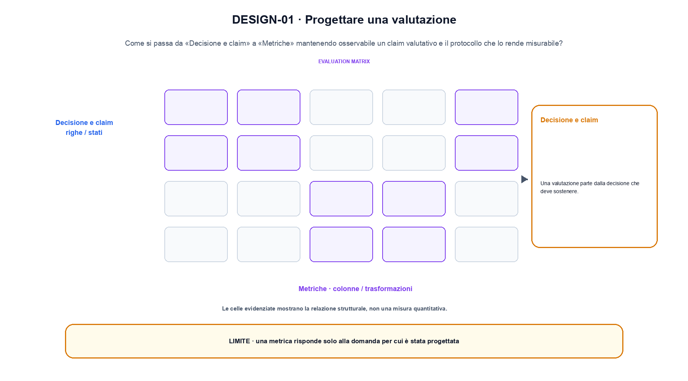
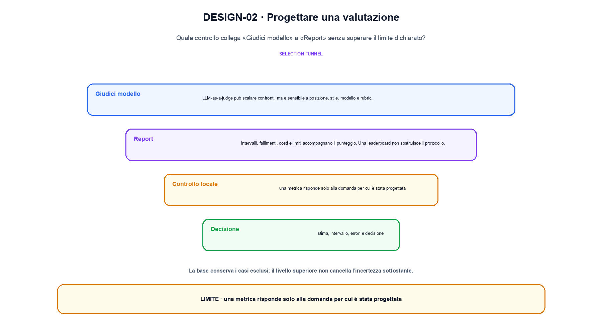

<!--
chapter_id: CH-P13-EVAL-DESIGN
part_id: P13
order_key: 830
title: Progettare una valutazione
maturity: CORE
status: revisione editoriale v2, approvazione autoriale aperta
version: 0.5.0-draft3
last_source_check: 4 agosto 2026
environment: Python 3.13.12, CPU
code_policy: reference
deferred: benchmark applicativi non eseguiti e approvazione autoriale delle visuali
-->

# Capitolo 83. Progettare una valutazione

Questa mappa di progettare una valutazione parte da «Decisione e claim» e arriva a «Report» conservando le proprietà che non sono state misurate. L'oggetto osservato è un claim valutativo e il protocollo che lo rende misurabile. Il contratto locale dichiara input, task, dataset, predizioni, riferimento e metriche; operazione, scelta della metrica, giudice, slice e report; output, stima, intervallo, errori e decisione. Il caso di partenza è Quattro predizioni producono accuracy pari a 0,75 e una failure esplicita. Il limite da non nascondere è: una metrica risponde solo alla domanda per cui è stata progettata.

## Decisione e claim

Una valutazione parte dalla decisione che deve sostenere. Il claim deve nominare popolazione, condizioni, metrica e incertezza. [SRC-83-001]

La metrica ha significato soltanto rispetto alla domanda di valutazione.

**Caso da seguire.** Quattro predizioni producono accuracy pari a 0,75 e una failure esplicita.

**Controllo.** Per «Decisione e claim», classifica lo stesso caso lungo un solo asse alla volta e annota quale proprietà non è stata misurata.


## Task e dataset

Prompt, input, reference e rubric devono rappresentare l'uso previsto. Split e cutoff impediscono contaminazione intenzionale. [SRC-83-002]

**Caso da seguire.** Due record con ID, testo, licenza e timestamp che attraversano una sola trasformazione registrata.

**Controllo.** Cambia la proprietà che distingue «Task e dataset» dalle categorie vicine. Nel caso «Task e dataset», se la classificazione non cambia, la distinzione va formulata meglio.


## Metriche

Metriche automatiche, giudizi umani e verificatori misurano proprietà differenti. Aggregazione e slice devono essere predefinite. [SRC-83-003]

**Caso da seguire.** Quattro casi con protocollo, una failure e una slice conservati insieme al valore aggregato.

**Controllo.** Per «Metriche», confronta un caso positivo e uno di confine usando la medesima definizione; non trasformare l'esempio in una graduatoria generale.


Lo schema seguente rende esplicito il confine tra il meccanismo e la sua valutazione.

**Schema concettuale.** `estimate = metric(outputs, references, protocol)`

La metrica ha significato soltanto rispetto alla domanda di valutazione. [SRC-83-001]




La prima figura segue il percorso da «Decisione e claim» a «Metriche».


## Giudici modello

LLM-as-a-judge può scalare confronti, ma è sensibile a posizione, stile, modello e rubric. Serve calibrazione con giudizi indipendenti. [SRC-83-004]

**Caso da seguire.** Per «Giudici modello» si mantiene l'input del capitolo e si isola questa condizione: LLM-as-a-judge può scalare confronti, ma è sensibile a posizione, stile, modello e rubric.

**Controllo.** Indica quale osservazione smentirebbe l'assegnazione del caso a «Giudici modello» e quale invece sarebbe irrilevante.


## Report

Intervalli, fallimenti, costi e limiti accompagnano il punteggio. Una leaderboard non sostituisce il protocollo. [SRC-83-001]

**Caso da seguire.** Per «Report» si mantiene l'input del capitolo e si isola questa condizione: Intervalli, fallimenti, costi e limiti accompagnano il punteggio.

**Controllo.** Per «Report», limita la conclusione alla proprietà dichiarata: Una leaderboard non sostituisce il protocollo. Nel caso «Report», le dimensioni non osservate restano aperte.


## Esempio Python eseguito

La prova locale di progettare una valutazione parte da un esempio minimo, registrato nel repository insieme ai suoi test. Per «Progettare una valutazione», il caso di default usa valori piccoli per isolare il meccanismo. La prova negativa riguarda proprio «progettare una valutazione» e interrompe l'interpretazione prima dell'output.

```python
def contract(case: str = "default"):
    if case != "default":
        raise ValueError("only the documented default case is supported")
    predictions = [1, 1, 0, 1]
    labels = [1, 0, 0, 1]
    correct = sum(prediction == label for prediction, label in zip(predictions, labels))
    failures = [index for index, pair in enumerate(zip(predictions, labels)) if pair[0] != pair[1]]
    return {"accuracy": correct / len(labels), "failures": failures, "invariant": "a metric is reported with its decision target and failure cases"}
```

Esecuzione con `python snip_83_contract.py`:

```text
{"accuracy": 0.75, "failures": [1], "invariant": "a metric is reported with its decision target and failure cases"}
```

Il test associato è [`code/test_83_contract.py`](code/test_83_contract.py); l'output versionato è [`code/outputs/SNIP-83-001.txt`](code/outputs/SNIP-83-001.txt).




La seconda figura mette a confronto «Giudici modello» e il limite discusso in «Report».


## Come si collegano i passaggi

- **Da «Decisione e claim» a «Task e dataset».** Una valutazione parte dalla decisione che deve sostenere. Prompt, input, reference e rubric devono rappresentare l'uso previsto. «Decisione e claim» stabilisce l'asse e «Task e dataset» aggiunge una proprietà senza creare una graduatoria. Da «Decisione e claim» a «Task e dataset» cambia la domanda osservabile. [SRC-83-001; SRC-83-002]

- **Da «Task e dataset» a «Metriche».** Prompt, input, reference e rubric devono rappresentare l'uso previsto. Metriche automatiche, giudizi umani e verificatori misurano proprietà differenti. Il confronto tra «Task e dataset» e «Metriche» mantiene le categorie distinguibili sullo stesso caso. Il passaggio successivo rende misurabile «Metriche». [SRC-83-002; SRC-83-003]

- **Da «Metriche» a «Giudici modello».** Metriche automatiche, giudizi umani e verificatori misurano proprietà differenti. LLM-as-a-judge può scalare confronti, ma è sensibile a posizione, stile, modello e rubric. «Giudici modello» mostra il punto in cui l'asse di «Metriche» non è più sufficiente. Da «Metriche» a «Giudici modello» cambia la domanda osservabile. [SRC-83-003; SRC-83-004]

- **Da «Giudici modello» a «Report».** LLM-as-a-judge può scalare confronti, ma è sensibile a posizione, stile, modello e rubric. Intervalli, fallimenti, costi e limiti accompagnano il punteggio. Il passaggio su «Report» riunisce più dimensioni senza cancellarne i limiti. Il passaggio successivo rende misurabile «Report». [SRC-83-004; SRC-83-001]

La catena completa produce stima, intervallo, errori e decisione a partire da task, dataset, predizioni, riferimento e metriche. Ogni collegamento conserva un oggetto osservabile diverso; per questo il risultato non può essere esteso oltre il limite dichiarato: una metrica risponde solo alla domanda per cui è stata progettata.


## Domande per distinguere le categorie

1. Ricostruisci «Decisione e claim» con un esempio diverso da quello mostrato e indica l'output atteso prima del calcolo.
2. Nel passaggio «Task e dataset», cambia una sola ipotesi e spiega quale risultato non è più confrontabile.
3. Collega «Metriche» a una riga dello snippet oppure motiva perché la prova deve essere documentale.
4. Progetta un caso limite per «Giudici modello» che produca una failure riconoscibile.
5. Per «Report», separa una conclusione sostenuta dal caso locale da una che richiederebbe nuovi dati o un benchmark.


## Una mappa, non una graduatoria

La lezione parte da «task, dataset, predizioni, riferimento e metriche» e arriva fino a «stima, intervallo, errori e decisione». Il limite da conservare è questo: una metrica risponde solo alla domanda per cui è stata progettata. Il confronto di «Report» resta verificabile nei dossier [`FONTI_PRIMARIE.md`](FONTI_PRIMARIE.md) e [`CLAIMS.md`](CLAIMS.md), senza trasformare la mappa in una graduatoria.
