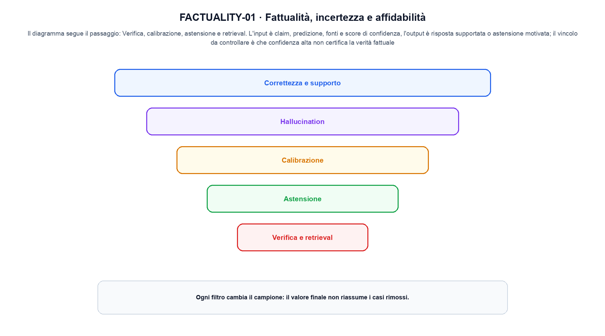
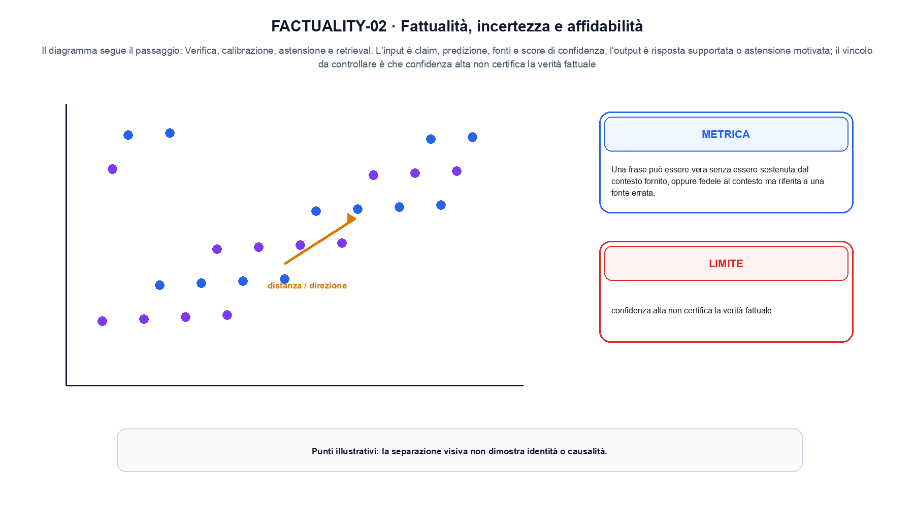

<!--
chapter_id: CH-P13-FACTUALITY
part_id: P13
order_key: 840
title: Fattualità, incertezza e affidabilità
maturity: CORE
status: candidatura completa in revisione autoriale
version: 0.4.0-draft2
last_source_check: 3 agosto 2026
environment: Python 3.13.12, CPU
deferred: benchmark applicativi, varianti non necessarie al contratto centrale e approvazione autoriale
-->

# Capitolo 84. Fattualità, incertezza e affidabilità

Una frase plausibile non basta a spiegare fattualità, incertezza e affidabilità. L'oggetto è una risposta con evidenza, confidenza e possibilità di errore; riprendiamo la richiesta «Il pacco non è arrivato» come contesto comune, partiamo da un input piccolo, rendiamo visibile l'operazione e fissiamo che cosa non possiamo concludere.

## Correttezza e supporto

Una frase può essere vera senza essere sostenuta dal contesto fornito, oppure fedele al contesto ma riferita a una fonte errata. [SRC-84-001]

Per capire «Correttezza e supporto» partiamo da questo caso: una risposta con score 0,95 può essere falsa, perciò la confidence viene confrontata con la correttezza. Il caso rende osservabile il punto centrale: «Una frase può essere vera senza essere sostenuta dal contesto fornito, oppure fedele al contesto ma riferita a una fonte errata».

Nel contratto locale, l'input «claim, predizione, fonti e score di confidenza» entra, l'operazione «verifica, calibrazione, astensione e retrieval» modifica il percorso e l'output «risposta supportata o astensione motivata» è ciò che osserviamo. Qui cambia soprattutto il passaggio «Correttezza e supporto»; resta da controllare che confidenza alta non certifica la verità fattuale. La domanda locale è «Una frase può essere vera senza essere sostenuta dal contesto fornito, oppure fedele al contesto ma riferita a una fonte errata».

La valutazione parte dalla decisione che il risultato deve sostenere e conserva popolazione, protocollo, misura, failure e incertezza. Un punteggio aggregato è utile soltanto dentro questo perimetro. Per «Correttezza e supporto» il controllo cambia una sola premessa della frase «Una frase può essere vera senza essere sostenuta dal contesto fornito, oppure fedele al contesto ma riferita a una fonte errata» e conserva input, output e criterio di successo, così la differenza resta attribuibile. La verifica resta ancorata a «Una frase può essere vera senza essere sostenuta dal contesto fornito, oppure fedele al contesto ma riferita a una fonte errata». [SRC-84-001]

La lettura va fatta in ordine: prima il caso, poi la trasformazione, quindi la conseguenza. Il piccolo risultato resta un'illustrazione di «Una frase può essere vera senza essere sostenuta dal contesto fornito, oppure fedele al contesto ma riferita a una fonte errata», non una promessa generale.

Per verificare «Correttezza e supporto» cambiamo una sola condizione vicina alla frase «Una frase può essere vera senza essere sostenuta dal contesto fornito, oppure fedele al contesto ma riferita a una fonte errata», teniamo fermo il resto e registriamo l'output «risposta supportata o astensione motivata». Il caso negativo deve rendere riconoscibile la failure, non soltanto produrre un numero diverso. La sezione successiva, «Hallucination», riceve l'output «risposta supportata o astensione motivata» come base, ma dovrà formulare e verificare la propria distinzione.

## Hallucination

Il termine copre errori diversi: entità inventate, attribuzioni scorrette, contraddizioni e citazioni inesistenti. La tassonomia deve precedere la metrica. [SRC-84-002]

Il caso minimo di «Hallucination» si presenta così: tre risposte corrette e una confidente ma non supportata. Non lo usiamo come decorazione: serve a rendere osservabile la frase «Il termine copre errori diversi: entità inventate, attribuzioni scorrette, contraddizioni e citazioni inesistenti».

La sezione usa l'input «claim, predizione, fonti e score di confidenza» come punto di partenza e l'output «risposta supportata o astensione motivata» come traccia d'uscita. La trasformazione concreta è «verifica, calibrazione, astensione e retrieval»; il caso non è completo se non dichiariamo anche che confidenza alta non certifica la verità fattuale. La condizione da isolare è «Il termine copre errori diversi: entità inventate, attribuzioni scorrette, contraddizioni e citazioni inesistenti».

La valutazione parte dalla decisione che il risultato deve sostenere e conserva popolazione, protocollo, misura, failure e incertezza. Un punteggio aggregato è utile soltanto dentro questo perimetro. Per «Hallucination» il controllo cambia una sola premessa della frase «Il termine copre errori diversi: entità inventate, attribuzioni scorrette, contraddizioni e citazioni inesistenti» e conserva input, output e criterio di successo, così la differenza resta attribuibile. La verifica resta ancorata a «Il termine copre errori diversi: entità inventate, attribuzioni scorrette, contraddizioni e citazioni inesistenti». [SRC-84-002]

Se cambiamo una premessa, dobbiamo riaprire l'interpretazione. Per «Hallucination» conserviamo l'osservazione collegata a «Il termine copre errori diversi: entità inventate, attribuzioni scorrette, contraddizioni e citazioni inesistenti» e lasciamo esplicitamente fuori ciò che non è stato misurato.

Il controllo minimo di «Hallucination» confronta il caso dichiarato con una variazione che rompe la sua ipotesi. Se la failure non è distinguibile dall'esito valido, manca un'osservazione nel contratto di protocollo, slice e decisione. Da «Hallucination» portiamo l'output «risposta supportata o astensione motivata»; non portiamo invece una conclusione oltre il caso locale.

La figura FACTUALITY-01 usa la famiglia funnel. Il diagramma segue il passaggio: Verifica, calibrazione, astensione e retrieval. L'input è claim, predizione, fonti e score di confidenza, l'output è risposta supportata o astensione motivata; il vincolo da controllare è che confidenza alta non certifica la verità fattuale.

## Calibrazione

Probabilità del token, score di un verifier e frequenza empirica devono essere collegati con un protocollo di calibrazione. [SRC-84-003]

Prima del nome tecnico fissiamo la situazione: consideriamo quattro casi con tre esiti corretti e una failure, riportando la media insieme alla slice e al protocollo per «Calibrazione» e all'output risposta supportata o astensione motivata. Da qui possiamo leggere la conseguenza dichiarata da «Probabilità del token, score di un verifier e frequenza empirica devono essere collegati con un protocollo di calibrazione».

Per ricostruire «Calibrazione» annotiamo l'input «claim, predizione, fonti e score di confidenza», poi l'operazione «verifica, calibrazione, astensione e retrieval», infine l'output «risposta supportata o astensione motivata». Questa sequenza impedisce di scambiare una forma compatibile per il comportamento descritto dalla fonte. Il controllo parte da «Probabilità del token, score di un verifier e frequenza empirica devono essere collegati con un protocollo di calibrazione».

La valutazione parte dalla decisione che il risultato deve sostenere e conserva popolazione, protocollo, misura, failure e incertezza. Un punteggio aggregato è utile soltanto dentro questo perimetro. Il controllo confronta valore originale, rappresentazione compressa e ricostruzione, riportando separatamente errore numerico e comportamento sul compito. La verifica resta ancorata a «Probabilità del token, score di un verifier e frequenza empirica devono essere collegati con un protocollo di calibrazione». [SRC-84-003]

Il punto didattico di «Calibrazione» è separare ciò che la fonte afferma da ciò che il piccolo caso illustra. L'output «risposta supportata o astensione motivata» mostra il contratto locale, ma non sostituisce una misura sul sistema completo.

La prova di «Calibrazione» conserva input, operazione e output; poi esplicita quale parte di «Probabilità del token, score di un verifier e frequenza empirica devono essere collegati con un protocollo di calibrazione» non è stata misurata. Così il test separa l'evidenza dall'inferenza. Il passaggio successivo, «Astensione», potrà cambiare una sola condizione, dichiarando il nuovo setup prima di interpretare il risultato.

## Astensione

Un sistema può rifiutare o chiedere chiarimenti quando il rischio è alto. Coverage e accuracy conditional vanno riportate insieme. [SRC-84-004]

Per capire «Astensione» partiamo da questo caso: su un piccolo insieme, la metrica viene calcolata insieme a una slice e a un caso fallito. La media non sostituisce la diagnosi. Il caso rende osservabile il punto centrale: «Un sistema può rifiutare o chiedere chiarimenti quando il rischio è alto».

Nel contratto locale, l'input «claim, predizione, fonti e score di confidenza» entra, l'operazione «verifica, calibrazione, astensione e retrieval» modifica il percorso e l'output «risposta supportata o astensione motivata» è ciò che osserviamo. Qui cambia soprattutto il passaggio «Astensione»; resta da controllare che confidenza alta non certifica la verità fattuale. La domanda locale è «Un sistema può rifiutare o chiedere chiarimenti quando il rischio è alto».

La valutazione parte dalla decisione che il risultato deve sostenere e conserva popolazione, protocollo, misura, failure e incertezza. Un punteggio aggregato è utile soltanto dentro questo perimetro. Per «Astensione» il controllo cambia una sola premessa della frase «Un sistema può rifiutare o chiedere chiarimenti quando il rischio è alto» e conserva input, output e criterio di successo, così la differenza resta attribuibile. La verifica resta ancorata a «Un sistema può rifiutare o chiedere chiarimenti quando il rischio è alto». [SRC-84-004]

La lettura va fatta in ordine: prima il caso, poi la trasformazione, quindi la conseguenza. Coverage e accuracy conditional vanno riportate insieme. Il piccolo risultato resta un'illustrazione di «Un sistema può rifiutare o chiedere chiarimenti quando il rischio è alto», non una promessa generale.

Per verificare «Astensione» cambiamo una sola condizione vicina alla frase «Un sistema può rifiutare o chiedere chiarimenti quando il rischio è alto», teniamo fermo il resto e registriamo l'output «risposta supportata o astensione motivata». Il caso negativo deve rendere riconoscibile la failure, non soltanto produrre un numero diverso. La sezione successiva, «Verifica e retrieval», riceve l'output «risposta supportata o astensione motivata» come base, ma dovrà formulare e verificare la propria distinzione.

## Verifica e retrieval

Fonti esterne possono aumentare supporto, ma retrieval e generazione hanno failure mode separati. La provenienza deve restare tracciabile. [SRC-84-001]

Il caso minimo di «Verifica e retrieval» si presenta così: una query confrontata con tre documenti, conservando ranking, chunk entrati nel contesto e risposta finale. Non lo usiamo come decorazione: serve a rendere osservabile la frase «Fonti esterne possono aumentare supporto, ma retrieval e generazione hanno failure mode separati».

La sezione usa l'input «claim, predizione, fonti e score di confidenza» come punto di partenza e l'output «risposta supportata o astensione motivata» come traccia d'uscita. La trasformazione concreta è «verifica, calibrazione, astensione e retrieval»; il caso non è completo se non dichiariamo anche che confidenza alta non certifica la verità fattuale. La condizione da isolare è «Fonti esterne possono aumentare supporto, ma retrieval e generazione hanno failure mode separati».

La valutazione parte dalla decisione che il risultato deve sostenere e conserva popolazione, protocollo, misura, failure e incertezza. Un punteggio aggregato è utile soltanto dentro questo perimetro. La prova conserva ranking, segmenti entrati nel contesto e risposta, così un errore di recupero non viene attribuito alla generazione. La verifica resta ancorata a «Fonti esterne possono aumentare supporto, ma retrieval e generazione hanno failure mode separati». [SRC-84-001]

Se cambiamo una premessa, dobbiamo riaprire l'interpretazione. Per «Verifica e retrieval» conserviamo l'osservazione collegata a «Fonti esterne possono aumentare supporto, ma retrieval e generazione hanno failure mode separati» e lasciamo esplicitamente fuori ciò che non è stato misurato.

Il controllo minimo di «Verifica e retrieval» confronta il caso dichiarato con una variazione che rompe la sua ipotesi. Se la failure non è distinguibile dall'esito valido, manca un'osservazione nel contratto di protocollo, slice e decisione. La conclusione resta ancorata al protocollo osservato, non al nome della tecnica.

## Il caso minimo e la sua variante: Correttezza e supporto

Il caso intero parte dall'input «claim, predizione, fonti e score di confidenza», applica l'operazione «verifica, calibrazione, astensione e retrieval» e osserva l'output «risposta supportata o astensione motivata». Un esempio controllato: tre risposte corrette e una confidente ma non supportata. La formula locale è:

$$
calibration = P(correct | confidence)
$$

Confidenza, correttezza e factuality sono quantità da separare. [SRC-84-001]

La figura FACTUALITY-02 cambia composizione rispetto alla prima. Il diagramma segue il passaggio: Verifica, calibrazione, astensione e retrieval. L'input è claim, predizione, fonti e score di confidenza, l'output è risposta supportata o astensione motivata; il vincolo da controllare è che confidenza alta non certifica la verità fattuale.

## Che cosa osserva lo snippet: Hallucination

Nel run Python rendiamo osservabile la frase «Una frase può essere vera senza essere sostenuta dal contesto fornito, oppure fedele al contesto ma riferita a una fonte errata» con valori piccoli e leggibili. Il test associato verifica determinismo, output e rifiuto di una condizione incoerente; il file di output `code/outputs/SNIP-84-001.txt` documenta il caso senza pretendere una misura generale.

## Che cosa non dimostra: Verifica e retrieval

Il meccanismo di «Fattualità, incertezza e affidabilità» non garantisce da solo che il sistema funzioni fuori dal caso guida. Confidenza alta non certifica la verità fattuale. Il limite osservato riguarda la frase «Una frase può essere vera senza essere sostenuta dal contesto fornito, oppure fedele al contesto ma riferita a una fonte errata»; per trasferire il concetto occorre riaprire la verifica quando cambiano dati, scala o ambiente.

## La mappa delle condizioni: Fattualità, incertezza e affidabilità

Il percorso ha tenuto insieme una risposta con evidenza, confidenza e possibilità di errore, l'operazione «verifica, calibrazione, astensione e retrieval» e l'output «risposta supportata o astensione motivata». Le sezioni «Correttezza e supporto», «Hallucination», «Verifica e retrieval» mostrano come il protocollo osservato delimiti ciò che il capitolo può sostenere. L'invariante da portare avanti è: confidenza alta non certifica la verità fattuale. Il Capitolo 85, Valutare contesto lungo, RAG, multimodalità e agenti, può partire da questo output e dichiarare la propria domanda.

### Cinque domande di controllo: Correttezza e supporto

1. Ricostruisci l'oggetto continuo a partire da «Correttezza e supporto» e indica quale parte della frase «Una frase può essere vera senza essere sostenuta dal contesto fornito, oppure fedele al contesto ma riferita a una fonte errata» entra nel caso.
2. Spiega quale trasformazione collega «Correttezza e supporto» a «Verifica e retrieval» e quale output osserviamo nel passaggio.
3. Usa lo snippet per controllare l'invariante del contratto: confidenza alta non certifica la verità fattuale.
4. Separa una definizione sostenuta da una fonte, un esempio illustrativo e un risultato locale del caso guida.
5. Indica quale parte della frase «Fonti esterne possono aumentare supporto, ma retrieval e generazione hanno failure mode separati» richiederebbe una misura nuova prima di essere estesa oltre il caso osservato.

### Esercizi per cambiare una condizione: Verifica e retrieval

1. Racconta «Correttezza e supporto» come una trasformazione: che cosa entra e che cosa esce?
2. Confronta due esecuzioni di «Hallucination» mantenendo il resto del setup invariato.
3. Per «Calibrazione», separa l'esempio locale dal limite che impedisce di generalizzarlo.
4. Progetta una prova per «Astensione» che renda visibile il suo confine.
5. Scrivi una metrica o una domanda per valutare «Verifica e retrieval» senza confondere livelli diversi.

## Fonti e risultati locali: Fattualità, incertezza e affidabilità

Per «Fattualità, incertezza e affidabilità», le fonti portanti, i limiti dei claim e la data di consultazione sono raccolti in `FONTI_PRIMARIE.md`; la ricerca riguarda soprattutto protocollo, slice e decisione. `CLAIMS.md` separa definizioni e risultati locali; codice, ambiente, test e output sono nella cartella `code/`, con attenzione a protocollo, slice e decisione.
