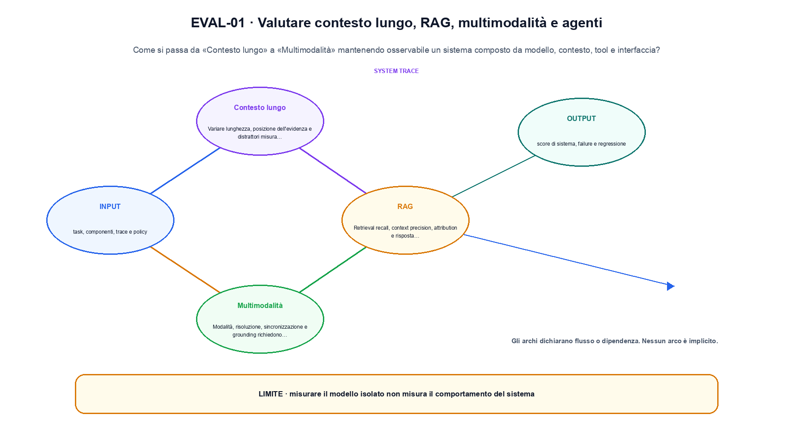
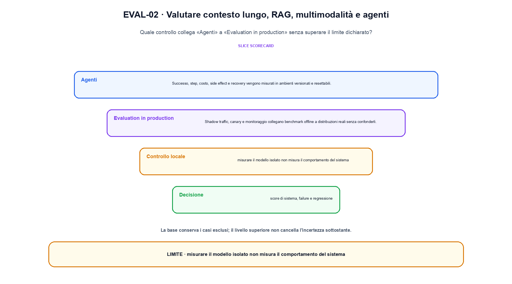

<!--
chapter_id: CH-P13-SYSTEM-EVAL
part_id: P13
order_key: 850
title: Valutare contesto lungo, RAG, multimodalità e agenti
maturity: CORE
status: revisione editoriale v2, approvazione autoriale aperta
version: 0.5.0-draft3
last_source_check: 4 agosto 2026
environment: Python 3.13.12, CPU
code_policy: reference
deferred: benchmark applicativi non eseguiti e approvazione autoriale delle visuali
-->

# Capitolo 85. Valutare contesto lungo, RAG, multimodalità e agenti

La domanda guida di questa lezione è come collegare «Contesto lungo» e «Evaluation in production» senza perdere il contratto tecnico di valutare contesto lungo, rag, multimodalità e agenti. L'oggetto osservato è un sistema composto da modello, contesto, tool e interfaccia. Il contratto locale è: input, task, componenti, trace e policy; operazione, eval end-to-end, stress, slice e monitoraggio; output, score di sistema, failure e regressione. Il caso guida è questo: Il RAG risponde correttamente ma la citation fallisce, quindi il sistema non passa il gate end-to-end. Il confine da mantenere esplicito è: misurare il modello isolato non misura il comportamento del sistema.

## Contesto lungo

Variare lunghezza, posizione dell'evidenza e distrattori misura utilizzo, non soltanto capacità nominale. [SRC-85-001]

La valutazione di sistema deve includere componenti che il modello non controlla.

**Caso da seguire.** Il RAG risponde correttamente ma la citation fallisce, quindi il sistema non passa il gate end-to-end.

**Controllo.** Registra richiesta, decisione, stato e output finale. Un esito plausibile non deve nascondere il componente che lo ha prodotto.


## RAG

Retrieval recall, context precision, attribution e risposta finale compongono una pipeline con errori localizzabili. [SRC-85-002]

**Caso da seguire.** Una query confrontata con tre documenti, conservando ranking, chunk entrati nel contesto e risposta finale.

**Controllo.** Ripeti «RAG» con una capability o un'autorizzazione rimossa e verifica che la failure preceda qualsiasi side effect.




La prima figura segue il percorso da «Contesto lungo» a «Multimodalità».


## Multimodalità

Modalità, risoluzione, sincronizzazione e grounding richiedono slice e metriche specifiche. [SRC-85-003]

**Caso da seguire.** Due rappresentazioni di modalità diverse proiettate nella stessa dimensione prima di similarità, fusione o generazione.

**Controllo.** Separa il test del singolo componente dal test end-to-end, usando lo stesso input e la stessa configurazione versionata.


## Agenti

Successo, step, costo, side effect e recovery vengono misurati in ambienti versionati e resettabili. [SRC-85-004]

**Caso da seguire.** Una traiettoria minima osservazione-azione-tool-verifica in cui una chiamata fuori allowlist viene bloccata prima dell'esecuzione.

**Controllo.** Introduci una failure a un solo confine e controlla che log, stato e recovery identifichino quel confine senza ambiguità.


## Evaluation in production

Shadow traffic, canary e monitoraggio collegano benchmark offline a distribuzioni reali senza confonderli. [SRC-85-001]

**Caso da seguire.** Quattro casi con tre esiti corretti e una failure, riportando la media insieme alla slice e al protocollo per «Evaluation in production» e all'output score di sistema, failure e regressione.

**Controllo.** Confronta il comportamento completo, non soltanto l'ultimo messaggio. Il risultato resta limitato da: Shadow traffic, canary e monitoraggio collegano benchmark offline a distribuzioni reali senza confonderli.




La seconda figura mette a confronto «Agenti» e il limite discusso in «Evaluation in production».


## Esempio Python eseguito

Il frammento seguente è lo stesso conservato nel repository. Usa valori piccoli perché l'obiettivo è osservare il meccanismo, non simulare una scala che non abbiamo eseguito.

```python
def contract():
    trace = {"retrieval": True, "answer": True, "citation": False, "tool": True}
    system_success = all(trace.values())
    return {"component_failures": [key for key, ok in trace.items() if not ok], "system_success": system_success, "invariant": "end-to-end evaluation keeps component failures visible"}
```

Esecuzione con `python snip_85_contract.py`:

```text
{"component_failures": ["citation"], "invariant": "end-to-end evaluation keeps component failures visible", "system_success": false}
```

Il test associato è [`code/test_85_contract.py`](code/test_85_contract.py); l'output versionato è [`code/outputs/SNIP-85-001.txt`](code/outputs/SNIP-85-001.txt).


## Come si collegano i passaggi

- **Da «Contesto lungo» a «RAG».** Variare lunghezza, posizione dell'evidenza e distrattori misura utilizzo, non soltanto capacità nominale. Retrieval recall, context precision, attribution e risposta finale compongono una pipeline con errori localizzabili. Il contratto iniziale nomina messaggi e confini; il componente successivo implementa una parte del percorso senza ereditare autorizzazioni implicite. [SRC-85-001; SRC-85-002]

- **Da «RAG» a «Multimodalità».** Retrieval recall, context precision, attribution e risposta finale compongono una pipeline con errori localizzabili. Modalità, risoluzione, sincronizzazione e grounding richiedono slice e metriche specifiche. Il terzo passaggio compone più componenti e rende quindi necessario conservare stato, identità e decisione oltre all'output finale. [SRC-85-002; SRC-85-003]

- **Da «Multimodalità» a «Agenti».** Modalità, risoluzione, sincronizzazione e grounding richiedono slice e metriche specifiche. Successo, step, costo, side effect e recovery vengono misurati in ambienti versionati e resettabili. La quarta sezione introduce failure e recovery nel punto in cui possono ancora precedere un side effect o una perdita di stato. [SRC-85-003; SRC-85-004]

- **Da «Agenti» a «Evaluation in production».** Successo, step, costo, side effect e recovery vengono misurati in ambienti versionati e resettabili. Shadow traffic, canary e monitoraggio collegano benchmark offline a distribuzioni reali senza confonderli. La chiusura valuta il comportamento end-to-end: un componente corretto non basta se il collegamento, il carico o la policy cambiano l'esito. [SRC-85-004; SRC-85-001]

La catena completa produce score di sistema, failure e regressione a partire da task, componenti, trace e policy. Ogni collegamento conserva un oggetto osservabile diverso; per questo il risultato non può essere esteso oltre il limite dichiarato: misurare il modello isolato non misura il comportamento del sistema.


## Prove sui confini del sistema

1. Ricostruisci «Contesto lungo» con un esempio diverso da quello mostrato e indica l'output atteso prima del calcolo.
2. Nel passaggio «RAG», cambia una sola ipotesi e spiega quale risultato non è più confrontabile.
3. Collega «Multimodalità» a una riga dello snippet oppure motiva perché la prova deve essere documentale.
4. Progetta un caso limite per «Agenti» che produca una failure riconoscibile.
5. Per «Evaluation in production», separa una conclusione sostenuta dal caso locale da una che richiederebbe nuovi dati o un benchmark.


## Il confine operativo

La lezione parte da «task, componenti, trace e policy» e arriva fino a «score di sistema, failure e regressione». Il limite da conservare è questo: misurare il modello isolato non misura il comportamento del sistema. Definizioni e risultati citati sono rintracciabili in [`FONTI_PRIMARIE.md`](FONTI_PRIMARIE.md); la mappa dei claim è in [`CLAIMS.md`](CLAIMS.md).
