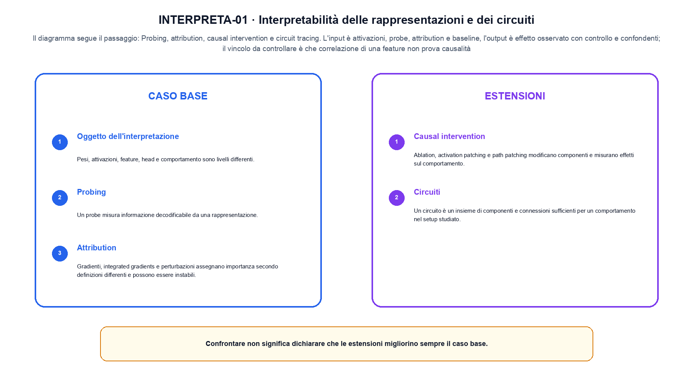
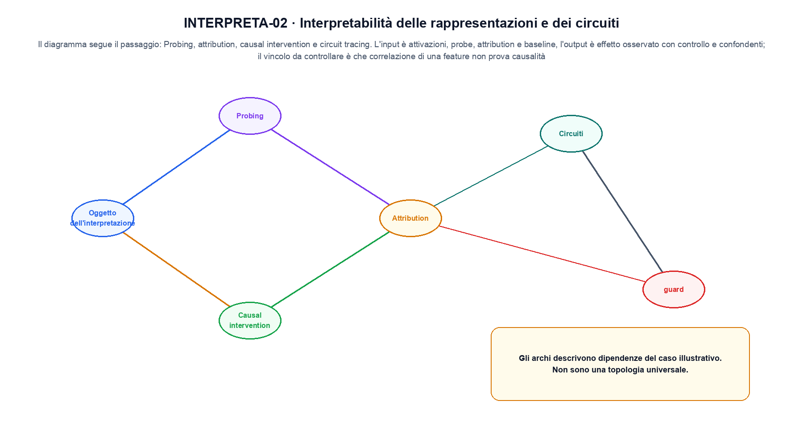

<!--
chapter_id: CH-P13-INTERPRETABILITY
part_id: P13
order_key: 860
title: Interpretabilità delle rappresentazioni e dei circuiti
maturity: CORE
status: candidatura completa in revisione autoriale
version: 0.4.0-draft2
last_source_check: 3 agosto 2026
environment: Python 3.13.12, CPU
deferred: benchmark applicativi, varianti non necessarie al contratto centrale e approvazione autoriale
-->

# Capitolo 86. Interpretabilità delle rappresentazioni e dei circuiti

Finora abbiamo potuto descrivere un comportamento del modello e l'intervento che lo modifica. La richiesta «Il pacco non è arrivato» resta lo scenario condiviso: nel Capitolo 86 prendiamo l'input «attivazioni, probe, attribution e baseline» e lo seguiamo fino all'output «effetto osservato con controllo e confondenti», dichiarando prima il contratto e poi il limite.

## Oggetto dell'interpretazione

Pesi, attivazioni, feature, head e comportamento sono livelli differenti. Il metodo deve dichiarare quale livello analizza. [SRC-86-001]

Prima del nome tecnico fissiamo la situazione: consideriamo un intervento riduce lo score da 0,60 a 0,25 rispetto alla baseline. Da qui possiamo leggere la conseguenza dichiarata da «Pesi, attivazioni, feature, head e comportamento sono livelli differenti».

La sezione usa l'input «attivazioni, probe, attribution e baseline» come punto di partenza e l'output «effetto osservato con controllo e confondenti» come traccia d'uscita. La trasformazione concreta è «probing, attribution, causal intervention e circuit tracing»; il caso non è completo se non dichiariamo anche che correlazione di una feature non prova causalità. La condizione da isolare è «Pesi, attivazioni, feature, head e comportamento sono livelli differenti».

Interpretare significa dichiarare quale oggetto viene analizzato e quale intervento o misura lo collega al comportamento. Informazione decodificabile, attribuzione e causalità non sono lo stesso risultato. Per «Oggetto dell'interpretazione» il controllo cambia una sola premessa della frase «Pesi, attivazioni, feature, head e comportamento sono livelli differenti» e conserva input, output e criterio di successo, così la differenza resta attribuibile. La verifica resta ancorata a «Pesi, attivazioni, feature, head e comportamento sono livelli differenti». [SRC-86-001]

Se cambiamo una premessa, dobbiamo riaprire l'interpretazione. Per «Oggetto dell'interpretazione» conserviamo l'osservazione collegata a «Pesi, attivazioni, feature, head e comportamento sono livelli differenti» e lasciamo esplicitamente fuori ciò che non è stato misurato.

La prova di «Oggetto dell'interpretazione» conserva input, operazione e output; poi esplicita quale parte di «Pesi, attivazioni, feature, head e comportamento sono livelli differenti» non è stata misurata. Così il test separa l'evidenza dall'inferenza. Il passaggio successivo, «Probing», potrà cambiare una sola condizione, dichiarando il nuovo setup prima di interpretare il risultato.

## Probing

Un probe misura informazione decodificabile da una rappresentazione. Non prova che il modello usi quella informazione causalmente. [SRC-86-002]

Per capire «Probing» partiamo da questo caso: ablazione di una componente e differenza rispetto alla baseline. Il caso rende osservabile il punto centrale: «Un probe misura informazione decodificabile da una rappresentazione».

Per ricostruire «Probing» annotiamo l'input «attivazioni, probe, attribution e baseline», poi l'operazione «probing, attribution, causal intervention e circuit tracing», infine l'output «effetto osservato con controllo e confondenti». Questa sequenza impedisce di scambiare una forma compatibile per il comportamento descritto dalla fonte. Il controllo parte da «Un probe misura informazione decodificabile da una rappresentazione».

Il passaggio da seguire in «Probing» è quello descritto dalla frase «Un probe misura informazione decodificabile da una rappresentazione»: l'esempio rende osservabile la trasformazione, mentre il contratto del capitolo ne delimita l'interpretazione. Per «Probing» il controllo cambia una sola premessa della frase «Un probe misura informazione decodificabile da una rappresentazione» e conserva input, output e criterio di successo, così la differenza resta attribuibile. La verifica resta ancorata a «Un probe misura informazione decodificabile da una rappresentazione». [SRC-86-002]

Il punto didattico di «Probing» è separare ciò che la fonte afferma da ciò che il piccolo caso illustra. L'output «effetto osservato con controllo e confondenti» mostra il contratto locale, ma non sostituisce una misura sul sistema completo.

Per verificare «Probing» cambiamo una sola condizione vicina alla frase «Un probe misura informazione decodificabile da una rappresentazione», teniamo fermo il resto e registriamo l'output «effetto osservato con controllo e confondenti». Il caso negativo deve rendere riconoscibile la failure, non soltanto produrre un numero diverso. La sezione successiva, «Attribution», riceve l'output «effetto osservato con controllo e confondenti» come base, ma dovrà formulare e verificare la propria distinzione.

## Attribution

Gradienti, integrated gradients e perturbazioni assegnano importanza secondo definizioni differenti e possono essere instabili. [SRC-86-003]

Il caso minimo di «Attribution» si presenta così: quattro casi con tre esiti corretti e una failure, riportando la media insieme alla slice e al protocollo per «Attribution» e all'output effetto osservato con controllo e confondenti. Non lo usiamo come decorazione: serve a rendere osservabile la frase «Gradienti, integrated gradients e perturbazioni assegnano importanza secondo definizioni differenti e possono essere instabili».

Nel contratto locale, l'input «attivazioni, probe, attribution e baseline» entra, l'operazione «probing, attribution, causal intervention e circuit tracing» modifica il percorso e l'output «effetto osservato con controllo e confondenti» è ciò che osserviamo. Qui cambia soprattutto il passaggio «Attribution»; resta da controllare che correlazione di una feature non prova causalità. La domanda locale è «Gradienti, integrated gradients e perturbazioni assegnano importanza secondo definizioni differenti e possono essere instabili».

Interpretare significa dichiarare quale oggetto viene analizzato e quale intervento o misura lo collega al comportamento. Informazione decodificabile, attribuzione e causalità non sono lo stesso risultato. Per «Attribution» il controllo cambia una sola premessa della frase «Gradienti, integrated gradients e perturbazioni assegnano importanza secondo definizioni differenti e possono essere instabili» e conserva input, output e criterio di successo, così la differenza resta attribuibile. La verifica resta ancorata a «Gradienti, integrated gradients e perturbazioni assegnano importanza secondo definizioni differenti e possono essere instabili». [SRC-86-003]

La lettura va fatta in ordine: prima il caso, poi la trasformazione, quindi la conseguenza. Il piccolo risultato resta un'illustrazione di «Gradienti, integrated gradients e perturbazioni assegnano importanza secondo definizioni differenti e possono essere instabili», non una promessa generale.

Il controllo minimo di «Attribution» confronta il caso dichiarato con una variazione che rompe la sua ipotesi. Se la failure non è distinguibile dall'esito valido, manca un'osservazione nel contratto di protocollo, slice e decisione. Da «Attribution» portiamo l'output «effetto osservato con controllo e confondenti»; non portiamo invece una conclusione oltre il caso locale.

## Causal intervention

Ablation, activation patching e path patching modificano componenti e misurano effetti sul comportamento. [SRC-86-004]

Prima del nome tecnico fissiamo la situazione: consideriamo una matrice di visibilità in cui la posizione futura resta esclusa anche se la shape dei tensori è compatibile. Da qui possiamo leggere la conseguenza dichiarata da «Ablation, activation patching e path patching modificano componenti e misurano effetti sul comportamento».

La sezione usa l'input «attivazioni, probe, attribution e baseline» come punto di partenza e l'output «effetto osservato con controllo e confondenti» come traccia d'uscita. La trasformazione concreta è «probing, attribution, causal intervention e circuit tracing»; il caso non è completo se non dichiariamo anche che correlazione di una feature non prova causalità. La condizione da isolare è «Ablation, activation patching e path patching modificano componenti e misurano effetti sul comportamento».

Interpretare significa dichiarare quale oggetto viene analizzato e quale intervento o misura lo collega al comportamento. Informazione decodificabile, attribuzione e causalità non sono lo stesso risultato. Per «Causal intervention» il controllo cambia una sola premessa della frase «Ablation, activation patching e path patching modificano componenti e misurano effetti sul comportamento» e conserva input, output e criterio di successo, così la differenza resta attribuibile. La verifica resta ancorata a «Ablation, activation patching e path patching modificano componenti e misurano effetti sul comportamento». [SRC-86-004]

Se cambiamo una premessa, dobbiamo riaprire l'interpretazione. Per «Causal intervention» conserviamo l'osservazione collegata a «Ablation, activation patching e path patching modificano componenti e misurano effetti sul comportamento» e lasciamo esplicitamente fuori ciò che non è stato misurato.

La prova di «Causal intervention» conserva input, operazione e output; poi esplicita quale parte di «Ablation, activation patching e path patching modificano componenti e misurano effetti sul comportamento» non è stata misurata. Così il test separa l'evidenza dall'inferenza. Il passaggio successivo, «Circuiti», potrà cambiare una sola condizione, dichiarando il nuovo setup prima di interpretare il risultato.

La figura INTERPRETA-01 usa la famiglia compare. Il diagramma segue il passaggio: Probing, attribution, causal intervention e circuit tracing. L'input è attivazioni, probe, attribution e baseline, l'output è effetto osservato con controllo e confondenti; il vincolo da controllare è che correlazione di una feature non prova causalità.

## Circuiti

Un circuito è un insieme di componenti e connessioni sufficienti per un comportamento nel setup studiato. Sufficienza e necessità richiedono test separati. [SRC-86-001]

Per capire «Circuiti» partiamo da questo caso: quattro casi con tre esiti corretti e una failure, riportando la media insieme alla slice e al protocollo per «Circuiti» e all'output effetto osservato con controllo e confondenti. Il caso rende osservabile il punto centrale: «Un circuito è un insieme di componenti e connessioni sufficienti per un comportamento nel setup studiato».

Per ricostruire «Circuiti» annotiamo l'input «attivazioni, probe, attribution e baseline», poi l'operazione «probing, attribution, causal intervention e circuit tracing», infine l'output «effetto osservato con controllo e confondenti». Questa sequenza impedisce di scambiare una forma compatibile per il comportamento descritto dalla fonte. Il controllo parte da «Un circuito è un insieme di componenti e connessioni sufficienti per un comportamento nel setup studiato».

Interpretare significa dichiarare quale oggetto viene analizzato e quale intervento o misura lo collega al comportamento. Informazione decodificabile, attribuzione e causalità non sono lo stesso risultato. Per «Circuiti» il controllo cambia una sola premessa della frase «Un circuito è un insieme di componenti e connessioni sufficienti per un comportamento nel setup studiato» e conserva input, output e criterio di successo, così la differenza resta attribuibile. La verifica resta ancorata a «Un circuito è un insieme di componenti e connessioni sufficienti per un comportamento nel setup studiato». [SRC-86-001]

Il punto didattico di «Circuiti» è separare ciò che la fonte afferma da ciò che il piccolo caso illustra. L'output «effetto osservato con controllo e confondenti» mostra il contratto locale, ma non sostituisce una misura sul sistema completo.

Per verificare «Circuiti» cambiamo una sola condizione vicina alla frase «Un circuito è un insieme di componenti e connessioni sufficienti per un comportamento nel setup studiato», teniamo fermo il resto e registriamo l'output «effetto osservato con controllo e confondenti». Il caso negativo deve rendere riconoscibile la failure, non soltanto produrre un numero diverso. Il percorso si chiude lasciando espliciti la misura locale e ciò che richiederebbe una prova ulteriore.

## La definizione messa alla prova: Oggetto dell'interpretazione

Il caso intero parte dall'input «attivazioni, probe, attribution e baseline», applica l'operazione «probing, attribution, causal intervention e circuit tracing» e osserva l'output «effetto osservato con controllo e confondenti». Un esempio controllato: ablazione di una componente e differenza rispetto alla baseline. Lo schema compatto è:

$$
effect = output(intervention) - output(baseline)
$$

È una notazione di interfaccia, non un'identità numerica completa. Un'interpretazione causale richiede un intervento e un confronto. [SRC-86-001]

La figura INTERPRETA-02 cambia composizione rispetto alla prima. Il diagramma segue il passaggio: Probing, attribution, causal intervention e circuit tracing. L'input è attivazioni, probe, attribution e baseline, l'output è effetto osservato con controllo e confondenti; il vincolo da controllare è che correlazione di una feature non prova causalità.

## Un esperimento piccolo ma leggibile: Probing

Il file `code/snip_86_contract.py` collega il contratto del capitolo alla frase «Un circuito è un insieme di componenti e connessioni sufficienti per un comportamento nel setup studiato». Il test controlla l'invariante, la risposta valida e il caso negativo; `code/outputs/SNIP-86-001.txt` conserva il risultato ripetibile del caso locale.

## Il confine del caso guida: Circuiti

Il meccanismo di «Interpretabilità delle rappresentazioni e dei circuiti» resta legato al contratto locale. Correlazione di una feature non prova causalità. Prima di generalizzare la frase «Un circuito è un insieme di componenti e connessioni sufficienti per un comportamento nel setup studiato», servono un nuovo setup, un protocollo dichiarato e una misura ripetibile.

## Il contratto che rimane: Interpretabilità delle rappresentazioni e dei circuiti

Abbiamo seguito un comportamento del modello e l'intervento che lo modifica, partendo dall'input «attivazioni, probe, attribution e baseline» e arrivando all'output «effetto osservato con controllo e confondenti». Le sezioni «Oggetto dell'interpretazione», «Probing», «Circuiti» hanno isolato le proprie frasi chiave senza confondere il meccanismo con il risultato applicativo. L'invariante da portare avanti è: correlazione di una feature non prova causalità. Il Capitolo 87, Sparse autoencoder e interpretabilità scalabile, può partire da questo output e dichiarare la propria domanda.

### Controllo finale della lezione: Oggetto dell'interpretazione

1. Ricostruisci l'oggetto continuo a partire da «Oggetto dell'interpretazione» e indica quale parte della frase «Pesi, attivazioni, feature, head e comportamento sono livelli differenti» entra nel caso.
2. Spiega quale trasformazione collega «Oggetto dell'interpretazione» a «Circuiti» e quale output osserviamo nel passaggio.
3. Usa lo snippet per controllare l'invariante del contratto: correlazione di una feature non prova causalità.
4. Separa una definizione sostenuta da una fonte, un esempio illustrativo e un risultato locale del caso guida.
5. Indica quale parte della frase «Un circuito è un insieme di componenti e connessioni sufficienti per un comportamento nel setup studiato» richiederebbe una misura nuova prima di essere estesa oltre il caso osservato.

### Prove da rifare e modificare: Circuiti

1. Racconta «Oggetto dell'interpretazione» come una trasformazione: che cosa entra e che cosa esce?
2. Confronta due esecuzioni di «Probing» mantenendo il resto del setup invariato.
3. Per «Attribution», separa l'esempio locale dal limite che impedisce di generalizzarlo.
4. Progetta una prova per «Causal intervention» che renda visibile il suo confine.
5. Scrivi una metrica o una domanda per valutare «Circuiti» senza confondere livelli diversi.

## Riferimenti e prove riproducibili: Interpretabilità delle rappresentazioni e dei circuiti

Il dossier di «Interpretabilità delle rappresentazioni e dei circuiti» in `FONTI_PRIMARIE.md` separa definizioni, risultati e la differenza tra media e failure; la data di consultazione è registrata accanto ai riferimenti. `CLAIMS.md` separa definizioni e risultati locali; codice, ambiente, test e output sono nella cartella `code/`, con attenzione a protocollo, slice e decisione.
