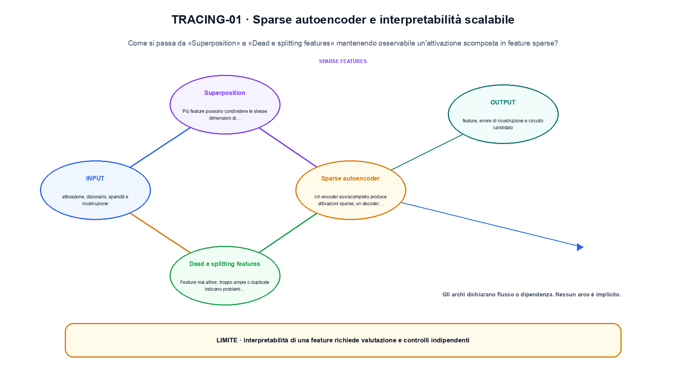
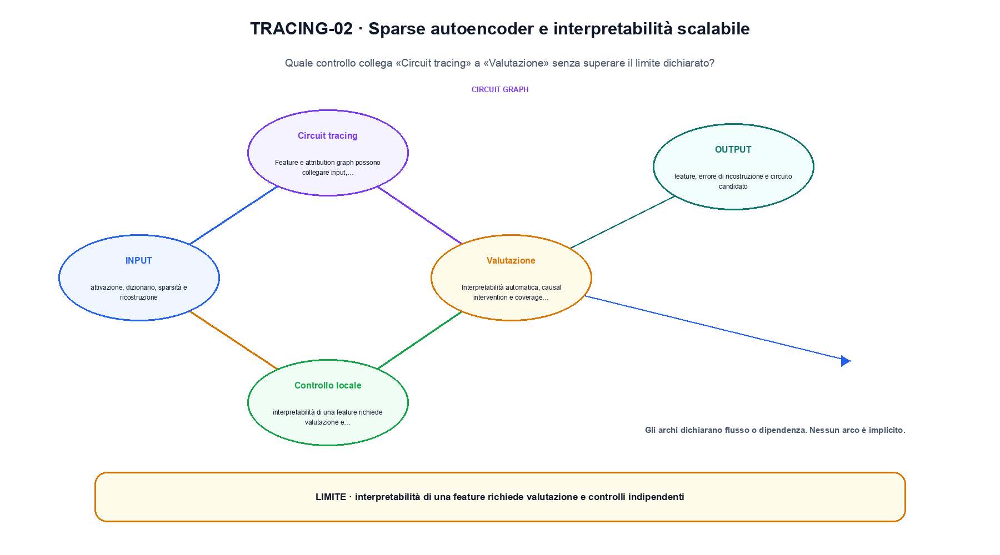

<!--
chapter_id: CH-P13-SAE-CIRCUIT-TRACING
part_id: P13
order_key: 870
title: Sparse autoencoder e interpretabilità scalabile
maturity: ESTABLISHED
status: revisione editoriale v2, approvazione autoriale aperta
version: 0.5.0-draft3
last_source_check: 4 agosto 2026
environment: Python 3.13.12, CPU
code_policy: reference
deferred: benchmark applicativi non eseguiti e approvazione autoriale delle visuali
-->

# Capitolo 87. Sparse autoencoder e interpretabilità scalabile

La domanda guida di questa lezione è come collegare «Superposition» e «Valutazione» senza perdere il contratto tecnico di sparse autoencoder e interpretabilità scalabile. L'oggetto osservato è un'attivazione scomposta in feature sparse. Il contratto locale è: input, attivazione, dizionario, sparsità e ricostruzione; operazione, training SAE, splitting, dead features e tracing; output, feature, errore di ricostruzione e circuito candidato. Il caso guida è questo: Due feature sparse ricostruiscono tre coordinate e l'errore viene registrato. Il confine da mantenere esplicito è: interpretabilità di una feature richiede valutazione e controlli indipendenti.

## Superposition

Più feature possono condividere le stesse dimensioni di attivazione. La sparsità offre una ipotesi per separarle. [SRC-87-001]

Un circuito descritto da feature richiede controlli indipendenti sull'attivazione.

**Caso da seguire.** Due feature sparse ricostruiscono tre coordinate e l'errore viene registrato.

**Controllo.** Scrivi il risultato atteso prima del calcolo, modifica una sola quantità e localizza il primo passaggio che cambia. Il vincolo da conservare è: La sparsità offre una ipotesi per separarle.


## Sparse autoencoder

Un encoder sovracompleto produce attivazioni sparse; un decoder ricostruisce il residual stream. Loss e sparsity coefficient determinano il dizionario. [SRC-87-002]

**Caso da seguire.** Due feature attive, una ricostruzione e un intervento.

**Controllo.** Ricalcola il caso a mano e con lo snippet. Se i risultati divergono, confronta prima i valori intermedi e soltanto dopo l'output finale.




La prima figura segue il percorso da «Superposition» a «Dead e splitting features».


## Dead e splitting features

Feature mai attive, troppo ampie o duplicate indicano problemi di training e granularità. [SRC-87-003]

**Caso da seguire.** Un manifest che conserva conteggi, checksum, tokenizer e confini dello split prima del training.

**Controllo.** Aggiungi un valore limite e verifica separatamente forma, valore e ipotesi. Una shape valida non dimostra da sola «Dead e splitting features».


## Circuit tracing

Feature e attribution graph possono collegare input, computazione e output. Il grafo resta una approssimazione del calcolo completo. [SRC-87-004]

**Caso da seguire.** Quattro casi con tre esiti corretti e una failure, riportando la media insieme alla slice e al protocollo per «Circuit tracing» e all'output feature, errore di ricostruzione e circuito candidato.

**Controllo.** Mantieni fisso l'input e sostituisci soltanto il meccanismo discusso nella sezione. Il confronto deve attribuire la differenza a quel passaggio, non al setup.


## Esempio Python eseguito

Il frammento seguente è lo stesso conservato nel repository. Usa valori piccoli perché l'obiettivo è osservare il meccanismo, non simulare una scala che non abbiamo eseguito.

```python
def contract():
    activation = [1.0, 0.0, 0.5]
    dictionary = [[1.0, 0.0, 0.0], [0.0, 0.0, 1.0]]
    sparse_codes = [activation[0], activation[2]]
    reconstruction = [sparse_codes[0], 0.0, sparse_codes[1]]
    error = sum((a - b) ** 2 for a, b in zip(activation, reconstruction))
    return {"active_features": len(sparse_codes), "reconstruction_error": error, "invariant": "sparsity and reconstruction must be evaluated together"}
```

Esecuzione con `python snip_87_contract.py`:

```text
{"active_features": 2, "invariant": "sparsity and reconstruction must be evaluated together", "reconstruction_error": 0.0}
```

Il test associato è [`code/test_87_contract.py`](code/test_87_contract.py); l'output versionato è [`code/outputs/SNIP-87-001.txt`](code/outputs/SNIP-87-001.txt).


## Valutazione

Interpretabilità automatica, causal intervention e coverage devono essere misurate. Una etichetta leggibile non prova monosemanticità universale. [SRC-87-001]

**Caso da seguire.** Su un piccolo insieme, la metrica viene calcolata insieme a una slice e a un caso fallito. La media non sostituisce la diagnosi.

**Controllo.** Costruisci un controesempio che rispetti il tipo di dato ma violi l'ipotesi centrale. Il test deve rendere riconoscibile perché «Valutazione» non si applica.




La seconda figura mette a confronto «Circuit tracing» e il limite discusso in «Valutazione».


## Come si collegano i passaggi

- **Da «Superposition» a «Sparse autoencoder».** Più feature possono condividere le stesse dimensioni di attivazione. Un encoder sovracompleto produce attivazioni sparse; un decoder ricostruisce il residual stream. Il primo passaggio definisce che cosa entra nel calcolo; il secondo stabilisce la regola che produce il valore osservabile. [SRC-87-001; SRC-87-002]

- **Da «Sparse autoencoder» a «Dead e splitting features».** Un encoder sovracompleto produce attivazioni sparse; un decoder ricostruisce il residual stream. Feature mai attive, troppo ampie o duplicate indicano problemi di training e granularità. La regola generale viene poi letta dentro il componente: questa separazione permette di localizzare un errore prima di attribuirlo all'intero modello. [SRC-87-002; SRC-87-003]

- **Da «Dead e splitting features» a «Circuit tracing».** Feature mai attive, troppo ampie o duplicate indicano problemi di training e granularità. Feature e attribution graph possono collegare input, computazione e output. Dopo avere reso visibile il componente, il percorso introduce la variante o l'ottimizzazione senza cambiare di nascosto il caso di partenza. [SRC-87-003; SRC-87-004]

- **Da «Circuit tracing» a «Valutazione».** Feature e attribution graph possono collegare input, computazione e output. Interpretabilità automatica, causal intervention e coverage devono essere misurate. L'ultimo passaggio sposta l'attenzione dal funzionamento locale alla misura: correttezza del calcolo e qualità applicativa restano domande distinte. [SRC-87-004; SRC-87-001]

La catena completa produce feature, errore di ricostruzione e circuito candidato a partire da attivazione, dizionario, sparsità e ricostruzione. Ogni collegamento conserva un oggetto osservabile diverso; per questo il risultato non può essere esteso oltre il limite dichiarato: interpretabilità di una feature richiede valutazione e controlli indipendenti.


## Esercizi sul meccanismo

1. Ricostruisci «Superposition» con un esempio diverso da quello mostrato e indica l'output atteso prima del calcolo.
2. Nel passaggio «Sparse autoencoder», cambia una sola ipotesi e spiega quale risultato non è più confrontabile.
3. Collega «Dead e splitting features» a una riga dello snippet oppure motiva perché la prova deve essere documentale.
4. Progetta un caso limite per «Circuit tracing» che produca una failure riconoscibile.
5. Per «Valutazione», separa una conclusione sostenuta dal caso locale da una che richiederebbe nuovi dati o un benchmark.


## Che cosa deve restare chiaro

La lezione parte da «attivazione, dizionario, sparsità e ricostruzione» e arriva fino a «feature, errore di ricostruzione e circuito candidato». Il limite da conservare è questo: interpretabilità di una feature richiede valutazione e controlli indipendenti. Definizioni e risultati citati sono rintracciabili in [`FONTI_PRIMARIE.md`](FONTI_PRIMARIE.md); la mappa dei claim è in [`CLAIMS.md`](CLAIMS.md).
