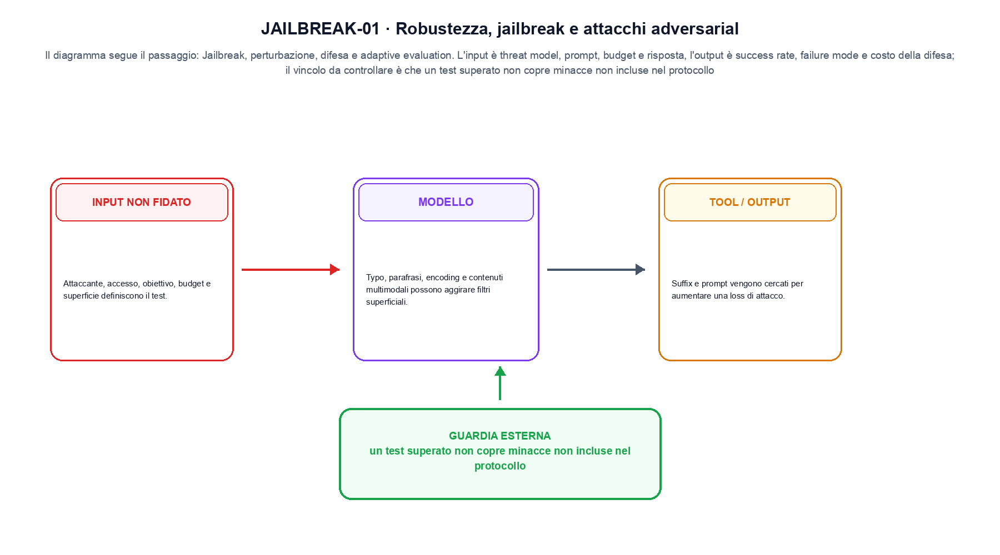
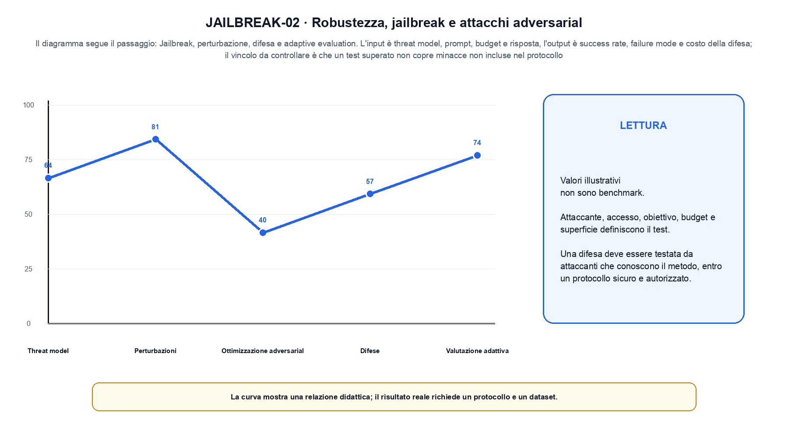

<!--
chapter_id: CH-P13-ROBUSTNESS-JAILBREAK
part_id: P13
order_key: 880
title: Robustezza, jailbreak e attacchi adversarial
maturity: CORE
status: candidatura completa in revisione autoriale
version: 0.4.0-draft2
last_source_check: 3 agosto 2026
environment: Python 3.13.12, CPU
deferred: benchmark applicativi, varianti non necessarie al contratto centrale e approvazione autoriale
-->

# Capitolo 88. Robustezza, jailbreak e attacchi adversarial

La richiesta «Il pacco non è arrivato» resta il caso guida. In questo capitolo la usiamo per distinguere una superficie di attacco e il comportamento sotto perturbazione, trasformazione e risultato, senza nascondere i dettagli tecnici.

## Threat model

Attaccante, accesso, obiettivo, budget e superficie definiscono il test. Un jailbreak testuale e un attacco ai pesi hanno contratti diversi. [SRC-88-001]

Il caso minimo di «Threat model» si presenta così: una perturbazione sullo stesso prompt produce un failure di attacco che la baseline non produce. Non lo usiamo come decorazione: serve a rendere osservabile la frase «Attaccante, accesso, obiettivo, budget e superficie definiscono il test».

Per ricostruire «Threat model» annotiamo l'input «threat model, prompt, budget e risposta», poi l'operazione «jailbreak, perturbazione, difesa e adaptive evaluation», infine l'output «success rate, failure mode e costo della difesa». Questa sequenza impedisce di scambiare una forma compatibile per il comportamento descritto dalla fonte. Il controllo parte da «Attaccante, accesso, obiettivo, budget e superficie definiscono il test».

Un flow rende esplicito il percorso invertibile tra spazio semplice e dati. La densità deve tenere conto del Jacobiano, mentre il costo dipende dalla trasformazione o dalla soluzione numerica scelta. Per «Threat model» il controllo cambia una sola premessa della frase «Attaccante, accesso, obiettivo, budget e superficie definiscono il test» e conserva input, output e criterio di successo, così la differenza resta attribuibile. La verifica resta ancorata a «Attaccante, accesso, obiettivo, budget e superficie definiscono il test». [SRC-88-001]

Il punto didattico di «Threat model» è separare ciò che la fonte afferma da ciò che il piccolo caso illustra. L'output «success rate, failure mode e costo della difesa» mostra il contratto locale, ma non sostituisce una misura sul sistema completo.

Il controllo minimo di «Threat model» confronta il caso dichiarato con una variazione che rompe la sua ipotesi. Se la failure non è distinguibile dall'esito valido, manca un'osservazione nel contratto di protocollo, slice e decisione. Da «Threat model» portiamo l'output «success rate, failure mode e costo della difesa»; non portiamo invece una conclusione oltre il caso locale.

## Perturbazioni

Typo, parafrasi, encoding e contenuti multimodali possono aggirare filtri superficiali. [SRC-88-002]

Prima del nome tecnico fissiamo la situazione: consideriamo stesso prompt con perturbazione e controllo di policy. Da qui possiamo leggere la conseguenza dichiarata da «Typo, parafrasi, encoding e contenuti multimodali possono aggirare filtri superficiali».

Nel contratto locale, l'input «threat model, prompt, budget e risposta» entra, l'operazione «jailbreak, perturbazione, difesa e adaptive evaluation» modifica il percorso e l'output «success rate, failure mode e costo della difesa» è ciò che osserviamo. Qui cambia soprattutto il passaggio «Perturbazioni»; resta da controllare che un test superato non copre minacce non incluse nel protocollo. La domanda locale è «Typo, parafrasi, encoding e contenuti multimodali possono aggirare filtri superficiali».

Il passaggio da seguire in «Perturbazioni» è quello descritto dalla frase «Typo, parafrasi, encoding e contenuti multimodali possono aggirare filtri superficiali»: l'esempio rende osservabile la trasformazione, mentre il contratto del capitolo ne delimita l'interpretazione. Per «Perturbazioni» il controllo cambia una sola premessa della frase «Typo, parafrasi, encoding e contenuti multimodali possono aggirare filtri superficiali» e conserva input, output e criterio di successo, così la differenza resta attribuibile. La verifica resta ancorata a «Typo, parafrasi, encoding e contenuti multimodali possono aggirare filtri superficiali». [SRC-88-002]

La lettura va fatta in ordine: prima il caso, poi la trasformazione, quindi la conseguenza. Il piccolo risultato resta un'illustrazione di «Typo, parafrasi, encoding e contenuti multimodali possono aggirare filtri superficiali», non una promessa generale.

La prova di «Perturbazioni» conserva input, operazione e output; poi esplicita quale parte di «Typo, parafrasi, encoding e contenuti multimodali possono aggirare filtri superficiali» non è stata misurata. Così il test separa l'evidenza dall'inferenza. Il passaggio successivo, «Ottimizzazione adversarial», potrà cambiare una sola condizione, dichiarando il nuovo setup prima di interpretare il risultato.

## Ottimizzazione adversarial

Suffix e prompt vengono cercati per aumentare una loss di attacco. Trasferibilità e query budget devono essere riportati. [SRC-88-003]

Per capire «Ottimizzazione adversarial» partiamo da questo caso: un caso in cui un test superato non copre minacce non incluse nel protocollo. Il caso rende osservabile il punto centrale: «Suffix e prompt vengono cercati per aumentare una loss di attacco».

La sezione usa l'input «threat model, prompt, budget e risposta» come punto di partenza e l'output «success rate, failure mode e costo della difesa» come traccia d'uscita. La trasformazione concreta è «jailbreak, perturbazione, difesa e adaptive evaluation»; il caso non è completo se non dichiariamo anche che un test superato non copre minacce non incluse nel protocollo. La condizione da isolare è «Suffix e prompt vengono cercati per aumentare una loss di attacco».

La sicurezza parte da una minaccia, una superficie e una decisione verificabile. Un filtro o una risposta convincente non sostituiscono isolamento, allowlist, provenienza, logging e recovery applicati al confine della risorsa. Per «Ottimizzazione adversarial» il controllo cambia una sola premessa della frase «Suffix e prompt vengono cercati per aumentare una loss di attacco» e conserva input, output e criterio di successo, così la differenza resta attribuibile. La verifica resta ancorata a «Suffix e prompt vengono cercati per aumentare una loss di attacco». [SRC-88-003]

Se cambiamo una premessa, dobbiamo riaprire l'interpretazione. Per «Ottimizzazione adversarial» conserviamo l'osservazione collegata a «Suffix e prompt vengono cercati per aumentare una loss di attacco» e lasciamo esplicitamente fuori ciò che non è stato misurato.

Per verificare «Ottimizzazione adversarial» cambiamo una sola condizione vicina alla frase «Suffix e prompt vengono cercati per aumentare una loss di attacco», teniamo fermo il resto e registriamo l'output «success rate, failure mode e costo della difesa». Il caso negativo deve rendere riconoscibile la failure, non soltanto produrre un numero diverso. La sezione successiva, «Difese», riceve l'output «success rate, failure mode e costo della difesa» come base, ma dovrà formulare e verificare la propria distinzione.

La figura JAILBREAK-01 usa la famiglia threat. Il diagramma segue il passaggio: Jailbreak, perturbazione, difesa e adaptive evaluation. L'input è threat model, prompt, budget e risposta, l'output è success rate, failure mode e costo della difesa; il vincolo da controllare è che un test superato non copre minacce non incluse nel protocollo.

## Difese

Training, filtri, classificatori e refusal possono ridurre alcuni attacchi e introdurre falsi positivi o nuove bypass. [SRC-88-004]

Il caso minimo di «Difese» si presenta così: un input non fidato attraversa una policy esterna. Il controllo deve restare attivo anche se il modello produce una richiesta testuale convincente. Non lo usiamo come decorazione: serve a rendere osservabile la frase «Training, filtri, classificatori e refusal possono ridurre alcuni attacchi e introdurre falsi positivi o nuove bypass».

Per ricostruire «Difese» annotiamo l'input «threat model, prompt, budget e risposta», poi l'operazione «jailbreak, perturbazione, difesa e adaptive evaluation», infine l'output «success rate, failure mode e costo della difesa». Questa sequenza impedisce di scambiare una forma compatibile per il comportamento descritto dalla fonte. Il controllo parte da «Training, filtri, classificatori e refusal possono ridurre alcuni attacchi e introdurre falsi positivi o nuove bypass».

Il passaggio da seguire in «Difese» è quello descritto dalla frase «Training, filtri, classificatori e refusal possono ridurre alcuni attacchi e introdurre falsi positivi o nuove bypass»: l'esempio rende osservabile la trasformazione, mentre il contratto del capitolo ne delimita l'interpretazione. Per «Difese» il controllo cambia una sola premessa della frase «Training, filtri, classificatori e refusal possono ridurre alcuni attacchi e introdurre falsi positivi o nuove bypass» e conserva input, output e criterio di successo, così la differenza resta attribuibile. La verifica resta ancorata a «Training, filtri, classificatori e refusal possono ridurre alcuni attacchi e introdurre falsi positivi o nuove bypass». [SRC-88-004]

Il punto didattico di «Difese» è separare ciò che la fonte afferma da ciò che il piccolo caso illustra. L'output «success rate, failure mode e costo della difesa» mostra il contratto locale, ma non sostituisce una misura sul sistema completo.

Il controllo minimo di «Difese» confronta il caso dichiarato con una variazione che rompe la sua ipotesi. Se la failure non è distinguibile dall'esito valido, manca un'osservazione nel contratto di protocollo, slice e decisione. Da «Difese» portiamo l'output «success rate, failure mode e costo della difesa»; non portiamo invece una conclusione oltre il caso locale.

## Valutazione adattiva

Una difesa deve essere testata da attaccanti che conoscono il metodo, entro un protocollo sicuro e autorizzato. [SRC-88-001]

Prima del nome tecnico fissiamo la situazione: consideriamo un input non fidato attraversa una policy esterna. Il controllo deve restare attivo anche se il modello produce una richiesta testuale convincente. Da qui possiamo leggere la conseguenza dichiarata da «Una difesa deve essere testata da attaccanti che conoscono il metodo, entro un protocollo sicuro e autorizzato».

Nel contratto locale, l'input «threat model, prompt, budget e risposta» entra, l'operazione «jailbreak, perturbazione, difesa e adaptive evaluation» modifica il percorso e l'output «success rate, failure mode e costo della difesa» è ciò che osserviamo. Qui cambia soprattutto il passaggio «Valutazione adattiva»; resta da controllare che un test superato non copre minacce non incluse nel protocollo. La domanda locale è «Una difesa deve essere testata da attaccanti che conoscono il metodo, entro un protocollo sicuro e autorizzato».

Una valutazione deve collegare claim, popolazione, protocollo e decisione. Media, slice, failure, giudice e incertezza misurano aspetti diversi e non diventano intercambiabili perché condividono una tabella. Il controllo separa raccolta di traiettorie e confronto delle policy, riportando ritorno, dispersione e vincoli come misure diverse. La verifica resta ancorata a «Una difesa deve essere testata da attaccanti che conoscono il metodo, entro un protocollo sicuro e autorizzato». [SRC-88-001]

La lettura va fatta in ordine: prima il caso, poi la trasformazione, quindi la conseguenza. Il piccolo risultato resta un'illustrazione di «Una difesa deve essere testata da attaccanti che conoscono il metodo, entro un protocollo sicuro e autorizzato», non una promessa generale.

La prova di «Valutazione adattiva» conserva input, operazione e output; poi esplicita quale parte di «Una difesa deve essere testata da attaccanti che conoscono il metodo, entro un protocollo sicuro e autorizzato» non è stata misurata. Così il test separa l'evidenza dall'inferenza. Il caso finale consegna l'output «success rate, failure mode e costo della difesa» come evidenza locale e conserva il confine tra evidenza e interpretazione come domanda aperta.

## La definizione messa alla prova: Threat model

Il caso intero parte dall'input «threat model, prompt, budget e risposta», applica l'operazione «jailbreak, perturbazione, difesa e adaptive evaluation» e osserva l'output «success rate, failure mode e costo della difesa». Un esempio controllato: stesso prompt con perturbazione e controllo di policy. Lo schema compatto è:

$$
risk = attack_surface * exposure * impact
$$

È una notazione di interfaccia, non un'identità numerica completa. Robustezza e jailbreak vanno definiti con minaccia e protocollo. [SRC-88-001]

La figura JAILBREAK-02 cambia composizione rispetto alla prima. Il diagramma segue il passaggio: Jailbreak, perturbazione, difesa e adaptive evaluation. L'input è threat model, prompt, budget e risposta, l'output è success rate, failure mode e costo della difesa; il vincolo da controllare è che un test superato non copre minacce non incluse nel protocollo.

## Un esperimento piccolo ma leggibile: Perturbazioni

Lo snippet locale mette in esecuzione questo caso: stesso prompt con perturbazione e controllo di policy. Il test associato controlla determinismo, output e invariante e rifiuta una shape o condizione incoerente; il risultato è conservato in `code/outputs/SNIP-88-001.txt`, come evidenza locale e non come benchmark di produzione.

## Il confine del caso guida: Valutazione adattiva

Il caso di «Robustezza, jailbreak e attacchi adversarial» non certifica un servizio completo. Un test superato non copre minacce non incluse nel protocollo. La domanda successiva è se «Una difesa deve essere testata da attaccanti che conoscono il metodo, entro un protocollo sicuro e autorizzato» regga quando cambiano dati, scala, hardware o criteri di decisione.

## Il contratto che rimane: Robustezza, jailbreak e attacchi adversarial

Il filo della lezione va dall'input «threat model, prompt, budget e risposta» all'output «success rate, failure mode e costo della difesa». Nei passaggi «Threat model», «Perturbazioni», «Valutazione adattiva» abbiamo usato esempi e controlli negativi per rendere il contratto controllabile e delimitare la conclusione. L'invariante da portare avanti è: un test superato non copre minacce non incluse nel protocollo. Il Capitolo 89, Prompt injection e sicurezza dei tool, può partire da questo output e dichiarare la propria domanda.

### Controllo finale della lezione: Threat model

1. Ricostruisci l'oggetto continuo a partire da «Threat model» e indica quale parte della frase «Attaccante, accesso, obiettivo, budget e superficie definiscono il test» entra nel caso.
2. Spiega quale trasformazione collega «Threat model» a «Valutazione adattiva» e quale output osserviamo nel passaggio.
3. Usa lo snippet per controllare l'invariante del contratto: un test superato non copre minacce non incluse nel protocollo.
4. Separa una definizione sostenuta da una fonte, un esempio illustrativo e un risultato locale del caso guida.
5. Indica quale parte della frase «Una difesa deve essere testata da attaccanti che conoscono il metodo, entro un protocollo sicuro e autorizzato» richiederebbe una misura nuova prima di essere estesa oltre il caso osservato.

### Prove da rifare e modificare: Valutazione adattiva

1. Ricostruisci input e output di «Threat model» usando un esempio di tre righe.
2. Modifica una sola variabile in «Perturbazioni» e anticipa l'invariante che dovrebbe restare.
3. Metti «Ottimizzazione adversarial» a confronto con il caso base e descrivi il failure mode più vicino.
4. Scrivi un test minimo per rendere osservabile il confine di «Difese».
5. Formula per «Valutazione adattiva» una domanda che separi meccanismo e qualità del sistema.

## Riferimenti e prove riproducibili: Robustezza, jailbreak e attacchi adversarial

Per ricontrollare «Robustezza, jailbreak e attacchi adversarial», partire da `FONTI_PRIMARIE.md` e poi dal codice: la domanda aperta è come trasferire il confine tra evidenza e interpretazione oltre il caso locale, con la data di consultazione dichiarata. `CLAIMS.md` separa definizioni e risultati locali; codice, ambiente, test e output sono nella cartella `code/`, con attenzione a protocollo, slice e decisione.
