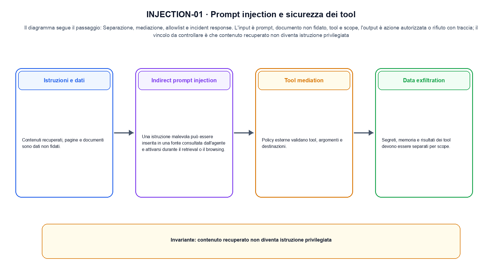
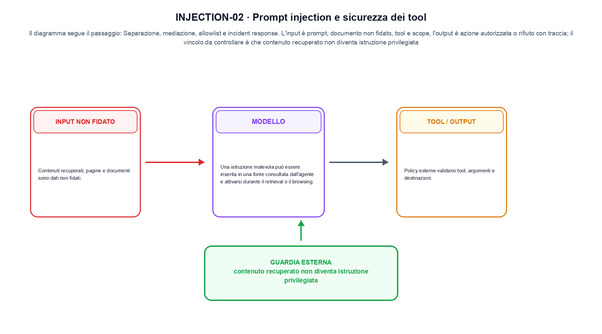

<!--
chapter_id: CH-P13-PROMPT-INJECTION
part_id: P13
order_key: 890
title: Prompt injection e sicurezza dei tool
maturity: CORE
status: candidatura completa in revisione autoriale
version: 0.4.0-draft2
last_source_check: 3 agosto 2026
environment: Python 3.13.12, CPU
deferred: benchmark applicativi, varianti non necessarie al contratto centrale e approvazione autoriale
-->

# Capitolo 89. Prompt injection e sicurezza dei tool

Una frase plausibile non basta a spiegare prompt injection e sicurezza dei tool. L'oggetto è istruzioni e dati che entrano in un sistema con tool; riprendiamo la richiesta «Il pacco non è arrivato» come contesto comune, partiamo da un input piccolo, rendiamo visibile l'operazione e fissiamo che cosa non possiamo concludere.

## Istruzioni e dati

Contenuti recuperati, pagine e documenti sono dati non fidati. Non devono acquisire automaticamente la priorità delle istruzioni di sistema. [SRC-89-001]

Prima del nome tecnico fissiamo la situazione: consideriamo un documento chiede export dei dati, ma il tool scope non lo autorizza. Da qui possiamo leggere la conseguenza dichiarata da «Contenuti recuperati, pagine e documenti sono dati non fidati».

La sezione usa l'input «prompt, documento non fidato, tool e scope» come punto di partenza e l'output «azione autorizzata o rifiuto con traccia» come traccia d'uscita. La trasformazione concreta è «separazione, mediazione, allowlist e incident response»; il caso non è completo se non dichiariamo anche che contenuto recuperato non diventa istruzione privilegiata. La condizione da isolare è «Contenuti recuperati, pagine e documenti sono dati non fidati».

Il componente può proporre un messaggio o un'azione, ma schema, identità, autorizzazione e side effect devono essere controllati al confine. La traiettoria osservabile è più informativa del testo prodotto. Per «Istruzioni e dati» il controllo cambia una sola premessa della frase «Contenuti recuperati, pagine e documenti sono dati non fidati» e conserva input, output e criterio di successo, così la differenza resta attribuibile. La verifica resta ancorata a «Contenuti recuperati, pagine e documenti sono dati non fidati». [SRC-89-001]

Se cambiamo una premessa, dobbiamo riaprire l'interpretazione. Per «Istruzioni e dati» conserviamo l'osservazione collegata a «Contenuti recuperati, pagine e documenti sono dati non fidati» e lasciamo esplicitamente fuori ciò che non è stato misurato.

La prova di «Istruzioni e dati» conserva input, operazione e output; poi esplicita quale parte di «Contenuti recuperati, pagine e documenti sono dati non fidati» non è stata misurata. Così il test separa l'evidenza dall'inferenza. Il passaggio successivo, «Indirect prompt injection», potrà cambiare una sola condizione, dichiarando il nuovo setup prima di interpretare il risultato.

## Indirect prompt injection

Una istruzione malevola può essere inserita in una fonte consultata dall'agente e attivarsi durante il retrieval o il browsing. [SRC-89-002]

Per capire «Indirect prompt injection» partiamo da questo caso: un input non fidato che raggiunge una policy esterna, con decisione allow/deny e traccia dell'evento conservate separatamente. Il caso rende osservabile il punto centrale: «Una istruzione malevola può essere inserita in una fonte consultata dall'agente e attivarsi durante il retrieval o il browsing».

Per ricostruire «Indirect prompt injection» annotiamo l'input «prompt, documento non fidato, tool e scope», poi l'operazione «separazione, mediazione, allowlist e incident response», infine l'output «azione autorizzata o rifiuto con traccia». Questa sequenza impedisce di scambiare una forma compatibile per il comportamento descritto dalla fonte. Il controllo parte da «Una istruzione malevola può essere inserita in una fonte consultata dall'agente e attivarsi durante il retrieval o il browsing».

Il componente può proporre un messaggio o un'azione, ma schema, identità, autorizzazione e side effect devono essere controllati al confine. La traiettoria osservabile è più informativa del testo prodotto. Per «Indirect prompt injection» il controllo cambia una sola premessa della frase «Una istruzione malevola può essere inserita in una fonte consultata dall'agente e attivarsi durante il retrieval o il browsing» e conserva input, output e criterio di successo, così la differenza resta attribuibile. La verifica resta ancorata a «Una istruzione malevola può essere inserita in una fonte consultata dall'agente e attivarsi durante il retrieval o il browsing». [SRC-89-002]

Il punto didattico di «Indirect prompt injection» è separare ciò che la fonte afferma da ciò che il piccolo caso illustra. L'output «azione autorizzata o rifiuto con traccia» mostra il contratto locale, ma non sostituisce una misura sul sistema completo.

Per verificare «Indirect prompt injection» cambiamo una sola condizione vicina alla frase «Una istruzione malevola può essere inserita in una fonte consultata dall'agente e attivarsi durante il retrieval o il browsing», teniamo fermo il resto e registriamo l'output «azione autorizzata o rifiuto con traccia». Il caso negativo deve rendere riconoscibile la failure, non soltanto produrre un numero diverso. La sezione successiva, «Tool mediation», riceve l'output «azione autorizzata o rifiuto con traccia» come base, ma dovrà formulare e verificare la propria distinzione.

## Tool mediation

Policy esterne validano tool, argomenti e destinazioni. Il modello propone, ma l'enforcement avviene fuori dal testo generato. [SRC-89-003]

Il caso minimo di «Tool mediation» si presenta così: una traiettoria minima osservazione-azione-tool-verifica in cui una chiamata fuori allowlist viene bloccata prima dell'esecuzione. Non lo usiamo come decorazione: serve a rendere osservabile la frase «Policy esterne validano tool, argomenti e destinazioni».

Nel contratto locale, l'input «prompt, documento non fidato, tool e scope» entra, l'operazione «separazione, mediazione, allowlist e incident response» modifica il percorso e l'output «azione autorizzata o rifiuto con traccia» è ciò che osserviamo. Qui cambia soprattutto il passaggio «Tool mediation»; resta da controllare che contenuto recuperato non diventa istruzione privilegiata. La domanda locale è «Policy esterne validano tool, argomenti e destinazioni».

Il componente può proporre un messaggio o un'azione, ma schema, identità, autorizzazione e side effect devono essere controllati al confine. La traiettoria osservabile è più informativa del testo prodotto. Il controllo deve mostrare la decisione prima del side effect e la verifica dopo la chiamata, includendo anche una richiesta fuori allowlist. La verifica resta ancorata a «Policy esterne validano tool, argomenti e destinazioni». [SRC-89-003]

La lettura va fatta in ordine: prima il caso, poi la trasformazione, quindi la conseguenza. Il modello propone, ma l'enforcement avviene fuori dal testo generato. Il piccolo risultato resta un'illustrazione di «Policy esterne validano tool, argomenti e destinazioni», non una promessa generale.

Il controllo minimo di «Tool mediation» confronta il caso dichiarato con una variazione che rompe la sua ipotesi. Se la failure non è distinguibile dall'esito valido, manca un'osservazione nel contratto di decisione, tool e side effect. Da «Tool mediation» portiamo l'output «azione autorizzata o rifiuto con traccia»; non portiamo invece una conclusione oltre il caso locale.

## Data exfiltration

Segreti, memoria e risultati dei tool devono essere separati per scope. Output e URL possono diventare canali di esfiltrazione. [SRC-89-004]

Prima del nome tecnico fissiamo la situazione: consideriamo due record con ID, testo, licenza e timestamp che attraversano una sola trasformazione registrata. Da qui possiamo leggere la conseguenza dichiarata da «Segreti, memoria e risultati dei tool devono essere separati per scope».

La sezione usa l'input «prompt, documento non fidato, tool e scope» come punto di partenza e l'output «azione autorizzata o rifiuto con traccia» come traccia d'uscita. La trasformazione concreta è «separazione, mediazione, allowlist e incident response»; il caso non è completo se non dichiariamo anche che contenuto recuperato non diventa istruzione privilegiata. La condizione da isolare è «Segreti, memoria e risultati dei tool devono essere separati per scope».

Il componente può proporre un messaggio o un'azione, ma schema, identità, autorizzazione e side effect devono essere controllati al confine. La traiettoria osservabile è più informativa del testo prodotto. Per «Data exfiltration» il controllo cambia una sola premessa della frase «Segreti, memoria e risultati dei tool devono essere separati per scope» e conserva input, output e criterio di successo, così la differenza resta attribuibile. La verifica resta ancorata a «Segreti, memoria e risultati dei tool devono essere separati per scope». [SRC-89-004]

Se cambiamo una premessa, dobbiamo riaprire l'interpretazione. Per «Data exfiltration» conserviamo l'osservazione collegata a «Segreti, memoria e risultati dei tool devono essere separati per scope» e lasciamo esplicitamente fuori ciò che non è stato misurato.

La prova di «Data exfiltration» conserva input, operazione e output; poi esplicita quale parte di «Segreti, memoria e risultati dei tool devono essere separati per scope» non è stata misurata. Così il test separa l'evidenza dall'inferenza. Il passaggio successivo, «Test e incident response», potrà cambiare una sola condizione, dichiarando il nuovo setup prima di interpretare il risultato.

La figura INJECTION-01 usa la famiglia pipeline. Il diagramma segue il passaggio: Separazione, mediazione, allowlist e incident response. L'input è prompt, documento non fidato, tool e scope, l'output è azione autorizzata o rifiuto con traccia; il vincolo da controllare è che contenuto recuperato non diventa istruzione privilegiata.

## Test e incident response

Canary, trace, allowlist, conferme e revoca delle credenziali supportano rilevamento, contenimento e recovery. [SRC-89-001]

Per capire «Test e incident response» partiamo da questo caso: una decisione con owner, rischio, evidenza, giurisdizione e condizione di riapertura. Il caso rende osservabile il punto centrale: «Canary, trace, allowlist, conferme e revoca delle credenziali supportano rilevamento, contenimento e recovery».

Per ricostruire «Test e incident response» annotiamo l'input «prompt, documento non fidato, tool e scope», poi l'operazione «separazione, mediazione, allowlist e incident response», infine l'output «azione autorizzata o rifiuto con traccia». Questa sequenza impedisce di scambiare una forma compatibile per il comportamento descritto dalla fonte. Il controllo parte da «Canary, trace, allowlist, conferme e revoca delle credenziali supportano rilevamento, contenimento e recovery».

Il componente può proporre un messaggio o un'azione, ma schema, identità, autorizzazione e side effect devono essere controllati al confine. La traiettoria osservabile è più informativa del testo prodotto. La verifica assegna owner, evidenza, decisione e condizione di riapertura allo stesso caso, senza trasformare la checklist in una certificazione. La verifica resta ancorata a «Canary, trace, allowlist, conferme e revoca delle credenziali supportano rilevamento, contenimento e recovery». [SRC-89-001]

Il punto didattico di «Test e incident response» è separare ciò che la fonte afferma da ciò che il piccolo caso illustra. L'output «azione autorizzata o rifiuto con traccia» mostra il contratto locale, ma non sostituisce una misura sul sistema completo.

Per verificare «Test e incident response» cambiamo una sola condizione vicina alla frase «Canary, trace, allowlist, conferme e revoca delle credenziali supportano rilevamento, contenimento e recovery», teniamo fermo il resto e registriamo l'output «azione autorizzata o rifiuto con traccia». Il caso negativo deve rendere riconoscibile la failure, non soltanto produrre un numero diverso. Il percorso si chiude lasciando espliciti la misura locale e ciò che richiederebbe una prova ulteriore.

## Il caso minimo e la sua variante: Istruzioni e dati

Il caso intero parte dall'input «prompt, documento non fidato, tool e scope», applica l'operazione «separazione, mediazione, allowlist e incident response» e osserva l'output «azione autorizzata o rifiuto con traccia». Un esempio controllato: un documento chiede export dati ma il tool lo nega. Lo schema compatto è:

$$
allow = policy(instruction, provenance, scope)
$$

È una notazione di interfaccia, non un'identità numerica completa. Prompt injection e tool security richiedono separazione tra dati e istruzioni. [SRC-89-001]

La figura INJECTION-02 cambia composizione rispetto alla prima. Il diagramma segue il passaggio: Separazione, mediazione, allowlist e incident response. L'input è prompt, documento non fidato, tool e scope, l'output è azione autorizzata o rifiuto con traccia; il vincolo da controllare è che contenuto recuperato non diventa istruzione privilegiata.

## Che cosa osserva lo snippet: Indirect prompt injection

Lo snippet locale mette in esecuzione questo caso: un documento chiede export dati ma il tool lo nega. Il test associato controlla determinismo, output e invariante e rifiuta una shape o condizione incoerente; il risultato è conservato in `code/outputs/SNIP-89-001.txt`, come evidenza locale e non come benchmark di produzione.

## Che cosa non dimostra: Test e incident response

Il caso di «Prompt injection e sicurezza dei tool» non certifica un servizio completo. Contenuto recuperato non diventa istruzione privilegiata. La domanda successiva è se «Canary, trace, allowlist, conferme e revoca delle credenziali supportano rilevamento, contenimento e recovery» regga quando cambiano dati, scala, hardware o criteri di decisione.

## La mappa delle condizioni: Prompt injection e sicurezza dei tool

Il filo della lezione va dall'input «prompt, documento non fidato, tool e scope» all'output «azione autorizzata o rifiuto con traccia». Nei passaggi «Istruzioni e dati», «Indirect prompt injection», «Test e incident response» abbiamo usato esempi e controlli negativi per rendere il contratto controllabile e delimitare la conclusione. L'invariante da portare avanti è: contenuto recuperato non diventa istruzione privilegiata. Il Capitolo 90, Poisoning, backdoor, extraction e supply chain, può partire da questo output e dichiarare la propria domanda.

### Cinque domande di controllo: Istruzioni e dati

1. Ricostruisci l'oggetto continuo a partire da «Istruzioni e dati» e indica quale parte della frase «Contenuti recuperati, pagine e documenti sono dati non fidati» entra nel caso.
2. Spiega quale trasformazione collega «Istruzioni e dati» a «Test e incident response» e quale output osserviamo nel passaggio.
3. Usa lo snippet per controllare l'invariante del contratto: contenuto recuperato non diventa istruzione privilegiata.
4. Separa una definizione sostenuta da una fonte, un esempio illustrativo e un risultato locale del caso guida.
5. Indica quale parte della frase «Canary, trace, allowlist, conferme e revoca delle credenziali supportano rilevamento, contenimento e recovery» richiederebbe una misura nuova prima di essere estesa oltre il caso osservato.

### Esercizi per cambiare una condizione: Test e incident response

1. Racconta «Istruzioni e dati» come una trasformazione: che cosa entra e che cosa esce?
2. Confronta due esecuzioni di «Indirect prompt injection» mantenendo il resto del setup invariato.
3. Per «Tool mediation», separa l'esempio locale dal limite che impedisce di generalizzarlo.
4. Progetta una prova per «Data exfiltration» che renda visibile il suo confine.
5. Scrivi una metrica o una domanda per valutare «Test e incident response» senza confondere livelli diversi.

## Fonti e risultati locali: Prompt injection e sicurezza dei tool

Per ricontrollare «Prompt injection e sicurezza dei tool», partire da `FONTI_PRIMARIE.md` e poi dal codice: la domanda aperta è come trasferire la traccia della traiettoria prima dell'effetto oltre il caso locale, con la data di consultazione dichiarata. `CLAIMS.md` separa definizioni e risultati locali; codice, ambiente, test e output sono nella cartella `code/`, con attenzione a decisione, tool e side effect.
