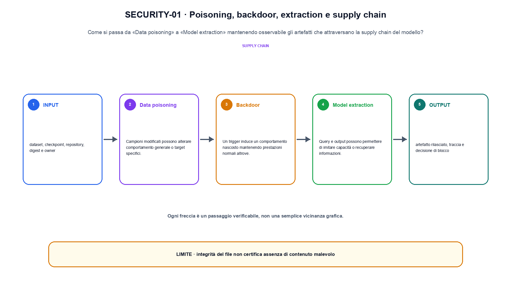
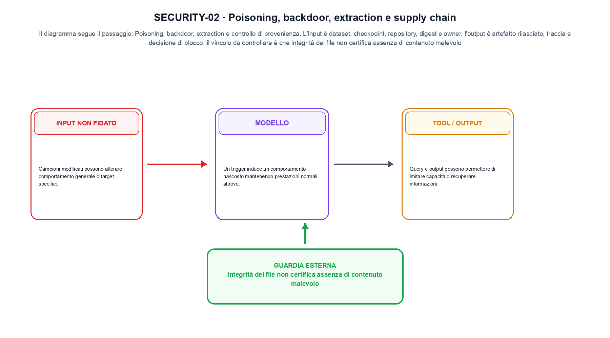

<!--
chapter_id: CH-P13-SUPPLY-CHAIN-SECURITY
part_id: P13
order_key: 900
title: Poisoning, backdoor, extraction e supply chain
maturity: CORE
status: revisione editoriale v2, approvazione autoriale aperta
version: 0.5.0-draft3
last_source_check: 4 agosto 2026
environment: Python 3.13.12, CPU
code_policy: reference
deferred: benchmark applicativi non eseguiti e approvazione autoriale delle visuali
-->

# Capitolo 90. Poisoning, backdoor, extraction e supply chain

In poisoning, backdoor, extraction e supply chain il percorso dei record è il filo conduttore: da «Data poisoning» a «Repository e deployment» ogni trasformazione lascia una traccia. L'oggetto osservato è gli artefatti che attraversano la supply chain del modello. Il contratto locale dichiara input, dataset, checkpoint, repository, digest e owner; operazione, poisoning, backdoor, extraction e controllo di provenienza; output, artefatto rilasciato, traccia e decisione di blocco. Il caso di partenza è Un checkpoint con digest e owner trusted supera l'integrity gate, ma il contenuto resta da analizzare. Il limite da non nascondere è: integrità del file non certifica assenza di contenuto malevolo.

## Data poisoning

Campioni modificati possono alterare comportamento generale o target specifici. Provenienza e deduplicazione riducono alcune superfici. [SRC-90-001]

Supply chain e backdoor richiedono una traccia degli artefatti e dei soggetti.

**Caso da seguire.** Un checkpoint con digest e owner trusted supera l'integrity gate, ma il contenuto resta da analizzare.

**Controllo.** Per «Data poisoning», conserva record iniziale, regola applicata e record finale; un conteggio aggregato non basta a spiegare la trasformazione.


Qui la notazione serve a fissare un'interfaccia tra componenti.

**Schema concettuale.** `trace = hash(model, data, artifact, owner)`

Supply chain e backdoor richiedono una traccia degli artefatti e dei soggetti. [SRC-90-001]




La prima figura segue il percorso da «Data poisoning» a «Model extraction».


## Backdoor

Un trigger induce un comportamento nascosto mantenendo prestazioni normali altrove. Scanner e fine-tuning non garantiscono rimozione. [SRC-90-002]

**Caso da seguire.** Un input non fidato che raggiunge una policy esterna, con decisione allow/deny e traccia dell'evento conservate separatamente.

**Controllo.** Esegui «Backdoor» due volte sullo stesso manifest e confronta identificatori, ordine, split e checksum.


## Model extraction

Query e output possono permettere di imitare capacità o recuperare informazioni. Rate limit e watermark comportamentali hanno limiti. [SRC-90-003]

**Caso da seguire.** Un caso in cui integrità del file non certifica assenza di contenuto malevolo.

**Controllo.** Per «Model extraction», aggiungi un record che deve essere escluso e verifica che l'output conservi anche il motivo dell'esclusione.


## Esempio Python eseguito

Questa sezione apre il contratto Python di poisoning, backdoor, extraction e supply chain: il lettore può eseguire lo stesso file e confrontare il risultato. Per «Poisoning, backdoor, extraction e supply chain», il caso di default usa valori piccoli per isolare il meccanismo. Il caso non supportato viene provato separatamente, così «poisoning, backdoor, extraction e supply chain» non viene generalizzato oltre l'esempio.

```python
def contract(case: str = "default"):
    if case != "default":
        raise ValueError("only the documented default case is supported")
    artifact = {"name": "checkpoint", "digest": "abc123", "owner": "team-a"}
    trusted_owners = {"team-a"}
    decision = artifact["owner"] in trusted_owners and bool(artifact["digest"])
    return {"release": decision, "invariant": "artifact integrity and content trust are separate checks"}
```

Esecuzione con `python snip_90_contract.py`:

```text
{"invariant": "artifact integrity and content trust are separate checks", "release": true}
```

Il test associato è [`code/test_90_contract.py`](code/test_90_contract.py); l'output versionato è [`code/outputs/SNIP-90-001.txt`](code/outputs/SNIP-90-001.txt).


## Artifact security

Checkpoint, tokenizer, codice e dipendenze richiedono hash, firma, SBOM e policy di caricamento sicuro. [SRC-90-004]

**Caso da seguire.** Per «Artifact security» si mantiene l'input del capitolo e si isola questa condizione: Checkpoint, tokenizer, codice e dipendenze richiedono hash, firma, SBOM e policy di caricamento sicuro.

**Controllo.** Per «Artifact security», modifica una sola regola della pipeline e misura quali record cambiano, evitando di confrontare raccolte di origine diversa.


## Repository e deployment

File eseguibili, custom code e deserializzazione possono introdurre rischio indipendente dai pesi matematici. [SRC-90-001]

**Caso da seguire.** Un input non fidato attraversa una policy esterna. Il controllo deve restare attivo anche se il modello produce una richiesta testuale convincente.

**Controllo.** Per «Repository e deployment», descrivi ciò che la pipeline perde oltre a ciò che produce. Nel caso «Repository e deployment», il limite locale è: File eseguibili, custom code e deserializzazione possono introdurre rischio indipendente dai pesi matematici.




La seconda figura mette a confronto «Artifact security» e il limite discusso in «Repository e deployment».


## Come si collegano i passaggi

- **Da «Data poisoning» a «Backdoor».** Campioni modificati possono alterare comportamento generale o target specifici. Un trigger induce un comportamento nascosto mantenendo prestazioni normali altrove. «Data poisoning» identifica il record e «Backdoor» dichiara la trasformazione sulla popolazione osservata. Il passaggio successivo rende misurabile «Backdoor». [SRC-90-001; SRC-90-002]

- **Da «Backdoor» a «Model extraction».** Un trigger induce un comportamento nascosto mantenendo prestazioni normali altrove. Query e output possono permettere di imitare capacità o recuperare informazioni. Il passaggio da «Backdoor» a «Model extraction» conserva configurazione, conteggi e artefatti intermedi. Da «Backdoor» a «Model extraction» cambia la domanda osservabile. [SRC-90-002; SRC-90-003]

- **Da «Model extraction» a «Artifact security».** Query e output possono permettere di imitare capacità o recuperare informazioni. Checkpoint, tokenizer, codice e dipendenze richiedono hash, firma, SBOM e policy di caricamento sicuro. Con «Artifact security» la pipeline può selezionare o usare dati senza confonderli con una modifica del modello. Il passaggio successivo rende misurabile «Artifact security». [SRC-90-003; SRC-90-004]

- **Da «Artifact security» a «Repository e deployment».** Checkpoint, tokenizer, codice e dipendenze richiedono hash, firma, SBOM e policy di caricamento sicuro. File eseguibili, custom code e deserializzazione possono introdurre rischio indipendente dai pesi matematici. «Repository e deployment» porta il risultato alla valutazione e rende visibili record, slice e failure esclusi. Da «Artifact security» a «Repository e deployment» cambia la domanda osservabile. [SRC-90-004; SRC-90-001]

La catena completa produce artefatto rilasciato, traccia e decisione di blocco a partire da dataset, checkpoint, repository, digest e owner. Ogni collegamento conserva un oggetto osservabile diverso; per questo il risultato non può essere esteso oltre il limite dichiarato: integrità del file non certifica assenza di contenuto malevolo.


## Esercizi sulla tracciabilità

1. Ricostruisci «Data poisoning» con un esempio diverso da quello mostrato e indica l'output atteso prima del calcolo.
2. Nel passaggio «Backdoor», cambia una sola ipotesi e spiega quale risultato non è più confrontabile.
3. Collega «Model extraction» a una riga dello snippet oppure motiva perché la prova deve essere documentale.
4. Progetta un caso limite per «Artifact security» che produca una failure riconoscibile.
5. Per «Repository e deployment», separa una conclusione sostenuta dal caso locale da una che richiederebbe nuovi dati o un benchmark.


## L'artefatto che deve sopravvivere

La lezione parte da «dataset, checkpoint, repository, digest e owner» e arriva fino a «artefatto rilasciato, traccia e decisione di blocco». Il limite da conservare è questo: integrità del file non certifica assenza di contenuto malevolo. Per «Repository e deployment», provenienza e trasformazioni sono registrate in [`FONTI_PRIMARIE.md`](FONTI_PRIMARIE.md), [`CLAIMS.md`](CLAIMS.md) e negli artefatti di `code/`.
