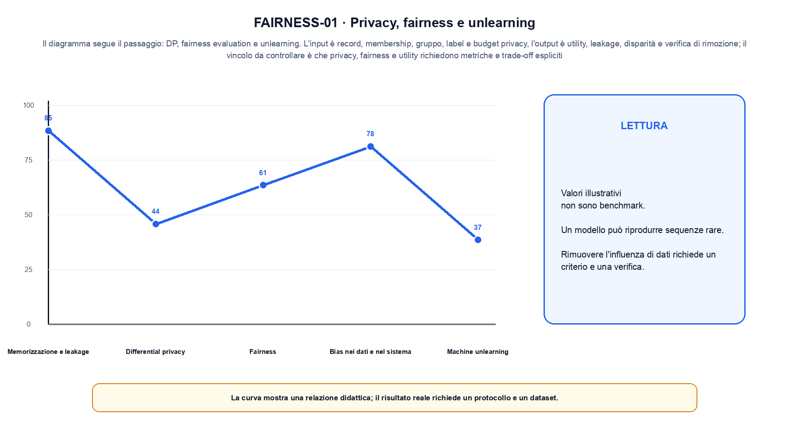
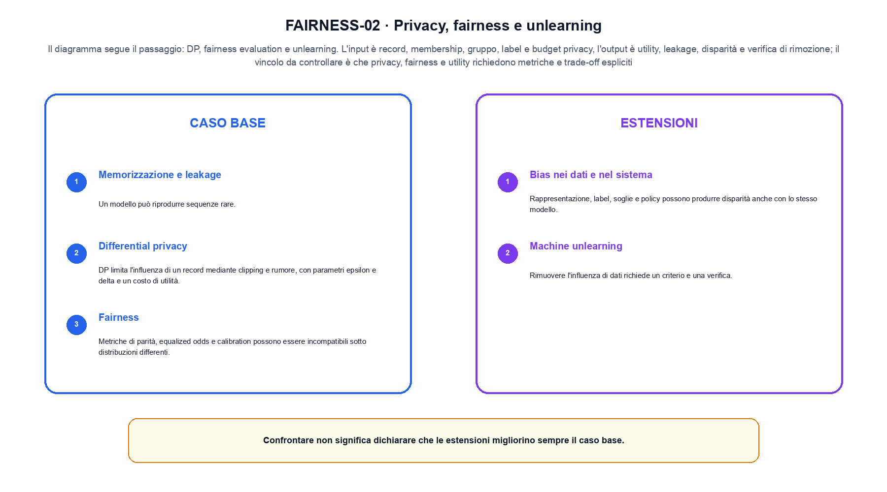

<!--
chapter_id: CH-P13-PRIVACY-FAIRNESS
part_id: P13
order_key: 910
title: Privacy, fairness e unlearning
maturity: CORE
status: candidatura completa in revisione autoriale
version: 0.4.0-draft2
last_source_check: 3 agosto 2026
environment: Python 3.13.12, CPU
deferred: benchmark applicativi, varianti non necessarie al contratto centrale e approvazione autoriale
-->

# Capitolo 91. Privacy, fairness e unlearning

Finora abbiamo potuto descrivere un dato personale e il comportamento del sistema su gruppi diversi. La richiesta «Il pacco non è arrivato» resta lo scenario condiviso: nel Capitolo 91 prendiamo l'input «record, membership, gruppo, label e budget privacy» e lo seguiamo fino all'output «utility, leakage, disparità e verifica di rimozione», dichiarando prima il contratto e poi il limite.

## Memorizzazione e leakage

Un modello può riprodurre sequenze rare. Membership inference e extraction misurano rischi differenti. [SRC-91-001]

Il caso minimo di «Memorizzazione e leakage» si presenta così: due gruppi hanno accuracy pari a 0,75 e 0,50, quindi la media non nasconde il gap. Non lo usiamo come decorazione: serve a rendere osservabile la frase «Un modello può riprodurre sequenze rare».

Per ricostruire «Memorizzazione e leakage» annotiamo l'input «record, membership, gruppo, label e budget privacy», poi l'operazione «DP, fairness evaluation e unlearning», infine l'output «utility, leakage, disparità e verifica di rimozione». Questa sequenza impedisce di scambiare una forma compatibile per il comportamento descritto dalla fonte. Il controllo parte da «Un modello può riprodurre sequenze rare».

Il controllo collega rischio, evidenza, responsabile e decisione al punto in cui il sistema può produrre un effetto. La presenza di un documento o di una credenziale non sostituisce l'applicazione del controllo. Per «Memorizzazione e leakage» il controllo cambia una sola premessa della frase «Un modello può riprodurre sequenze rare» e conserva input, output e criterio di successo, così la differenza resta attribuibile. La verifica resta ancorata a «Un modello può riprodurre sequenze rare». [SRC-91-001]

Il punto didattico di «Memorizzazione e leakage» è separare ciò che la fonte afferma da ciò che il piccolo caso illustra. L'output «utility, leakage, disparità e verifica di rimozione» mostra il contratto locale, ma non sostituisce una misura sul sistema completo.

Il controllo minimo di «Memorizzazione e leakage» confronta il caso dichiarato con una variazione che rompe la sua ipotesi. Se la failure non è distinguibile dall'esito valido, manca un'osservazione nel contratto di protocollo, slice e decisione. Da «Memorizzazione e leakage» portiamo l'output «utility, leakage, disparità e verifica di rimozione»; non portiamo invece una conclusione oltre il caso locale.

## Differential privacy

DP limita l'influenza di un record mediante clipping e rumore, con parametri epsilon e delta e un costo di utilità. [SRC-91-002]

Prima del nome tecnico fissiamo la situazione: consideriamo un input non fidato che raggiunge una policy esterna, con decisione allow/deny e traccia dell'evento conservate separatamente. Da qui possiamo leggere la conseguenza dichiarata da «DP limita l'influenza di un record mediante clipping e rumore, con parametri epsilon e delta e un costo di utilità».

Nel contratto locale, l'input «record, membership, gruppo, label e budget privacy» entra, l'operazione «DP, fairness evaluation e unlearning» modifica il percorso e l'output «utility, leakage, disparità e verifica di rimozione» è ciò che osserviamo. Qui cambia soprattutto il passaggio «Differential privacy»; resta da controllare che privacy, fairness e utility richiedono metriche e trade-off espliciti. La domanda locale è «DP limita l'influenza di un record mediante clipping e rumore, con parametri epsilon e delta e un costo di utilità».

Il controllo collega rischio, evidenza, responsabile e decisione al punto in cui il sistema può produrre un effetto. La presenza di un documento o di una credenziale non sostituisce l'applicazione del controllo. Per «Differential privacy» il controllo cambia una sola premessa della frase «DP limita l'influenza di un record mediante clipping e rumore, con parametri epsilon e delta e un costo di utilità» e conserva input, output e criterio di successo, così la differenza resta attribuibile. La verifica resta ancorata a «DP limita l'influenza di un record mediante clipping e rumore, con parametri epsilon e delta e un costo di utilità». [SRC-91-002]

La lettura va fatta in ordine: prima il caso, poi la trasformazione, quindi la conseguenza. Il piccolo risultato resta un'illustrazione di «DP limita l'influenza di un record mediante clipping e rumore, con parametri epsilon e delta e un costo di utilità», non una promessa generale.

La prova di «Differential privacy» conserva input, operazione e output; poi esplicita quale parte di «DP limita l'influenza di un record mediante clipping e rumore, con parametri epsilon e delta e un costo di utilità» non è stata misurata. Così il test separa l'evidenza dall'inferenza. Il passaggio successivo, «Fairness», potrà cambiare una sola condizione, dichiarando il nuovo setup prima di interpretare il risultato.

## Fairness

Metriche di parità, equalized odds e calibration possono essere incompatibili sotto distribuzioni differenti. Il contesto decisionale guida la scelta. [SRC-91-003]

Per capire «Fairness» partiamo da questo caso: un input non fidato che raggiunge una policy esterna, con decisione allow/deny e traccia dell'evento conservate separatamente. Il caso rende osservabile il punto centrale: «Metriche di parità, equalized odds e calibration possono essere incompatibili sotto distribuzioni differenti».

La sezione usa l'input «record, membership, gruppo, label e budget privacy» come punto di partenza e l'output «utility, leakage, disparità e verifica di rimozione» come traccia d'uscita. La trasformazione concreta è «DP, fairness evaluation e unlearning»; il caso non è completo se non dichiariamo anche che privacy, fairness e utility richiedono metriche e trade-off espliciti. La condizione da isolare è «Metriche di parità, equalized odds e calibration possono essere incompatibili sotto distribuzioni differenti».

Il controllo collega rischio, evidenza, responsabile e decisione al punto in cui il sistema può produrre un effetto. La presenza di un documento o di una credenziale non sostituisce l'applicazione del controllo. Per «Fairness» il controllo cambia una sola premessa della frase «Metriche di parità, equalized odds e calibration possono essere incompatibili sotto distribuzioni differenti» e conserva input, output e criterio di successo, così la differenza resta attribuibile. La verifica resta ancorata a «Metriche di parità, equalized odds e calibration possono essere incompatibili sotto distribuzioni differenti». [SRC-91-003]

Se cambiamo una premessa, dobbiamo riaprire l'interpretazione. Per «Fairness» conserviamo l'osservazione collegata a «Metriche di parità, equalized odds e calibration possono essere incompatibili sotto distribuzioni differenti» e lasciamo esplicitamente fuori ciò che non è stato misurato.

Per verificare «Fairness» cambiamo una sola condizione vicina alla frase «Metriche di parità, equalized odds e calibration possono essere incompatibili sotto distribuzioni differenti», teniamo fermo il resto e registriamo l'output «utility, leakage, disparità e verifica di rimozione». Il caso negativo deve rendere riconoscibile la failure, non soltanto produrre un numero diverso. La sezione successiva, «Bias nei dati e nel sistema», riceve l'output «utility, leakage, disparità e verifica di rimozione» come base, ma dovrà formulare e verificare la propria distinzione.

La figura FAIRNESS-01 usa la famiglia chart. Il diagramma segue il passaggio: DP, fairness evaluation e unlearning. L'input è record, membership, gruppo, label e budget privacy, l'output è utility, leakage, disparità e verifica di rimozione; il vincolo da controllare è che privacy, fairness e utility richiedono metriche e trade-off espliciti.

## Bias nei dati e nel sistema

Rappresentazione, label, soglie e policy possono produrre disparità anche con lo stesso modello. [SRC-91-004]

Il caso minimo di «Bias nei dati e nel sistema» si presenta così: un input non fidato attraversa una policy esterna. Il controllo deve restare attivo anche se il modello produce una richiesta testuale convincente. Non lo usiamo come decorazione: serve a rendere osservabile la frase «Rappresentazione, label, soglie e policy possono produrre disparità anche con lo stesso modello».

Per ricostruire «Bias nei dati e nel sistema» annotiamo l'input «record, membership, gruppo, label e budget privacy», poi l'operazione «DP, fairness evaluation e unlearning», infine l'output «utility, leakage, disparità e verifica di rimozione». Questa sequenza impedisce di scambiare una forma compatibile per il comportamento descritto dalla fonte. Il controllo parte da «Rappresentazione, label, soglie e policy possono produrre disparità anche con lo stesso modello».

Il controllo collega rischio, evidenza, responsabile e decisione al punto in cui il sistema può produrre un effetto. La presenza di un documento o di una credenziale non sostituisce l'applicazione del controllo. Per «Bias nei dati e nel sistema» il controllo cambia una sola premessa della frase «Rappresentazione, label, soglie e policy possono produrre disparità anche con lo stesso modello» e conserva input, output e criterio di successo, così la differenza resta attribuibile. La verifica resta ancorata a «Rappresentazione, label, soglie e policy possono produrre disparità anche con lo stesso modello». [SRC-91-004]

Il punto didattico di «Bias nei dati e nel sistema» è separare ciò che la fonte afferma da ciò che il piccolo caso illustra. L'output «utility, leakage, disparità e verifica di rimozione» mostra il contratto locale, ma non sostituisce una misura sul sistema completo.

Il controllo minimo di «Bias nei dati e nel sistema» confronta il caso dichiarato con una variazione che rompe la sua ipotesi. Se la failure non è distinguibile dall'esito valido, manca un'osservazione nel contratto di protocollo, slice e decisione. Da «Bias nei dati e nel sistema» portiamo l'output «utility, leakage, disparità e verifica di rimozione»; non portiamo invece una conclusione oltre il caso locale.

## Machine unlearning

Rimuovere l'influenza di dati richiede un criterio e una verifica. Cancellare un record dal corpus non modifica automaticamente il checkpoint. [SRC-91-001]

Prima del nome tecnico fissiamo la situazione: consideriamo un input non fidato attraversa una policy esterna. Il controllo deve restare attivo anche se il modello produce una richiesta testuale convincente. Da qui possiamo leggere la conseguenza dichiarata da «Rimuovere l'influenza di dati richiede un criterio e una verifica».

Nel contratto locale, l'input «record, membership, gruppo, label e budget privacy» entra, l'operazione «DP, fairness evaluation e unlearning» modifica il percorso e l'output «utility, leakage, disparità e verifica di rimozione» è ciò che osserviamo. Qui cambia soprattutto il passaggio «Machine unlearning»; resta da controllare che privacy, fairness e utility richiedono metriche e trade-off espliciti. La domanda locale è «Rimuovere l'influenza di dati richiede un criterio e una verifica».

Il controllo collega rischio, evidenza, responsabile e decisione al punto in cui il sistema può produrre un effetto. La presenza di un documento o di una credenziale non sostituisce l'applicazione del controllo. Per «Machine unlearning» il controllo cambia una sola premessa della frase «Rimuovere l'influenza di dati richiede un criterio e una verifica» e conserva input, output e criterio di successo, così la differenza resta attribuibile. La verifica resta ancorata a «Rimuovere l'influenza di dati richiede un criterio e una verifica». [SRC-91-001]

La lettura va fatta in ordine: prima il caso, poi la trasformazione, quindi la conseguenza. Cancellare un record dal corpus non modifica automaticamente il checkpoint. Il piccolo risultato resta un'illustrazione di «Rimuovere l'influenza di dati richiede un criterio e una verifica», non una promessa generale.

La prova di «Machine unlearning» conserva input, operazione e output; poi esplicita quale parte di «Rimuovere l'influenza di dati richiede un criterio e una verifica» non è stata misurata. Così il test separa l'evidenza dall'inferenza. Il caso finale consegna l'output «utility, leakage, disparità e verifica di rimozione» come evidenza locale e conserva il confine tra evidenza e interpretazione come domanda aperta.

## Una traiettoria controllata: Memorizzazione e leakage

Il caso intero parte dall'input «record, membership, gruppo, label e budget privacy», applica l'operazione «DP, fairness evaluation e unlearning» e osserva l'output «utility, leakage, disparità e verifica di rimozione». Un esempio controllato: stessa accuracy media con leakage e disparità per slice. Lo schema compatto è:

$$
risk = utility + privacy + fairness
$$

È una notazione di interfaccia, non un'identità numerica completa. Privacy, equità e utilità entrano in un trade-off da rendere misurabile. [SRC-91-001]

La figura FAIRNESS-02 cambia composizione rispetto alla prima. Il diagramma segue il passaggio: DP, fairness evaluation e unlearning. L'input è record, membership, gruppo, label e budget privacy, l'output è utility, leakage, disparità e verifica di rimozione; il vincolo da controllare è che privacy, fairness e utility richiedono metriche e trade-off espliciti.

## Il passaggio eseguito in Python: Differential privacy

Nel run Python rendiamo osservabile la frase «Un modello può riprodurre sequenze rare» con valori piccoli e leggibili. Il test associato verifica determinismo, output e rifiuto di una condizione incoerente; il file di output `code/outputs/SNIP-91-001.txt` documenta il caso senza pretendere una misura generale.

## Prima di generalizzare: Machine unlearning

Il meccanismo di «Privacy, fairness e unlearning» non garantisce da solo che il sistema funzioni fuori dal caso guida. Privacy, fairness e utility richiedono metriche e trade-off espliciti. Il limite osservato riguarda la frase «Un modello può riprodurre sequenze rare»; per trasferire il concetto occorre riaprire la verifica quando cambiano dati, scala o ambiente.

## Dalla lezione al capitolo seguente: Privacy, fairness e unlearning

Il percorso ha tenuto insieme un dato personale e il comportamento del sistema su gruppi diversi, l'operazione «DP, fairness evaluation e unlearning» e l'output «utility, leakage, disparità e verifica di rimozione». Le sezioni «Memorizzazione e leakage», «Differential privacy», «Machine unlearning» mostrano come il protocollo osservato delimiti ciò che il capitolo può sostenere. L'invariante da portare avanti è: privacy, fairness e utility richiedono metriche e trade-off espliciti. Il Capitolo 92, Watermarking e provenienza dei contenuti, può partire da questo output e dichiarare la propria domanda.

### Domande per ricostruire il percorso: Memorizzazione e leakage

1. Ricostruisci l'oggetto continuo a partire da «Memorizzazione e leakage» e indica quale parte della frase «Un modello può riprodurre sequenze rare» entra nel caso.
2. Spiega quale trasformazione collega «Memorizzazione e leakage» a «Machine unlearning» e quale output osserviamo nel passaggio.
3. Usa lo snippet per controllare l'invariante del contratto: privacy, fairness e utility richiedono metriche e trade-off espliciti.
4. Separa una definizione sostenuta da una fonte, un esempio illustrativo e un risultato locale del caso guida.
5. Indica quale parte della frase «Rimuovere l'influenza di dati richiede un criterio e una verifica» richiederebbe una misura nuova prima di essere estesa oltre il caso osservato.

### Esercizi sul failure mode: Machine unlearning

1. Ricostruisci «Memorizzazione e leakage» senza usare il nome della tecnica, soltanto con input, operazione e output.
2. Sostituisci una condizione di «Differential privacy» e prevedi che cosa non dovrebbe cambiare.
3. Cerca un controesempio per «Fairness» e annota quale ipotesi viene rotta.
4. Trasforma il limite di «Bias nei dati e nel sistema» in un test ripetibile.
5. Spiega come trasferire «Machine unlearning» senza portare con sé una promessa non misurata.

## Dossier delle fonti e materiali: Privacy, fairness e unlearning

Per «Privacy, fairness e unlearning», le fonti portanti, i limiti dei claim e la data di consultazione sono raccolti in `FONTI_PRIMARIE.md`; la ricerca riguarda soprattutto protocollo, slice e decisione. `CLAIMS.md` separa definizioni e risultati locali; codice, ambiente, test e output sono nella cartella `code/`, con attenzione a protocollo, slice e decisione.
