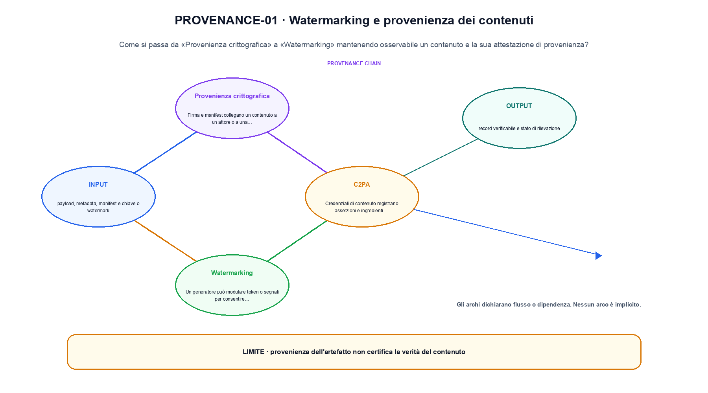
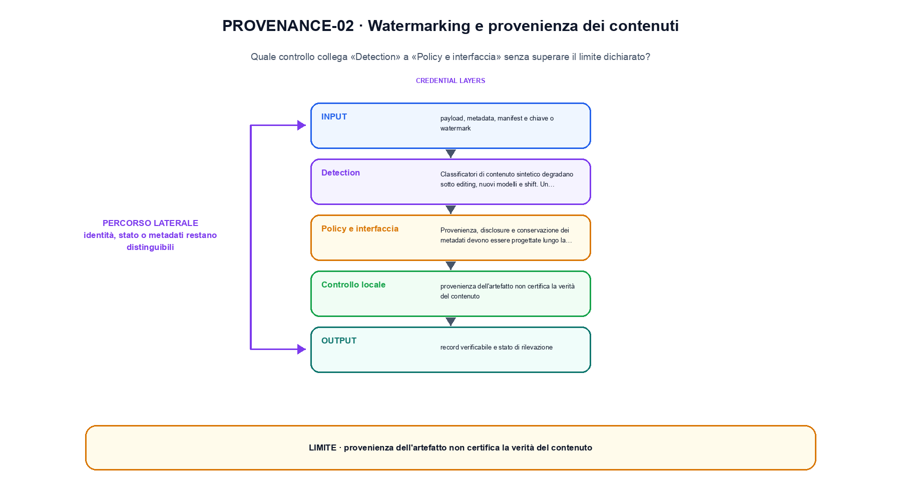

<!--
chapter_id: CH-P13-PROVENANCE
part_id: P13
order_key: 920
title: Watermarking e provenienza dei contenuti
maturity: ESTABLISHED
status: revisione editoriale v2, approvazione autoriale aperta
version: 0.5.0-draft3
last_source_check: 4 agosto 2026
environment: Python 3.13.12, CPU
code_policy: reference
deferred: benchmark applicativi non eseguiti e approvazione autoriale delle visuali
-->

# Capitolo 92. Watermarking e provenienza dei contenuti

La domanda guida di questa lezione è come collegare «Provenienza crittografica» e «Policy e interfaccia» senza perdere il contratto tecnico di watermarking e provenienza dei contenuti. L'oggetto osservato è un contenuto e la sua attestazione di provenienza. Il contratto locale è: input, payload, metadata, manifest e chiave o watermark; operazione, digest, firma, C2PA, watermark e detection; output, record verificabile e stato di rilevazione. Il caso guida è questo: Cambiare il payload cambia il digest e rende rilevabile la manomissione. Il confine da mantenere esplicito è: provenienza dell'artefatto non certifica la verità del contenuto.

## Provenienza crittografica

Firma e manifest collegano un contenuto a un attore o a una catena di modifiche, se le chiavi e il workflow sono affidabili. [SRC-92-001]

Il digest collega contenuto e metadati senza certificare la verità semantica.

**Caso da seguire.** Cambiare il payload cambia il digest e rende rilevabile la manomissione.

**Controllo.** Classifica lo stesso caso lungo un solo asse alla volta e annota quale proprietà non è stata misurata.


## C2PA

Credenziali di contenuto registrano asserzioni e ingredienti. Assenza di credenziali non prova che un contenuto sia sintetico. [SRC-92-002]

**Caso da seguire.** Digest di payload e metadati con verifica di una modifica.

**Controllo.** Cambia la proprietà che distingue «C2PA» dalle categorie vicine. Se la classificazione non cambia, la distinzione va formulata meglio.


## Watermarking

Un generatore può modulare token o segnali per consentire rilevamento statistico. Robustezza e falsi positivi dipendono dal canale. [SRC-92-003]

**Caso da seguire.** Un payload modificato dopo la firma, con digest e metadati confrontati separatamente.

**Controllo.** Confronta un caso positivo e uno di confine usando la medesima definizione; non trasformare l'esempio in una graduatoria generale.




La prima figura segue il percorso da «Provenienza crittografica» a «Watermarking».


## Detection

Classificatori di contenuto sintetico degradano sotto editing, nuovi modelli e shift. Un punteggio non è una prova forense isolata. [SRC-92-003]

**Caso da seguire.** Un contenuto viene accompagnato da fonte, versione e digest. Il record rende ricostruibile la storia dell'artefatto, ma non sostituisce la verifica del contenuto.

**Controllo.** Indica quale osservazione smentirebbe l'assegnazione del caso a «Detection» e quale invece sarebbe irrilevante.


## Policy e interfaccia

Provenienza, disclosure e conservazione dei metadati devono essere progettate lungo la pipeline di pubblicazione. [SRC-92-004]

**Caso da seguire.** Una traiettoria di due passi in cui l'azione scelta modifica lo stato successivo prima del reward.

**Controllo.** Limita la conclusione alla proprietà dichiarata: Provenienza, disclosure e conservazione dei metadati devono essere progettate lungo la pipeline di pubblicazione. Le dimensioni non osservate restano aperte.


## Esempio Python eseguito

Il frammento seguente è lo stesso conservato nel repository. Usa valori piccoli perché l'obiettivo è osservare il meccanismo, non simulare una scala che non abbiamo eseguito.

```python
def contract():
    payload = "Il pacco non è arrivato"
    manifest = {"payload": payload, "creator": "local-test", "version": "v1"}
    digest = hashlib.sha256(json.dumps(manifest, ensure_ascii=False, sort_keys=True).encode()).hexdigest()
    tampered = dict(manifest, payload="Il pacco è arrivato")
    tampered_digest = hashlib.sha256(json.dumps(tampered, ensure_ascii=False, sort_keys=True).encode()).hexdigest()
    return {"digest_prefix": digest[:12], "tamper_detected": digest != tampered_digest, "invariant": "provenance detects a changed record but does not certify its truth"}
```

Esecuzione con `python snip_92_contract.py`:

```text
{"digest_prefix": "9f84b58f871a", "invariant": "provenance detects a changed record but does not certify its truth", "tamper_detected": true}
```

Il test associato è [`code/test_92_contract.py`](code/test_92_contract.py); l'output versionato è [`code/outputs/SNIP-92-001.txt`](code/outputs/SNIP-92-001.txt).




La seconda figura mette a confronto «Detection» e il limite discusso in «Policy e interfaccia».


## Come si collegano i passaggi

- **Da «Provenienza crittografica» a «C2PA».** Firma e manifest collegano un contenuto a un attore o a una catena di modifiche, se le chiavi e il workflow sono affidabili. Credenziali di contenuto registrano asserzioni e ingredienti. La definizione iniziale stabilisce l'asse del confronto; la categoria successiva aggiunge una proprietà senza creare una classifica implicita. [SRC-92-001; SRC-92-002]

- **Da «C2PA» a «Watermarking».** Credenziali di contenuto registrano asserzioni e ingredienti. Un generatore può modulare token o segnali per consentire rilevamento statistico. Il terzo passaggio verifica se le categorie restano distinguibili sullo stesso caso e impedisce che termini vicini diventino sinonimi. [SRC-92-002; SRC-92-003]

- **Da «Watermarking» a «Detection».** Un generatore può modulare token o segnali per consentire rilevamento statistico. Classificatori di contenuto sintetico degradano sotto editing, nuovi modelli e shift. La quarta sezione introduce il punto in cui l'asse scelto smette di bastare e richiede una nuova osservazione. [SRC-92-003; SRC-92-003]

- **Da «Detection» a «Policy e interfaccia».** Classificatori di contenuto sintetico degradano sotto editing, nuovi modelli e shift. Provenienza, disclosure e conservazione dei metadati devono essere progettate lungo la pipeline di pubblicazione. La sezione finale riunisce le dimensioni della valutazione, ma conserva i limiti di ciascuna invece di fonderle in un unico punteggio. [SRC-92-003; SRC-92-004]

La catena completa produce record verificabile e stato di rilevazione a partire da payload, metadata, manifest e chiave o watermark. Ogni collegamento conserva un oggetto osservabile diverso; per questo il risultato non può essere esteso oltre il limite dichiarato: provenienza dell'artefatto non certifica la verità del contenuto.


## Domande per distinguere le categorie

1. Ricostruisci «Provenienza crittografica» con un esempio diverso da quello mostrato e indica l'output atteso prima del calcolo.
2. Nel passaggio «C2PA», cambia una sola ipotesi e spiega quale risultato non è più confrontabile.
3. Collega «Watermarking» a una riga dello snippet oppure motiva perché la prova deve essere documentale.
4. Progetta un caso limite per «Detection» che produca una failure riconoscibile.
5. Per «Policy e interfaccia», separa una conclusione sostenuta dal caso locale da una che richiederebbe nuovi dati o un benchmark.


## Una mappa, non una graduatoria

La lezione parte da «payload, metadata, manifest e chiave o watermark» e arriva fino a «record verificabile e stato di rilevazione». Il limite da conservare è questo: provenienza dell'artefatto non certifica la verità del contenuto. Definizioni e risultati citati sono rintracciabili in [`FONTI_PRIMARIE.md`](FONTI_PRIMARIE.md); la mappa dei claim è in [`CLAIMS.md`](CLAIMS.md).
