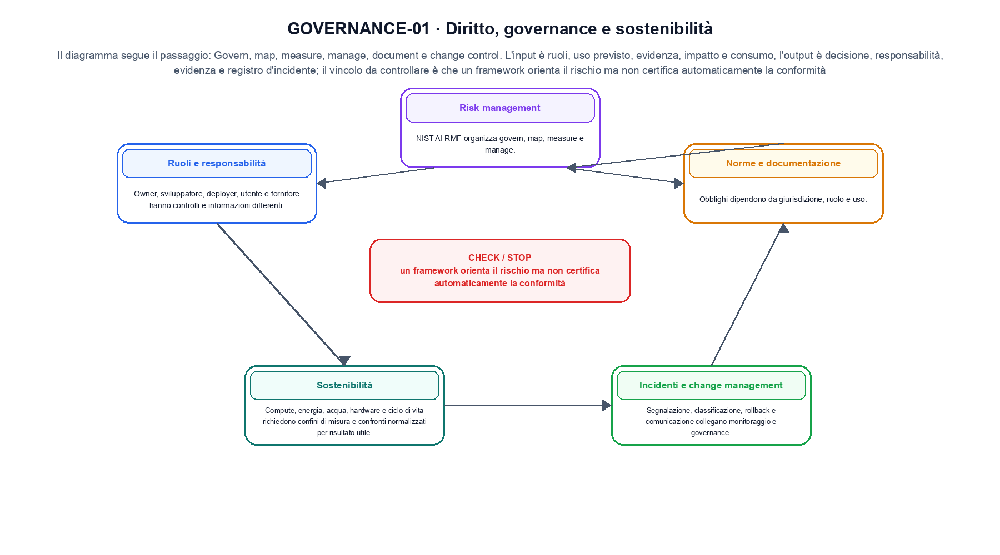
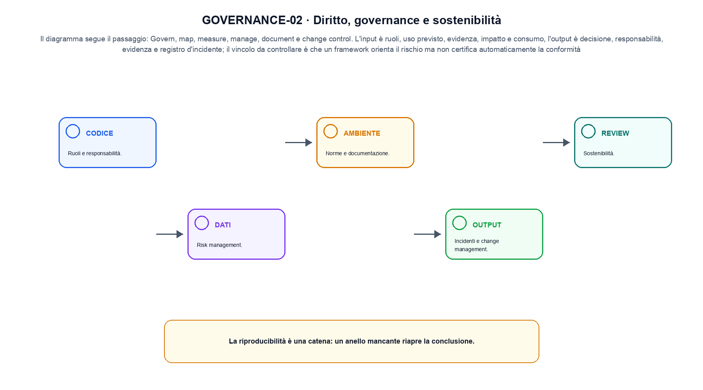

<!--
chapter_id: CH-P13-GOVERNANCE
part_id: P13
order_key: 930
title: Diritto, governance e sostenibilità
maturity: CORE
status: candidatura completa in revisione autoriale
version: 0.4.0-draft2
last_source_check: 3 agosto 2026
environment: Python 3.13.12, CPU
deferred: benchmark applicativi, varianti non necessarie al contratto centrale e approvazione autoriale
-->

# Capitolo 93. Diritto, governance e sostenibilità

La richiesta «Il pacco non è arrivato» resta il caso guida. In questo capitolo la usiamo per distinguere una decisione di governance su un sistema e il suo rischio, trasformazione e risultato, senza nascondere i dettagli tecnici.

## Ruoli e responsabilità

Owner, sviluppatore, deployer, utente e fornitore hanno controlli e informazioni differenti. La matrice RACI rende esplicite decisioni ed escalation. [SRC-93-001]

Per capire «Ruoli e responsabilità» partiamo da questo caso: una scheda con owner, rischio, evidenza e decisione è completa, ma non certifica la compliance. Il caso rende osservabile il punto centrale: «Owner, sviluppatore, deployer, utente e fornitore hanno controlli e informazioni differenti».

Nel contratto locale, l'input «ruoli, uso previsto, evidenza, impatto e consumo» entra, l'operazione «govern, map, measure, manage, document e change control» modifica il percorso e l'output «decisione, responsabilità, evidenza e registro d'incidente» è ciò che osserviamo. Qui cambia soprattutto il passaggio «Ruoli e responsabilità»; resta da controllare che un framework orienta il rischio ma non certifica automaticamente la conformità. La domanda locale è «Owner, sviluppatore, deployer, utente e fornitore hanno controlli e informazioni differenti».

Il controllo collega rischio, evidenza, responsabile e decisione al punto in cui il sistema può produrre un effetto. La presenza di un documento o di una credenziale non sostituisce l'applicazione del controllo. In questa sezione si isola la maschera: a parità di messaggio, si controlla quali posizioni contribuiscono davvero alla loss. La verifica resta ancorata a «Owner, sviluppatore, deployer, utente e fornitore hanno controlli e informazioni differenti». [SRC-93-001]

La lettura va fatta in ordine: prima il caso, poi la trasformazione, quindi la conseguenza. La matrice RACI rende esplicite decisioni ed escalation. Il piccolo risultato resta un'illustrazione di «Owner, sviluppatore, deployer, utente e fornitore hanno controlli e informazioni differenti», non una promessa generale.

Per verificare «Ruoli e responsabilità» cambiamo una sola condizione vicina alla frase «Owner, sviluppatore, deployer, utente e fornitore hanno controlli e informazioni differenti», teniamo fermo il resto e registriamo l'output «decisione, responsabilità, evidenza e registro d'incidente». Il caso negativo deve rendere riconoscibile la failure, non soltanto produrre un numero diverso. La sezione successiva, «Risk management», riceve l'output «decisione, responsabilità, evidenza e registro d'incidente» come base, ma dovrà formulare e verificare la propria distinzione.

## Risk management

NIST AI RMF organizza govern, map, measure e manage. Il framework guida un processo e non certifica automaticamente un sistema. [SRC-93-002]

Il caso minimo di «Risk management» si presenta così: una tabella govern-map-measure-manage con evidenza e responsabile per ogni controllo. Non lo usiamo come decorazione: serve a rendere osservabile la frase «NIST AI RMF organizza govern, map, measure e manage».

La sezione usa l'input «ruoli, uso previsto, evidenza, impatto e consumo» come punto di partenza e l'output «decisione, responsabilità, evidenza e registro d'incidente» come traccia d'uscita. La trasformazione concreta è «govern, map, measure, manage, document e change control»; il caso non è completo se non dichiariamo anche che un framework orienta il rischio ma non certifica automaticamente la conformità. La condizione da isolare è «NIST AI RMF organizza govern, map, measure e manage».

Il controllo collega rischio, evidenza, responsabile e decisione al punto in cui il sistema può produrre un effetto. La presenza di un documento o di una credenziale non sostituisce l'applicazione del controllo. Per «Risk management» il controllo cambia una sola premessa della frase «NIST AI RMF organizza govern, map, measure e manage» e conserva input, output e criterio di successo, così la differenza resta attribuibile. La verifica resta ancorata a «NIST AI RMF organizza govern, map, measure e manage». [SRC-93-002]

Se cambiamo una premessa, dobbiamo riaprire l'interpretazione. Per «Risk management» conserviamo l'osservazione collegata a «NIST AI RMF organizza govern, map, measure e manage» e lasciamo esplicitamente fuori ciò che non è stato misurato.

Il controllo minimo di «Risk management» confronta il caso dichiarato con una variazione che rompe la sua ipotesi. Se la failure non è distinguibile dall'esito valido, manca un'osservazione nel contratto di protocollo, slice e decisione. Da «Risk management» portiamo l'output «decisione, responsabilità, evidenza e registro d'incidente»; non portiamo invece una conclusione oltre il caso locale.

La figura GOVERNANCE-01 usa la famiglia loop. Il diagramma segue il passaggio: Govern, map, measure, manage, document e change control. L'input è ruoli, uso previsto, evidenza, impatto e consumo, l'output è decisione, responsabilità, evidenza e registro d'incidente; il vincolo da controllare è che un framework orienta il rischio ma non certifica automaticamente la conformità.

## Norme e documentazione

Obblighi dipendono da giurisdizione, ruolo e uso. Versione, data e parere legale devono essere separati dal testo tecnico stabile. [SRC-93-003]

Prima del nome tecnico fissiamo la situazione: consideriamo un requisito normativo annotato con giurisdizione, ruolo, versione e data di lettura. Da qui possiamo leggere la conseguenza dichiarata da «Obblighi dipendono da giurisdizione, ruolo e uso».

Per ricostruire «Norme e documentazione» annotiamo l'input «ruoli, uso previsto, evidenza, impatto e consumo», poi l'operazione «govern, map, measure, manage, document e change control», infine l'output «decisione, responsabilità, evidenza e registro d'incidente». Questa sequenza impedisce di scambiare una forma compatibile per il comportamento descritto dalla fonte. Il controllo parte da «Obblighi dipendono da giurisdizione, ruolo e uso».

Il controllo collega rischio, evidenza, responsabile e decisione al punto in cui il sistema può produrre un effetto. La presenza di un documento o di una credenziale non sostituisce l'applicazione del controllo. La prova conserva ranking, segmenti entrati nel contesto e risposta, così un errore di recupero non viene attribuito alla generazione. La verifica resta ancorata a «Obblighi dipendono da giurisdizione, ruolo e uso». [SRC-93-003]

Il punto didattico di «Norme e documentazione» è separare ciò che la fonte afferma da ciò che il piccolo caso illustra. L'output «decisione, responsabilità, evidenza e registro d'incidente» mostra il contratto locale, ma non sostituisce una misura sul sistema completo.

La prova di «Norme e documentazione» conserva input, operazione e output; poi esplicita quale parte di «Obblighi dipendono da giurisdizione, ruolo e uso» non è stata misurata. Così il test separa l'evidenza dall'inferenza. Il passaggio successivo, «Incidenti e change management», potrà cambiare una sola condizione, dichiarando il nuovo setup prima di interpretare il risultato.

## Incidenti e change management

Segnalazione, classificazione, rollback e comunicazione collegano monitoraggio e governance. [SRC-93-001]

Per capire «Incidenti e change management» partiamo da questo caso: un incident record con rilevazione, classificazione, contenimento, rollback e comunicazione. Il caso rende osservabile il punto centrale: «Segnalazione, classificazione, rollback e comunicazione collegano monitoraggio e governance».

Nel contratto locale, l'input «ruoli, uso previsto, evidenza, impatto e consumo» entra, l'operazione «govern, map, measure, manage, document e change control» modifica il percorso e l'output «decisione, responsabilità, evidenza e registro d'incidente» è ciò che osserviamo. Qui cambia soprattutto il passaggio «Incidenti e change management»; resta da controllare che un framework orienta il rischio ma non certifica automaticamente la conformità. La domanda locale è «Segnalazione, classificazione, rollback e comunicazione collegano monitoraggio e governance».

Il controllo collega rischio, evidenza, responsabile e decisione al punto in cui il sistema può produrre un effetto. La presenza di un documento o di una credenziale non sostituisce l'applicazione del controllo. La verifica assegna owner, evidenza, decisione e condizione di riapertura allo stesso caso, senza trasformare la checklist in una certificazione. La verifica resta ancorata a «Segnalazione, classificazione, rollback e comunicazione collegano monitoraggio e governance». [SRC-93-001]

La lettura va fatta in ordine: prima il caso, poi la trasformazione, quindi la conseguenza. Il piccolo risultato resta un'illustrazione di «Segnalazione, classificazione, rollback e comunicazione collegano monitoraggio e governance», non una promessa generale.

Per verificare «Incidenti e change management» cambiamo una sola condizione vicina alla frase «Segnalazione, classificazione, rollback e comunicazione collegano monitoraggio e governance», teniamo fermo il resto e registriamo l'output «decisione, responsabilità, evidenza e registro d'incidente». Il caso negativo deve rendere riconoscibile la failure, non soltanto produrre un numero diverso. La sezione successiva, «Sostenibilità», riceve l'output «decisione, responsabilità, evidenza e registro d'incidente» come base, ma dovrà formulare e verificare la propria distinzione.

## Sostenibilità

Compute, energia, acqua, hardware e ciclo di vita richiedono confini di misura e confronti normalizzati per risultato utile. [SRC-93-004]

Il caso minimo di «Sostenibilità» si presenta così: un confronto tra due configurazioni normalizzato per risultato utile, energia e hardware. Non lo usiamo come decorazione: serve a rendere osservabile la frase «Compute, energia, acqua, hardware e ciclo di vita richiedono confini di misura e confronti normalizzati per risultato utile».

La sezione usa l'input «ruoli, uso previsto, evidenza, impatto e consumo» come punto di partenza e l'output «decisione, responsabilità, evidenza e registro d'incidente» come traccia d'uscita. La trasformazione concreta è «govern, map, measure, manage, document e change control»; il caso non è completo se non dichiariamo anche che un framework orienta il rischio ma non certifica automaticamente la conformità. La condizione da isolare è «Compute, energia, acqua, hardware e ciclo di vita richiedono confini di misura e confronti normalizzati per risultato utile».

Il controllo collega rischio, evidenza, responsabile e decisione al punto in cui il sistema può produrre un effetto. La presenza di un documento o di una credenziale non sostituisce l'applicazione del controllo. Per «Sostenibilità» il controllo cambia una sola premessa della frase «Compute, energia, acqua, hardware e ciclo di vita richiedono confini di misura e confronti normalizzati per risultato utile» e conserva input, output e criterio di successo, così la differenza resta attribuibile. La verifica resta ancorata a «Compute, energia, acqua, hardware e ciclo di vita richiedono confini di misura e confronti normalizzati per risultato utile». [SRC-93-004]

Se cambiamo una premessa, dobbiamo riaprire l'interpretazione. Per «Sostenibilità» conserviamo l'osservazione collegata a «Compute, energia, acqua, hardware e ciclo di vita richiedono confini di misura e confronti normalizzati per risultato utile» e lasciamo esplicitamente fuori ciò che non è stato misurato.

Il controllo minimo di «Sostenibilità» confronta il caso dichiarato con una variazione che rompe la sua ipotesi. Se la failure non è distinguibile dall'esito valido, manca un'osservazione nel contratto di protocollo, slice e decisione. La conclusione resta ancorata al protocollo osservato, non al nome della tecnica.

## Una traiettoria controllata: Ruoli e responsabilità

Il caso intero parte dall'input «ruoli, uso previsto, evidenza, impatto e consumo», applica l'operazione «govern, map, measure, manage, document e change control» e osserva l'output «decisione, responsabilità, evidenza e registro d'incidente». Un esempio controllato: un caso d'uso assegnato a owner, misura, controllo e decisione di escalation. Lo schema compatto è:

$$
decision = govern(policy, risk, evidence)
$$

È una notazione di interfaccia, non un'identità numerica completa. Governance traduce evidenza e rischio in una decisione documentata. [SRC-93-001]

La figura GOVERNANCE-02 cambia composizione rispetto alla prima. Il diagramma segue il passaggio: Govern, map, measure, manage, document e change control. L'input è ruoli, uso previsto, evidenza, impatto e consumo, l'output è decisione, responsabilità, evidenza e registro d'incidente; il vincolo da controllare è che un framework orienta il rischio ma non certifica automaticamente la conformità.

## Il passaggio eseguito in Python: Risk management

Il file `code/snip_93_contract.py` collega il contratto del capitolo alla frase «Compute, energia, acqua, hardware e ciclo di vita richiedono confini di misura e confronti normalizzati per risultato utile». Il test controlla l'invariante, la risposta valida e il caso negativo; `code/outputs/SNIP-93-001.txt` conserva il risultato ripetibile del caso locale.

## Prima di generalizzare: Sostenibilità

Il meccanismo di «Diritto, governance e sostenibilità» resta legato al contratto locale. Un framework orienta il rischio ma non certifica automaticamente la conformità. Prima di generalizzare la frase «Compute, energia, acqua, hardware e ciclo di vita richiedono confini di misura e confronti normalizzati per risultato utile», servono un nuovo setup, un protocollo dichiarato e una misura ripetibile.

## Dalla lezione al capitolo seguente: Diritto, governance e sostenibilità

Abbiamo seguito una decisione di governance su un sistema e il suo rischio, partendo dall'input «ruoli, uso previsto, evidenza, impatto e consumo» e arrivando all'output «decisione, responsabilità, evidenza e registro d'incidente». Le sezioni «Ruoli e responsabilità», «Risk management», «Sostenibilità» hanno isolato le proprie frasi chiave senza confondere il meccanismo con il risultato applicativo. L'invariante da portare avanti è: un framework orienta il rischio ma non certifica automaticamente la conformità. Il Capitolo 94, Percorso pratico dai fondamenti, può partire da questo output e dichiarare la propria domanda.

### Domande per ricostruire il percorso: Ruoli e responsabilità

1. Ricostruisci l'oggetto continuo a partire da «Ruoli e responsabilità» e indica quale parte della frase «Owner, sviluppatore, deployer, utente e fornitore hanno controlli e informazioni differenti» entra nel caso.
2. Spiega quale trasformazione collega «Ruoli e responsabilità» a «Sostenibilità» e quale output osserviamo nel passaggio.
3. Usa lo snippet per controllare l'invariante del contratto: un framework orienta il rischio ma non certifica automaticamente la conformità.
4. Separa una definizione sostenuta da una fonte, un esempio illustrativo e un risultato locale del caso guida.
5. Indica quale parte della frase «Compute, energia, acqua, hardware e ciclo di vita richiedono confini di misura e confronti normalizzati per risultato utile» richiederebbe una misura nuova prima di essere estesa oltre il caso osservato.

### Esercizi sul failure mode: Sostenibilità

1. Ricostruisci «Ruoli e responsabilità» senza usare il nome della tecnica, soltanto con input, operazione e output.
2. Sostituisci una condizione di «Risk management» e prevedi che cosa non dovrebbe cambiare.
3. Cerca un controesempio per «Norme e documentazione» e annota quale ipotesi viene rotta.
4. Trasforma il limite di «Incidenti e change management» in un test ripetibile.
5. Spiega come trasferire «Sostenibilità» senza portare con sé una promessa non misurata.

## Dossier delle fonti e materiali: Diritto, governance e sostenibilità

Il dossier di «Diritto, governance e sostenibilità» in `FONTI_PRIMARIE.md` separa definizioni, risultati e la differenza tra media e failure; la data di consultazione è registrata accanto ai riferimenti. `CLAIMS.md` separa definizioni e risultati locali; codice, ambiente, test e output sono nella cartella `code/`, con attenzione a protocollo, slice e decisione.
