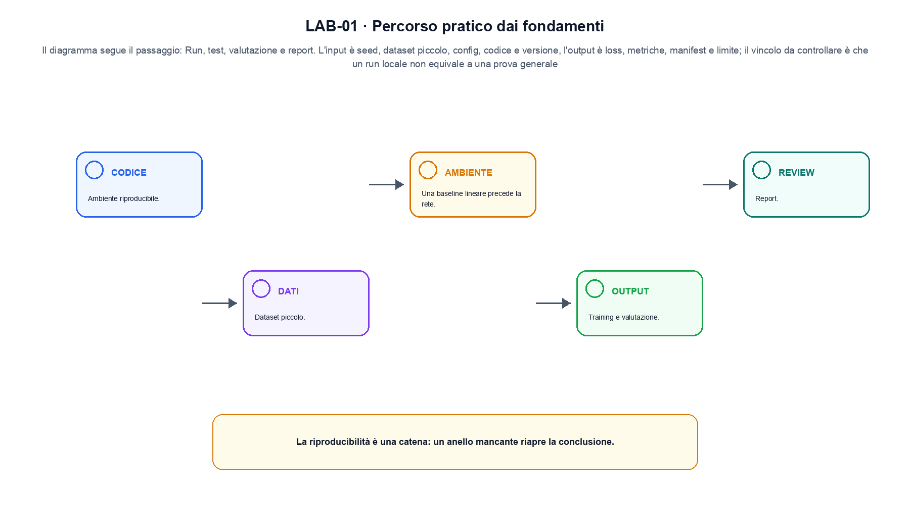
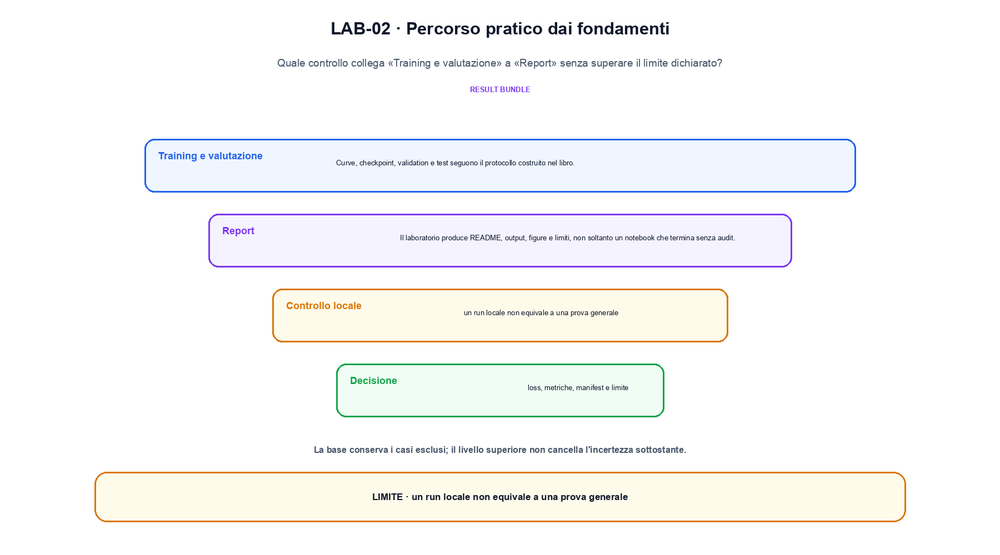

<!--
chapter_id: CH-P14-FOUNDATIONS-LAB
part_id: P14
order_key: 940
title: Percorso pratico dai fondamenti
maturity: CORE
status: revisione editoriale v2, approvazione autoriale aperta
version: 0.5.0-draft3
last_source_check: 4 agosto 2026
environment: Python 3.13.12, CPU
code_policy: reference
deferred: benchmark applicativi non eseguiti e approvazione autoriale delle visuali
-->

# Capitolo 94. Percorso pratico dai fondamenti

Qui percorso pratico dai fondamenti è una procedura: «Ambiente riproducibile» fissa l'ingresso e «Report» definisce il risultato da ricostruire. L'oggetto osservato è un esperimento didattico con ambiente e artefatti dichiarati. Il contratto locale dichiara input, seed, dataset piccolo, config, codice e versione; operazione, run, test, valutazione e report; output, loss, metriche, manifest e limite. Il caso di partenza è La stessa configurazione seed=7, split=fixed e dtype=float32 produce un digest ripetibile. Il limite da non nascondere è: un run locale non equivale a una prova generale.



La prima figura segue il percorso da «Ambiente riproducibile» a «Modello e loss».


## Ambiente riproducibile

Python, dipendenze, seed e struttura del progetto vengono fissati prima degli esperimenti. [SRC-94-001]

Un laboratorio è utile quando il risultato può essere ricostruito.

**Caso da seguire.** La stessa configurazione seed=7, split=fixed e dtype=float32 produce un digest ripetibile.

**Controllo.** Per «Ambiente riproducibile», esegui il caso con ambiente, seed e comando registrati; il risultato deve sopravvivere fuori dalla sessione interattiva.


## Dataset piccolo

Un dataset controllabile permette di vedere preprocessing, split, batch e leakage. [SRC-94-002]

**Caso da seguire.** Un dataset di quattro record con split e checksum conservati nel manifest.

**Controllo.** Per «Dataset piccolo» conserva almeno un artefatto verificabile e un caso fallito, insieme alla configurazione che li ha prodotti.


La forma compatta aiuta a seguire il flusso senza attribuirgli una garanzia quantitativa.

**Schema concettuale.** `result = run(code, data, environment)`

Un laboratorio è utile quando il risultato può essere ricostruito. [SRC-94-001]


## Modello e loss

Una baseline lineare precede la rete. Shape, logits e loss vengono verificati con test. [SRC-94-003]

**Caso da seguire.** Un forward che produce loss su target dichiarati e un controllo negativo di shape.

**Controllo.** Per «Modello e loss», scrivi prima l'esito atteso, poi confrontalo con output e log. Nel caso «Modello e loss», ogni differenza deve restare visibile nel report.


## Esempio Python eseguito

Questa sezione apre il contratto Python di percorso pratico dai fondamenti: il lettore può eseguire lo stesso file e confrontare il risultato. Per «Percorso pratico dai fondamenti», il caso di default usa valori piccoli per isolare il meccanismo. Il caso non supportato viene provato separatamente, così «percorso pratico dai fondamenti» non viene generalizzato oltre l'esempio.

```python
def contract(case: str = "default"):
    if case != "default":
        raise ValueError("only the documented default case is supported")
    configuration = {"seed": 7, "split": "fixed", "dtype": "float32"}
    digest = hashlib.sha256(json.dumps(configuration, sort_keys=True).encode()).hexdigest()
    return {"configuration_digest": digest[:12], "configuration": configuration, "invariant": "a local run is reproducible only with its declared setup"}
```

Esecuzione con `python snip_94_contract.py`:

```text
{"configuration": {"dtype": "float32", "seed": 7, "split": "fixed"}, "configuration_digest": "47f01c1610dd", "invariant": "a local run is reproducible only with its declared setup"}
```

Il test associato è [`code/test_94_contract.py`](code/test_94_contract.py); l'output versionato è [`code/outputs/SNIP-94-001.txt`](code/outputs/SNIP-94-001.txt).

## Laboratorio completo: Training, baseline e manifest

Il contratto precedente isola un solo punto. Il laboratorio seguente attraversa invece più fasi e conserva sia l'esito valido sia una failure controllata. L'estratto è identico al file eseguito.

```python
def train_classifier(
    data: np.ndarray, steps: int = 120, learning_rate: float = 0.2
) -> dict[str, object]:
    if steps <= 0 or learning_rate <= 0:
        raise ValueError("steps e learning_rate devono essere positivi")
    dataset_digest(data)  # valida shape e rende esplicito l'artefatto usato
    features, labels = data[:, :2], data[:, 2]
    weights = np.zeros(2, dtype=np.float64)
    bias = 0.0

    initial_loss = binary_cross_entropy(sigmoid(features @ weights + bias), labels)
    for _ in range(steps):
        probabilities = sigmoid(features @ weights + bias)
        residual = probabilities - labels
        weights -= learning_rate * (features.T @ residual) / len(features)
        bias -= learning_rate * float(np.mean(residual))

    probabilities = sigmoid(features @ weights + bias)
    predictions = (probabilities >= 0.5).astype(np.float64)
    return {
        "initial_loss": round(initial_loss, 6),
        "final_loss": round(binary_cross_entropy(probabilities, labels), 6),
        "accuracy": round(float(np.mean(predictions == labels)), 6),
        "weights": weights.round(6).tolist(),
        "bias": round(bias, 6),
        "dataset_sha256": dataset_digest(data),
        "rows": int(len(data)),
    }
```

Output di `python foundations_lab.py`:

```text
{"acceptance": true, "accuracy": 1.0, "baseline_accuracy": 0.5, "bias": -0.12329, "dataset_sha256": "fc28b299e579d62c", "final_loss": 0.018584, "initial_loss": 0.693147, "rows": 6, "weights": [2.156813, 1.228259]}
```

Codice completo: [`code/foundations_lab.py`](code/foundations_lab.py); test: [`code/test_foundations_lab.py`](code/test_foundations_lab.py); output versionato: [`code/outputs/FOUNDATIONS-LAB.txt`](code/outputs/FOUNDATIONS-LAB.txt).


## Training e valutazione

Curve, checkpoint, validation e test seguono il protocollo costruito nel libro. [SRC-94-004]

**Caso da seguire.** Due run con la stessa configurazione confrontati con metriche e casi falliti.

**Controllo.** Per «Training e valutazione», riparti da un processo pulito e ricostruisci input e ambiente prima di interpretare la metrica.


## Report

Il laboratorio produce README, output, figure e limiti, non soltanto un notebook che termina senza audit. [SRC-94-001]

**Caso da seguire.** Un report che collega comando, artefatti, output e limite del risultato.

**Controllo.** Per «Report», distingui il risultato riprodotto dal suo trasferimento ad altra scala. Nel caso «Report», il confine è: Il laboratorio produce README, output, figure e limiti, non soltanto un notebook che termina senza audit.




La seconda figura mette a confronto «Training e valutazione» e il limite discusso in «Report».


## Come si collegano i passaggi

- **Da «Ambiente riproducibile» a «Dataset piccolo».** Python, dipendenze, seed e struttura del progetto vengono fissati prima degli esperimenti. Un dataset controllabile permette di vedere preprocessing, split, batch e leakage. «Ambiente riproducibile» fissa domanda, ambiente e input prima che «Dataset piccolo» materializzi il protocollo. Il passaggio successivo rende misurabile «Dataset piccolo». [SRC-94-001; SRC-94-002]

- **Da «Dataset piccolo» a «Modello e loss».** Un dataset controllabile permette di vedere preprocessing, split, batch e leakage. Una baseline lineare precede la rete. Il passaggio a «Modello e loss» produce numeri e file soltanto dopo la registrazione della configurazione. Da «Dataset piccolo» a «Modello e loss» cambia la domanda osservabile. [SRC-94-002; SRC-94-003]

- **Da «Modello e loss» a «Training e valutazione».** Una baseline lineare precede la rete. Curve, checkpoint, validation e test seguono il protocollo costruito nel libro. «Training e valutazione» confronta atteso e osservato e conserva le divergenze del run. Il passaggio successivo rende misurabile «Training e valutazione». [SRC-94-003; SRC-94-004]

- **Da «Training e valutazione» a «Report».** Curve, checkpoint, validation e test seguono il protocollo costruito nel libro. Il laboratorio produce README, output, figure e limiti, non soltanto un notebook che termina senza audit. La conclusione distingue ciò che «Report» ha ricostruito da ciò che richiede nuovi dati o hardware. Da «Training e valutazione» a «Report» cambia la domanda osservabile. [SRC-94-004; SRC-94-001]

La catena completa produce loss, metriche, manifest e limite a partire da seed, dataset piccolo, config, codice e versione. Ogni collegamento conserva un oggetto osservabile diverso; per questo il risultato non può essere esteso oltre il limite dichiarato: un run locale non equivale a una prova generale.


## Esperimenti da riprodurre

1. Ricostruisci «Ambiente riproducibile» con un esempio diverso da quello mostrato e indica l'output atteso prima del calcolo.
2. Nel passaggio «Dataset piccolo», cambia una sola ipotesi e spiega quale risultato non è più confrontabile.
3. Collega «Modello e loss» a una riga dello snippet oppure motiva perché la prova deve essere documentale.
4. Progetta un caso limite per «Training e valutazione» che produca una failure riconoscibile.
5. Per «Report», separa una conclusione sostenuta dal caso locale da una che richiederebbe nuovi dati o un benchmark.


## Criterio di completamento

La lezione parte da «seed, dataset piccolo, config, codice e versione» e arriva fino a «loss, metriche, manifest e limite». Il limite da conservare è questo: un run locale non equivale a una prova generale. Il run relativo a «Report» conserva codice, test e output; le ipotesi esterne restano nel dossier [`FONTI_PRIMARIE.md`](FONTI_PRIMARIE.md).
