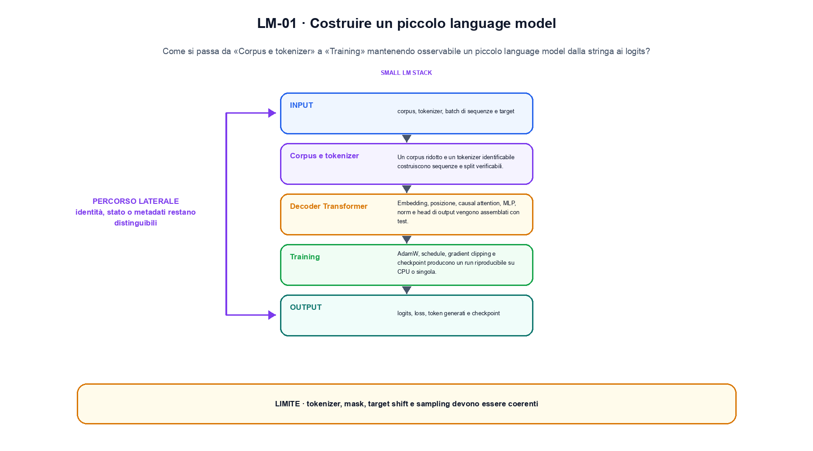
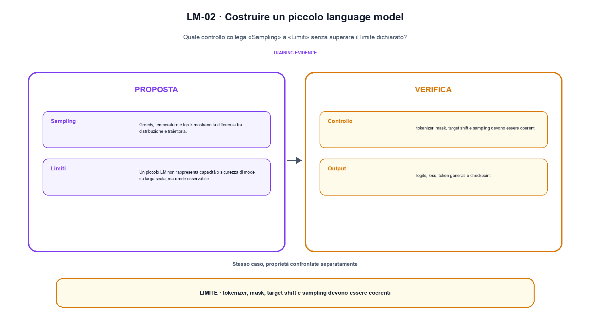

<!--
chapter_id: CH-P14-SMALL-LM
part_id: P14
order_key: 950
title: Costruire un piccolo language model
maturity: CORE
status: revisione editoriale v2, approvazione autoriale aperta
version: 0.5.0-draft3
last_source_check: 4 agosto 2026
environment: Python 3.13.12, CPU
code_policy: reference
deferred: benchmark applicativi non eseguiti e approvazione autoriale delle visuali
-->

# Capitolo 95. Costruire un piccolo language model

Per rendere concreto costruire un piccolo language model, registriamo ciò che accade tra «Corpus e tokenizer» e «Limiti». L'oggetto osservato è un piccolo language model dalla stringa ai logits. Il contratto locale dichiara input, corpus, tokenizer, batch di sequenze e target; operazione, embedding, decoder causale, cross-entropy e sampling; output, logits, loss, token generati e checkpoint. Per fissare il riferimento usiamo Due sequenze di tre token diventano input e target spostati con shape coerenti. Il limite da non nascondere è: tokenizer, mask, target shift e sampling devono essere coerenti.



La prima figura segue il percorso da «Corpus e tokenizer» a «Training».


## Corpus e tokenizer

Un corpus ridotto e un tokenizer identificabile costruiscono sequenze e split verificabili. [SRC-95-001]

Un piccolo LM consente di osservare la relazione tra dati, logits e loss.

**Caso da seguire.** Due sequenze di tre token diventano input e target spostati con shape coerenti.

**Controllo.** Per «Corpus e tokenizer», esegui il caso con ambiente, seed e comando registrati; il risultato deve sopravvivere fuori dalla sessione interattiva.


## Decoder Transformer

Embedding, posizione, causal attention, MLP, norm e head di output vengono assemblati con test di shape. [SRC-95-002]

**Caso da seguire.** Un batch [2, 4] attraversa embedding, mask causale, MLP e head dei logits.

**Controllo.** Per «Decoder Transformer» conserva almeno un artefatto verificabile e un caso fallito, insieme alla configurazione che li ha prodotti.


La relazione centrale può essere scritta come:

$$
loss = cross_entropy(logits, targets)
$$

Un piccolo LM consente di osservare la relazione tra dati, logits e loss. [SRC-95-001]


## Training

AdamW, schedule, gradient clipping e checkpoint producono un run riproducibile su CPU o singola GPU. [SRC-95-003]

**Caso da seguire.** Un optimizer step confrontato con loss, seed e stato del checkpoint salvato.

**Controllo.** Per «Training», scrivi prima l'esito atteso, poi confrontalo con output e log. Nel caso «Training», ogni differenza deve restare visibile nel report.


## Esempio Python eseguito

La prova locale di costruire un piccolo language model parte da un esempio minimo, registrato nel repository insieme ai suoi test. Per «Costruire un piccolo language model», il caso di default usa valori piccoli per isolare il meccanismo. La prova negativa riguarda proprio «costruire un piccolo language model» e interrompe l'interpretazione prima dell'output.

```python
def contract(case: str = "default"):
    if case != "default":
        raise ValueError("only the documented default case is supported")
    tokens = [[1, 2, 3], [2, 3, 4]]
    inputs = [row[:-1] for row in tokens]
    targets = [row[1:] for row in tokens]
    return {"input_shape": [len(inputs), len(inputs[0])], "target_shape": [len(targets), len(targets[0])], "invariant": "causal training shifts target one token after the input"}
```

Esecuzione con `python snip_95_contract.py`:

```text
{"input_shape": [2, 2], "invariant": "causal training shifts target one token after the input", "target_shape": [2, 2]}
```

Il test associato è [`code/test_95_contract.py`](code/test_95_contract.py); l'output versionato è [`code/outputs/SNIP-95-001.txt`](code/outputs/SNIP-95-001.txt).

## Laboratorio completo: Decoder causale addestrato e campionato

Il contratto precedente isola un solo punto. Il laboratorio seguente attraversa invece più fasi e conserva sia l'esito valido sia una failure controllata. L'estratto è identico al file eseguito.

```python
def train_and_generate(steps: int = 24) -> dict[str, object]:
    if steps <= 0:
        raise ValueError("steps deve essere positivo")
    random.seed(7)
    torch.manual_seed(7)
    torch.use_deterministic_algorithms(True)

    tokenizer = CharTokenizer(CORPUS)
    model = TinyCausalLM(len(tokenizer.tokens))
    inputs, targets = build_training_batch(tokenizer.encode(CORPUS), model.context)
    optimizer = torch.optim.AdamW(model.parameters(), lr=0.01)

    losses: list[float] = []
    model.train()
    for _ in range(steps):
        optimizer.zero_grad(set_to_none=True)
        logits = model(inputs)
        loss = nn.functional.cross_entropy(
            logits.reshape(-1, logits.shape[-1]), targets.reshape(-1)
        )
        loss.backward()
        optimizer.step()
        losses.append(float(loss.detach()))

    model.eval()
    generated = tokenizer.encode("il modello")
    with torch.inference_mode():
        for _ in range(18):
            context = torch.tensor([generated[-model.context :]], dtype=torch.long)
            next_id = int(model(context)[0, -1].argmax())
            generated.append(next_id)

    return {
        "vocab_size": len(tokenizer.tokens),
        "context": model.context,
        "initial_loss": round(losses[0], 6),
        "final_loss": round(losses[-1], 6),
        "generated": tokenizer.decode(generated),
        "target_shift_verified": bool(torch.equal(inputs[:, 1:], targets[:, :-1])),
    }
```

Output di `python tiny_transformer_lm.py`:

```text
{"context": 16, "final_loss": 0.952446, "generated": "il modello lelleggggge token", "initial_loss": 2.921019, "target_shift_verified": true, "vocab_size": 17}
```

Codice completo: [`code/tiny_transformer_lm.py`](code/tiny_transformer_lm.py); test: [`code/test_tiny_transformer_lm.py`](code/test_tiny_transformer_lm.py); output versionato: [`code/outputs/TINY-TRANSFORMER-LM.txt`](code/outputs/TINY-TRANSFORMER-LM.txt).


## Sampling

Greedy, temperature e top-k mostrano la differenza tra distribuzione e traiettoria. [SRC-95-004]

**Caso da seguire.** Lo stesso vettore di logits decodificato con greedy e top-k.

**Controllo.** Per «Sampling», riparti da un processo pulito e ricostruisci input e ambiente prima di interpretare la metrica.


## Limiti

Un piccolo LM non rappresenta capacità o sicurezza di modelli su larga scala, ma rende osservabile l'intero contratto. [SRC-95-001]

**Caso da seguire.** Un confronto tra loss del piccolo modello e un claim che non può essere trasferito a modelli grandi.

**Controllo.** Per «Limiti», distingui il risultato riprodotto dal suo trasferimento ad altra scala. Nel caso «Limiti», il confine è: Un piccolo LM non rappresenta capacità o sicurezza di modelli su larga scala, ma rende osservabile l'intero contratto.




La seconda figura mette a confronto «Sampling» e il limite discusso in «Limiti».


## Come si collegano i passaggi

- **Da «Corpus e tokenizer» a «Decoder Transformer».** Un corpus ridotto e un tokenizer identificabile costruiscono sequenze e split verificabili. Embedding, posizione, causal attention, MLP, norm e head di output vengono assemblati con test di shape. «Corpus e tokenizer» fissa domanda, ambiente e input prima che «Decoder Transformer» materializzi il protocollo. Da «Corpus e tokenizer» a «Decoder Transformer» cambia la domanda osservabile. [SRC-95-001; SRC-95-002]

- **Da «Decoder Transformer» a «Training».** Embedding, posizione, causal attention, MLP, norm e head di output vengono assemblati con test di shape. AdamW, schedule, gradient clipping e checkpoint producono un run riproducibile su CPU o singola GPU. Il passaggio a «Training» produce numeri e file soltanto dopo la registrazione della configurazione. Il passaggio successivo rende misurabile «Training». [SRC-95-002; SRC-95-003]

- **Da «Training» a «Sampling».** AdamW, schedule, gradient clipping e checkpoint producono un run riproducibile su CPU o singola GPU. Greedy, temperature e top-k mostrano la differenza tra distribuzione e traiettoria. «Sampling» confronta atteso e osservato e conserva le divergenze del run. Da «Training» a «Sampling» cambia la domanda osservabile. [SRC-95-003; SRC-95-004]

- **Da «Sampling» a «Limiti».** Greedy, temperature e top-k mostrano la differenza tra distribuzione e traiettoria. Un piccolo LM non rappresenta capacità o sicurezza di modelli su larga scala, ma rende osservabile l'intero contratto. La conclusione distingue ciò che «Limiti» ha ricostruito da ciò che richiede nuovi dati o hardware. Il passaggio successivo rende misurabile «Limiti». [SRC-95-004; SRC-95-001]

La catena completa produce logits, loss, token generati e checkpoint a partire da corpus, tokenizer, batch di sequenze e target. Ogni collegamento conserva un oggetto osservabile diverso; per questo il risultato non può essere esteso oltre il limite dichiarato: tokenizer, mask, target shift e sampling devono essere coerenti.


## Esperimenti da riprodurre

1. Ricostruisci «Corpus e tokenizer» con un esempio diverso da quello mostrato e indica l'output atteso prima del calcolo.
2. Nel passaggio «Decoder Transformer», cambia una sola ipotesi e spiega quale risultato non è più confrontabile.
3. Collega «Training» a una riga dello snippet oppure motiva perché la prova deve essere documentale.
4. Progetta un caso limite per «Sampling» che produca una failure riconoscibile.
5. Per «Limiti», separa una conclusione sostenuta dal caso locale da una che richiederebbe nuovi dati o un benchmark.


## Criterio di completamento

La lezione parte da «corpus, tokenizer, batch di sequenze e target» e arriva fino a «logits, loss, token generati e checkpoint». Il limite da conservare è questo: tokenizer, mask, target shift e sampling devono essere coerenti. Il run relativo a «Limiti» conserva codice, test e output; le ipotesi esterne restano nel dossier [`FONTI_PRIMARIE.md`](FONTI_PRIMARIE.md).
