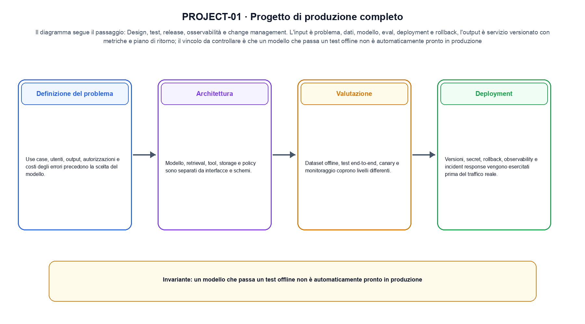
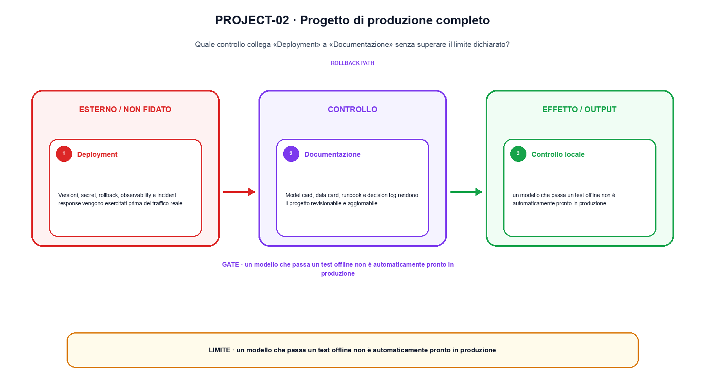

<!--
chapter_id: CH-P14-PRODUCTION-PROJECT
part_id: P14
order_key: 960
title: Progetto di produzione completo
maturity: CORE
status: revisione editoriale v2, approvazione autoriale aperta
version: 0.5.0-draft3
last_source_check: 4 agosto 2026
environment: Python 3.13.12, CPU
code_policy: reference
deferred: benchmark applicativi non eseguiti e approvazione autoriale delle visuali
-->

# Capitolo 96. Progetto di produzione completo

Il laboratorio di progetto di produzione completo costruisce un percorso riproducibile da «Definizione del problema» a «Documentazione». L'oggetto osservato è un sistema ML che attraversa sviluppo, rilascio e monitoraggio. Il contratto locale dichiara input, problema, dati, modello, eval, deployment e rollback; operazione, design, test, release, osservabilità e change management; output, servizio versionato con metriche e piano di ritorno. Il caso di partenza è Una release passa offline gate, canary e rollback prima di essere candidata. Il limite da non nascondere è: un modello che passa un test offline non è automaticamente pronto in produzione.



La prima figura segue il percorso da «Definizione del problema» a «Valutazione».


## Definizione del problema

Use case, utenti, output, autorizzazioni e costi degli errori precedono la scelta del modello. [SRC-96-001]

Un progetto di produzione richiede anche gestione del ciclo di vita.

**Caso da seguire.** Una release passa offline gate, canary e rollback prima di essere candidata.

**Controllo.** Per «Definizione del problema», esegui il caso con ambiente, seed e comando registrati; il risultato deve sopravvivere fuori dalla sessione interattiva.


## Architettura

Modello, retrieval, tool, storage e policy sono separati da interfacce e schemi. [SRC-96-004]

**Caso da seguire.** Un diagramma che separa dati, modello, policy, API, monitor e rollback.

**Controllo.** Per «Architettura» conserva almeno un artefatto verificabile e un caso fallito, insieme alla configurazione che li ha prodotti.


La relazione seguente è una mappa operativa e non una misura del sistema.

**Schema concettuale.** `release = model + eval + monitoring + rollback`

Un progetto di produzione richiede anche gestione del ciclo di vita. [SRC-96-001]


## Valutazione

Dataset offline, test end-to-end, canary e monitoraggio coprono livelli differenti. [SRC-96-002]

**Caso da seguire.** Un gate offline con slice, soglia, errore e decisione di promozione.

**Controllo.** Per «Valutazione», scrivi prima l'esito atteso, poi confrontalo con output e log. Nel caso «Valutazione», ogni differenza deve restare visibile nel report.


## Esempio Python eseguito

Per rendere osservabile progetto di produzione completo, il capitolo conserva qui l'artefatto Python eseguito. Per «Progetto di produzione completo», il caso di default usa valori piccoli per isolare il meccanismo. Il test rifiuta anche un caso non documentato di «progetto di produzione completo».

```python
def contract(case: str = "default"):
    if case != "default":
        raise ValueError("only the documented default case is supported")
    release = {"version": "v2", "offline_gate": True, "canary": True, "rollback": True}
    ready = all(release[key] for key in ("offline_gate", "canary", "rollback"))
    return {"version": release["version"], "ready_for_review": ready, "invariant": "production readiness requires independent gates and a rollback path"}
```

Esecuzione con `python snip_96_contract.py`:

```text
{"invariant": "production readiness requires independent gates and a rollback path", "ready_for_review": true, "version": "v2"}
```

Il test associato è [`code/test_96_contract.py`](code/test_96_contract.py); l'output versionato è [`code/outputs/SNIP-96-001.txt`](code/outputs/SNIP-96-001.txt).

## Laboratorio completo: Gate offline, canary e rollback

Il contratto precedente isola un solo punto. Il laboratorio seguente attraversa invece più fasi e conserva sia l'esito valido sia una failure controllata. L'estratto è identico al file eseguito.

```python
def evaluate_release(
    candidate: ReleaseCandidate, policy: GatePolicy = GatePolicy()
) -> dict[str, object]:
    candidate.validate()
    offline_checks = {
        "overall": candidate.overall_accuracy >= policy.minimum_overall_accuracy,
        "critical_slice": candidate.critical_slice_accuracy
        >= policy.minimum_critical_slice_accuracy,
    }
    offline_passed = all(offline_checks.values())
    canary_passed = candidate.canary_error_rate <= policy.maximum_canary_error_rate

    promoted = offline_passed and canary_passed
    rollback = offline_passed and not canary_passed
    decision = "promote" if promoted else ("rollback" if rollback else "reject_offline")
    return {
        "version": candidate.version,
        "decision": decision,
        "offline_checks": offline_checks,
        "canary_passed": canary_passed,
        "rollback_target": candidate.rollback_version if rollback else None,
        "manifest_sha256": manifest_digest(candidate, policy),
    }
```

Output di `python production_pipeline.py`:

```text
{"healthy": {"canary_passed": true, "decision": "promote", "manifest_sha256": "581618d2cb8297b7", "offline_checks": {"critical_slice": true, "overall": true}, "rollback_target": null, "version": "v2"}, "regressed_canary": {"canary_passed": false, "decision": "rollback", "manifest_sha256": "a4f4f54a4ff52a47", "offline_checks": {"critical_slice": true, "overall": true}, "rollback_target": "v2", "version": "v3"}}
```

Codice completo: [`code/production_pipeline.py`](code/production_pipeline.py); test: [`code/test_production_pipeline.py`](code/test_production_pipeline.py); output versionato: [`code/outputs/PRODUCTION-PIPELINE.txt`](code/outputs/PRODUCTION-PIPELINE.txt).


## Deployment

Versioni, secret, rollback, observability e incident response vengono esercitati prima del traffico reale. [SRC-96-003]

**Caso da seguire.** Un canary versionato con alert, owner e ritorno alla versione precedente.

**Controllo.** Per «Deployment», riparti da un processo pulito e ricostruisci input e ambiente prima di interpretare la metrica.


## Documentazione

Model card, data card, runbook e decision log rendono il progetto revisionabile e aggiornabile. [SRC-96-001]

**Caso da seguire.** Una model card collegata a changelog, dataset, limiti e contatto operativo.

**Controllo.** Per «Documentazione», distingui il risultato riprodotto dal suo trasferimento ad altra scala. Nel caso «Documentazione», il confine è: Model card, data card, runbook e decision log rendono il progetto revisionabile e aggiornabile.




La seconda figura mette a confronto «Deployment» e il limite discusso in «Documentazione».


## Come si collegano i passaggi

- **Da «Definizione del problema» a «Architettura».** Use case, utenti, output, autorizzazioni e costi degli errori precedono la scelta del modello. Modello, retrieval, tool, storage e policy sono separati da interfacce e schemi. «Definizione del problema» fissa domanda, ambiente e input prima che «Architettura» materializzi il protocollo. Il passaggio successivo rende misurabile «Architettura». [SRC-96-001; SRC-96-004]

- **Da «Architettura» a «Valutazione».** Modello, retrieval, tool, storage e policy sono separati da interfacce e schemi. Dataset offline, test end-to-end, canary e monitoraggio coprono livelli differenti. Il passaggio a «Valutazione» produce numeri e file soltanto dopo la registrazione della configurazione. Da «Architettura» a «Valutazione» cambia la domanda osservabile. [SRC-96-004; SRC-96-002]

- **Da «Valutazione» a «Deployment».** Dataset offline, test end-to-end, canary e monitoraggio coprono livelli differenti. Versioni, secret, rollback, observability e incident response vengono esercitati prima del traffico reale. «Deployment» confronta atteso e osservato e conserva le divergenze del run. Il passaggio successivo rende misurabile «Deployment». [SRC-96-002; SRC-96-003]

- **Da «Deployment» a «Documentazione».** Versioni, secret, rollback, observability e incident response vengono esercitati prima del traffico reale. Model card, data card, runbook e decision log rendono il progetto revisionabile e aggiornabile. La conclusione distingue ciò che «Documentazione» ha ricostruito da ciò che richiede nuovi dati o hardware. Da «Deployment» a «Documentazione» cambia la domanda osservabile. [SRC-96-003; SRC-96-001]

La catena completa produce servizio versionato con metriche e piano di ritorno a partire da problema, dati, modello, eval, deployment e rollback. Ogni collegamento conserva un oggetto osservabile diverso; per questo il risultato non può essere esteso oltre il limite dichiarato: un modello che passa un test offline non è automaticamente pronto in produzione.


## Esperimenti da riprodurre

1. Ricostruisci «Definizione del problema» con un esempio diverso da quello mostrato e indica l'output atteso prima del calcolo.
2. Nel passaggio «Architettura», cambia una sola ipotesi e spiega quale risultato non è più confrontabile.
3. Collega «Valutazione» a una riga dello snippet oppure motiva perché la prova deve essere documentale.
4. Progetta un caso limite per «Deployment» che produca una failure riconoscibile.
5. Per «Documentazione», separa una conclusione sostenuta dal caso locale da una che richiederebbe nuovi dati o un benchmark.


## Criterio di completamento

La lezione parte da «problema, dati, modello, eval, deployment e rollback» e arriva fino a «servizio versionato con metriche e piano di ritorno». Il limite da conservare è questo: un modello che passa un test offline non è automaticamente pronto in produzione. Il run relativo a «Documentazione» conserva codice, test e output; le ipotesi esterne restano nel dossier [`FONTI_PRIMARIE.md`](FONTI_PRIMARIE.md).
