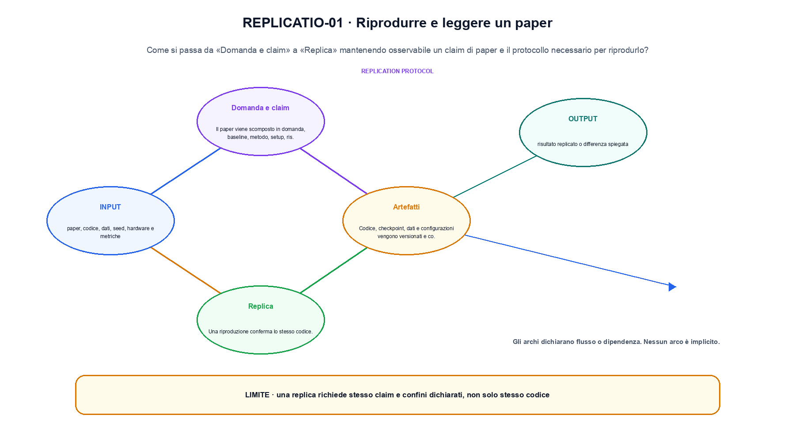
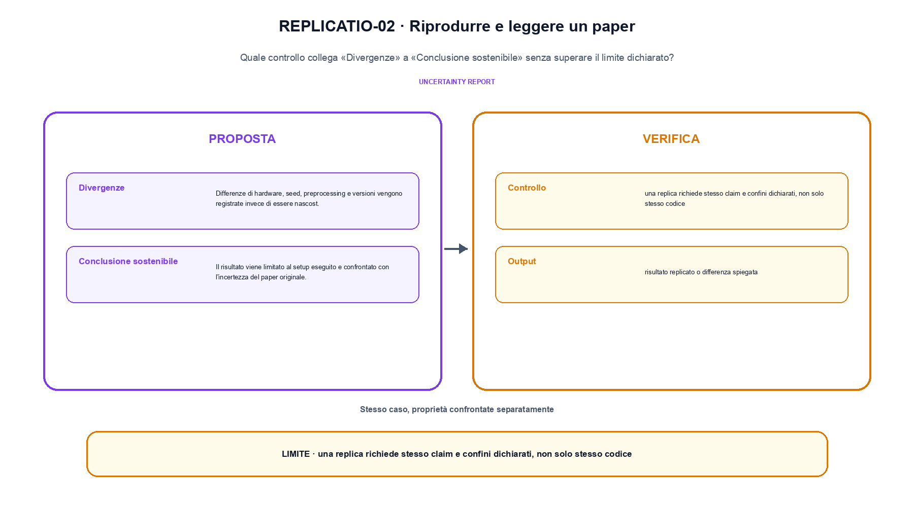

<!--
chapter_id: CH-P14-REPLICATION
part_id: P14
order_key: 970
title: Riprodurre e leggere un paper
maturity: CORE
status: revisione editoriale v2, approvazione autoriale aperta
version: 0.5.0-draft3
last_source_check: 4 agosto 2026
environment: Python 3.13.12, CPU
code_policy: reference
deferred: benchmark applicativi non eseguiti e approvazione autoriale delle visuali
-->

# Capitolo 97. Riprodurre e leggere un paper

Qui riprodurre e leggere un paper è una procedura: «Domanda e claim» fissa l'ingresso e «Conclusione sostenibile» definisce il risultato da ricostruire. L'oggetto osservato è un claim di paper e il protocollo necessario per riprodurlo. Il contratto locale dichiara input, paper, codice, dati, seed, hardware e metriche; operazione, setup indipendente, run, confronto e analisi delle divergenze; output, risultato replicato o differenza spiegata. Il caso di partenza è Due run con split uguale ma seed diversi producono una differenza che va registrata. Il limite da non nascondere è: una replica richiede stesso claim e confini dichiarati, non solo stesso codice.



La prima figura segue il percorso da «Domanda e claim» a «Replica».


## Domanda e claim

Il paper viene scomposto in domanda, baseline, metodo, setup, risultati e limiti. [SRC-97-001]

La replica verifica quanto il risultato dipenda dal setup originale.

**Caso da seguire.** Due run con split uguale ma seed diversi producono una differenza che va registrata.

**Controllo.** Per «Domanda e claim», esegui il caso con ambiente, seed e comando registrati; il risultato deve sopravvivere fuori dalla sessione interattiva.


## Artefatti

Codice, checkpoint, dati e configurazioni vengono versionati e confrontati con la descrizione. [SRC-97-002]

**Caso da seguire.** Un manifest con commit, dataset, seed, hardware, dipendenze e checksum.

**Controllo.** Per «Artefatti» conserva almeno un artefatto verificabile e un caso fallito, insieme alla configurazione che li ha prodotti.


La relazione centrale può essere scritta come:

$$
replica = run(protocol, independent_setup)
$$

La replica verifica quanto il risultato dipenda dal setup originale. [SRC-97-001]


## Replica

Una riproduzione conferma lo stesso codice; una replica indipendente ricostruisce il metodo con scelte proprie. [SRC-97-003]

**Caso da seguire.** Un setup indipendente che ripete il protocollo senza riusare l'output originale.

**Controllo.** Per «Replica», scrivi prima l'esito atteso, poi confrontalo con output e log. Nel caso «Replica», ogni differenza deve restare visibile nel report.


## Esempio Python eseguito

Il caso computazionale di riprodurre e leggere un paper è riportato senza trasformazioni: il file e l'output sono quelli verificati. Per «Riprodurre e leggere un paper», il caso di default usa valori piccoli per isolare il meccanismo. La suite conserva inoltre una failure esplicita per separare il contratto osservato da «riprodurre e leggere un paper».

```python
def contract(case: str = "default"):
    if case != "default":
        raise ValueError("only the documented default case is supported")
    original = {"metric": 0.80, "seed": 1, "split": "fixed"}
    replica = {"metric": 0.78, "seed": 2, "split": "fixed"}
    difference = replica["metric"] - original["metric"]
    return {"difference": difference, "same_split": replica["split"] == original["split"], "invariant": "a replication records setup differences before interpreting outcome differences"}
```

Esecuzione con `python snip_97_contract.py`:

```text
{"difference": -0.020000000000000018, "invariant": "a replication records setup differences before interpreting outcome differences", "same_split": true}
```

Il test associato è [`code/test_97_contract.py`](code/test_97_contract.py); l'output versionato è [`code/outputs/SNIP-97-001.txt`](code/outputs/SNIP-97-001.txt).

## Laboratorio completo: Replica indipendente con incertezza

Il contratto precedente isola un solo punto. Il laboratorio seguente attraversa invece più fasi e conserva sia l'esito valido sia una failure controllata. L'estratto è identico al file eseguito.

```python
def replicate(
    protocol: Protocol, original_seed: int = 11, replica_seed: int = 29
) -> dict[str, object]:
    original = run_trial(protocol, original_seed)
    replica = run_trial(protocol, replica_seed)
    difference = abs(float(replica["estimate"]) - float(original["estimate"]))
    return {
        "protocol_sha256": protocol_digest(protocol),
        "original": original,
        "replica": replica,
        "absolute_difference": round(difference, 6),
        "within_declared_tolerance": difference <= protocol.tolerance,
        "interpretation": "stesso protocollo, campione indipendente; la tolleranza non prova equivalenza universale",
    }
```

Output di `python replication_protocol.py`:

```text
{"absolute_difference": 0.016, "interpretation": "stesso protocollo, campione indipendente; la tolleranza non prova equivalenza universale", "original": {"ci95": [0.663386, 0.720614], "estimate": 0.692, "seed": 11, "successes": 692}, "protocol_sha256": "0d3b20f75be38fc9", "replica": {"ci95": [0.679818, 0.736182], "estimate": 0.708, "seed": 29, "successes": 708}, "within_declared_tolerance": true}
```

Codice completo: [`code/replication_protocol.py`](code/replication_protocol.py); test: [`code/test_replication_protocol.py`](code/test_replication_protocol.py); output versionato: [`code/outputs/REPLICATION-PROTOCOL.txt`](code/outputs/REPLICATION-PROTOCOL.txt).


## Divergenze

Differenze di hardware, seed, preprocessing e versioni vengono registrate invece di essere nascoste. [SRC-97-004]

**Caso da seguire.** Una tabella che separa divergenze di seed, preprocessing, hardware e implementazione.

**Controllo.** Per «Divergenze», riparti da un processo pulito e ricostruisci input e ambiente prima di interpretare la metrica.


## Conclusione sostenibile

Il risultato viene limitato al setup eseguito e confrontato con l'incertezza del paper originale. [SRC-97-001]

**Caso da seguire.** Una conclusione limitata al claim e all'intervallo realmente eseguiti.

**Controllo.** Per «Conclusione sostenibile», distingui il risultato riprodotto dal suo trasferimento ad altra scala. Nel caso «Conclusione sostenibile», il confine è: Il risultato viene limitato al setup eseguito e confrontato con l'incertezza del paper originale.




La seconda figura mette a confronto «Divergenze» e il limite discusso in «Conclusione sostenibile».


## Come si collegano i passaggi

- **Da «Domanda e claim» a «Artefatti».** Il paper viene scomposto in domanda, baseline, metodo, setup, risultati e limiti. Codice, checkpoint, dati e configurazioni vengono versionati e confrontati con la descrizione. «Domanda e claim» fissa domanda, ambiente e input prima che «Artefatti» materializzi il protocollo. Da «Domanda e claim» a «Artefatti» cambia la domanda osservabile. [SRC-97-001; SRC-97-002]

- **Da «Artefatti» a «Replica».** Codice, checkpoint, dati e configurazioni vengono versionati e confrontati con la descrizione. Una riproduzione conferma lo stesso codice; una replica indipendente ricostruisce il metodo con scelte proprie. Il passaggio a «Replica» produce numeri e file soltanto dopo la registrazione della configurazione. Il passaggio successivo rende misurabile «Replica». [SRC-97-002; SRC-97-003]

- **Da «Replica» a «Divergenze».** Una riproduzione conferma lo stesso codice; una replica indipendente ricostruisce il metodo con scelte proprie. Differenze di hardware, seed, preprocessing e versioni vengono registrate invece di essere nascoste. «Divergenze» confronta atteso e osservato e conserva le divergenze del run. Da «Replica» a «Divergenze» cambia la domanda osservabile. [SRC-97-003; SRC-97-004]

- **Da «Divergenze» a «Conclusione sostenibile».** Differenze di hardware, seed, preprocessing e versioni vengono registrate invece di essere nascoste. Il risultato viene limitato al setup eseguito e confrontato con l'incertezza del paper originale. La conclusione distingue ciò che «Conclusione sostenibile» ha ricostruito da ciò che richiede nuovi dati o hardware. Il passaggio successivo rende misurabile «Conclusione sostenibile». [SRC-97-004; SRC-97-001]

La catena completa produce risultato replicato o differenza spiegata a partire da paper, codice, dati, seed, hardware e metriche. Ogni collegamento conserva un oggetto osservabile diverso; per questo il risultato non può essere esteso oltre il limite dichiarato: una replica richiede stesso claim e confini dichiarati, non solo stesso codice.


## Esperimenti da riprodurre

1. Ricostruisci «Domanda e claim» con un esempio diverso da quello mostrato e indica l'output atteso prima del calcolo.
2. Nel passaggio «Artefatti», cambia una sola ipotesi e spiega quale risultato non è più confrontabile.
3. Collega «Replica» a una riga dello snippet oppure motiva perché la prova deve essere documentale.
4. Progetta un caso limite per «Divergenze» che produca una failure riconoscibile.
5. Per «Conclusione sostenibile», separa una conclusione sostenuta dal caso locale da una che richiederebbe nuovi dati o un benchmark.


## Criterio di completamento

La lezione parte da «paper, codice, dati, seed, hardware e metriche» e arriva fino a «risultato replicato o differenza spiegata». Il limite da conservare è questo: una replica richiede stesso claim e confini dichiarati, non solo stesso codice. Il run relativo a «Conclusione sostenibile» conserva codice, test e output; le ipotesi esterne restano nel dossier [`FONTI_PRIMARIE.md`](FONTI_PRIMARIE.md).
