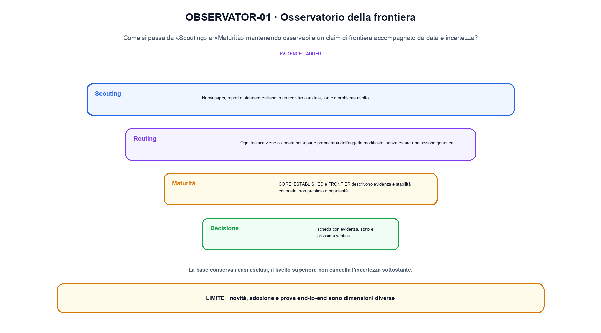
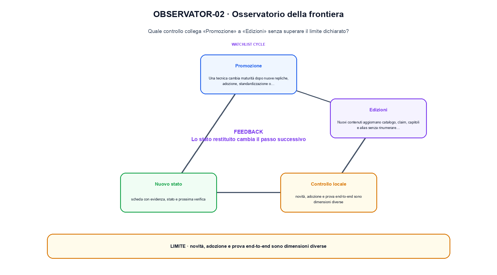

<!--
chapter_id: CH-P14-FRONTIER-OBSERVATORY
part_id: P14
order_key: 980
title: Osservatorio della frontiera
maturity: FRONTIER
status: revisione editoriale v2, approvazione autoriale aperta
version: 0.5.0-draft3
last_source_check: 4 agosto 2026
environment: Python 3.13.12, CPU
code_policy: exception
code_exception: Un osservatorio di frontiera valuta evidenza aggiornata e maturità editoriale; il controllo centrale è documentale e datato, non computazionale. Ogni scheda conserva data, versione, disponibilità degli artefatti, replica indipendente, incertezza e condizione esplicita di riapertura.
deferred: benchmark applicativi non eseguiti e approvazione autoriale delle visuali
-->

# Capitolo 98. Osservatorio della frontiera

La domanda guida di questa lezione è come collegare «Scouting» e «Edizioni» senza perdere il contratto tecnico di osservatorio della frontiera. L'oggetto osservato è un claim di frontiera accompagnato da data e incertezza. Il contratto locale è: input, paper, release, benchmark, fonte e data di osservazione; operazione, scouting, routing, maturità, confronto e promozione; output, scheda con evidenza, stato e prossima verifica. Il caso guida è questo: Una scheda registra claim, data, evidenza e maturità FRONTIER separatamente. Il confine da mantenere esplicito è: novità, adozione e prova end-to-end sono dimensioni diverse.

## Scouting

Nuovi paper, report e standard entrano in un registro con data, fonte e problema risolto. [SRC-98-001]

Un osservatorio di frontiera deve distinguere evidenza, data e incertezza.

**Caso da seguire.** Una scheda registra claim, data, evidenza e maturità FRONTIER separatamente.

**Controllo.** Classifica lo stesso caso lungo un solo asse alla volta e annota quale proprietà non è stata misurata.

## Routing

Ogni tecnica viene collocata nella parte proprietaria dell'oggetto modificato, senza creare una sezione generica della frontiera. [SRC-98-002]

**Caso da seguire.** Una tecnica instradata per oggetto modificato, prerequisito e consumer.

**Controllo.** Cambia la proprietà che distingue «Routing» dalle categorie vicine. Se la classificazione non cambia, la distinzione va formulata meglio.

## Maturità

CORE, ESTABLISHED e FRONTIER descrivono evidenza e stabilità editoriale, non prestigio o popolarità. [SRC-98-003]

**Caso da seguire.** Una matrice che separa novità, replica, adozione, standard e readiness.

**Controllo.** Confronta un caso positivo e uno di confine usando la medesima definizione; non trasformare l'esempio in una graduatoria generale.

La prima figura segue il percorso da «Scouting» a «Maturità».

## Promozione

Una tecnica cambia maturità dopo nuove repliche, adozione, standardizzazione o chiarimento dei limiti. [SRC-98-004]

**Caso da seguire.** Una decisione di promozione basata su evidenza nuova e soglie registrate.

**Controllo.** Indica quale osservazione smentirebbe l'assegnazione del caso a «Promozione» e quale invece sarebbe irrilevante.

## Edizioni

Nuovi contenuti aggiornano catalogo, claim, capitoli e alias senza rinumerare identità stabili. [SRC-98-001]

**Caso da seguire.** Un'edizione che aggiorna claim, fonti e data senza cambiare identità storiche.

**Controllo.** Limita la conclusione alla proprietà dichiarata: Nuovi contenuti aggiornano catalogo, claim, capitoli e alias senza rinumerare identità stabili. Le dimensioni non osservate restano aperte.

La seconda figura mette a confronto «Promozione» e il limite discusso in «Edizioni».

## Perché non forziamo un esempio Python

Un osservatorio di frontiera valuta evidenza aggiornata e maturità editoriale; il controllo centrale è documentale e datato, non computazionale. Ogni scheda conserva data, versione, disponibilità degli artefatti, replica indipendente, incertezza e condizione esplicita di riapertura. La verifica resta comunque obbligatoria attraverso fonti primarie, data di consultazione, claim delimitati e confronto tra casi.

## Come si collegano i passaggi

- **Da «Scouting» a «Routing».** Nuovi paper, report e standard entrano in un registro con data, fonte e problema risolto. Ogni tecnica viene collocata nella parte proprietaria dell'oggetto modificato, senza creare una sezione generica della frontiera. La definizione iniziale stabilisce l'asse del confronto; la categoria successiva aggiunge una proprietà senza creare una classifica implicita. [SRC-98-001; SRC-98-002]

- **Da «Routing» a «Maturità».** Ogni tecnica viene collocata nella parte proprietaria dell'oggetto modificato, senza creare una sezione generica della frontiera. CORE, ESTABLISHED e FRONTIER descrivono evidenza e stabilità editoriale, non prestigio o popolarità. Il terzo passaggio verifica se le categorie restano distinguibili sullo stesso caso e impedisce che termini vicini diventino sinonimi. [SRC-98-002; SRC-98-003]

- **Da «Maturità» a «Promozione».** CORE, ESTABLISHED e FRONTIER descrivono evidenza e stabilità editoriale, non prestigio o popolarità. Una tecnica cambia maturità dopo nuove repliche, adozione, standardizzazione o chiarimento dei limiti. La quarta sezione introduce il punto in cui l'asse scelto smette di bastare e richiede una nuova osservazione. [SRC-98-003; SRC-98-004]

- **Da «Promozione» a «Edizioni».** Una tecnica cambia maturità dopo nuove repliche, adozione, standardizzazione o chiarimento dei limiti. Nuovi contenuti aggiornano catalogo, claim, capitoli e alias senza rinumerare identità stabili. La sezione finale riunisce le dimensioni della valutazione, ma conserva i limiti di ciascuna invece di fonderle in un unico punteggio. [SRC-98-004; SRC-98-001]

La catena completa produce scheda con evidenza, stato e prossima verifica a partire da paper, release, benchmark, fonte e data di osservazione. Ogni collegamento conserva un oggetto osservabile diverso; per questo il risultato non può essere esteso oltre il limite dichiarato: novità, adozione e prova end-to-end sono dimensioni diverse.

## Domande per distinguere le categorie

1. Ricostruisci «Scouting» con un esempio diverso da quello mostrato e indica l'output atteso prima del calcolo.
2. Nel passaggio «Routing», cambia una sola ipotesi e spiega quale risultato non è più confrontabile.
3. Collega «Maturità» a una riga dello snippet oppure motiva perché la prova deve essere documentale.
4. Progetta un caso limite per «Promozione» che produca una failure riconoscibile.
5. Per «Edizioni», separa una conclusione sostenuta dal caso locale da una che richiederebbe nuovi dati o un benchmark.

## Una mappa, non una graduatoria

La lezione parte da «paper, release, benchmark, fonte e data di osservazione» e arriva fino a «scheda con evidenza, stato e prossima verifica». Il limite da conservare è questo: novità, adozione e prova end-to-end sono dimensioni diverse. Definizioni e risultati citati sono rintracciabili in [`FONTI_PRIMARIE.md`](FONTI_PRIMARIE.md); la mappa dei claim è in [`CLAIMS.md`](CLAIMS.md).
